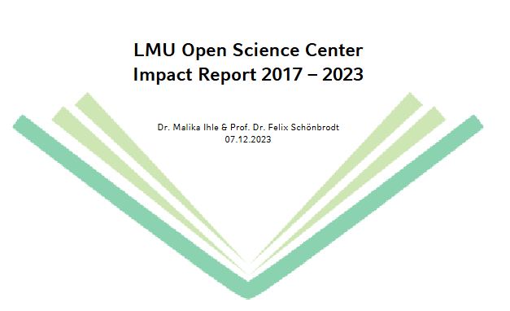

# About Us

The interdisciplinary LMU Open Science Center (OSC) promotes and fosters open research practices at LMU Munich and beyond, supporting LMU’s strategic commitment to excellent, responsible, and internationally competitive research. In a global research environment where world-leading institutions are redefining standards of good research practice, the OSC ensures that LMU researchers are equipped to meet and actively shape these evolving standards.  
  
The LMU Open Science Center was supported by LMUexcellent, funded by the Federal Ministry of Education and Research (BMBF) and the Free State of Bavaria under the Excellence Strategy of the Federal Government and the Länder. [View all our Funders ](../partners/funders.llms.md)

# An error occurred.

Unable to execute JavaScript.

 [Download PDF ](https://zenodo.org/records/10285395)

## What We Aim For

The OSC’s mission is to promote and foster open research practices at LMU Munich and beyond. We do this by providing training, resources, and support for researchers at all career stages, and by advocating for institutional and cultural changes that facilitate the adoption of open research practices. We are committed to fostering a collaborative and inclusive community that values transparency, reproducibility, and accessibility in research.

## Who We Are

### Leadership

Executive and scientific leadership.

[Managing Director](../people/people/felix-schoenbrodt.llms.md) [Scientific Coordinator](../people/people/malika-ihle.llms.md)

### Governance

Oversight and advisory structures.

[Scientific Board](../people/scientific-board.llms.md) [Advisors](../people/advisors.llms.md)

### Staff & Members

Our people.

[OSC Staff](../people/staff.llms.md) [OSC members](../people/members.llms.md)

[Read our Statutes ](../about/statutes.llms.md)

## What We Do

### Events

Explore upcoming and past events from the OSC community.

[View Events ](../events/index.llms.md)

### Training

Browse our training resources on open science practices, from data management to reproducible workflows.

[Explore Training ](../training.llms.md)

### Consultations

Get support on your implementation of open research practices and responsible research assessement.

[Request a consultation ](mailto:osc@lmu.de?subject=Consultation%20request:)

### Meta-research Hub

Collaborate with meta researchers and open science enthusiasts across disciplines.

[Bibliography Network ](https://www.resources.osc.lmu.de/bibliography/)

## Join Us

### Subscribe to our Announcement List

Stay up-to-date with our activities and events!

[Subscribe](https://lists.lrz.de/mailman/listinfo/lmu-osc)

### Become a Member

Support and shape the OSC's goals and activities by becoming a member!

[Join as Member](../about/join-us.llms.md)
