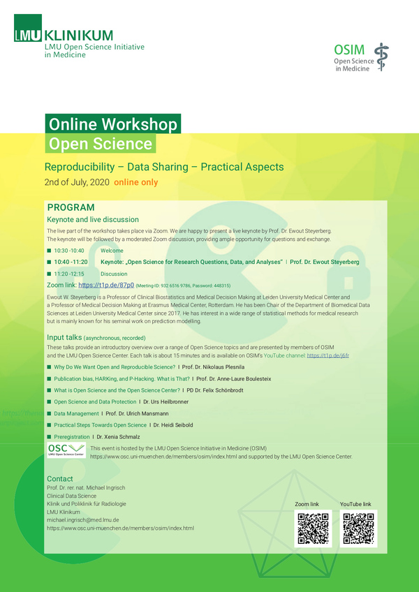

# Open Science - Reproduciblity, Data Sharing, Practical Aspects Symposium

#####  Date & Time

02 Jul 2020  

#####  Location

Online (Zoom)  

#####  Format

Online  

#####  Language

English  

[ Materials](https://www.youtube.com/@lmuopenscienceinitiativein447/videos)

  

 

We are incredibly excited to announce the second workshop held by the LMU Open Science Initiative in Medicine (OSIM):

**“Open Science - Reproduciblity, Data Sharing, Practical Aspects”**

This time the workshop will be online, consisting of two parts:

- [Input videos on YouTube](https://www.youtube.com/channel/UCEFq307_Zijcmw1Xto-eqeg)
- An exciting ***Keynote*** (“Open Science for Research Questions, Data, and Analyses”)  by Professor of Clinical Biostatistics and Medical Decision Making Ewout Steyerberg on [Zoom](https://lmu-munich.zoom.us/j/93265169786?pwd=ZE5xLzhnNGFoRmx0WjRFRHh0VWRTZz09) (July 2nd 2020)

Detailed information can be found in the following flyer:

  
  

 

#### Presenters

- Prof. Dr. Nikolaus Plensila
- Prof. Dr. Anne-Laure Boulesteix
- Prof. Dr. Felix Schönbrodt
- Dr. Urs Heilbronner
- Prof. Dr. Ulrich Mansmann
- Dr. Heidi Seibold
- Dr. Xenia Schmalz

#### Questions?

If you have any questions, please contact [Heidi Seibold](mailto:Heidi.Seibold@stat.uni-muenchen.de).
