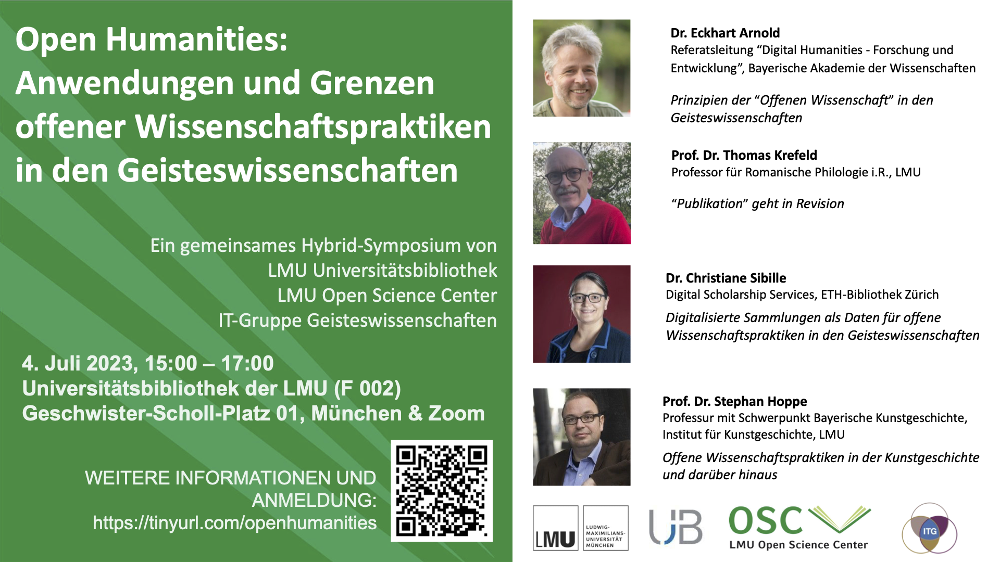

# Open Humanities: Anwendungen Und Grenzen Offener Wissenschaftspraktiken in Den Geisteswissenschaften

#####  Date & Time

04 Jul 2023  

#####  Location

Hybrid (Geschwister-Scholl-Platz 1, room F002 (Zentralbibliothek, EG), Munich and via Zoom)  

#####  Format

Hybrid  

#####  Language

German  

[ Materials](https://osf.io/8dmz2/)

  

Das Open Science Center veranstaltet gemeinsam mit der Universitätsbibliothek der LMU (UB) und der IT-Gruppe Geisteswissenschaften (ITG) ein Symposium zum Konzept von Open Science in den Geisteswissenschaften.  
Wir würden uns über Ihre Teilnahme sehr freuen.

Gegenstand von Open Science sind Konzepte und Methoden, die möglichst sämtliche Phasen und Inhalte von Forschungsprozessen transparent und allgemein zugänglich gestalten, um auch die geisteswissenschaftliche Forschung zu kontextualisieren und Kooperation und Nachnutzung zu erleichtern.

Auf dem geplanten Symposium diskutieren zunächst Dr. Eckhart Arnold (Leiter des Referats für IT und Digital Humanities, Bayerische Akademie der Wissenschaften) und Prof. Dr. Thomas Krefeld (Professor für Romanische Philologie, LMU), inwieweit Open-Science-Konzepte auf die Geisteswissenschaften anwendbar sind.  
Anschließend stellen Dr. Christiane Sibille (ETH Library, ETH Zürich) und Prof. Dr. Stephan Hoppe (Bayerische Kunstgeschichte, Architekturgeschichte, Digitale Kunstgeschichte, LMU) offene Forschungspraktiken vor, die in einigen Bereichen der Geisteswissenschaften bereits umgesetzt werden, wie das Teilen von ggf. sensiblen Daten und Open Monographs.

Abschließend findet eine Podiumsdiskussion mit allen Vortragenden statt. Es geht zum einen darum, Möglichkeiten und Grenzen der Open-Science-Bewegung in den Geisteswissenschaften auszuloten sowie die Notwendigkeit eines internen Diskurses oder einer eigenen Initiative zur proaktiven Förderung der Open Humanities zu diskutieren. Ferner sollen im Rahmen der Diskussion bestehende positive Ansätze und Verfahren identifiziert werden und eher negativ zu bewertenden Entwicklungen und Strukturen (Defizite, etwa hinsichtlich Problembewusstsein, Ausbildung oder Infrastruktur) gegenübergestellt werden.  
Am Ende des Symposiums soll eine Bedarfsumfrage unter dem Publikum durchgeführt und schließlich überlegt werden, wie das LMU Open Science Center, die UB der LMU und die IT-Gruppe Geisteswissenschaften Forscher\*innen in den Geisteswissenschaften bei der Umsetzung von offenen Forschungspraktiken unterstützen können.

**Programm**

- 15:00 Möglichkeiten und Grenzen offener Forschungspraktiken in den Geisteswissenschaften
  - **Dr. Eckhart Arnold** (Referatsleitung “Digital Humanities - Forschung und Entwicklung”, Bayerische Akademie der Wissenschaften): **Prinzipien der “offenen Wissenschaften” in den Geisteswissenschaften** - 13 min
  - **Dr. Thomas Krefeld** (Professor für Romanische Philologie i.R., LMU): **“Publikation” geht in Revision** - 13 min
- Fragen und Antworten - 10 min
- Pause - 5 min
- 15:45 Offene Forschungspraktiken, die in den Geisteswissenschaften bereits angewandt werden
  - **Dr. Christiane Sibille** (Digital Scholarship Services, ETH-Bibliothek Zürich): **Digitalisierte Sammlungen als Daten für offene Wissenschaftspraktiken in den Geisteswissenschaften** - 8 min
  - **Prof. Dr. Stephan Hoppe** (Professur mit Schwerpunkt Bayerische Kunstgeschichte, Institut für Kunstgeschichte, LMU): **Offene Wissenschaftspraktiken in der Kunstgeschichte und darüber hinaus** - 8 min
- Fragen und Antworten - 5 min
- Pause - 5 min
- 16:15 Podiumsdiskussion - 30 min
- 16:45 Nachbereitung und Fragen an das Publikum - 15 min
  - Zusammenfassung der Ko-Vorsitzenden
  - Welcher Bedarf besteht in Bezug auf Ausbildung, Verbreitung von Normen, Infrastruktur?
  - Wie kann das OSC /die UB / die ITG die Forscher bei diesen Fragen unterstützen?
- 17:00 Ende

  
Die Veranstaltung wird moderiert von Prof. Dr. Ralf Ludwig (Open Science Center, LMU), Dr. Stephan Lücke (IT-Gruppe Geisteswissenschaften, LMU) und Dr. Martin Spenger (Universitätsbibliothek, LMU).

 

 

#### Presenters

- Dr. Eckhart Arnold
- Prof. Dr. Thomas Krefeld
- Dr. Christiane Sibille
- Prof. Dr. Stephan Hoppe
- Prof. Dr. Ralf Ludwig
- Dr. Stephan Lücke

#### Questions?

If you have any questions, please contact [Malika Ihle](mailto:malika.ihle@lmu.de).
