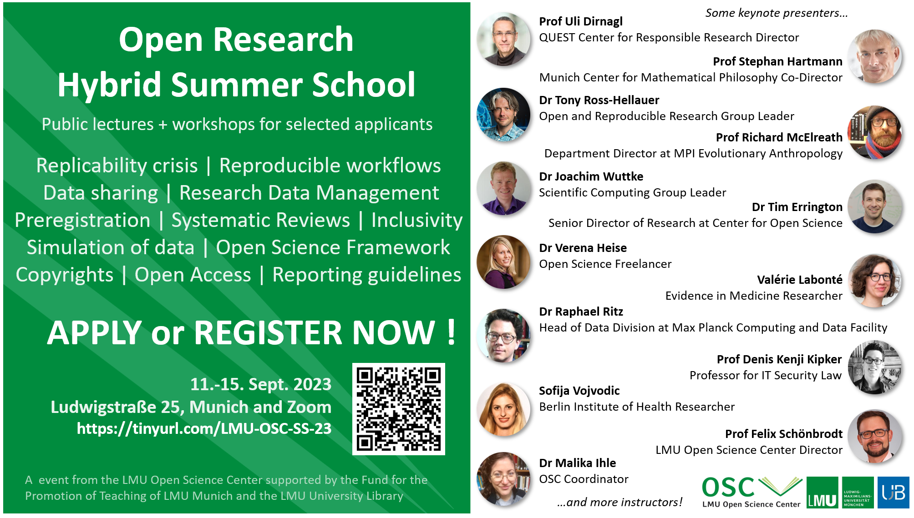

# 5-Day Open Research Summer School 2023

#####  Date & Time

11 Sep - 15 Sep 2023  

#####  Location

Hybrid (Ludwigstraße 25, Munich and via Zoom)  

#####  Format

Hybrid  

#####  Language

English  

[ Materials](https://osf.io/nymr5/)

  

The LMU Open Science Center organises this hybrid open research summer school to allow early-career researchers to gain more trust in the research that they do, and make it as credible as it can be in the eyes of their peers, the public, and funding agencies.

By joining (or accessing the material after the school), you will learn how to:

- plan your statistical plans in advance of collecting data to prevent biases in analyses, with the help of **preregistration** and **data simulation**;
- create computationally reproducible workflows so you can be more efficient and spot mistakes in data wrangling or analyses, through **programming**, creating **dynamic** **reports**, and **version** **controlling** scripts;
- share **data**, **materials**, **codes**, and **articles** appropriately (using **Findable**, **Accessible**, **Interoperable**, **Reusable** **principles**, sensible data **anonymisation** **techniques**, adequate **repositories** and **licences**) for your research to have more impact, by allowing others to build upon or replicate your work;
- follow **guidelines to report results** adequately and conduct **systematic reviews**

The summer school will consist of public lectures and workshops for selected applicants.

Some keynote presenters:

- Prof Uli Dirnagl, Director of QUEST Center for Responsible Research
- Prof Stephan Hartmann, Co-Director of Munich Center for Mathematical Philosophy
- Dr Tony Ross-Hellauer, Leader of Open and Reproducible Research Group
- Prof Richard McElreath, Department Director at MPI Evolutionary Anthropology
- Dr Joachim Wuttke, Leader of Scientific Computing Group
- Dr Tim Errington, Senior Director of Research at Center for Open Science
- Dr Verena Heise, Open Science Freelancer
- Valérie Labonté, Researcher in Evidence in Medicine
- Dr Raphael Ritz, Head of Data Division at Max Planck Computing and Data Facility
- Prof Denis Kenji Kipker, Professor for IT Security Law
- Sofija Vojvodic, Researcher at Berlin Institute of Health
- Prof Felix Schönbrodt, Director of LMU Open Science Center
- Dr Malika Ihle, Coordinator of LMU Open Science Center

…and many more instructors!

You can find the **programme** and more information on the **lectures** and **workshops** here: <https://malikaihle.github.io/OSC-Open-Research-Summer-School-2023/>

## Apply to attend the whole summer school (in-person or online)

To attend the whole school, i.e. both public lectures and workshops for selected applicants, in person or online, you must apply before **17 July 2023, 12:00 noon**.

The summer school is targeted at PhD students of all scientific disciplines (Medical sciences, Social Sciences, Life Sciences, etc. as opposed to research fields in the Humanities). Master students and early post docs are also welcome to apply. It will be held in a hybrid format and you will be able to choose your preferred mode of participation (online or in-person). By applying, we expect you to attend all sessions of the school (with exception possible).

During the application process, you will be asked about your motivation and experience. We will prioritize novices with a clear ideas about where to integrate these news skills in their own research. At equal score, we will prioritize members of the LMU, and maximize the diversity of applicants background in terms of discipline, career stage, and gender.

We will not provide travel grants. The in-person part of the school will take place in UB der LMU - Fachbibliothek Philologicum, Ludwigstraße 25, 80539 München, Germany. The online part will be on Zoom.

Apply here: <https://tellmi.psy.lmu.de/formr/OSC-Summer-School-2023>

## Join one or several of the public lectures (online)

Anyone can register at any time before the end of the summer school to attend one, multiple, or all lectures online.

Register here: <https://www.pretix.osc.lmu.de/lmu-osc/lectures/>

## Funding Note

The [LMU Open Science Center coordinator](../../about_us/coordinator/index.llms.md "Scientific Coordinator"), Dr Malika Ihle, organising the summer school, is funded by the **Frontier Fund of LMU Munich**. The summer school is funded by the **Fund for the Promotion of Teaching of LMU Munich**. The **LMU University Library** provides in-kind support.

 

 

#### Presenters

- Prof. Dr. Uli Dirnagl
- Prof. Dr. Stephan Hartmann
- Dr. Tony Ross-Hellauer
- Prof. Dr. Richard McElreath
- P.D. Dr. Joachim Wuttke
- Dr. Tim Errington
- Valérie Labonté
- Dr. Raphael Ritz
- Prof. Dr. Denis Kenji Kipker

#### Instructors

- Nicklas Hafiz
- Dr. Aaron Peikert
- Laura Meier
- Dr. Florian Pargent
- Dr. Verena Heise
- Sofija Vojvodic
- Florian Kohrt
- Dr. Malika Ihle

#### Helpers

- Felix Henninger
- Pat Callahan
- Moritz Ketzer
- Maximilian Ernst
- Dr. Karoline Sachse

#### Questions?

If you have any questions, please contact [Malika Ihle](mailto:malika.ihle@lmu.de).
