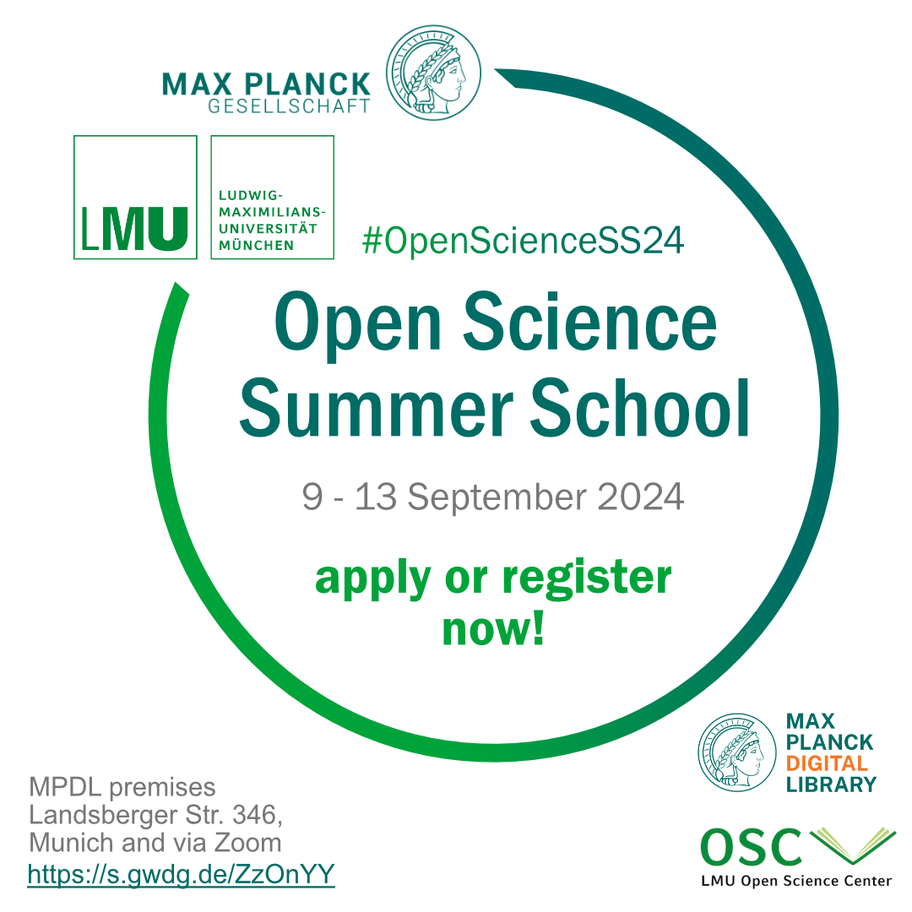

# LMU-MPG Open Science Summer School 2024

#####  Date & Time

09 Sep - 13 Sep 2024  

#####  Location

Hybrid (Max Planck Digital Library in Laim)  

#####  Format

Hybrid  

#####  Language

English  

[ Materials](https://osf.io/pxgsc/overview)

  

 

The LMU & MPG Open Science Summer School 2024 is organised by the [LMU Open Science Center (OSC)](https://www.osc.uni-muenchen.de/index.html) and the [Max Planck Digital Library (MPDL)](https://www.mpdl.mpg.de/en/).

This intensive 5-day Open Science Summer School provides early career researchers with the knowledge and skills to make their research more **transparent, reproducible** and **credible** in the eyes of their peers, the public and funding agencies.

By joining (or accessing the material after the school), you will learn how to:

- clarify your research design and set up your statistical plans in advance of collecting data to prevent biases in analyses, with the help of **preregistration** and **data simulation**
- create computationally reproducible workflows so you can be more efficient and spot mistakes in data wrangling or analyses, through **programming** with **version controlled** scripts;
- prepare, manage and share **data** and **code** in connection with your **articles** by applying the **Findable, Accessible, Interoperable, Reusable principles**, and using adequate **repositories** and **licences**.The summer school will consist of public lectures and workshops for selected applicants.

Increase the **impact** of your research and secure the **acknowledgement** of your and others contributions by opening your research practices!

Some keynote presenters:

- Ádám Dér, Head of the Scientific Information Provision at the MPDL
- Dr Tim Errington, Senior Director of Research at Center for Open Science
- Jonas Hagenberg, PhD student at the Max Planck Institute of Psychiatry
- Prof Dr Sabina Leonelli, Professor of Philosophy and History of Science at University of Exeter
- Prof Dr Richard McElreath, Department Director at MPI Evolutionary Anthropology
- Dr Malvika Sharan, Senior Researcher at the Alan Turing Institute
- Prof Dr Felix Schönbrodt, Director of LMU Open Science Center
- Dr Malika Ihle, Coordinator of LMU Open Science Center

…and many more instructors!

You can find the **programme** and more information on the **lectures** and **workshops** here: <https://osip.mpdl.mpg.de/lmu-mpg-open-science-summer-school-2024/>

## Apply to attend the whole summer school (in-person or online)

To attend the whole school, i.e. both public lectures and workshops for selected applicants, on site or online, you must apply before **15 July 2024, 12:00 noon CEST**.

**Apply here**: <https://surveys.osc.lmu.de/OpenScienceSummerSchool2024/>

The Summer Schoolis targeted at PhD students of all scientific disciplines (Earth sciences, Medical sciences, Social Sciences, Life Sciences, etc.). Researchers in fields of the Humanities can also apply, but should note that the Summer School contents lean towards quantitative research. Master students and early post docs are also welcome to apply.

The SummerSchool will be held in a hybrid format and you will be able to choose your preferred mode of participation (online or on site). By applying, we expect you to attend all sessions of the school (with justified exception possible). A certificate of attendance will be provided.

During the application process, you will be asked about your motivation, experience and prior knowledge. We will prioritize novices with clear ideas about where to integrate these new skills in their own research. At equal score, we will prioritize members of the LMU or MPG, and maximize the diversity of applicants background in terms of discipline, career stage, and gender.

The on site part of the school will take place on the premises of the Max Planck Digital Library, **Landsberger Straße 346, 80687 München, Germany**. Lunch will be provided for on site participants throughout the week. The dinner on Thursday is optional and on a self-payment basis. The online part will be on **Zoom**. We will not provide travel grants.

Please note that the Laim S-Bahn station is currently not barrier-free. If you require a barrier-free journey, please contact the [OSiP-Supp](mailto:osip@mpdl.mpg.de)

[ort](mailto:osip@mpdl.mpg.de).

## Join one or several of the public lectures (online)

Anyone can register at any time before the end of the summer school to attend one, multiple, or all lectures online.

Register here: <https://www.pretix.osc.lmu.de/lmu-osc/SS24/>

## Funding Note

The Summer School is financed by the **Max Planck Digital Library**.

 

#### Presenters

- Prof. Dr. Sabina Leonelli
- Dr. Malvika Sharan
- Prof. Dr. Richard McElreath
- Dr. Tim Errington
- Ádám Dér
- Jonas Hagenberg
- Dr. Angela Holzer
- Dr. Miriam Kip
- Dr. Angela Holzer
- Dr. Irene Haslinger

#### Instructors

- Dr. Malika Ihle
- Maximilian Mandl
- Jean-Claude Passy
- Laura Meier
- Pat Callahan
- Dr. Florian Pargent
- Florian Kohrt
- David Philip Morgan

#### Helpers

- Barbara Kovačić
- Julian Lange
- Maike Kleemeyer
- David Walter
- Valkyrie Felso
- Diego Theuerkauf
- Kathy Su

#### Questions?

If you have any questions, please contact [Malika Ihle](mailto:malika.ihle@lmu.de).
