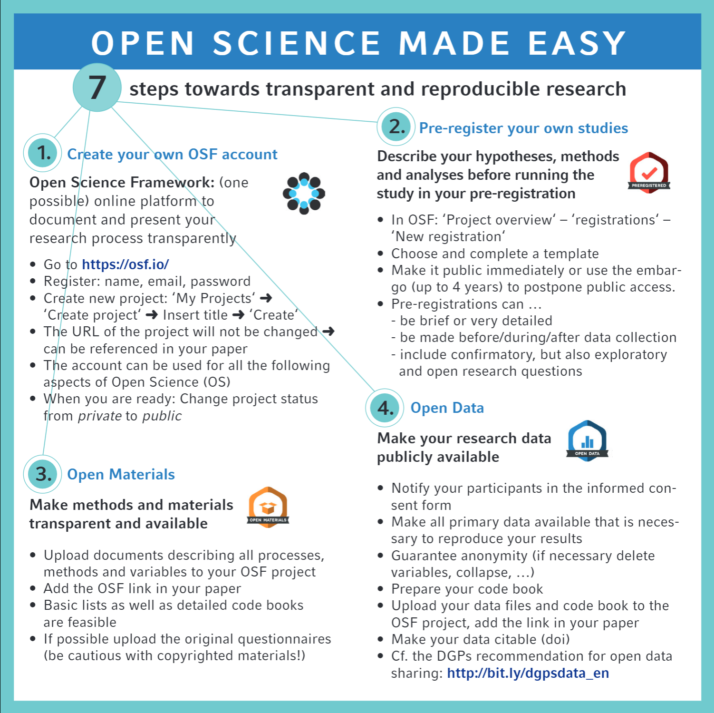
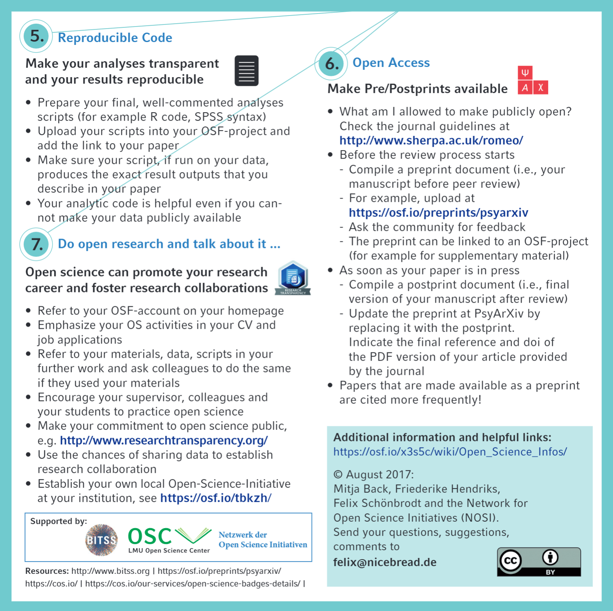

# Info flyer: Open science in 7 easy steps

February 28, 2018

Doing transparent and reproducible research might look complicated at first sight. This info flyer outlines in 7 really easy steps how you can increase the openness of your research workflow.

There’s an [English](https://osf.io/hktmf/) and a [German](https://osf.io/7au4n/) version of the flyer. The flyer has a CC-BY license; that means you can copy it, print it (we printed it on a 15x15cm card) and distribute it at your university, or take the information and remix it, as long as you credit the original authors.

*This flyer has been created in a cooperation between the [Network of Open Science Initiatives](https://osf.io/tbkzh/) and the LMU Open Science Center.*

