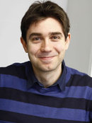
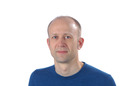
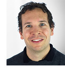
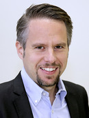
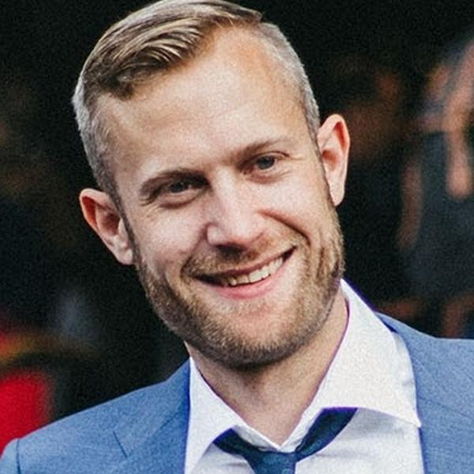
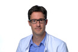
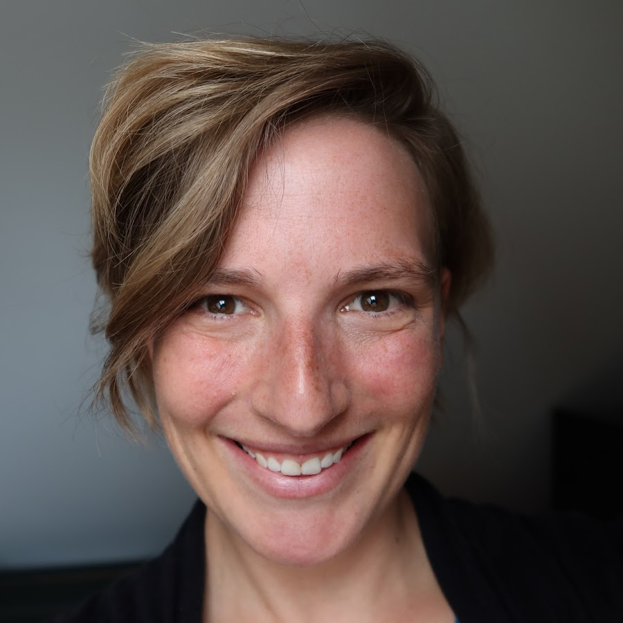
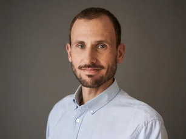
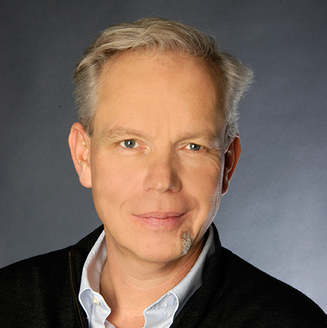

The OSC started in November 2017 with 17 founding members. It didn’t take long for the community to grow—nearly doubling in size. With these new members, we now span 11 disciplines across 10 of LMU’s 18 faculties.

**We are happy to introduce our 15 new members (in alphabetical order):**

---

{width=20%}  
**[PD Dr. Andreas Beyerlein](../../people/people/andreas-beyerlein.qmd)**  
Helmholtz Zentrum Munich  

---

{width=20%}  
**[Prof. Dr. Michael Ewers](../../people/people/michael-ewers.qmd)**  
Institute of Stroke Research and Dementia  

---

{width=20%}  
**[Prof. Dr. Mario Gollwitzer](../../people/people/mario-gollwitzer.qmd)**  
Social Psychology, Department of Psychology  

---

{width=20%}  
**[Dr. Ivett Guntersdorfer](../../people/people/ivett-guntersdorfer.qmd)**  
Intercultural Certificate Program (IKK)  

---

{width=20%}  
**[Taisuke Imai, PhD](../../people/people/imai-taisuke.qmd)**  
Department of Economics  

---

{width=20%}  
**[Dr. Daniel Keeser](../../people/people/daniel-keeser.qmd)**  
University Hospital Munich  

---

{width=20%}  
**[Dr. Barbara Osimani](../../people/people/barbara-osimani.qmd)**  
Munich Center for Mathematical Philosophy  

---

{width=20%}  
**[Prof. Dr. Frank Padberg](../../people/people/frank-padberg.qmd)**  
University Hospital Munich  

---

{width=20%}  
**[Prof. Dr. Andreas Peichl](../../people/people/andreas-peichl.qmd)**  
Macroeconomics and Public Finance, Department of Economics  

---

{width=20%}  
**[Dr. Fabian Scheipl](../../people/people/fabian-scheipl.qmd)**  
Department of Statistics  

---

{width=20%}  
**[Dr. Xenia Schmalz](../../people/people/xenia-schmalz.qmd)**  
University Hospital Munich  

---

{width=20%}  
**[Prof. Dr. Christian Schulz](../../people/people/christian-schulz.qmd)**  
University Hospital Munich  

---

{width=20%}  
**[Dr. Heidi Seibold](../../people/people/heidi-seibold.qmd)**  
Institute for Medical Information Processing, Biometry, and Epidemiology  

---

{width=20%}  
**[Dr. Sebastian Wichert](../../people/people/sebastian-wichert.qmd)**  
Empirical Innovation Economics  

---

{width=20%}  
**[Prof. Dr. Gert Wörheide](../../people/people/gert-woerheide.qmd)**  
Department of Earth and Environmental Sciences  

---

**Thank you all for joining the initiative!**