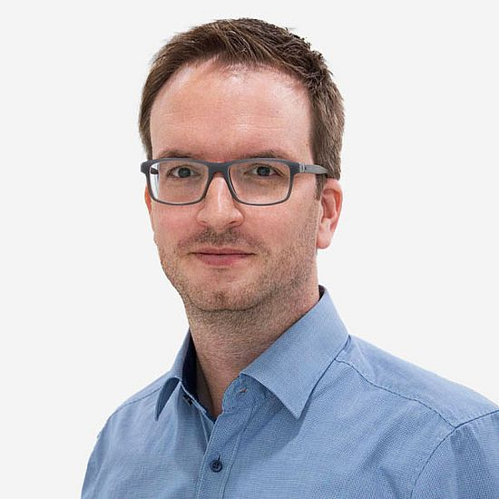

# We welcome 4 new individual members

The Open Science Center counts 54 members! We want to introduce our latest members.

New Members

Published

March 3, 2020

The number of individual members of the OSC is continuously increasing since its foundation in November 2017 with 17 founding members. With our 4 new members, from 4 different disciplines, the OSC counts 54 members from 15 disciplines.

***We are happy to introduce our new members, in alphabetical order:***

------------------------------------------------------------------------

**[Prof. Dr. Marco Düring](../../people/people/marco-duering.llms.md)**

Institute for Stroke and Dementia Research

------------------------------------------------------------------------

**[Dr. Julian Unkel](../../people/people/julian-unkel.llms.md)**

Department of Media and Communication

------------------------------------------------------------------------

**[Prof. Dr. Helmut Küchenhoff](../../people/people/helmut-kuechenhoff.llms.md)**

Statistical consulting laboratory

------------------------------------------------------------------------

**[Dr. Julia Schulte-Cloos](../../people/people/julia-schulte-cloos.llms.md)**

Geschwister-Scholl-Institute for Political Science

------------------------------------------------------------------------

Thank you for joining the initiative!
