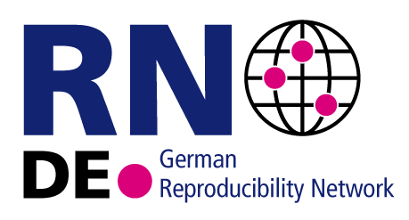

# German Reproducibility Network was launched recently!

The LMU Open Science Center is a founding member

February 1, 2021

Eight key Open Science actors in Germany founded the [German Reproducibility Network (GRN)](https://reproducibilitynetwork.de/) and the LMU Open Science Center is one of them! The cross-disciplinary consortium is dedicated to promote reproducible and robust research on a national level in Germany. The managing director of the LMU Open Science Center, Professor Felix Schönbrodt, says: “Especially in times when medical and societal challenges require scientifically sound answers, we need an open, cooperative, and credible science. To achieve this goal, the German Reproducibility Network brings together key players in Germany.”

### Mission and goals

Today, it seems more important than ever that research results are trustworthy and based on robust research. This includes transparency and openness to enable the reproducibility of research results as a key quality indicator in research, which is also in line with established principles of good scientific practice. With this background, the GRN was founded in January 2021. This peer-led cross-disciplinary consortium in Germany aims to increase trustworthiness and transparency of scientific research. Therefore, the network focuses on the following activities:

- Support researchers in educating themselves about open science practices, and founding local open science communities.
- Connecting local or topic-centered Reproducibility Initiatives to a national network, and foster connections between them.
- Advise institutions on how to embed open science practices in their work.
- Represent the open science community toward other stakeholders in the wider scientific landscape.

The GRN is embedded in a growing network of similar initiatives as the [UK Reproducibility Network](https://www.ukrn.org/), [Swiss Reproducibility Network](https://www.swissrn.org/), [Australian Reproducibility Network](https://www.aus-rn.org/) and [Slovak Reproducibility Network](https://www.skrn.sk/).

### Members

The founding members are the following eight Open Science actors in Germany:

- [Berlin University Alliance](https://www.berlin-university-alliance.de/)
- [BIH QUEST Center](https://www.bihealth.org/de/forschung/quest-center/)
- [German Psychological Society (DGPs)](https://www.dgps.de)
- [Helmholtz AI](https://www.helmholtz.ai/)
- [Helmholtz Open Science Office](https://os.helmholtz.de/)
- [LMU Open Science Center](https://lmu-osc.github.io/ "Welcome to the Open Science Center")
- [NOSI (Network of Open Science Initiatives)](https://osf.io/tbkzh/)
- [ZBW (Leibniz Information Centre for Economics)](http://www.zbw.eu/en/home/)

The network is open for further members (e.g. local Open Science initiatives) and offers various ways to participate. More information about how to join the network can be found on the [website of the GRN](https://reproducibilitynetwork.de/join/).

 

 
