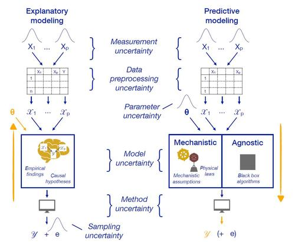
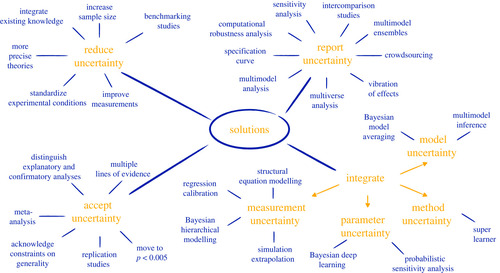

# Joint interdisciplinary work by OSC members now published

‘The multiplicity of analysis strategies jeopardizes replicability: Lessons learned across disciplines’ by S. Hoffmann, F. Schönbrodt, R. Elsas, R. Wilson, U. Strasser and A. Boulesteix

April 21, 2021

Available from The Royal Society Publishing, DOI: [10.1098/rsos.201925](https://doi.org/10.1098/rsos.201925)

This work was conducted by a multidisciplinary team uniting the managing director and two scientific board members of the Open Science Center (OSC) of the LMU Munich. This collaboration results in a diverse list of authors from psychology, epidemiology, finance, hydroclimatology and statistics. It is part of the OSC’s mission that members collaborate interdisciplinary to examine topics related to Open Science and good research practices. An outcome of this publication is a list of concrete suggestions how to handle the multiplicity of possible data analysis strategies. The uncertainty concerning the best analytic approach often appears conducting empirical studies across different disciplines. The paper illustrates the problem (Figure 2) and systematizes a wide range of available solutions (Figure 4).

### Abstract:

For a given research question, there are usually a large variety of possible analysis strategies acceptable according to the scientific standards of the field, and there are concerns that this multiplicity of analysis strategies plays an important role in the non-replicability of research findings. Here, we define a general framework on common sources of uncertainty arising in computational analyses that lead to this multiplicity, and apply this framework within an overview of approaches proposed across disciplines to address the issue. Armed with this framework, and a set of recommendations derived therefrom, researchers will be able to recognize strategies applicable to their field and use them to generate findings more likely to be replicated in future studies, ultimately improving the credibility of the scientific process.

### 

Figure 2: Sources of uncertainty in explanatory, mechanistic predictive and agnostic predictive modelling.

Figure 4: Overview of solutions to the replication crisis which address the multiplicity of analysis strategies by reducing, reporting, integrating or accepting uncertainty. For an interactive version of this graphic with assorted references see <https://shiny.psy.lmu.de/multiplicity/index.html>.
