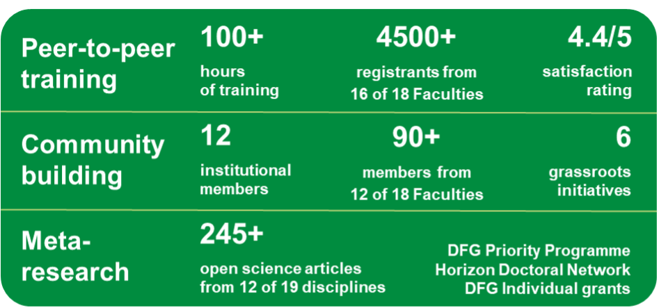

# LMU Open Science Center Impact Report 2017 – 2023

December 7, 2023

We compiled an **impact report from 2017-2023** which we are excited to share with you here: <https://doi.org/10.5281/zenodo.10285395>

It describes all our **activities** (training, community building, meta-research, consultations, and liaison with stakeholders), our **incomes** **and expenditures**, and our **future strategies**. We believe this report attests of the Center’s success!

Below are some statistics on training offers since May 2022 when the coordinator role started, as well as on community building and meta- research activities since the OSC’s foundation in 2017.

