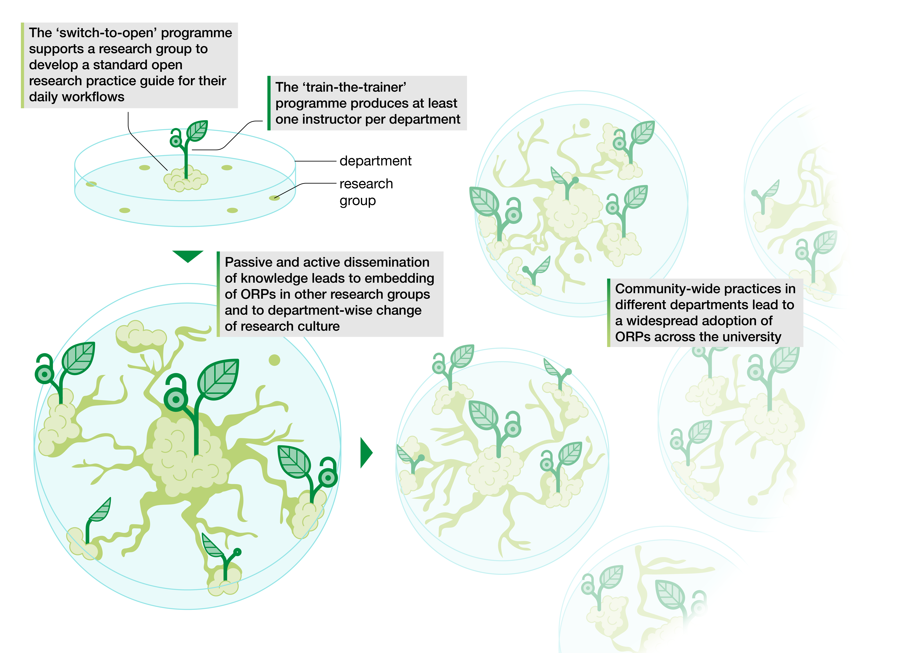

# Our project “From local to systemic implementation: Embedding open research in institutional practices” was funded by the Volkswagen Foundation!

December 11, 2023

We applied for the call “Pioneer Projects - Impetus for the German Research System” with a project entitled “**From local to systemic implementation: Embedding open research in institutional practices**” composed of two work packages: (i) a “**switch-to-open**” program, an innovative intervention designed to help individual research groups transition from closed to open workflows, (ii) a complementary **train-the-trainer** program focusing on empowering participants to become instructors of open research practices to increase uptake within their disciplines. We were granted **500.000€ for 3 years**!

**Local nucleus of change.**

*Within each department, our “switch-to-open” programme will support a research group to become a model for their peers, by developing a written standard open research practice guide that can be adopted or adapted by other research groups. This programme will raise awareness of open research practices (ORPs) and lead to passive dissemination of knowledge to other working groups. In addition, trained instructors from our train-the-trainer programme (which may or may not be members of the switched groups) will pass on skills to their peers, actively disseminating new practices within their department. Combined, these efforts will embed ORPs locally, and change local culture within each department, thereby initiating systemic change.*

LMU press release  
**EN:** <https://www.lmu.de/en/newsroom/news-overview/news/bringing-transparency-to-research-practice.html>  
**DE:*** *<https://www.lmu.de/de/newsroom/newsuebersicht/news/transparenz-in-die-forschungspraxis-bringen.html>
