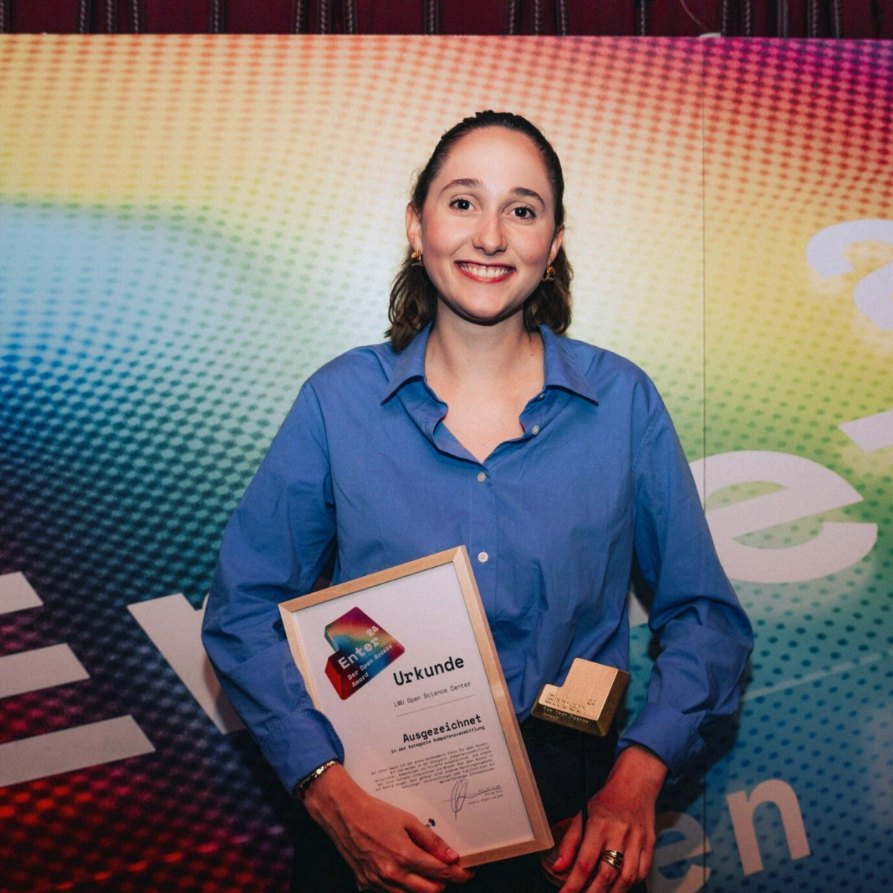

# The LMU Open Science Center received the Open Access Enter-Award!

July 3, 2024

On July 3, the LMU Open Science Center, has received the [Open Access Enter-Award](https://enter-award.irights-lab.de) in the category competence building. This is a great recognition of our work and dedication to promoting open science.

The Open Access Enter-Award, supported by the Federal Ministry of Education and Research and the iRights Lab, recognizes outstanding commitment and dedication to open access.

At yesterday’s award ceremony, our student assistant, Gracia Prüm, had the privilege of representing the Open Science Center in Berlin. She introduced our grassroot initiative to the audience and also talked about our two upcoming programs “Switch-to-Open” and “Train-the-Trainer” which aim to foster a cultural shift at our institution towards open and reproducible science. Another important aspect which has been highlighted is a structural change of incentives for good research practices e.g by reforming the criteria of research assessment.

The event provided an excellent opportunity to connect with other inspiring projects which promote open access in our research culture. In a very warm and collaborative environment it was possible to engage in various discussions and to exchange ideas about ways of advancing open access and open science in academia.

Winning this award is a great honor for us and acknowledges our efforts and contributions in this field. It is gratifying to receive such an appreciation and validation of our work.

We want to thank the iRights Lab and the Federal Ministry of Education and Research for supporting such an important topic and organizing this great event. It’s a great sign to recognize and appreciate the engagement and contribution of different people in this field. We’re excited to build on this success and look forward to all upcoming projects with you.

Read the official LMU press release [here](https://www.lmu.de/de/die-lmu/die-lmu-auf-einen-blick/auszeichnungen/weitere-auszeichnungen/#st_img_text__master_1#st_img_text__master_1).

* Our student assistant, Gracia Prüm who accepted the certificate and the Enter award on behalf of the OSC.*

 

 
