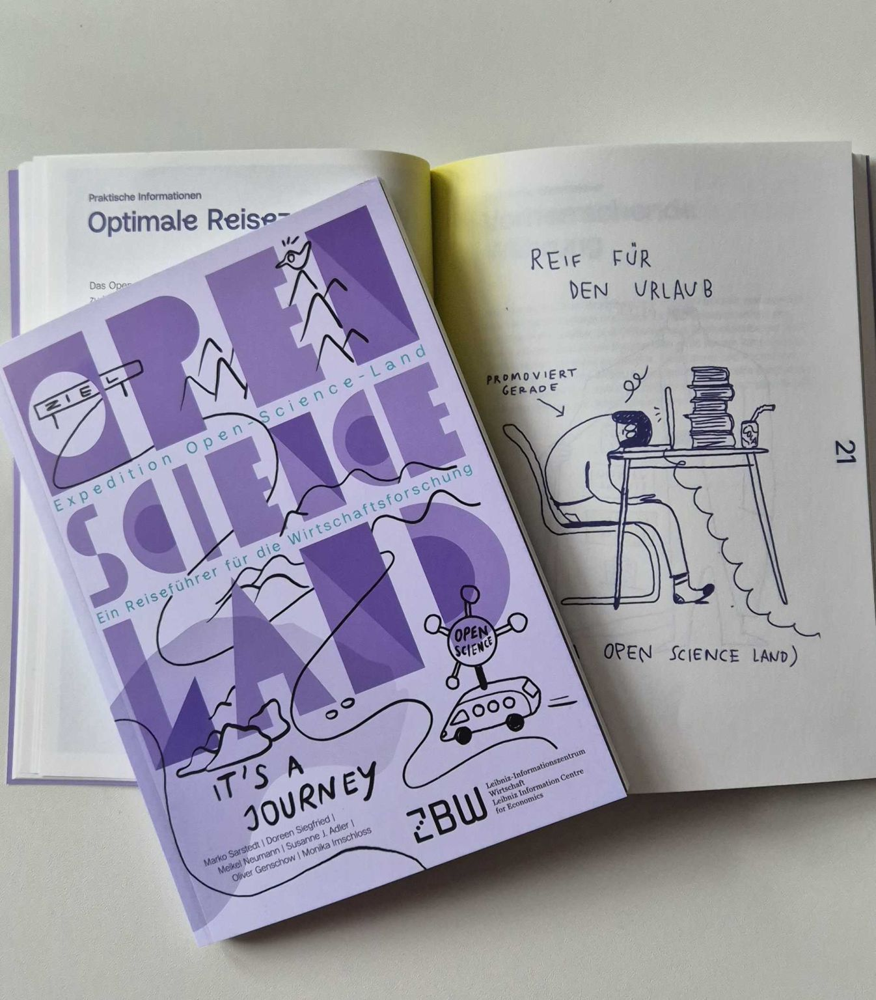
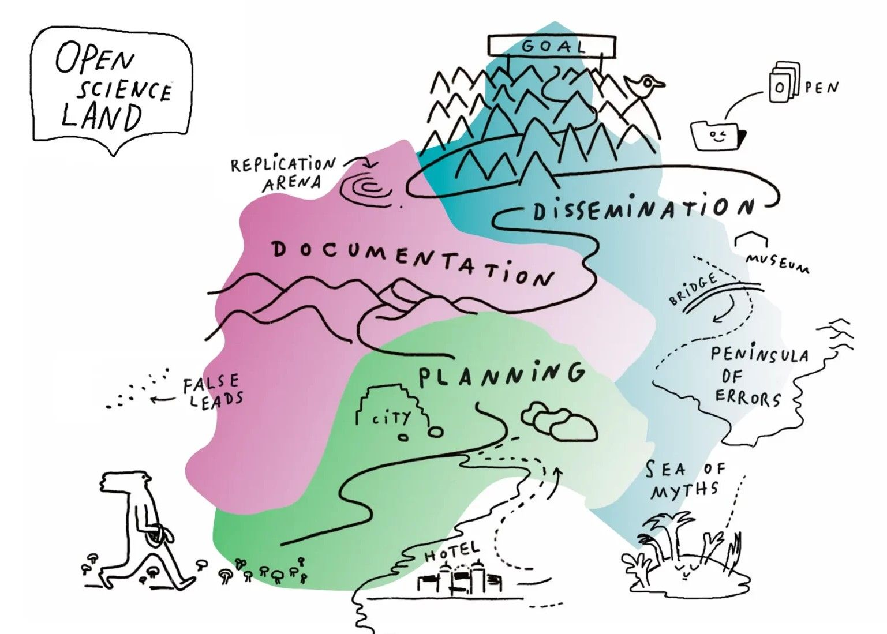

How to see Open Science as an adventure? Two of our OSC members, [Prof. Dr. Marko Sarstedt](/people/people/marko-sarstedt.qmd) and [Dr. Susanne Adler](/people/people/susanne-adler.qmd), are part of the team that presents a refreshing and imaginative perspective on open science. 

In a newly published book *“Expedition Open Science Land: A travel guide for business research”*, readers are invited to explore Open Science not as a set of requirements, but as a landscape to discover, navigate, and experience. Written by business researchers for business researchers!

{width=40% alt="Book titled “Expedition Open Science Land” with a purple cover placed on an open page with a simple illustration of a researcher at a desk."}

The book helps you navigate the regions of **Planning, Documentation, and Dissemination** within Open Science, covering topics such as:  

- Preregistration
- Registered reports
- Replication studies
- Large-scale collaborative projects

{width=40% alt="Illustrated map of “Open Science Land” showing areas like planning, documentation, and dissemination as mountains, valleys, and islands."}

It also introduces key tools, platforms, and resources that support transparency and reproducibility, helping researchers get started in practice. The guide further situates Open Science within the evolving research landscape, highlighting both opportunities and challenges, and offering practical guidance for navigating them.

For more information, visit the project website: <https://expedition-open-science.org/>

## Download the book!

- [Click here to download the **English** version](https://expedition-open-science.org/sdc_download/759/?key=myoz1a00fb4vcfbw6gn9crhawzxdfb)
- [Click here to download the **German** version](https://expedition-open-science.org/sdc_download/762/?key=l0ei9n5p9vlea28o8jrd2yx962mbvb)

