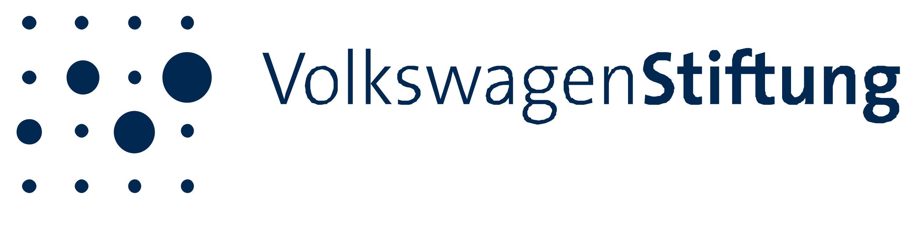

# Funders

##### LMU Project Funding

[ Website](https://www.lmu.de/de/index.html)

Frontiers LMU Excellence 2022 - 2024 €250K

Meta-Research Hub

Fund for the Promotion of Teaching 2022 €15K+

Hybrid Open Science Summer School 2023

Central Study Grant 2024 - 2025 €140K+

Open Hybrid Facilitated Self-paced Tutorial (Open HyFaST)

------------------------------------------------------------------------

##### Volkswagen Foundation

[ Website](https://www.volkswagenstiftung.de/en)

Pioneer Project – Impetus for the German Science System 2025 - 2027 €550K

From local to systemic implementation: Embedding open research in institutional practices [Press Release ](https://www.lmu.de/en/newsroom/news-overview/news/bringing-transparency-to-research-practice-28b91a8c.html)

------------------------------------------------------------------------

##### LMU Funding Institutional Members

[ Website](funding-institutional-members.llms.md)

Yearly membership fee Ongoing €10K+/year

Funding institutional members such as LMU Faculties and Clusters of Excellence provide the center with a yearly membership fee to get priority access to our training programmes and consultations.

------------------------------------------------------------------------

##### LMU Psychology Department

[ Website](https://www.lmu.de/psy/de/)

Departmental Study Grant 2026 €5K+

Integration of Open Science training material into the Psychology curriculum
