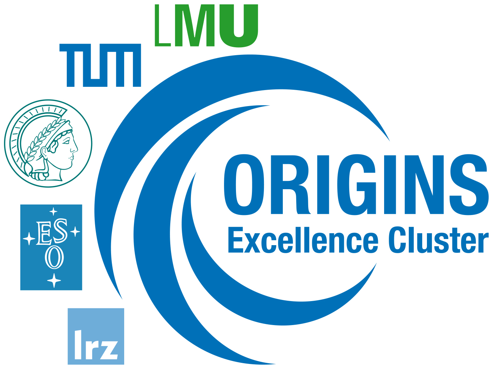
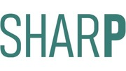
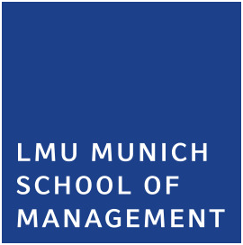

# Funding Institutional Members

##### Cluster of Excellence: Origins

Contact Person:

[Prof. Dr. Thomas Kuhr](../people/people/thomas-kuhr.llms.md)

[ Website](https://www.med.lmu.de/bmc/en/)

The Excellence Cluster ORIGINS: “From the Origins of the Universe to the First Building Blocks of Life” is an interdisciplinary research network based in Munich and Garching. Building on the previous Excellence Cluster Universe, a very fruitful collaboration between astro-, particle- and nuclear physicists, ORIGINS is exploring the conjecture of modern cosmology that the Universe and the emergence of life have naturally unfolded from the initial conditions laid out in the Big Bang. Open Science under FAIR (Findability, Accessibility, Interoperability, and Reuse of digital assets) principles has a long tradition in astrophysics and is showing increased activity in particle physics. The ORIGINS Data Science Lab (ODSL) was founded as a pillar for novel statistical data analysis and artificial intelligence in all ORIGINS (bio-)physics and chemistry disciplines. As a part of ODSL, the Dark Matter Data Centre (DMDC) provides an open science repository for dark matter-related experimental data, numerical simulations and related software to improve accessibility within the dark matter community.

------------------------------------------------------------------------

##### Cluster of Excellence: SyNergy

Contact Person:

[Prof. Dr. Martin Dichgans](../people/people/martin-dichgans.llms.md)

[ Website](https://www.synergy-munich.de/synergy)

The Munich Cluster for Systems Neurology (SyNergy) investigates how complex neurological diseases such as Alzheimer's disease, stroke, and multiple sclerosis develop. Using systems neurology as a new interdisciplinary approach, researchers can decipher the shared disease mechanisms of neurovascular, neurodegenerative, and neuroimmunological diseases and on this basis develop novel diagnostic and therapeutic approaches. SyNergy has expressed its commitment to promoting research transparency and reproducibility in both quantitative and qualitative research endeavors. We view the ability to replicate and reproduce research findings, whether quantitative or qualitative, as fundamental pillars supporting the generalizability and reliability of scientific knowledge.

------------------------------------------------------------------------

##### Collaborative Research Centre - SHARP (TRR419)

Contact Person:

[Prof. Dr. Frank Fischer](../people/people/frank-fischer.llms.md)

[ Website](https://www.en.mcls.uni-muenchen.de/research/sharp-initiative/index.html)

"Simulation-Based Learning in Higher Education. Advancing Research on Process Diagnostics and Personalised Interventions" (SHARP) - mission statement tba.

------------------------------------------------------------------------

##### Department of Psychology

Contact Person:

[Prof. Dr. Felix Schönbrodt](../people/people/felix-schoenbrodt.llms.md)

[ Website](https://www.lmu.de/psy/de/)

Psychological science has seen a substantial replication crisis in the last years, with many large scale projects failing to replicate apparently well established findings. With the goal to increase the awareness and the adoption of open science practices, in July 2015 an Open Science Committee was established at the Department Psychology. Its project on the Open Science Framework (OSF) provides different documents and presentations that are used in research and teaching. Furthermore, since 2016 all job descriptions for professorship positions at our department included an "Open Science track record" as desirable characteristic of an applicant. Additionally, a PhD/Dissertation agreement between all PhD students and their supervisors now includes planned open science practices. A template for this kind of agreement is provided on their website.

------------------------------------------------------------------------

##### Faculty of Biology

Contact Person:

[Prof. Dr. Niels Dingemanse](../people/people/niels-dingemanse.llms.md)

[ Website](https://www.lmu.de/psy/de/)

The Faculty of Biology is committed to actively support and foster good and open research practices including preregistration of studies, sharing of data and analysis scripts, and ensuring open access to publications wherever possible. As a funding institutional member, we aim to support training and community building activities that advance robust and reproducible research at LMU.

------------------------------------------------------------------------

##### Faculty of Business Administration - Munich School of Management

Contact Person:

[Prof. Dr. Ralf Elsas](../people/people/ralf-elsas.llms.md)

[ Website](https://www.som.lmu.de/en/)

The LMU Munich School of Management is committed to advancing the principles of open science and research transparency. By becoming an institutional member of the LMU's Open Science Center, we aim to foster a culture of openness, collaboration, and integrity in our research community. We believe that promoting open access to data, methodologies, and findings will enhance the quality and reproducibility of research in business studies, ultimately contributing to innovative and impactful solutions for global business challenges.
