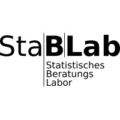

# Other LMU Support Services

##### Research Funding Unit

Contact Person:

[Dr. Florian Schreck](mailto:florian.schreck@verwaltung.uni-muenchen.de)

[ Website](https://fdm.ub.lmu.de/services-networks/research-funding/)

The Research Funding Unit is here to help researchers comply to requirements of funding agencies to increase your chances of getting funded.

------------------------------------------------------------------------

##### StaBLab: Statistical consulting unit

Contact Person:

[StaBLab team](mailto:kontakt@stablab.stat.uni-muenchen.de)

[ Website](https://www.stat.lmu.de/stablab/en/)

The StaBLab team provide free statistical consultations for LMU students and researchers to support them with their thesis and research projects with:

- Experimental design and sampling planning
- Statistical modelling
- Big Data Analyses & Machine Learning

------------------------------------------------------------------------

##### MLCU: Machine Learning Consulting Unit

Contact Person:

[MLCU](https://www.slds.stat.uni-muenchen.de/consulting/webform.html)

[ Website](https://www.slds.stat.uni-muenchen.de/consulting/)

The MLCU provides machine learning consulting to LMU students and researchers. We offer:

- Help with selection of appropriate methods to answer specific research questions
- Support with implementation and interpretation of machine and deep learning methods
- Support in setup and implementation of reproducible benchmark experiments (including hyperparameter optimization and benchmark evaluation)

------------------------------------------------------------------------

##### University Library LMU - Research Data Management Information

Contact Person:

[RDM team](mailto:rdm@ub.uni-muenchen.de)

[ Website](https://www.ub.lmu.de/en/open-access-publishing/research-data/)

The [RDM Information team](https://www.ub.lmu.de/en/open-access-publishing/research-data/) at the University Library of LMU Munich supports researchers throughout the research data lifecycle by providing infrastructure, guidance, and training in:

- Research data management planning and implementation
- Research data management plans (e.g. with the tool [RDMO](https://rdmo.ub.lmu.de))
- FAIR data practices (findable, accessible, interoperable, reusable)
- Data publication and repositories, including [Open Data LMU](https://data.ub.uni-muenchen.de)
- Electronic Lab Notebooks (ELNs), including eLabFTW, for structured research documentation

Information on research data management is centrally available on [Research Data LMU](https://fdm.ub.lmu.de).

------------------------------------------------------------------------

##### University Library LMU - Associated Electronic Publishing Divisions: Open Access Publishing Services

Contact Person:

[Open Access & Publishing Team](mailto:open-access@ub.uni-muenchen.de)

[ Website](https://www.ub.lmu.de/en/open-access-publishing/)

The team provides:

- Infrastructure and support on collecting, preserve and share publications based on text, following the Green or Gold Open Access route on the institutional repository Open Access LMU
- Advice on topics around Open Access (e.g. Creative Commons licenses, different versions of manuscripts, Green and Gold Open Access, Predatory Publishing, etc.)
- Infrastructure for founding your own Open Access journal with the service of Open Journals LMU
- Infrastructure to publish monographs, conference proceedings or anthologies (including your university thesis) in both print and digital form as Open Access publication with the service of Open Publishing LMU
- Support through the (partial) funding of open access publications via agreements with publishers and the LMU Open Access Fund
- Bibliometric consultations

------------------------------------------------------------------------

##### IT-Gruppe Geisteswissenschaften (ITG) - LMU Center for Digital Humanities

Contact Person:

[Dr. Stephan Lücke](mailto:luecke@lmu.de)

[ Website](https://www.itg.uni-muenchen.de/index.html)

The ITG provides advice and assistance with:

- Planning and conducting projects with substantial shares of digital methods in the humanities
- Research data management

The ITG is responsible for accompanying digital projects in the humanities, computer science, statistics and computational linguistics as well as the emerging data sciences.
