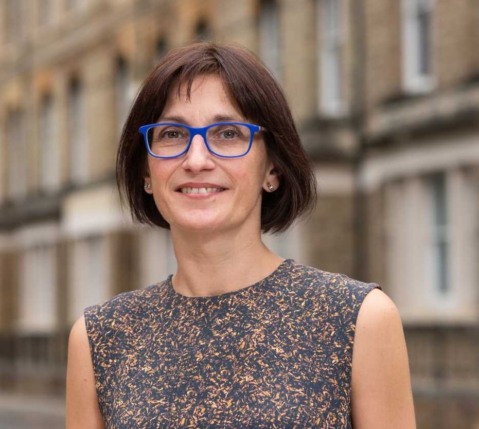
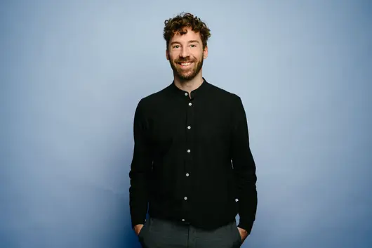
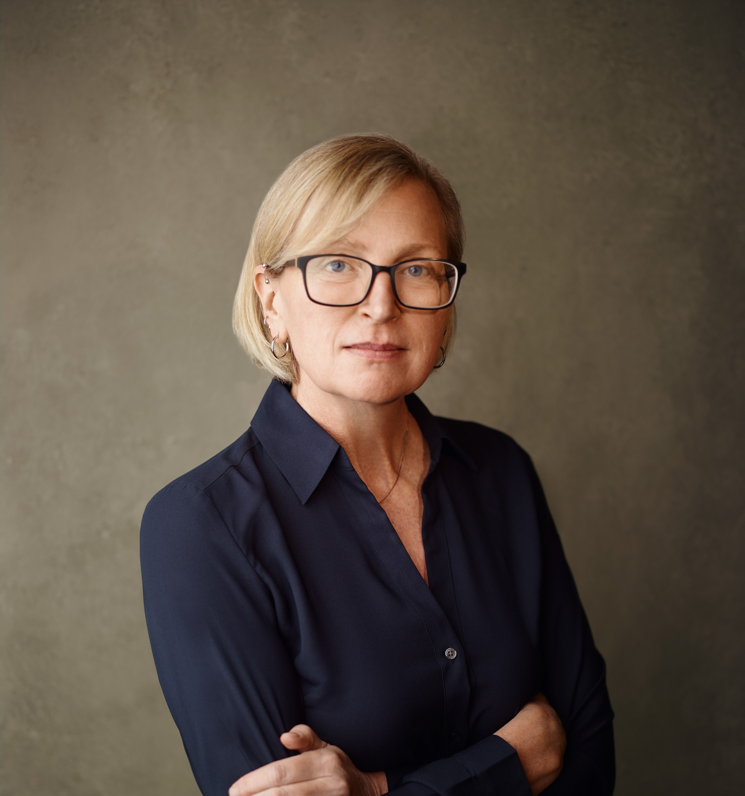
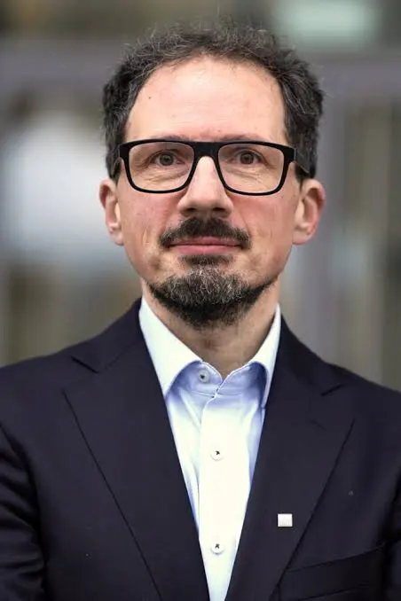
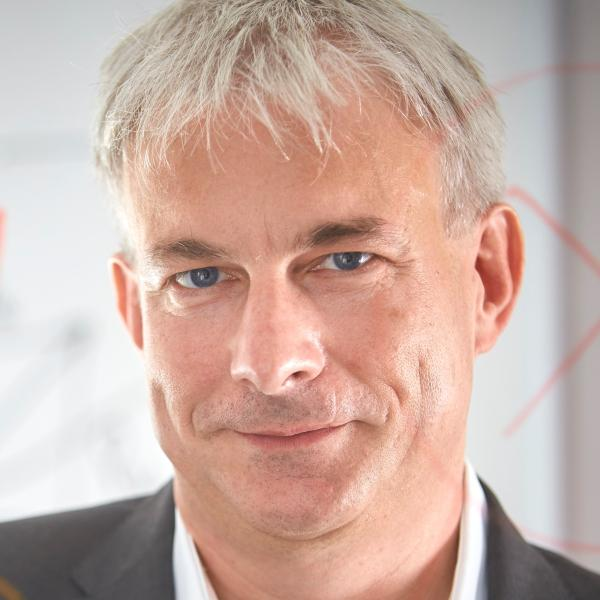
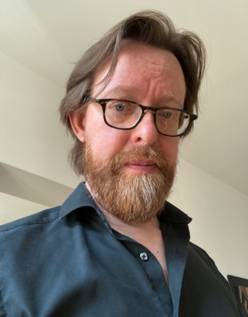
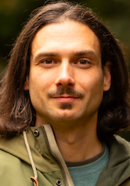

# Advisors

## Current Advisory Board

The OSC is advised by key internal and external actors appointed for 3-year terms. Advisory board members for the term 2024 - 2027 are:

[Tanita Casci](https://staff.web.ox.ac.uk/redirects-research)

Dr.

Research Strategy & Policy Unit Director

University of Oxford

[Mathijs Vleugel](https://os.helmholtz.de/en/about/team-and-contact/#c122678)

Dr.

Head Helmholtz Open Science Office

Helmholtz Association

[Chelle Gentemann](https://cgentemann.github.io)

Dr.

Science Lead for the NASA Transform to Open Science Initiative

NASA

[Bernhard Goodwin](https://www.lmu.de/mzn/de/mitglieder/kontaktseite/bernhard-goodwin-518b73ed.html)

Dr.

Executive Director of the Munich Science Communication Lab

LMU Munich

[Stephan Hartmann](https://www.philosophie.lmu.de/de/personenuebersicht/kontaktseite/stephan-hartmann-6dff5dee.html)

Prof. Dr.

Dean of the Faculty of Philosophy, Philosophy of Science and the Study of Religion

LMU Munich

[Richard McElreath](https://www.eva.mpg.de/ecology/staff/richard-mcelreath/)

Prof. Dr.

Director of the Max Planck for Evolutionary Anthropology, Open Science Advisor to the Max Planck Society

Max Planck Institute for Evolutionary Anthropology

## Special Advisors

We benefit from the expertise of additional advisors on specific topics such as politics and didactics.

[Peter Edelsbrunner](../people/people/peter-edelsbrunner.llms.md)

Prof. Dr.

Instructional Design Advisor

Psychology & Education

[Maximilian Frank](../people/people/maximilian-frank.llms.md)

M.Sc.

Strategy Advisor

Psychology & Education

## Former Advisory Board Members

- [Prof. Dr. Ulrich Dirnagl (2024 - 2025): Founding Director of the QUEST Center for Responsible Research, Berlin Institute of Health](https://schlaganfallcentrum.charite.de/metas/person/person/address_detail/prof_dr_med_ulrich_dirnagl-1)

&nbsp;
