# Fellows

OSC Fellows are early career researchers who do not have a PhD degree and who are (co-)leading grassroots initiatives or (co-)deliver training on open research. We are grateful for their valuable contributions! [Become a Fellow](../about/join-us.llms.md) .

## Fellows

[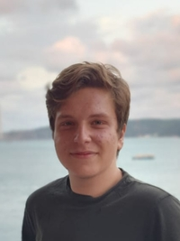](../people/people/alp-kaan-aksu.llms.md)

[Alp Kaan Aksu](../people/people/alp-kaan-aksu.llms.md)

B.Sc. Student

Psychology & Education

[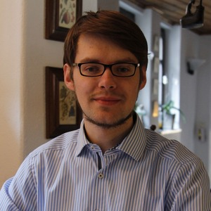](../people/people/maximilian-frank.llms.md)

[Maximilian Frank](../people/people/maximilian-frank.llms.md)

Ph.D. Candidate

Psychology & Education

[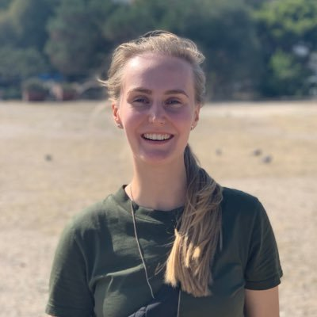](../people/people/laura-goetz.llms.md)

[Laura Goetz](../people/people/laura-goetz.llms.md)

M.Sc. Student

Medicine, Psychology & Education

[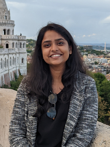](../people/people/reema-gupta.llms.md)

[Reema Gupta](../people/people/reema-gupta.llms.md)

Ph.D. Candidate

Medicine

[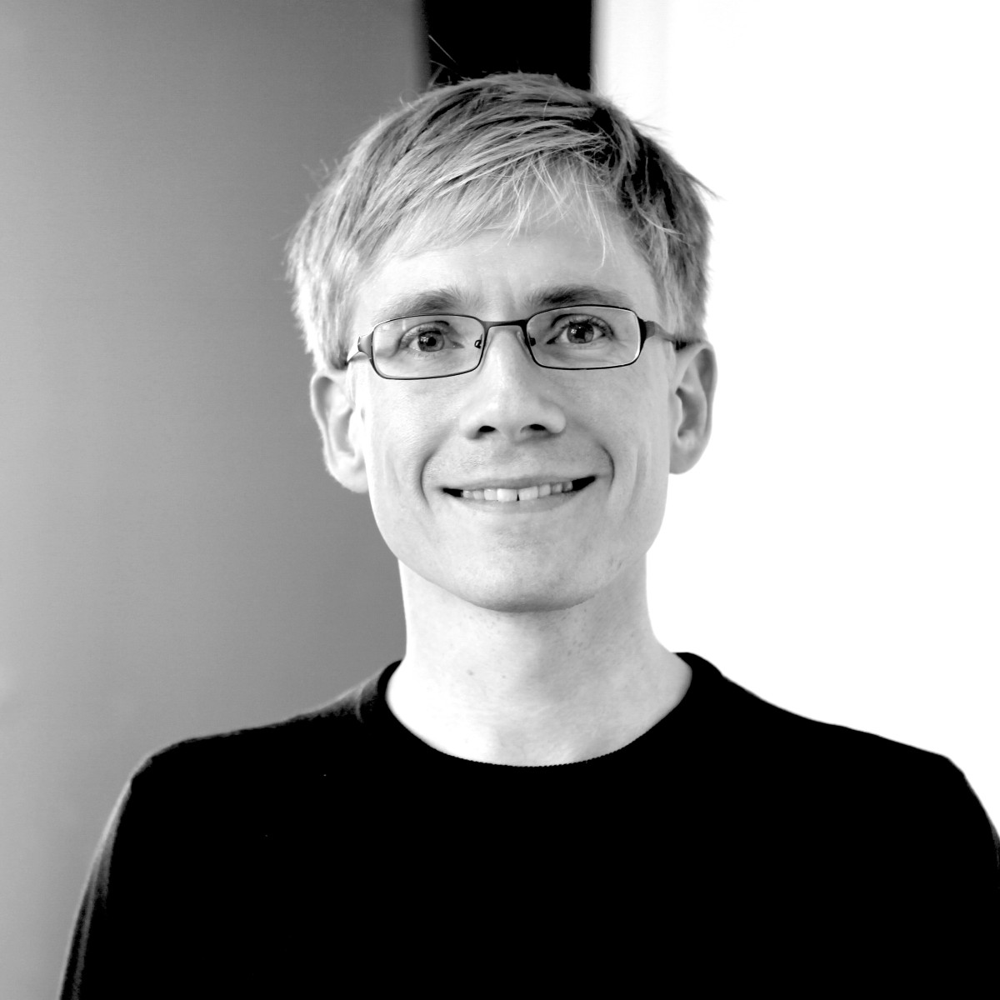](../people/people/felix-henninger.llms.md)

[Felix Henninger](../people/people/felix-henninger.llms.md)

Ph.D. Candidate

Math, Informatics & Stats

[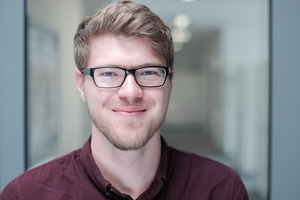](../people/people/markus-herklotz.llms.md)

[Markus Herklotz](../people/people/markus-herklotz.llms.md)

Researcher

Math, Informatics & Stats

[Florian Kohrt](../people/people/florian-kohrt.llms.md)

Ph.D. Candidate

Psychology & Education

[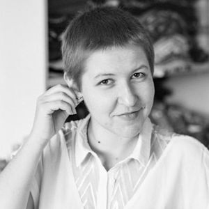](../people/people/barbara-kovacic.llms.md)

[Barbara Kovačić](../people/people/barbara-kovacic.llms.md)

B.Sc. Student

Languages & Literatures

[Maximilian Kristen](../people/people/maximilian-kristen.llms.md)

M.Sc. Student

History & Arts

[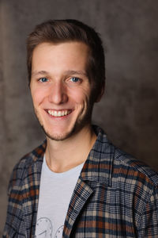](../people/people/daniel-kraehmer.llms.md)

[Daniel Krähmer](../people/people/daniel-kraehmer.llms.md)

Ph.D. Candidate

Social Sciences

[Riya Lamichhane](../people/people/riya-lamichhane.llms.md)

Research Assistant - Software Development

Medicine

[Julian Lange](../people/people/julian-lange.llms.md)

Ph.D. Candidate

Medicine

[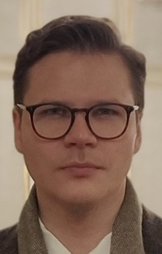](../people/people/maximilian-mandl.llms.md)

[Maximilian Mandl](../people/people/maximilian-mandl.llms.md)

Ph.D. Candidate

Medicine

[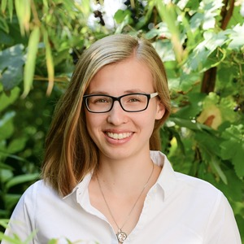](../people/people/maria-matveev.llms.md)

[Maria Matveev](../people/people/maria-matveev.llms.md)

Ph.D. Candidate

Math, Informatics & Stats

[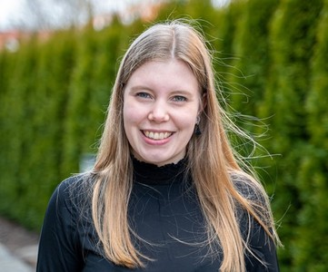](../people/people/laura-meier.llms.md)

[Laura Meier](../people/people/laura-meier.llms.md)

B.Sc Student

University Library

[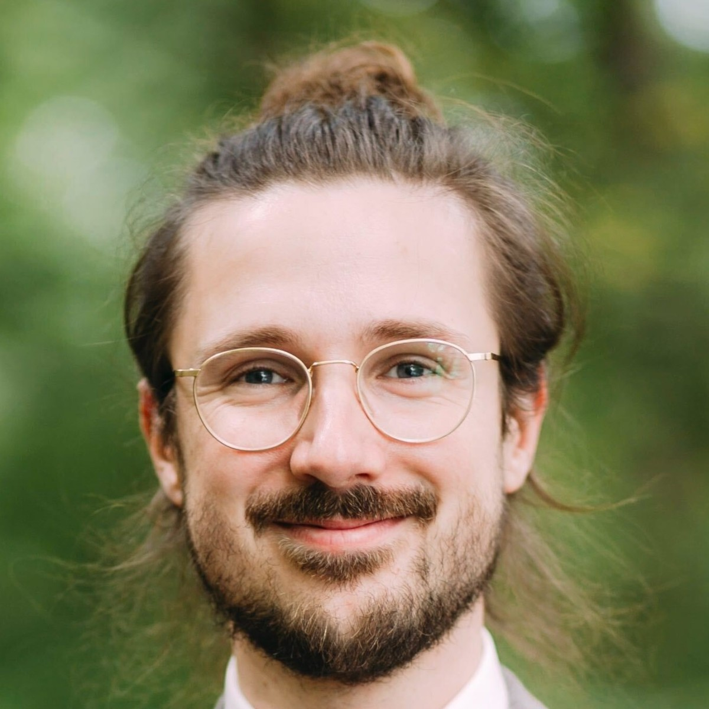](../people/people/stephan-nuding.llms.md)

[Stephan Nuding](../people/people/stephan-nuding.llms.md)

Ph.D. Candidate

Psychology & Education

[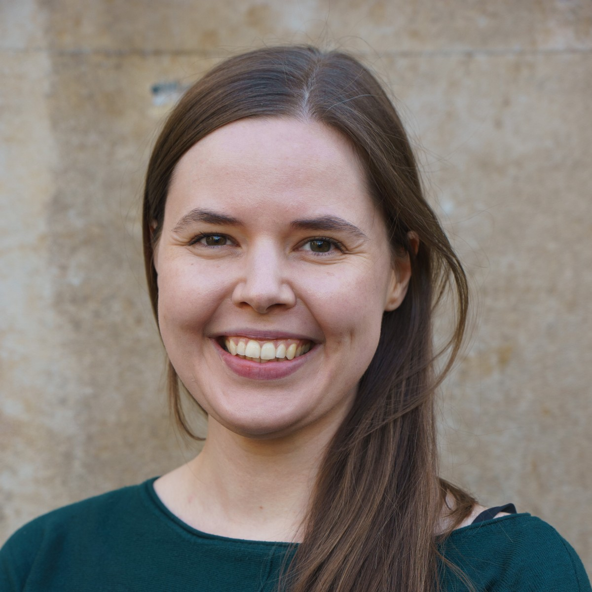](../people/people/christina-sauer.llms.md)

[Christina Sauer](../people/people/christina-sauer.llms.md)

Ph.D. Candidate

Medicine

[Patrick Oliver Schenk](../people/people/patrick-oliver-schenk.llms.md)

Ph.D. Candidate

Social Sciences

[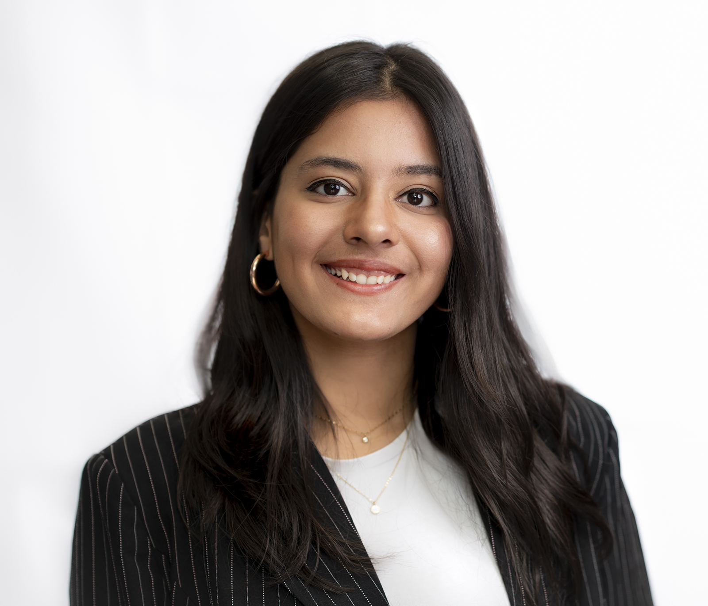](../people/people/tejaswini-sharma.llms.md)

[Tejaswini Sharma](../people/people/tejaswini-sharma.llms.md)

M.Sc. Student

Psychology & Education

[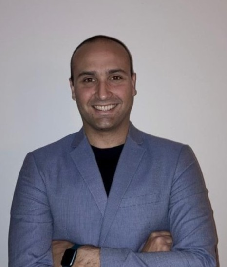](../people/people/alberto-villagran.llms.md)

[Alberto G. Villagran](../people/people/alberto-villagran.llms.md)

Researcher

Medicine

[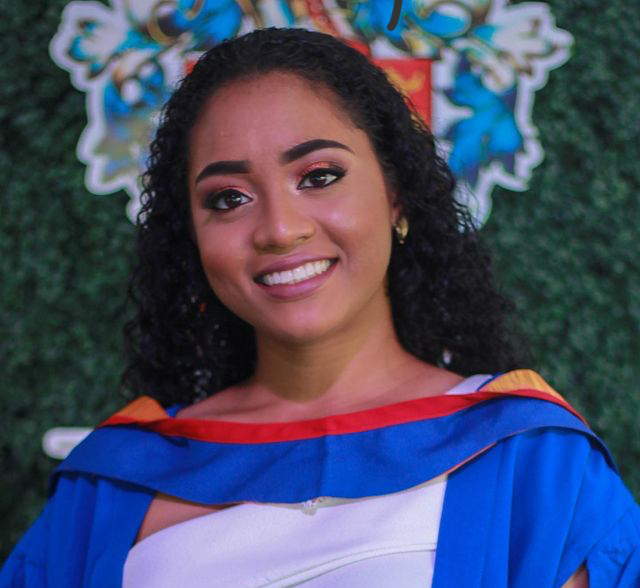](../people/people/elizabeth-waterfield.llms.md)

[Elizabeth Waterfield](../people/people/elizabeth-waterfield.llms.md)

M.Sc. Student

Psychology & Education

[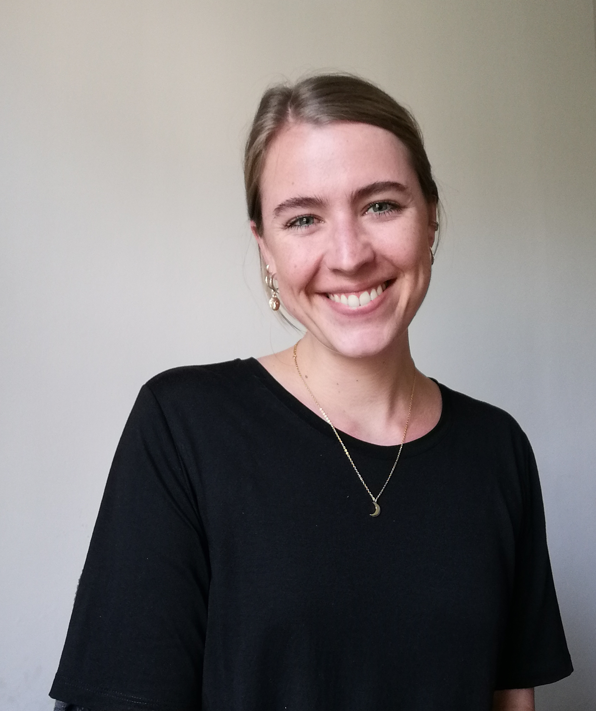](../people/people/lisa-wimmer.llms.md)

[Lisa Wimmer](../people/people/lisa-wimmer.llms.md)

Ph.D. Candidate

Math, Informatics & Stats

## Former Fellows

- [Ben Abrahams (2025 - 2025), M.Sc.](../people/people/ben-abrahams.llms.md)
- [Pat Callahan (2023 - 2025), M.Sc. Epidemiology](../people/people/pat-callahan.llms.md)
- [Giacomo De Nicola, M.Sc.](../people/people/giacomo-de-nicola.llms.md)
- [Benedikt Ehrenwirth, B.Sc.](../people/people/benedikt-ehrenwirth.llms.md)
- [Franka Etzel, B.Sc.](../people/people/franka-etzel.llms.md)
- [Lutz Heil (2018 - 2019), M.Sc.](../people/people/lutz-heil.llms.md)
- [Leyla Larsson, M.Sc.](../people/people/leyla-larsson.llms.md)
- [Gracia Prüm, B.Sc.](../people/people/gracia-pruem.llms.md)

- [Leonhard Schramm, M.Sc.](../people/people/leonhard-schramm.llms.md)
- [Caspar Schumacher, B.Sc.](../people/people/caspar-schumacher.llms.md)
- [Jan Simson, M.Sc.](../people/people/jan-simson.llms.md)
- [Po-Chun Tseng, DDS, MSc](../people/people/po-chun-tseng.llms.md)
- [Yijing Wang, M.Sc.](../people/people/yijing-wang.llms.md)
- [Viktoria Wiegelmann, B.Sc.](../people/people/viktoria-wiegelmann.llms.md)
- [Martin Wiehr, B.Sc. Student](../people/people/martin-wiehr.llms.md)
