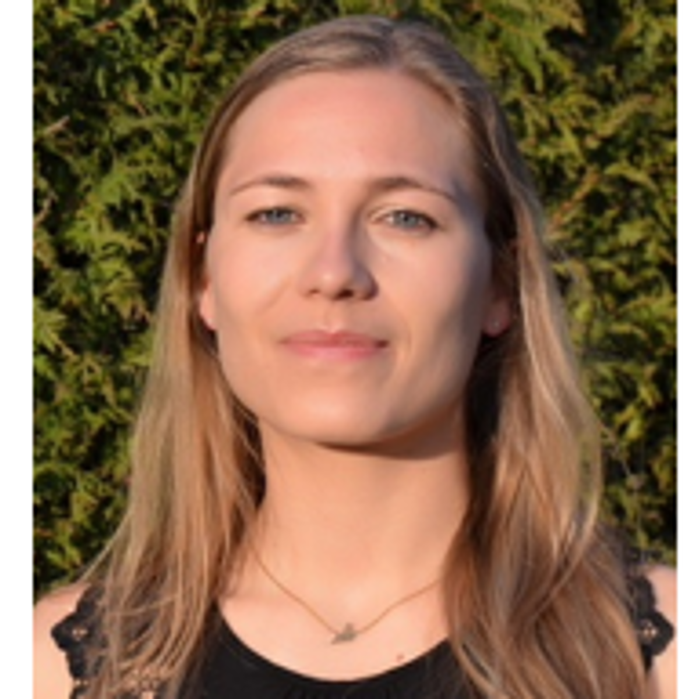

# Members

Our members actively support the goals of the OSC and contribute to our activities such as training, community building, meta-research, and liaison with stakeholders. [Join us](../about/join-us.llms.md) .

## LMU Members

Susanne Adler

Dr.

Business Administration

Hans-Joachim Anders

Prof. Dr.

University Hospital

Katrin Auspurg

Prof. Dr.

Social Sciences

Matthias Aßenmacher

Dr.

Math, Informatics & Stats

Christian Behrends

Prof. Dr.

Medicine

Claus Belka

Prof. Dr.

University Hospital

Andreas Bender

Dr.

Math, Informatics & Stats

Bernd Bischl

Prof. Dr.

Math, Informatics & Stats

Edouard Bonneville

Dr.

Medicine

Judith Bopp

Dr.

Geosciences

Anne-Laure Boulesteix

Prof. Dr.

Medicine

Hans-Bernd Brosius

Prof. Dr.

Social Sciences

Josef Brüderl

Prof. Dr.

Social Sciences

Gerrit Burkhardt

Dr.

University Hospital

Markus Bühner

Prof. Dr.

Psychology & Education

Annie Chan

Dr.

Study of Culture

Martin Dichgans

Prof. Dr.

Medicine

Niels Dingemanse

Prof. Dr.

Biology

Johan Duchêne

Dr.

University Hospital

Marco Düring

Prof. Dr.

Medicine

Nikola Ebenbeck

Dr.

Psychology & Education

Peter Edelsbrunner

Prof. Dr.

Psychology & Education

Thomas Ehring

Prof. Dr.

Psychology & Education

Ralf Elsas

Prof. Dr.

Business Administration

Michael Ewers

Prof. Dr.

Medicine

Peter Falkai

Prof. Dr.

University Hospital

Xavier Fernández-i-Marín

Dr.

Social Sciences

Stefan Feuerriegel

Prof.

Business Administration

Frank Fischer

Prof Dr.

Psychology & Education

Anne Frenzel

Prof. Dr.

Psychology & Education

Markus Gebhardt

Prof. Dr.

Psychology & Education

Mario Gollwitzer

Prof. Dr.

Psychology & Education

Sonja Grath

Dr.

Biology

Eva Grill

Prof. Dr.

Medicine

Anna-Carolina Haensch

Dr.

Math, Informatics & Stats

Mario Haim

Prof. Dr.

Social Sciences

Moritz Heene

Prof. Dr.

Psychology & Education

Moritz Herrmann

Dr.

Medicine

Sabine Hoffmann

Dr.

Math, Informatics & Stats

Michael Ingrisch

Prof. Dr.

University Hospital

Luisa F. Jiménez-Soto

PD. Dr.

Medicine

Daniel Keeser

Dr.

University Hospital

Anne-Kathrin Kleine

Dr.

Psychology & Education

Inga Koerte

Prof. Dr.

Medicine

Johannes Kopf-Beck

PD Dr.

Psychology & Education

Dieter Kranzlmüller

Prof. Dr.

Math, Informatics & Stats

Thomas Krefeld

Prof. Dr.

Languages & Literatures

Frauke Kreuter

Prof. Dr.

Math, Informatics & Stats

Andreas Kruck

PD Dr.

Social Sciences

Reka Kugyelka

Dr.

University Hospital

Thomas Kuhr

Prof. Dr.

Physics

Gitta Kutyniok

Prof. Dr.

Math, Informatics & Stats

Helmut Küchenhoff

Prof. Dr.

Math, Informatics & Stats

Anna Sophie Kümpel

Prof. Dr.

Social Sciences

Jürgen Landes

Dr.

Philosophy

Michael Lauseker

PD. Dr.

Medicine

Ralf Ludwig

Prof. Dr.

Geosciences

Markus Maier

Prof. Dr.

Psychology & Education

Ulrich Mansmann

Prof. Dr.

Medicine

Anton Marx

Dr.

Psychology & Education

Marko Mijic

Dr.

Medicine

Antonia Misch

Dr.

Psychology & Education

Christian L. Müller

Prof. Dr.

Math, Informatics & Stats

Maliheh Nazari-Jahantigh

Dr.

University Hospital

Marcel Neunhoeffer

Dr.

Math, Informatics & Stats

Frank Padberg

Prof. Dr.

University Hospital

Florian Pargent

Dr.

Psychology & Education

Andreas Peichl

Prof. Dr.

Economics

Robert Perneczky

Prof. Dr.

University Hospital

Giovanni Picogna

Dr.

Physics

Barbara Plank

Prof. Dr.

Languages & Literatures

Belinda Platt

Dr.

University Hospital

Nikolaus Plesnila

Prof. Dr.

Medicine

Matthias Reinhard

Dr.

University Hospital

Jörg Renkawitz

Prof. Dr.

Medicine

Saskia Rusche

Dr.

Medicine

Marko Sarstedt

Prof. Dr.

Business Administration

Balthasar Schachtner

Dr.

Medicine

Fabian Scheipl

PD Dr.

Math, Informatics & Stats

Moritz Schiltenwolf

Dr.

Psychology & Education

Xenia Schmalz

Dr.

University Hospital

Doris Schmid

Dr.

Psychology & Education

Julia Schulte-Cloos

Dr.

Social Sciences

Enrico Schulz

Dr.

University Hospital

Christian Schulz

Prof. Dr.

University Hospital

Carsten Schwemmer

Prof.

Social Sciences

Ramona Schödel

Dr.

Psychology & Education

Laura Seelkopf

Prof. Dr.

Social Sciences

Ksenia Shagal

Prof. Dr.

Languages & Literatures

Rebecca I. Sienel

Dr.

University Hospital

Adam Sorbie

Dr.

University Hospital

Tobias Straub

Dr.

Medicine

Justin Sulik

Dr.

Philosophy

Paul C.J. Taylor

Prof. Dr.

Psychology & Education

Paul W. Thurner

Prof. Dr.

Social Sciences

Renata Topinkova

Dr.

Social Sciences

Mathias Twardawski

Dr.

Psychology & Education

Elisabeth Vogl

Dr.

Psychology & Education

Sebastian Wichert

Dr.

Economics

Juliane Wilcke

Dr.

Medicine

Joachim Winter

Prof. Dr.

Economics

Eckhard Wolf

Prof. Dr.

Veterinary Medicine

Alexander Wuttke

Prof. Dr.

Social Sciences

Gert Wörheide

Prof. Dr.

Geosciences

Quirin Würschinger

Dr.

Languages & Literatures

Dietmar Zaefferer

Prof. Dr.

Languages & Literatures

Judith Zellner

Dr. des.

Psychology & Education

Caroline Zygar-Hoffmann

Dr.

Psychology & Education

 Susanne Adler

Title: Dr.

Faculty: Business Administration

[View Profile](../people/people/susanne-adler.llms.md)

 Hans-Joachim Anders

Title: Prof. Dr.

Faculty: University Hospital

[View Profile](../people/people/hans-joachim-anders.llms.md)

 Katrin Auspurg

Title: Prof. Dr.

Faculty: Social Sciences

[View Profile](../people/people/katrin-auspurg.llms.md)

 Matthias Aßenmacher

Title: Dr.

Faculty: Math, Informatics & Stats

[View Profile](../people/people/matthias-assenmacher.llms.md)

 Christian Behrends

Title: Prof. Dr.

Faculty: Medicine

[View Profile](../people/people/christian-behrends.llms.md)

 Claus Belka

Title: Prof. Dr.

Faculty: University Hospital

[View Profile](../people/people/claus-belka.llms.md)

 Andreas Bender

Title: Dr.

Faculty: Math, Informatics & Stats

[View Profile](../people/people/andreas-bender.llms.md)

 Bernd Bischl

Title: Prof. Dr.

Faculty: Math, Informatics & Stats

[View Profile](../people/people/bernd-bischl.llms.md)

 Edouard Bonneville

Title: Dr.

Faculty: Medicine

[View Profile](../people/people/edouard-bonneville.llms.md)

 Judith Bopp

Title: Dr.

Faculty: Geosciences

[View Profile](../people/people/judith-bopp.llms.md)

 Anne-Laure Boulesteix

Title: Prof. Dr.

Faculty: Medicine

[View Profile](../people/people/anne-laure-boulesteix.llms.md)

 Hans-Bernd Brosius

Title: Prof. Dr.

Faculty: Social Sciences

[View Profile](../people/people/hans-bernd-brosius.llms.md)

 Josef Brüderl

Title: Prof. Dr.

Faculty: Social Sciences

[View Profile](../people/people/josef-bruederl.llms.md)

 Gerrit Burkhardt

Title: Dr.

Faculty: University Hospital

[View Profile](../people/people/gerrit-burkhardt.llms.md)

 Markus Bühner

Title: Prof. Dr.

Faculty: Psychology & Education

[View Profile](../people/people/markus-buehner.llms.md)

 Annie Chan

Title: Dr.

Faculty: Study of Culture

[View Profile](../people/people/annie-chan.llms.md)

 Martin Dichgans

Title: Prof. Dr.

Faculty: Medicine

[View Profile](../people/people/martin-dichgans.llms.md)

 Niels Dingemanse

Title: Prof. Dr.

Faculty: Biology

[View Profile](../people/people/niels-dingemanse.llms.md)

 Johan Duchêne

Title: Dr.

Faculty: University Hospital

[View Profile](../people/people/johan-duchene.llms.md)

 Marco Düring

Title: Prof. Dr.

Faculty: Medicine

[View Profile](../people/people/marco-duering.llms.md)

 Nikola Ebenbeck

Title: Dr.

Faculty: Psychology & Education

[View Profile](../people/people/nikola-ebenbeck.llms.md)

 Peter Edelsbrunner

Title: Prof. Dr.

Faculty: Psychology & Education

[View Profile](../people/people/peter-edelsbrunner.llms.md)

 Thomas Ehring

Title: Prof. Dr.

Faculty: Psychology & Education

[View Profile](../people/people/thomas-ehring.llms.md)

 Ralf Elsas

Title: Prof. Dr.

Faculty: Business Administration

[View Profile](../people/people/ralf-elsas.llms.md)

 Michael Ewers

Title: Prof. Dr.

Faculty: Medicine

[View Profile](../people/people/michael-ewers.llms.md)

 Peter Falkai

Title: Prof. Dr.

Faculty: University Hospital

[View Profile](../people/people/peter-falkai.llms.md)

 Xavier Fernández-i-Marín

Title: Dr.

Faculty: Social Sciences

[View Profile](../people/people/xavier-fernandez-marin.llms.md)

 Stefan Feuerriegel

Title: Prof.

Faculty: Business Administration

[View Profile](../people/people/stefan-feuerriegel.llms.md)

 Frank Fischer

Title: Prof Dr.

Faculty: Psychology & Education

[View Profile](../people/people/frank-fischer.llms.md)

 Anne Frenzel

Title: Prof. Dr.

Faculty: Psychology & Education

[View Profile](../people/people/anne-frenzel.llms.md)

 Markus Gebhardt

Title: Prof. Dr.

Faculty: Psychology & Education

[View Profile](../people/people/markus-gebhardt.llms.md)

 Mario Gollwitzer

Title: Prof. Dr.

Faculty: Psychology & Education

[View Profile](../people/people/mario-gollwitzer.llms.md)

 Sonja Grath

Title: Dr.

Faculty: Biology

[View Profile](../people/people/sonja-grath.llms.md)

 Eva Grill

Title: Prof. Dr.

Faculty: Medicine

[View Profile](../people/people/eva-grill.llms.md)

 Anna-Carolina Haensch

Title: Dr.

Faculty: Math, Informatics & Stats

[View Profile](../people/people/anna-carolina-haensch.llms.md)

 Mario Haim

Title: Prof. Dr.

Faculty: Social Sciences

[View Profile](../people/people/mario-haim.llms.md)

 Moritz Heene

Title: Prof. Dr.

Faculty: Psychology & Education

[View Profile](../people/people/moritz-heene.llms.md)

 Moritz Herrmann

Title: Dr.

Faculty: Medicine

[View Profile](../people/people/moritz-herrmann.llms.md)

 Sabine Hoffmann

Title: Dr.

Faculty: Math, Informatics & Stats

[View Profile](../people/people/sabine-hoffmann.llms.md)

 Michael Ingrisch

Title: Prof. Dr.

Faculty: University Hospital

[View Profile](../people/people/michael-ingrisch.llms.md)

 Luisa F. Jiménez-Soto

Title: PD. Dr.

Faculty: Medicine

[View Profile](../people/people/luisa-jimenez-soto.llms.md)

 Daniel Keeser

Title: Dr.

Faculty: University Hospital

[View Profile](../people/people/daniel-keeser.llms.md)

 Anne-Kathrin Kleine

Title: Dr.

Faculty: Psychology & Education

[View Profile](../people/people/anne-kathrin-kleine.llms.md)

 Inga Koerte

Title: Prof. Dr.

Faculty: Medicine

[View Profile](../people/people/inga-koerte.llms.md)

 Johannes Kopf-Beck

Title: PD Dr.

Faculty: Psychology & Education

[View Profile](../people/people/johannes-kopf-beck.llms.md)

 Dieter Kranzlmüller

Title: Prof. Dr.

Faculty: Math, Informatics & Stats

[View Profile](../people/people/dieter-kranzlmueller.llms.md)

 Thomas Krefeld

Title: Prof. Dr.

Faculty: Languages & Literatures

[View Profile](../people/people/thomas-krefeld.llms.md)

 Frauke Kreuter

Title: Prof. Dr.

Faculty: Math, Informatics & Stats

[View Profile](../people/people/frauke-kreuter.llms.md)

 Andreas Kruck

Title: PD Dr.

Faculty: Social Sciences

[View Profile](../people/people/andreas-kruck.llms.md)

 Reka Kugyelka

Title: Dr.

Faculty: University Hospital

[View Profile](../people/people/reka-kugyelka.llms.md)

 Thomas Kuhr

Title: Prof. Dr.

Faculty: Physics

[View Profile](../people/people/thomas-kuhr.llms.md)

 Gitta Kutyniok

Title: Prof. Dr.

Faculty: Math, Informatics & Stats

[View Profile](../people/people/gitta-kutyniok.llms.md)

 Helmut Küchenhoff

Title: Prof. Dr.

Faculty: Math, Informatics & Stats

[View Profile](../people/people/helmut-kuechenhoff.llms.md)

 Anna Sophie Kümpel

Title: Prof. Dr.

Faculty: Social Sciences

[View Profile](../people/people/anna-sophie-kuempel.llms.md)

 Jürgen Landes

Title: Dr.

Faculty: Philosophy

[View Profile](../people/people/juergen-landes.llms.md)

 Michael Lauseker

Title: PD. Dr.

Faculty: Medicine

[View Profile](../people/people/michael-lauseker.llms.md)

 Ralf Ludwig

Title: Prof. Dr.

Faculty: Geosciences

[View Profile](../people/people/ralf-ludwig.llms.md)

 Markus Maier

Title: Prof. Dr.

Faculty: Psychology & Education

[View Profile](../people/people/markus-maier.llms.md)

 Ulrich Mansmann

Title: Prof. Dr.

Faculty: Medicine

[View Profile](../people/people/ulrich-mansmann.llms.md)

 Anton Marx

Title: Dr.

Faculty: Psychology & Education

[View Profile](../people/people/anton-marx.llms.md)

 Marko Mijic

Title: Dr.

Faculty: Medicine

[View Profile](../people/people/marko-mijic.llms.md)

 Antonia Misch

Title: Dr.

Faculty: Psychology & Education

[View Profile](../people/people/antonia-misch.llms.md)

 Christian L. Müller

Title: Prof. Dr.

Faculty: Math, Informatics & Stats

[View Profile](../people/people/christian-mueller.llms.md)

 Maliheh Nazari-Jahantigh

Title: Dr.

Faculty: University Hospital

[View Profile](../people/people/maliheh-nazari-jahantigh.llms.md)

 Marcel Neunhoeffer

Title: Dr.

Faculty: Math, Informatics & Stats

[View Profile](../people/people/marcel-neunhoeffer.llms.md)

 Frank Padberg

Title: Prof. Dr.

Faculty: University Hospital

[View Profile](../people/people/frank-padberg.llms.md)

 Florian Pargent

Title: Dr.

Faculty: Psychology & Education

[View Profile](../people/people/florian-pargent.llms.md)

 Andreas Peichl

Title: Prof. Dr.

Faculty: Economics

[View Profile](../people/people/andreas-peichl.llms.md)

 Robert Perneczky

Title: Prof. Dr.

Faculty: University Hospital

[View Profile](../people/people/robert-perneczky.llms.md)

 Giovanni Picogna

Title: Dr.

Faculty: Physics

[View Profile](../people/people/giovanni-picogna.llms.md)

 Barbara Plank

Title: Prof. Dr.

Faculty: Languages & Literatures

[View Profile](../people/people/barbara-plank.llms.md)

 Belinda Platt

Title: Dr.

Faculty: University Hospital

[View Profile](../people/people/belinda-platt.llms.md)

 Nikolaus Plesnila

Title: Prof. Dr.

Faculty: Medicine

[View Profile](../people/people/nikolaus-plesnila.llms.md)

 Matthias Reinhard

Title: Dr.

Faculty: University Hospital

[View Profile](../people/people/matthias-reinhard.llms.md)

 Jörg Renkawitz

Title: Prof. Dr.

Faculty: Medicine

[View Profile](../people/people/joerg-renkawitz.llms.md)

 Saskia Rusche

Title: Dr.

Faculty: Medicine

[View Profile](../people/people/rusche-saskia.llms.md)

 Marko Sarstedt

Title: Prof. Dr.

Faculty: Business Administration

[View Profile](../people/people/marko-sarstedt.llms.md)

 Balthasar Schachtner

Title: Dr.

Faculty: Medicine

[View Profile](../people/people/balthasar-schachtner.llms.md)

 Fabian Scheipl

Title: PD Dr.

Faculty: Math, Informatics & Stats

[View Profile](../people/people/fabian-scheipl.llms.md)

 Moritz Schiltenwolf

Title: Dr.

Faculty: Psychology & Education

[View Profile](../people/people/moritz-schiltenwolf.llms.md)

 Xenia Schmalz

Title: Dr.

Faculty: University Hospital

[View Profile](../people/people/xenia-schmalz.llms.md)

 Doris Schmid

Title: Dr.

Faculty: Psychology & Education

[View Profile](../people/people/doris-schmid.llms.md)

 Julia Schulte-Cloos

Title: Dr.

Faculty: Social Sciences

[View Profile](../people/people/julia-schulte-cloos.llms.md)

 Enrico Schulz

Title: Dr.

Faculty: University Hospital

[View Profile](../people/people/enrico-schulz.llms.md)

 Christian Schulz

Title: Prof. Dr.

Faculty: University Hospital

[View Profile](../people/people/christian-schulz.llms.md)

 Carsten Schwemmer

Title: Prof.

Faculty: Social Sciences

[View Profile](../people/people/carsten-schwemmer.llms.md)

 Ramona Schödel

Title: Dr.

Faculty: Psychology & Education

[View Profile](../people/people/ramona-schoedel.llms.md)

 Laura Seelkopf

Title: Prof. Dr.

Faculty: Social Sciences

[View Profile](../people/people/laura-seelkopf.llms.md)

 Ksenia Shagal

Title: Prof. Dr.

Faculty: Languages & Literatures

[View Profile](../people/people/ksenia-shagal.llms.md)

 Rebecca I. Sienel

Title: Dr.

Faculty: University Hospital

[View Profile](../people/people/rebecca-sienel.llms.md)

 Adam Sorbie

Title: Dr.

Faculty: University Hospital

[View Profile](../people/people/adam-sorbie.llms.md)

 Tobias Straub

Title: Dr.

Faculty: Medicine

[View Profile](../people/people/tobias-straub.llms.md)

 Justin Sulik

Title: Dr.

Faculty: Philosophy

[View Profile](../people/people/justin-sulik.llms.md)

 Paul C.J. Taylor

Title: Prof. Dr.

Faculty: Psychology & Education

[View Profile](../people/people/paul-cj-taylor.llms.md)

 Paul W. Thurner

Title: Prof. Dr.

Faculty: Social Sciences

[View Profile](../people/people/paul-thurner.llms.md)

 Renata Topinkova

Title: Dr.

Faculty: Social Sciences

[View Profile](../people/people/renata-topinkova.llms.md)

 Mathias Twardawski

Title: Dr.

Faculty: Psychology & Education

[View Profile](../people/people/mathias-twardawski.llms.md)

 Elisabeth Vogl

Title: Dr.

Faculty: Psychology & Education

[View Profile](../people/people/elisabeth-vogl.llms.md)

 Sebastian Wichert

Title: Dr.

Faculty: Economics

[View Profile](../people/people/sebastian-wichert.llms.md)

 Juliane Wilcke

Title: Dr.

Faculty: Medicine

[View Profile](../people/people/juliane-wilcke.llms.md)

 Joachim Winter

Title: Prof. Dr.

Faculty: Economics

[View Profile](../people/people/joachim-winter.llms.md)

 Eckhard Wolf

Title: Prof. Dr.

Faculty: Veterinary Medicine

[View Profile](../people/people/eckhard-wolf.llms.md)

 Alexander Wuttke

Title: Prof. Dr.

Faculty: Social Sciences

[View Profile](../people/people/alexander-wuttke.llms.md)

 Gert Wörheide

Title: Prof. Dr.

Faculty: Geosciences

[View Profile](../people/people/gert-woerheide.llms.md)

 Quirin Würschinger

Title: Dr.

Faculty: Languages & Literatures

[View Profile](../people/people/quirin-wuerschinger.llms.md)

 Dietmar Zaefferer

Title: Prof. Dr.

Faculty: Languages & Literatures

[View Profile](../people/people/dietmar-zaefferer.llms.md)

 Judith Zellner

Title: Dr. des.

Faculty: Psychology & Education

[View Profile](../people/people/judith-zellner.llms.md)

 Caroline Zygar-Hoffmann

Title: Dr.

Faculty: Psychology & Education

[View Profile](../people/people/caroline-zygar-hoffmann.llms.md)

## Affiliate Members

Andreas Beyerlein

PD Dr.

Bayerischen LGL

Christiane Fuchs

Prof. Dr.

Helmholtz Munich: Institute of Computational Biology

Annika Hoyer

Prof. Dr.

University of Bielefeld

Thomas Misgeld

Prof. Dr.

TUM Medicine & Health

Christina Peter

Prof. Dr.

University of Klagenfurt

Markus Ploner

Prof. Dr.

TUM

Tom Ratz

Dr.

University of Zürich

Heidi Seibold

Dr.

Digital Research Academy

Elmar Spiegel

Dr.

Helmholtz Zentrum Munich

 Andreas Beyerlein

Title: PD Dr.

Affiliation: Bayerischen LGL

[View Profile](../people/people/andreas-beyerlein.llms.md)

 Christiane Fuchs

Title: Prof. Dr.

Affiliation: Helmholtz Munich: Institute of Computational Biology

[View Profile](../people/people/christiane-fuchs.llms.md)

 Annika Hoyer

Title: Prof. Dr.

Affiliation: University of Bielefeld

[View Profile](../people/people/annika-hoyer.llms.md)

 Thomas Misgeld

Title: Prof. Dr.

Affiliation: TUM Medicine & Health

[View Profile](../people/people/thomas-misgeld.llms.md)

 Christina Peter

Title: Prof. Dr.

Affiliation: University of Klagenfurt

[View Profile](../people/people/christina-peter.llms.md)

 Markus Ploner

Title: Prof. Dr.

Affiliation: TUM

[View Profile](../people/people/markus-ploner.llms.md)

 Tom Ratz

Title: Dr.

Affiliation: University of Zürich

[View Profile](../people/people/tom-ratz.llms.md)

 Heidi Seibold

Title: Dr.

Affiliation: Digital Research Academy

[View Profile](../people/people/heidi-seibold.llms.md)

 Elmar Spiegel

Title: Dr.

Affiliation: Helmholtz Zentrum Munich

[View Profile](../people/people/elmar-spiegel.llms.md)

## Former Members

- [Dr. Marlene Altenmüller](../people/people/marlene-altenmueller.llms.md)
- [Dr. Stefano Coretta](../people/people/coretta-stefano.llms.md)
- [Prof. Dr. Ivett Guntersdorfer](../people/people/ivett-guntersdorfer.llms.md)
- [Dr. Larissa Neumann](../people/people/larissa-neumann.llms.md)
- [Prof. Dr. Barbara Osimani](../people/people/barbara-osimani.llms.md)
- [Dr. Andreas Schneck](../people/people/andreas-schneck.llms.md)
- [Dr. Angelika Stefan](../people/people/angelika-stefan.llms.md)
- [Dr. Wolfgang Strube](../people/people/wolfgang-strube.llms.md)
- [Dr. Imai Taisuke](../people/people/imai-taisuke.llms.md)
- [Dr. Julian Unkel](../people/people/julian-unkel.llms.md)
- [Dr. Christian Woll](../people/people/christian-woll.llms.md)
- [Dr. Johannes Ziegler](../people/people/johannes-ziegler.llms.md)

&nbsp;
