# Members

Our members actively support the goals of the OSC and contribute to our activities such as training, community building, meta-research, and liaison with stakeholders. [Join us](../about/join-us.llms.md) .

## LMU Members

[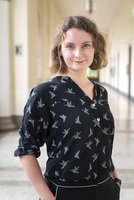](../people/people/susanne-adler.llms.md)

[Susanne Adler](../people/people/susanne-adler.llms.md)

Dr.

Business Administration

[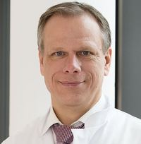](../people/people/hans-joachim-anders.llms.md)

[Hans-Joachim Anders](../people/people/hans-joachim-anders.llms.md)

Prof. Dr.

University Hospital

[Katrin Auspurg](../people/people/katrin-auspurg.llms.md)

Prof. Dr.

Social Sciences

[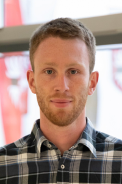](../people/people/matthias-assenmacher.llms.md)

[Matthias Aßenmacher](../people/people/matthias-assenmacher.llms.md)

Dr.

Math, Informatics & Stats

[Christian Behrends](../people/people/christian-behrends.llms.md)

Prof. Dr.

Medicine

[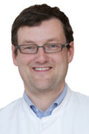](../people/people/claus-belka.llms.md)

[Claus Belka](../people/people/claus-belka.llms.md)

Prof. Dr.

University Hospital

[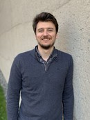](../people/people/andreas-bender.llms.md)

[Andreas Bender](../people/people/andreas-bender.llms.md)

Dr.

Math, Informatics & Stats

[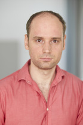](../people/people/bernd-bischl.llms.md)

[Bernd Bischl](../people/people/bernd-bischl.llms.md)

Prof. Dr.

Math, Informatics & Stats

[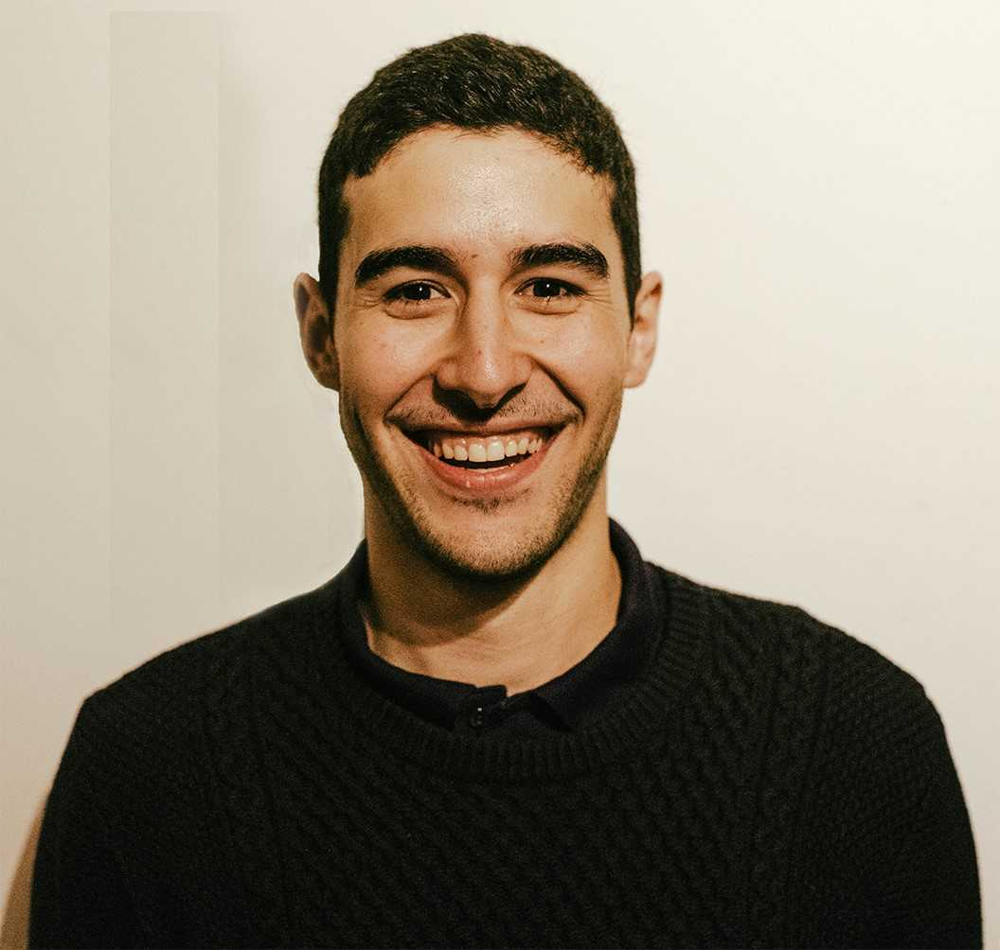](../people/people/edouard-bonneville.llms.md)

[Edouard Bonneville](../people/people/edouard-bonneville.llms.md)

Dr.

Medicine

[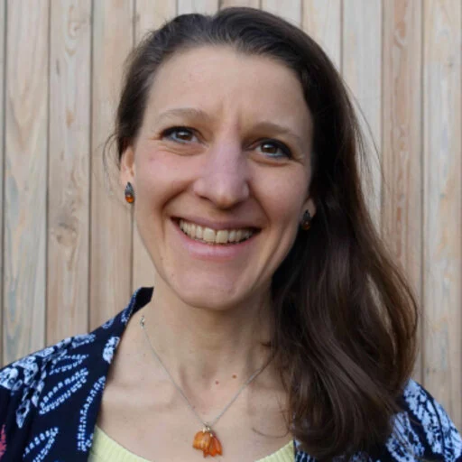](../people/people/judith-bopp.llms.md)

[Judith Bopp](../people/people/judith-bopp.llms.md)

Dr.

Geosciences

[Anne-Laure Boulesteix](../people/people/anne-laure-boulesteix.llms.md)

Prof. Dr.

Medicine

[Hans-Bernd Brosius](../people/people/hans-bernd-brosius.llms.md)

Prof. Dr.

Social Sciences

[Josef Brüderl](../people/people/josef-bruederl.llms.md)

Prof. Dr.

Social Sciences

[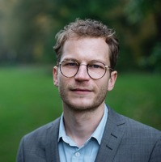](../people/people/gerrit-burkhardt.llms.md)

[Gerrit Burkhardt](../people/people/gerrit-burkhardt.llms.md)

Dr.

University Hospital

[Markus Bühner](../people/people/markus-buehner.llms.md)

Prof. Dr.

Psychology & Education

[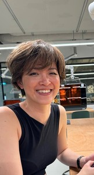](../people/people/annie-chan.llms.md)

[Annie Chan](../people/people/annie-chan.llms.md)

Dr.

Study of Culture

[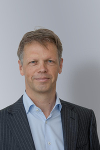](../people/people/martin-dichgans.llms.md)

[Martin Dichgans](../people/people/martin-dichgans.llms.md)

Prof. Dr.

Medicine

[Niels Dingemanse](../people/people/niels-dingemanse.llms.md)

Prof. Dr.

Biology

[Johan Duchêne](../people/people/johan-duchene.llms.md)

Dr.

University Hospital

[Marco Düring](../people/people/marco-duering.llms.md)

Prof. Dr.

Medicine

[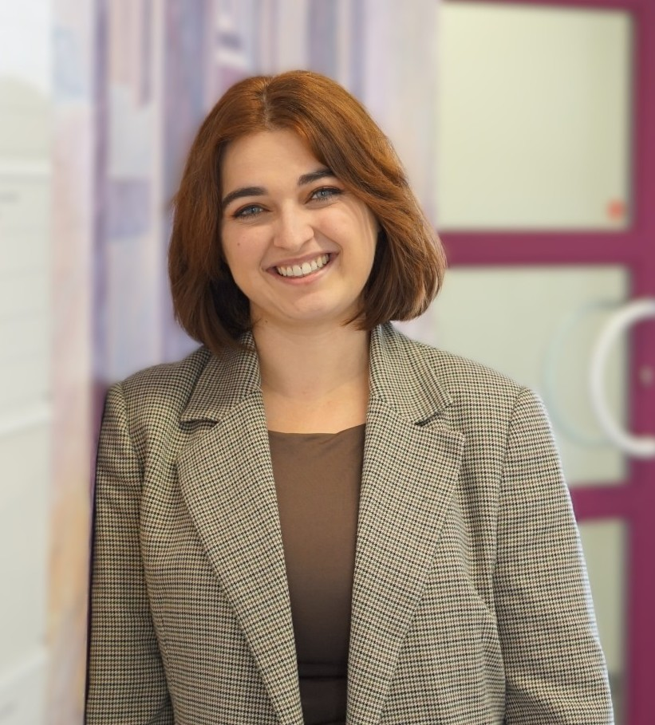](../people/people/nikola-ebenbeck.llms.md)

[Nikola Ebenbeck](../people/people/nikola-ebenbeck.llms.md)

Dr.

Psychology & Education

[Peter Edelsbrunner](../people/people/peter-edelsbrunner.llms.md)

Prof. Dr.

Psychology & Education

[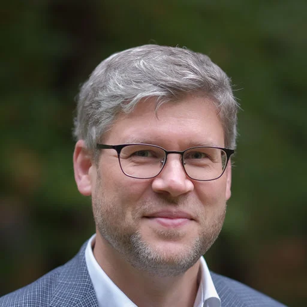](../people/people/thomas-ehring.llms.md)

[Thomas Ehring](../people/people/thomas-ehring.llms.md)

Prof. Dr.

Psychology & Education

[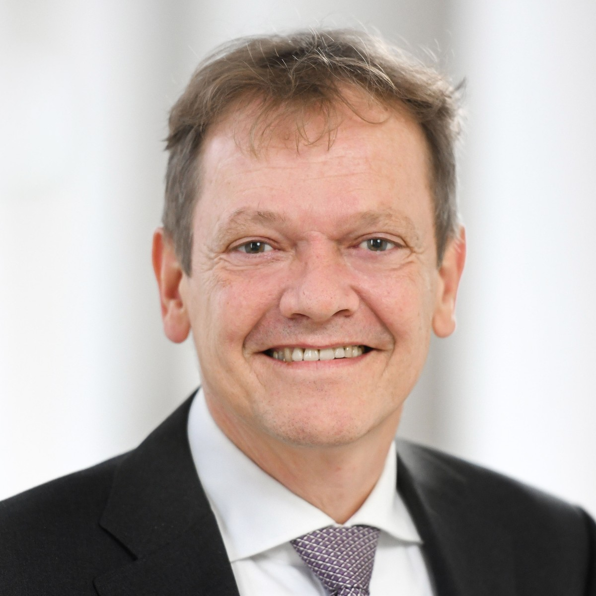](../people/people/ralf-elsas.llms.md)

[Ralf Elsas](../people/people/ralf-elsas.llms.md)

Prof. Dr.

Business Administration

[Michael Ewers](../people/people/michael-ewers.llms.md)

Prof. Dr.

Medicine

[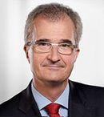](../people/people/peter-falkai.llms.md)

[Peter Falkai](../people/people/peter-falkai.llms.md)

Prof. Dr.

University Hospital

[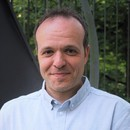](../people/people/xavier-fernandez-marin.llms.md)

[Xavier Fernández-i-Marín](../people/people/xavier-fernandez-marin.llms.md)

Dr.

Social Sciences

[Stefan Feuerriegel](../people/people/stefan-feuerriegel.llms.md)

Prof.

Business Administration

[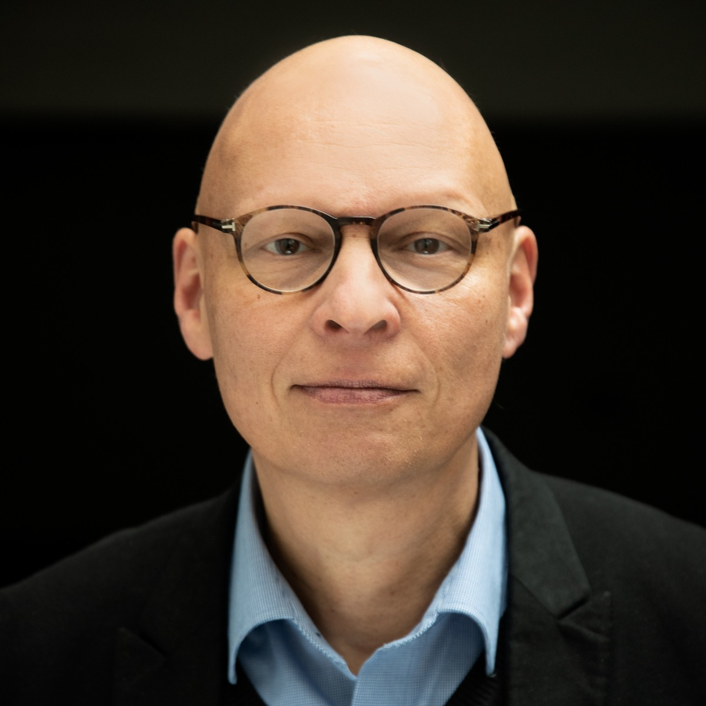](../people/people/frank-fischer.llms.md)

[Frank Fischer](../people/people/frank-fischer.llms.md)

Prof Dr.

Psychology & Education

[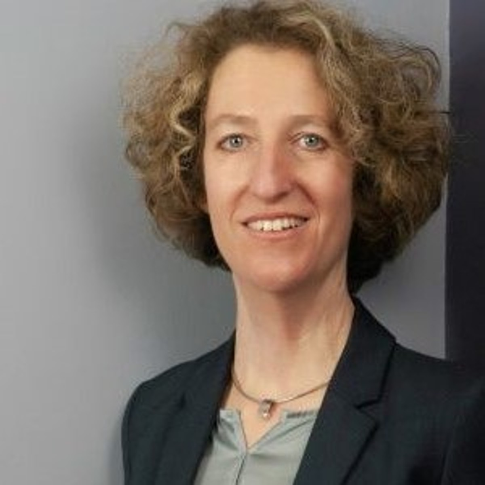](../people/people/anne-frenzel.llms.md)

[Anne Frenzel](../people/people/anne-frenzel.llms.md)

Prof. Dr.

Psychology & Education

[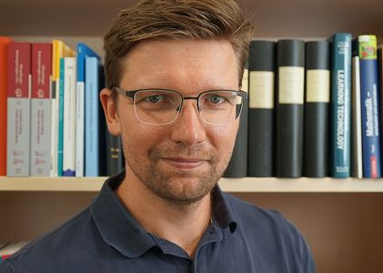](../people/people/markus-gebhardt.llms.md)

[Markus Gebhardt](../people/people/markus-gebhardt.llms.md)

Prof. Dr.

Psychology & Education

[Mario Gollwitzer](../people/people/mario-gollwitzer.llms.md)

Prof. Dr.

Psychology & Education

[Sonja Grath](../people/people/sonja-grath.llms.md)

Dr.

Biology

[Eva Grill](../people/people/eva-grill.llms.md)

Prof. Dr.

Medicine

[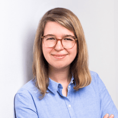](../people/people/anna-carolina-haensch.llms.md)

[Anna-Carolina Haensch](../people/people/anna-carolina-haensch.llms.md)

Dr.

Math, Informatics & Stats

[Mario Haim](../people/people/mario-haim.llms.md)

Prof. Dr.

Social Sciences

[Moritz Heene](../people/people/moritz-heene.llms.md)

Prof. Dr.

Psychology & Education

[Moritz Herrmann](../people/people/moritz-herrmann.llms.md)

Dr.

Medicine

[Sabine Hoffmann](../people/people/sabine-hoffmann.llms.md)

Dr.

Math, Informatics & Stats

[Michael Ingrisch](../people/people/michael-ingrisch.llms.md)

Prof. Dr.

University Hospital

[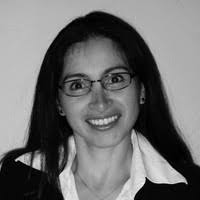](../people/people/luisa-jimenez-soto.llms.md)

[Luisa F. Jiménez-Soto](../people/people/luisa-jimenez-soto.llms.md)

PD. Dr.

Medicine

[Daniel Keeser](../people/people/daniel-keeser.llms.md)

Dr.

University Hospital

[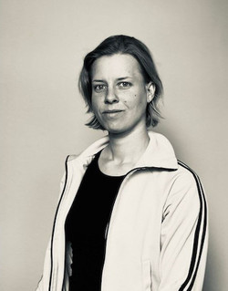](../people/people/anne-kathrin-kleine.llms.md)

[Anne-Kathrin Kleine](../people/people/anne-kathrin-kleine.llms.md)

Dr.

Psychology & Education

[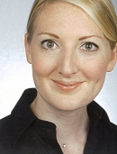](../people/people/inga-koerte.llms.md)

[Inga Koerte](../people/people/inga-koerte.llms.md)

Prof. Dr.

Medicine

[Johannes Kopf-Beck](../people/people/johannes-kopf-beck.llms.md)

PD Dr.

Psychology & Education

[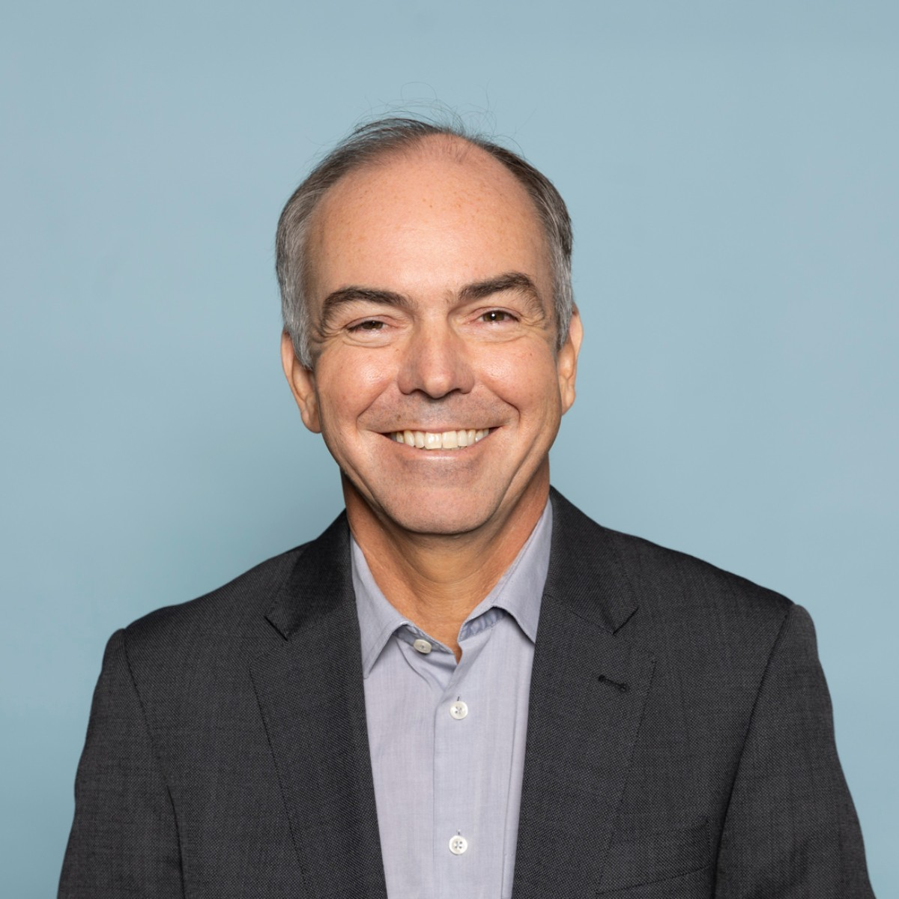](../people/people/dieter-kranzlmueller.llms.md)

[Dieter Kranzlmüller](../people/people/dieter-kranzlmueller.llms.md)

Prof. Dr.

Math, Informatics & Stats

[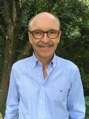](../people/people/thomas-krefeld.llms.md)

[Thomas Krefeld](../people/people/thomas-krefeld.llms.md)

Prof. Dr.

Languages & Literatures

[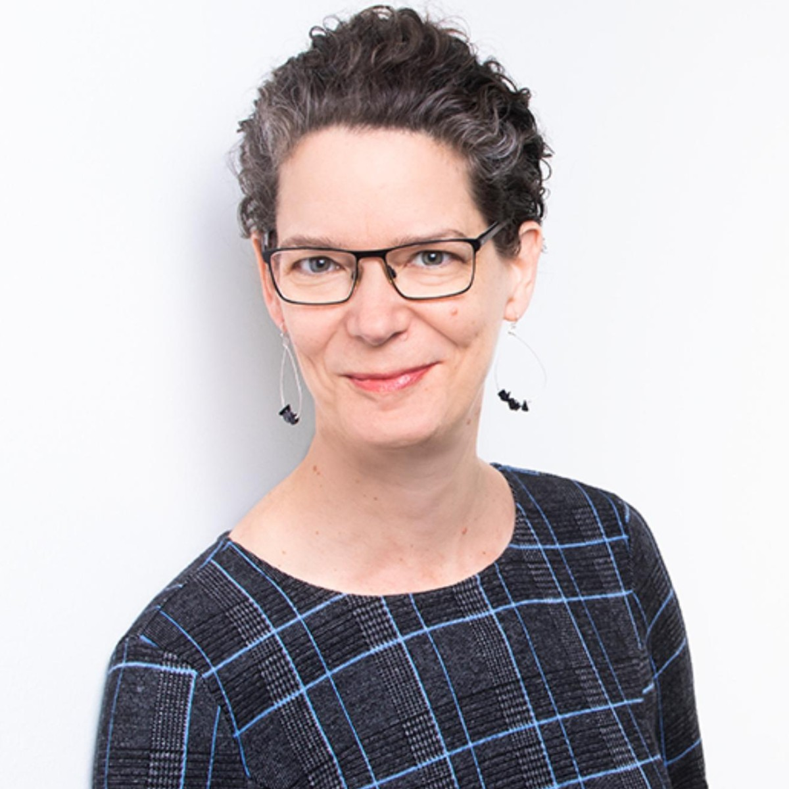](../people/people/frauke-kreuter.llms.md)

[Frauke Kreuter](../people/people/frauke-kreuter.llms.md)

Prof. Dr.

Math, Informatics & Stats

[Andreas Kruck](../people/people/andreas-kruck.llms.md)

PD Dr.

Social Sciences

[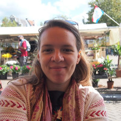](../people/people/reka-kugyelka.llms.md)

[Reka Kugyelka](../people/people/reka-kugyelka.llms.md)

Dr.

University Hospital

[Thomas Kuhr](../people/people/thomas-kuhr.llms.md)

Prof. Dr.

Physics

[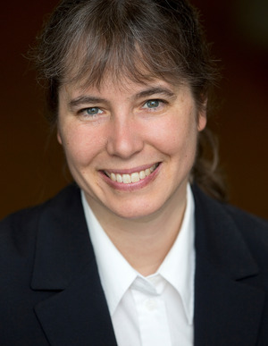](../people/people/gitta-kutyniok.llms.md)

[Gitta Kutyniok](../people/people/gitta-kutyniok.llms.md)

Prof. Dr.

Math, Informatics & Stats

[Helmut Küchenhoff](../people/people/helmut-kuechenhoff.llms.md)

Prof. Dr.

Math, Informatics & Stats

[Anna Sophie Kümpel](../people/people/anna-sophie-kuempel.llms.md)

Prof. Dr.

Social Sciences

[Jürgen Landes](../people/people/juergen-landes.llms.md)

Dr.

Philosophy

[Michael Lauseker](../people/people/michael-lauseker.llms.md)

PD. Dr.

Medicine

[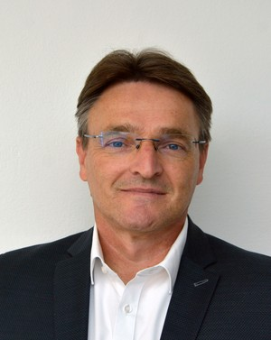](../people/people/ralf-ludwig.llms.md)

[Ralf Ludwig](../people/people/ralf-ludwig.llms.md)

Prof. Dr.

Geosciences

[Markus Maier](../people/people/markus-maier.llms.md)

Prof. Dr.

Psychology & Education

[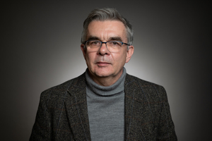](../people/people/ulrich-mansmann.llms.md)

[Ulrich Mansmann](../people/people/ulrich-mansmann.llms.md)

Prof. Dr.

Medicine

[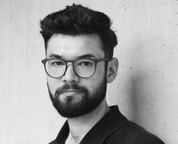](../people/people/anton-marx.llms.md)

[Anton Marx](../people/people/anton-marx.llms.md)

Dr.

Psychology & Education

[Marko Mijic](../people/people/marko-mijic.llms.md)

Dr.

Medicine

[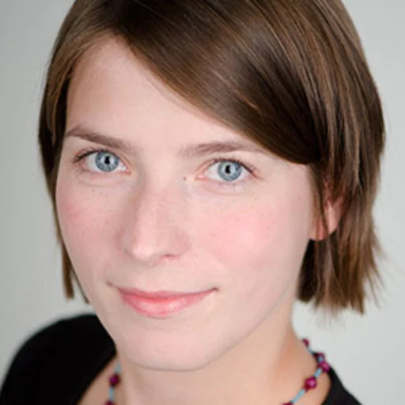](../people/people/antonia-misch.llms.md)

[Antonia Misch](../people/people/antonia-misch.llms.md)

Dr.

Psychology & Education

[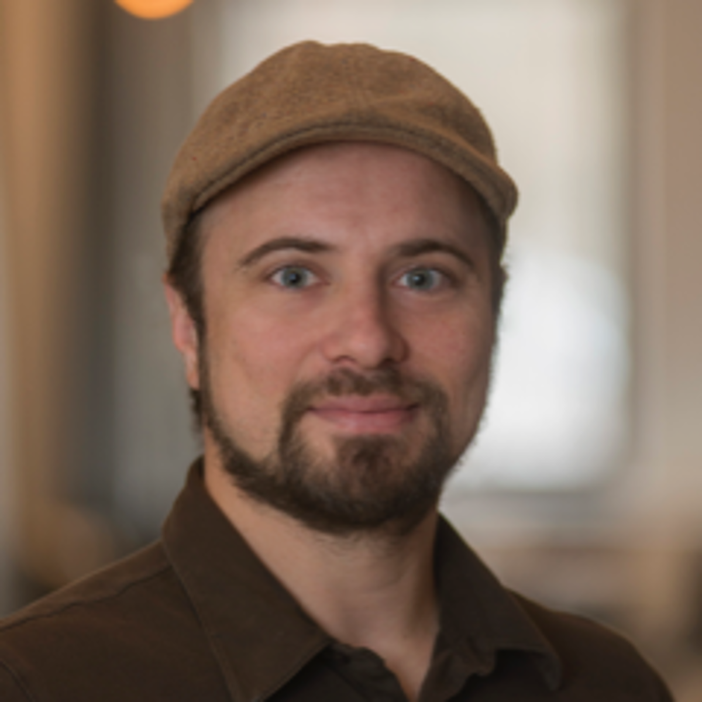](../people/people/christian-mueller.llms.md)

[Christian L. Müller](../people/people/christian-mueller.llms.md)

Prof. Dr.

Math, Informatics & Stats

[Marcel Neunhoeffer](../people/people/marcel-neunhoeffer.llms.md)

Dr.

Math, Informatics & Stats

[Frank Padberg](../people/people/frank-padberg.llms.md)

Prof. Dr.

University Hospital

[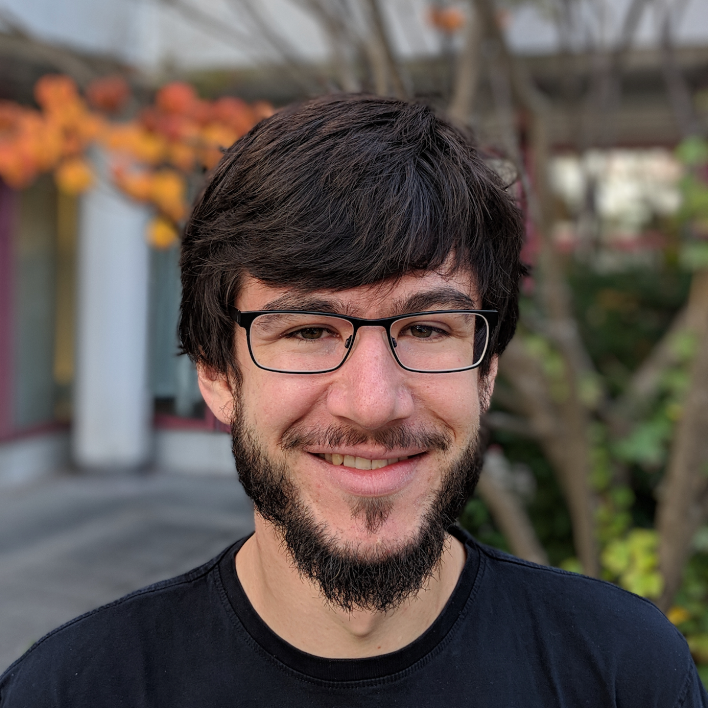](../people/people/florian-pargent.llms.md)

[Florian Pargent](../people/people/florian-pargent.llms.md)

Dr.

Psychology & Education

[Andreas Peichl](../people/people/andreas-peichl.llms.md)

Prof. Dr.

Economics

[Robert Perneczky](../people/people/robert-perneczky.llms.md)

Prof. Dr.

University Hospital

[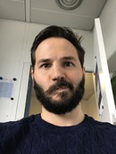](../people/people/giovanni-picogna.llms.md)

[Giovanni Picogna](../people/people/giovanni-picogna.llms.md)

Dr.

Physics

[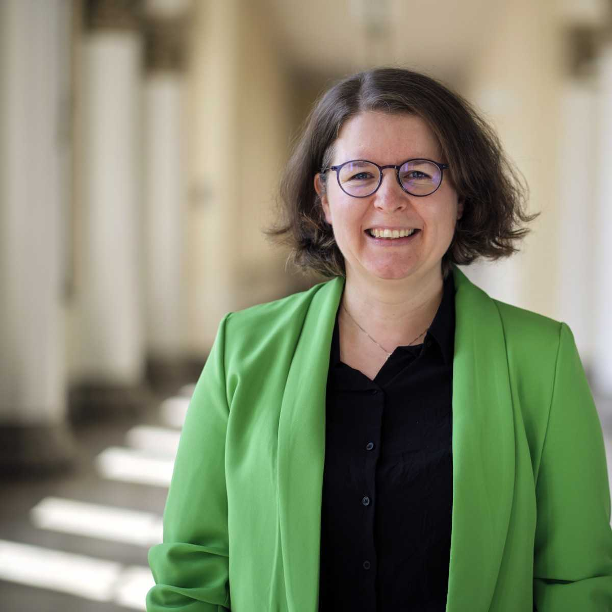](../people/people/barbara-plank.llms.md)

[Barbara Plank](../people/people/barbara-plank.llms.md)

Prof. Dr.

Languages & Literatures

[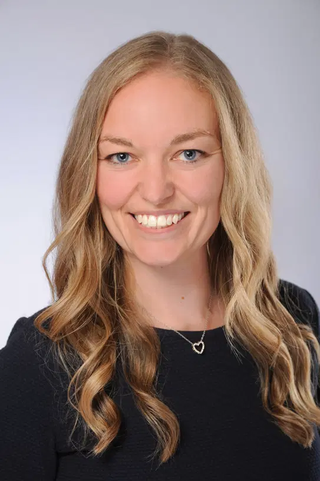](../people/people/belinda-platt.llms.md)

[Belinda Platt](../people/people/belinda-platt.llms.md)

Dr.

University Hospital

[Nikolaus Plesnila](../people/people/nikolaus-plesnila.llms.md)

Prof. Dr.

Medicine

[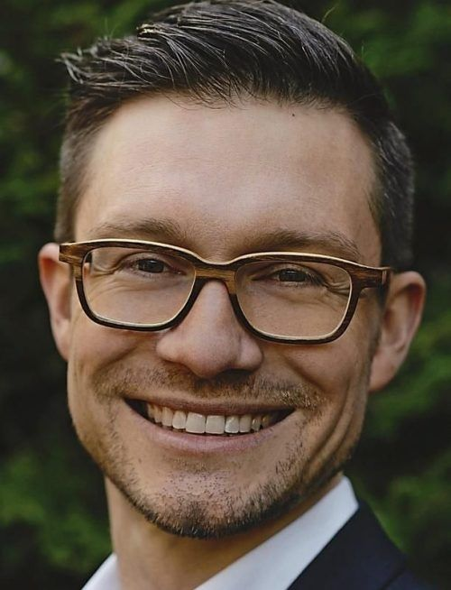](../people/people/matthias-reinhard.llms.md)

[Matthias Reinhard](../people/people/matthias-reinhard.llms.md)

Dr.

University Hospital

[Jörg Renkawitz](../people/people/joerg-renkawitz.llms.md)

Prof. Dr.

Medicine

[Saskia Rusche](../people/people/rusche-saskia.llms.md)

Dr.

Medicine

[Marko Sarstedt](../people/people/marko-sarstedt.llms.md)

Prof. Dr.

Business Administration

[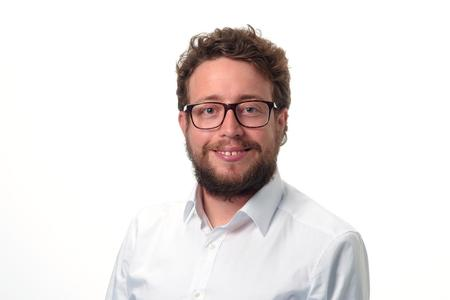](../people/people/balthasar-schachtner.llms.md)

[Balthasar Schachtner](../people/people/balthasar-schachtner.llms.md)

Dr.

Medicine

[Fabian Scheipl](../people/people/fabian-scheipl.llms.md)

PD Dr.

Math, Informatics & Stats

[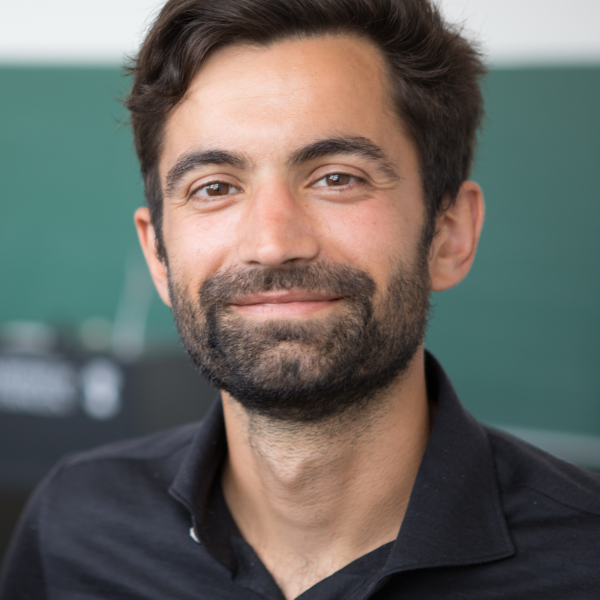](../people/people/moritz-schiltenwolf.llms.md)

[Moritz Schiltenwolf](../people/people/moritz-schiltenwolf.llms.md)

Dr.

Psychology & Education

[Xenia Schmalz](../people/people/xenia-schmalz.llms.md)

Dr.

University Hospital

[Julia Schulte-Cloos](../people/people/julia-schulte-cloos.llms.md)

Dr.

Social Sciences

[Christian Schulz](../people/people/christian-schulz.llms.md)

Prof. Dr.

University Hospital

[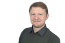](../people/people/enrico-schulz.llms.md)

[Enrico Schulz](../people/people/enrico-schulz.llms.md)

Dr.

University Hospital

[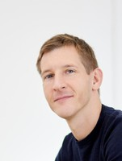](../people/people/carsten-schwemmer.llms.md)

[Carsten Schwemmer](../people/people/carsten-schwemmer.llms.md)

Prof.

Social Sciences

[Ramona Schödel](../people/people/ramona-schoedel.llms.md)

Dr.

Psychology & Education

[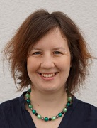](../people/people/laura-seelkopf.llms.md)

[Laura Seelkopf](../people/people/laura-seelkopf.llms.md)

Prof. Dr.

Social Sciences

[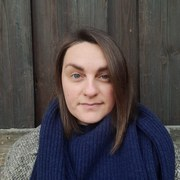](../people/people/ksenia-shagal.llms.md)

[Ksenia Shagal](../people/people/ksenia-shagal.llms.md)

Prof. Dr.

Languages & Literatures

[Rebecca I. Sienel](../people/people/rebecca-sienel.llms.md)

Dr.

University Hospital

[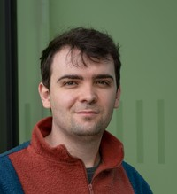](../people/people/adam-sorbie.llms.md)

[Adam Sorbie](../people/people/adam-sorbie.llms.md)

Dr.

University Hospital

[Tobias Straub](../people/people/tobias-straub.llms.md)

Dr.

Medicine

[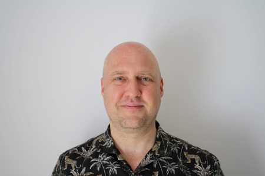](../people/people/justin-sulik.llms.md)

[Justin Sulik](../people/people/justin-sulik.llms.md)

Dr.

Philosophy

[Paul C.J. Taylor](../people/people/paul-cj-taylor.llms.md)

Prof. Dr.

Psychology & Education

[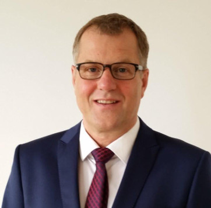](../people/people/paul-thurner.llms.md)

[Paul W. Thurner](../people/people/paul-thurner.llms.md)

Prof. Dr.

Social Sciences

[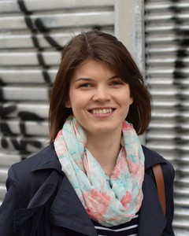](../people/people/renata-topinkova.llms.md)

[Renata Topinkova](../people/people/renata-topinkova.llms.md)

Dr.

Social Sciences

[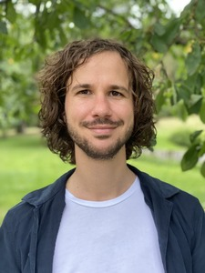](../people/people/mathias-twardawski.llms.md)

[Mathias Twardawski](../people/people/mathias-twardawski.llms.md)

Dr.

Psychology & Education

[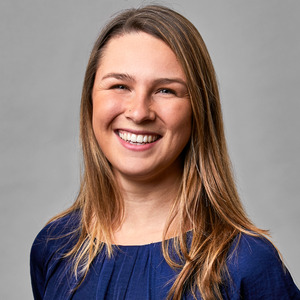](../people/people/elisabeth-vogl.llms.md)

[Elisabeth Vogl](../people/people/elisabeth-vogl.llms.md)

Dr.

Psychology & Education

[Sebastian Wichert](../people/people/sebastian-wichert.llms.md)

Dr.

Economics

[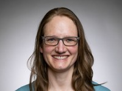](../people/people/juliane-wilcke.llms.md)

[Juliane Wilcke](../people/people/juliane-wilcke.llms.md)

Dr.

Medicine

[Joachim Winter](../people/people/joachim-winter.llms.md)

Prof. Dr.

Economics

[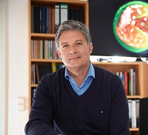](../people/people/eckhard-wolf.llms.md)

[Eckhard Wolf](../people/people/eckhard-wolf.llms.md)

Prof. Dr.

Veterinary Medicine

[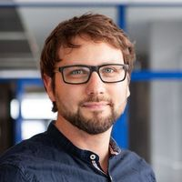](../people/people/alexander-wuttke.llms.md)

[Alexander Wuttke](../people/people/alexander-wuttke.llms.md)

Prof. Dr.

Social Sciences

[Gert Wörheide](../people/people/gert-woerheide.llms.md)

Prof. Dr.

Geosciences

[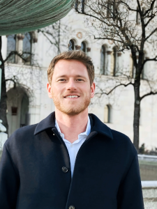](../people/people/quirin-wuerschinger.llms.md)

[Quirin Würschinger](../people/people/quirin-wuerschinger.llms.md)

Dr.

Languages & Literatures

[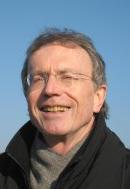](../people/people/dietmar-zaefferer.llms.md)

[Dietmar Zaefferer](../people/people/dietmar-zaefferer.llms.md)

Prof. Dr.

Languages & Literatures

[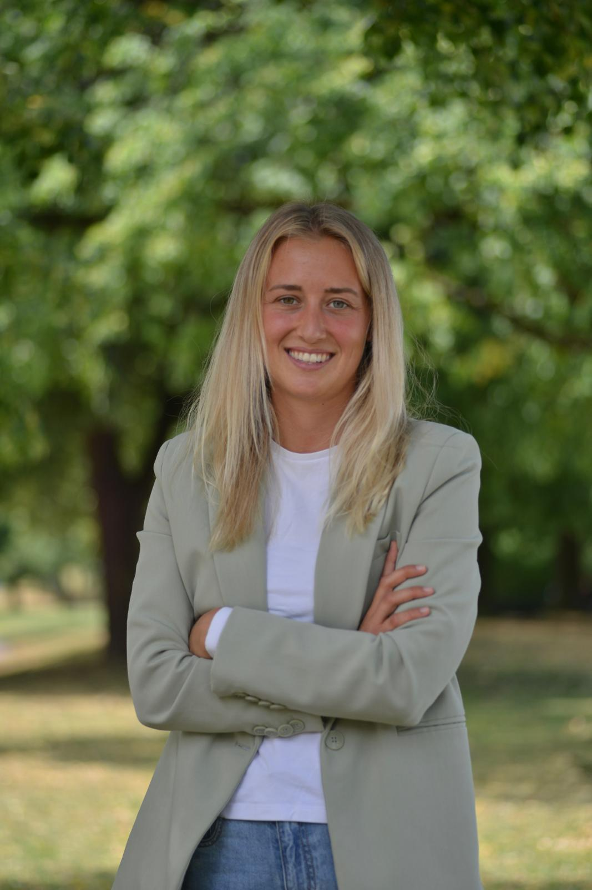](../people/people/judith-zellner.llms.md)

[Judith Zellner](../people/people/judith-zellner.llms.md)

Dr. des.

Psychology & Education

[Caroline Zygar-Hoffmann](../people/people/caroline-zygar-hoffmann.llms.md)

Dr.

Psychology & Education

## Affiliate Members

[Andreas Beyerlein](../people/people/andreas-beyerlein.llms.md)

PD Dr.

Bayerischen LGL

[Christiane Fuchs](../people/people/christiane-fuchs.llms.md)

Prof. Dr.

Helmholtz Munich: Institute of Computational Biology

[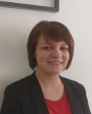](../people/people/annika-hoyer.llms.md)

[Annika Hoyer](../people/people/annika-hoyer.llms.md)

Prof. Dr.

University of Bielefeld

[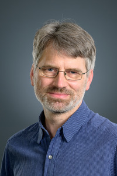](../people/people/thomas-misgeld.llms.md)

[Thomas Misgeld](../people/people/thomas-misgeld.llms.md)

Prof. Dr.

TUM Medicine & Health

[Christina Peter](../people/people/christina-peter.llms.md)

Prof. Dr.

University of Klagenfurt

[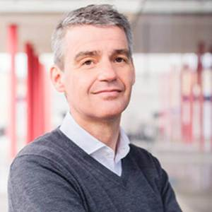](../people/people/markus-ploner.llms.md)

[Markus Ploner](../people/people/markus-ploner.llms.md)

Prof. Dr.

TUM

[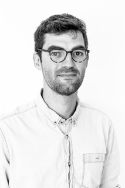](../people/people/tom-ratz.llms.md)

[Tom Ratz](../people/people/tom-ratz.llms.md)

Dr.

University of Zürich

[Heidi Seibold](../people/people/heidi-seibold.llms.md)

Dr.

Digital Research Academy

[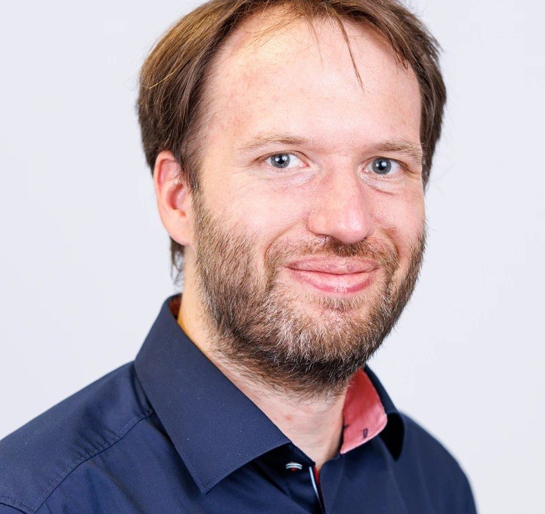](../people/people/elmar-spiegel.llms.md)

[Elmar Spiegel](../people/people/elmar-spiegel.llms.md)

Dr.

Helmholtz Zentrum Munich

## Former Members

- [Dr. Marlene Altenmüller](../people/people/marlene-altenmueller.llms.md)
- [Dr. Stefano Coretta](../people/people/coretta-stefano.llms.md)
- [Prof. Dr. Ivett Guntersdorfer](../people/people/ivett-guntersdorfer.llms.md)
- [Dr. Larissa Neumann](../people/people/larissa-neumann.llms.md)
- [Prof. Dr. Barbara Osimani](../people/people/barbara-osimani.llms.md)
- [Dr. Andreas Schneck](../people/people/andreas-schneck.llms.md)
- [Dr. Angelika Stefan](../people/people/angelika-stefan.llms.md)
- [Dr. Wolfgang Strube](../people/people/wolfgang-strube.llms.md)
- [Dr. Imai Taisuke](../people/people/imai-taisuke.llms.md)
- [Dr. Julian Unkel](../people/people/julian-unkel.llms.md)
- [Dr. Christian Woll](../people/people/christian-woll.llms.md)
- [Dr. Johannes Ziegler](../people/people/johannes-ziegler.llms.md)

&nbsp;
