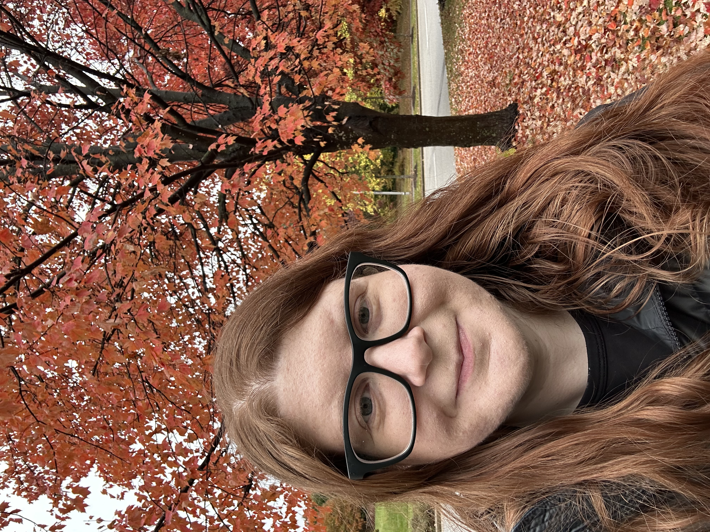

# Alyssa Columbus

Ph.D. Candidate

Faculty of Math, Informatics & Stats

[alyssa.columbus@campus.lmu.de](mailto:alyssa.columbus@campus.lmu.de)

[Personal Website](https://alyssacolumbus.com)

## Mission Statement

My research is on trustworthy data science for education, health, and policy- how the many defensible choices in an analysis shape the conclusions we draw, and how to make that process transparent enough for others to check. Open science, to me, is what makes that checking possible. I work across several of its parts rather than one, from open-source software development and software peer review to the responsible handling of sensitive data, the last of these drawing on the years I spent in information security and data governance before returning to academia. I care most about the pieces that tend to get less attention than open access and open data, and about building training that carries across disciplines instead of staying inside any single field.
