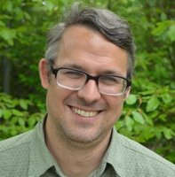

# Andreas Kruck

Researcher

Faculty of Social Sciences

[andreas.kruck@gsi.uni-muenchen.de](mailto:andreas.kruck@gsi.uni-muenchen.de)

[LMU Profile](https://www.en.gsi.uni-muenchen.de/people/academic/kruck/index.html)

## Mission Statement

I am Senior Researcher and Lecturer in Global Governance at the Geschwister Scholl Institute of Political Science.

Widespread adoption of Open Science across all research methodologies is essential to ensuring that research is methodologically rigorous, ethically sound, and openly accessible, maximizing its impact on both the scientific community and society at large. My objective is to advance tailored Open Science policies and procedures for qualitative Social Science through my research, teaching, mentoring, and institution-building work.
