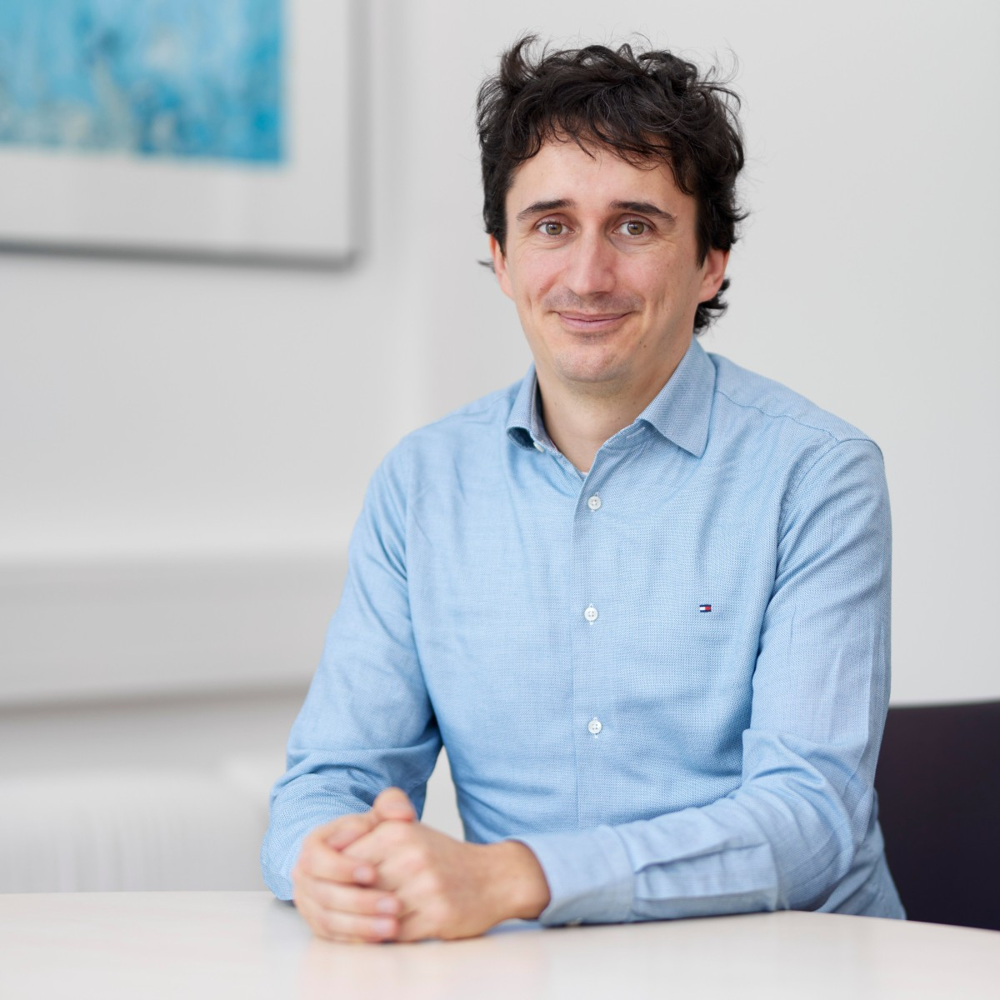

# Andreas Schneck

Researcher

Faculty of Social Sciences

[andreas.schneck@soziologie.uni-muenchen.de](mailto:andreas.schneck@soziologie.uni-muenchen.de)

[LMU Profile](https://www.ls4.soziologie.uni-muenchen.de/personen/wissenschaftlich_mitarbeiter/emmer/index.html)

## Mission Statement

I am postdoctoral researcher at the chair of Quantitative Methods of Social Research (Department of Sociology). Besides my interest in researching the causes and contextual factors of social inequality using also meta-analytical tools I do methodological research on detection methods of publication bias and the assessment of scientific integrity. I am convinced that norms of transparency, sharing data and analysis files as well as establishing good practices of replication, and further interventions of open science are important to advance the quality as well as increase the efficiency of science.
