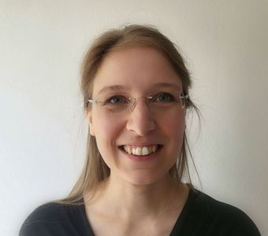

# Angelika Stefan

Researcher

Faculty of Psychology & Education

[angelika.m.stefan@gmail.com](mailto:angelika.m.stefan@gmail.com)

[LMU Profile](https://www.lmu.de/psy/de/lehrstuehle/computational-modeling-in-psychology/people/)

## Mission Statement

I am a postdoctoral researcher in the Computational Modeling in Psychology unit at the department of psychology.

To me, openness and transparency are core values of scientific practice. I try to implement them in my own work by following Open Science practices, and I try to communicate them to students and colleagues in lectures and workshops. As a researcher in psychological methods, I also contribute to methodological reform by finding adequate approaches for planning studies and analyzing data. During my PhD in the Netherlands, I co-founded the Amsterdam section of the ReproducibiliTea journal club, and I enjoy good-faith discussions about what constitutes good scientific practice. As a current co-chair of the Open Science Initiative in Psychology (OSIP), my goal is to foster open and participatory scholarship at an institutional level.
