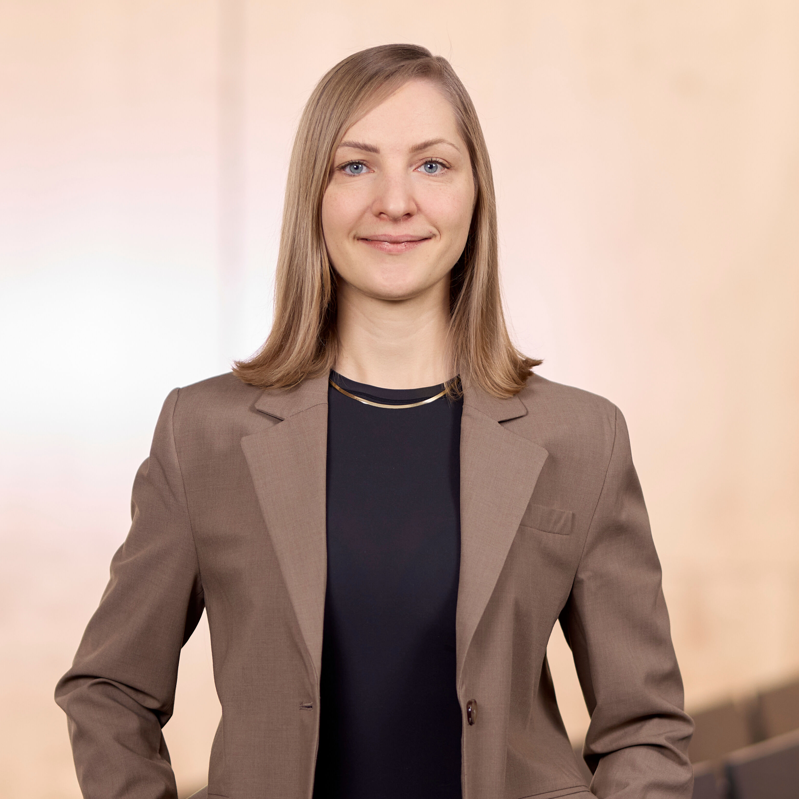

# Anna Sophie Kümpel

Professor of Communication

Faculty of Social Sciences

[anna.kuempel@ifkw.lmu.de](mailto:anna.kuempel@ifkw.lmu.de)

[LMU Profile](https://www.sw.lmu.de/ifkw/de/das-institut/organization-und-ansprechpartner/menschen-am-ifkw/kontaktseite/anna-sophie-kuempel-37f0dbbd.html)

[Personal Website](https://anna-kuempel.de/)

## Mission Statement

I am a Professor of Communication at the Department of Media and Communication. My field faces many of the same challenges seen in other disciplines, such as low replicability and declining trust in research findings. I firmly believe that adopting Open Science (OS) practices is a vital step towards addressing these issues. To this end, I actively adhere to and promote OS principles, continuously exploring ways to enhance transparency and accessibility in my (and our) research.  
As a co-author of the paper *[An Agenda for Open Science in Communication](https://doi.org/10.1093/joc/jqz052)*, I have contributed to identifying key strategies and recommendations to advance OS within the communication discipline. Moreover, as an advocate of mixed methods research, I emphasize the importance of considering both quantitative and qualitative research designs when thinking about and developing OS practices.
