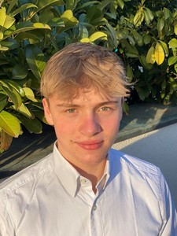

# Caspar Schumacher

B.Sc. Student

Faculty of Psychology & Education

[C.Schumacher@campus.lmu.de](mailto:C.Schumacher@campus.lmu.de)

## Mission Statement

I am Caspar and I’m currently enrolled in the B.Sc Psychology program, where my academic focus and research interest lies in the realm of social- and personality psychology, as well as Open Science and Science Communication.

Occasionally, when time permits, I participate in the ReproducibiliTea Journal Club?a forum dedicated to discussions on crucial aspects of research methodology.

Collaborating with other Bsc. students, I am actively involved in the RPsyche programming course designed for psychologists. This course emphasizes the fundamental principles of clean, technology-supported research and advocates for the adoption of good coding practices within the field.

My academic journey is driven by a commitment to promoting rigorous research standards in psychology, combining theoretical knowledge with practical skills. Through these initiatives, I aim to contribute to the cultivation of a research community that values transparency, reproducibility, and excellence in scientific methodology.
