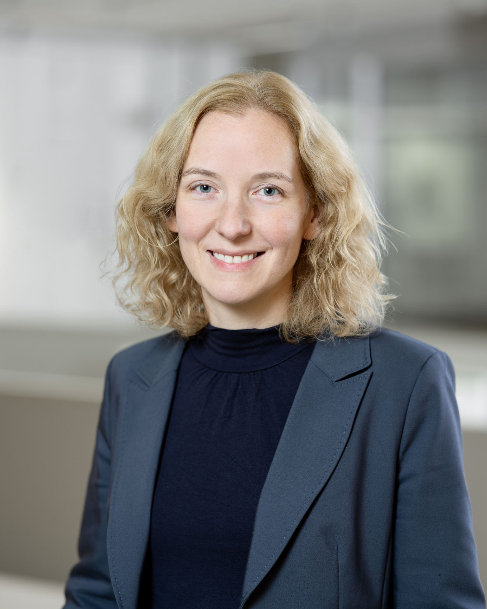

# Christiane Fuchs

[christiane.fuchs@helmholtz-muenchen.de](mailto:christiane.fuchs@helmholtz-muenchen.de)

[Professional Profile](https://www.helmholtz-munich.de/en/icb/christiane-fuchs)

## Mission Statement

My research mission is to gain knowledge from data to make it usable for medicine, the environment, and society. As a professor of data science, I lead interdisciplinary and multinational working groups at Helmholtz Munich and at Bielefeld University.
