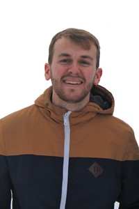

# Leonhard Schramm

Research Assistant - Members Onboarding, Guidelines Creator

[leonhard.f.f.schramm@gmail.com](mailto:leonhard.f.f.schramm@gmail.com)

## Mission Statement

I have been an Open Science enthusiast since the beginning of my studies, when I first heard about the replication crisis in psychology and the Open Science movement. In 2018, I was a founding member of a German-wide student OS group of the PsyFako \[<https://psyfako.org/>\] (German psychology student representation). Since then, I have been involved in a number of local and nationwide projects to promote OS. For example, I co-authored a paper on QRPs among students, contributed to two position papers on implementing Open Science in teaching and I am still organising the journal club “ReproducibiliTea” at LMU Munich. Personally, I am convinced that the OS movement will be most successful if it allows critical voices, maintains dialogue with dissenters and works towards strengthening local OS-communities.
