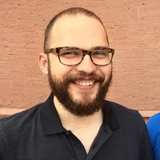

# Marcel Neunhoeffer

Researcher

Faculty of Math, Informatics & Stats

[marcel.neunhoeffer@stat.uni-muenchen.de](mailto:marcel.neunhoeffer@stat.uni-muenchen.de)

[LMU Profile](https://www.stat.lmu.de/soda/en/team/contact-page/marcel-neunhoeffer-2cbaa704.html)

[Personal Website](https://www.marcel-neunhoeffer.com)

## Mission Statement

I am a postdoctoral researcher at the Department of Statistics at LMU and the Department of Computer Science at Boston University.

Open science is at the heart of any scientific endeavor, as the goal of science should be to be transparent and inclusive without too high entry barriers. I lead by example in teaching reproducible quantitative research and contributing open-source software to the research community.

In my research, I focus on balancing the seemingly contradictory goals of open science/open data and privacy protection, for example, through synthetic data with formal privacy guarantees.

***  ***
