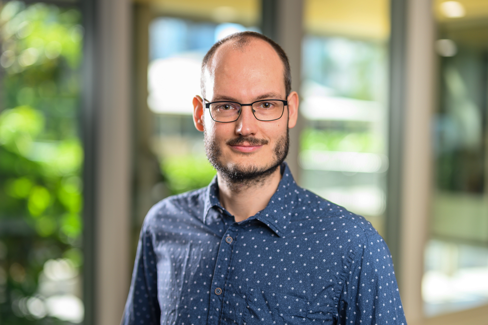

# Dr. med. Markus Laubach

Surgeon-scientist at Musculoskeletal University Center Munich (MUM)

University Hospital

[markus.laubach@med.uni-muenchen.de](mailto:markus.laubach@med.uni-muenchen.de)

[LMU Profile](https://www.lmu-klinikum.de/mum-lmu/6eff8b2b49e54ab7/383af7251a6e8a47)

## Mission Statement

As a member of the LMU Open Science Center, I support the advancement of transparent, reproducible, and open research practices. In my work as a surgeon-scientist and clinician at the Department of Orthopaedics and Trauma Surgery (Musculoskeletal University Center Munich, MUM) of the LMU University Hospital, I focus on translational orthopaedic and trauma research, including the development of innovative 3D-printed solutions and tissue engineering approaches to improve bone regeneration and patient care. My involvement in the Center reflects my commitment to rigorous methodology, interdisciplinary collaboration, and responsible dissemination of research that bridges laboratory innovation and clinical impact.
