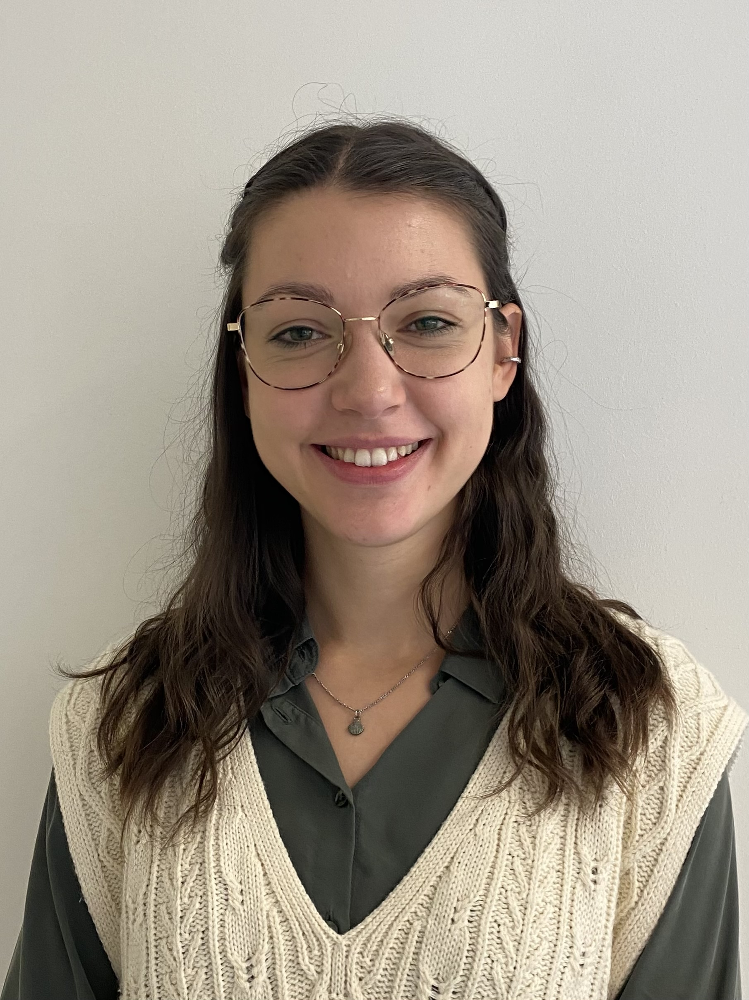

# Mia Grünewald

Ph.D. Candidate

Faculty of Social Sciences

[mia.gruenewald@ifkw.lmu.de](mailto:mia.gruenewald@ifkw.lmu.de)

[LMU Profile](https://www.sw.lmu.de/ifkw/en/department/people-contacts-and-organization/people-at-the-ifkw/contact-page/mia-gruenewald-e038f427.html)

## Mission Statement

I am a research associate and PhD student at the Journalism Research Unit at the Department of Media and Communication. My dissertation project focuses on the image of journalists. As one of two data managers of the [Worlds of Journalism Study](https://worldsofjournalism.org/), I contribute to implementing open science practices in a global large-scale collaborative research project. I consider it particularly important to teach open science principles to students and, through interdisciplinary exchange, to make scientific knowledge more accessible both within and beyond the scientific community.
