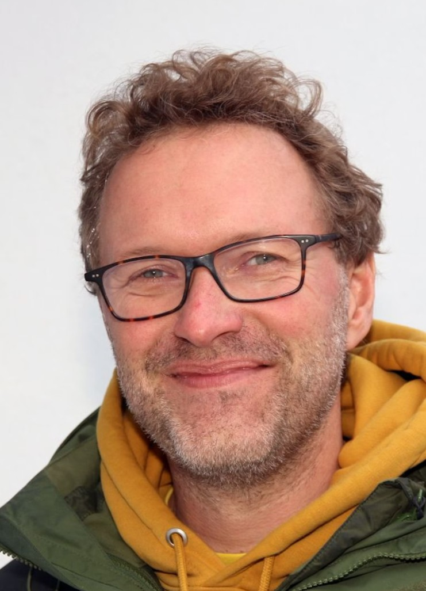

# Niels Dingemanse

Chair

Faculty of Biology

[n.dingemanse@lmu.de](mailto:n.dingemanse@lmu.de)

[LMU Profile](https://www.behavioural-ecology.bio.lmu.de/people/professor/dingemanse/index.html)

## Mission Statement

I am professor for Behavioural Ecology at the Faculty of Biology

I specialize on biodiversity in the broad sense, with a focus on understanding patterns of variation (among genotypes, individuals) within single populations, particularly in the context of behaviour. Much of our work is starting to involve large-scale collaborations to perform study replications to understand whether study-specific results are generally applicable, for example through the SPI-Birds Network. Open and reproducible science are important for making such enterprises successful. My work also involves developing and teaching complex statistics, particularly mixed-model analyses. I am have many years of editorial experience for high-quality journals, and because of such experiences am convinced we need to move our community to conduct transparent, reproducible, and open science.
