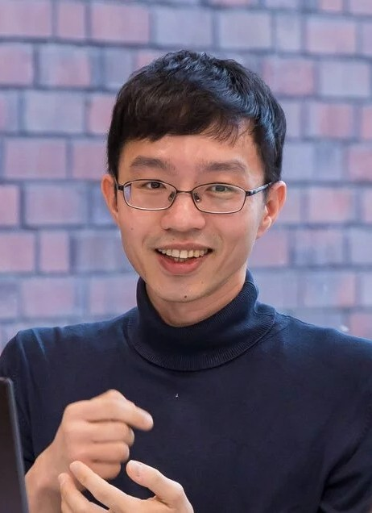

# Po-Chun Tseng

Ph.D. Candidate

Faculty of Medicine

[p.tseng@campus.lmu.de](mailto:p.tseng@campus.lmu.de)

## Mission Statement

I am addressing topics of dental biomechanics and digital dentistry using almost exclusively open-source packages. To empower enthusiastic users, I always follow open science principles and make the projects fully open to the research community. My ultimate goal is to introduce more deductive thinking to the clinical practice in dentistry. Inspired by the AI Safety Fundamentals program held by Effective Altruism Germany, I am also concerned about how AI impacts the current practice of academia. Open science could play a pivotal role in mitigating the potential harm.
