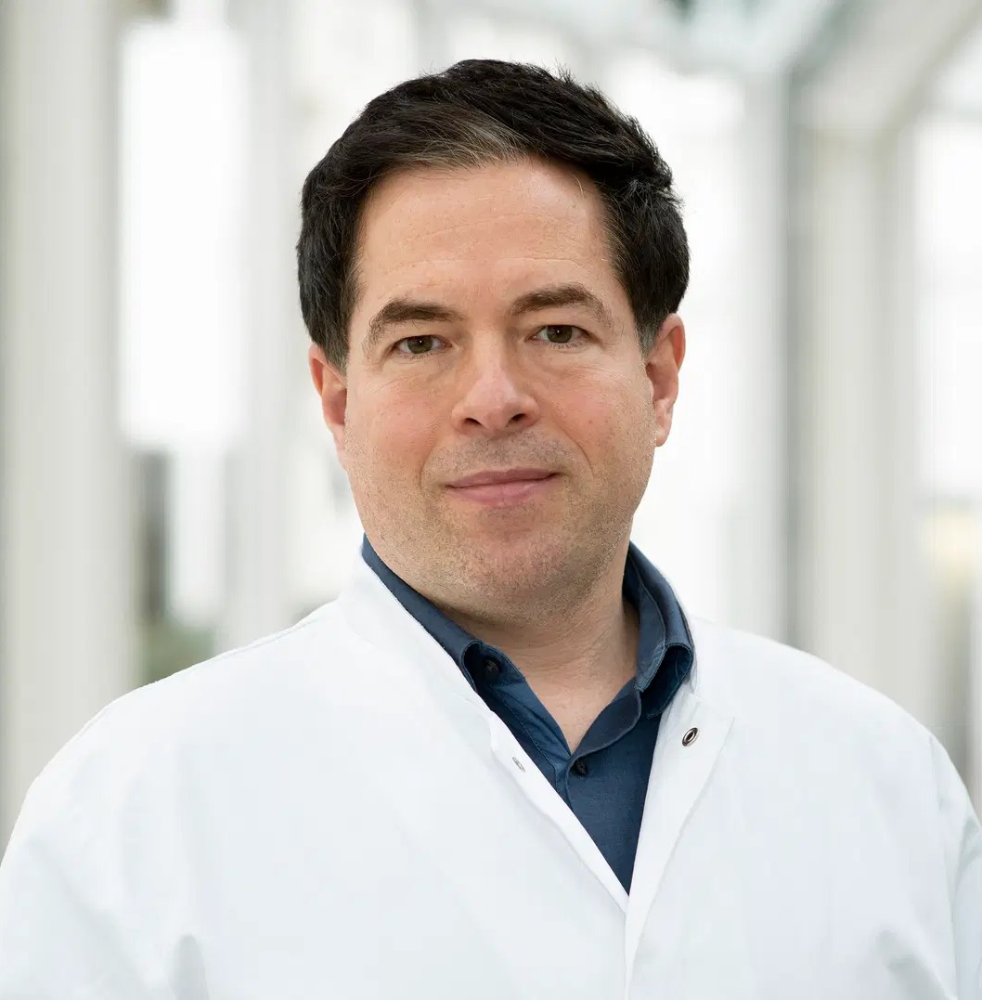

# Robert Perneczky

Chair

Faculty of University Hospital

[Robert.Perneczky@med.uni-muenchen.de](mailto:Robert.Perneczky@med.uni-muenchen.de)

[Professional Profile](https://www.synergy-munich.de/about/members/5be5301b72fd3b59)

## Mission Statement

In my work as Professor of Translational Dementia Research and Director of the Division of Mental Health in Older Adults and Alzheimer Therapy and Research Center at LMU Munich, I focus on improving our understanding of dementia through clinical and biomarker research and the development of early detection and treatment strategies. My involvement in the Center reflects my commitment to open scientific inquiry that enhances the reliability, accessibility, and societal impact of research in neurodegenerative disease and mental health.
