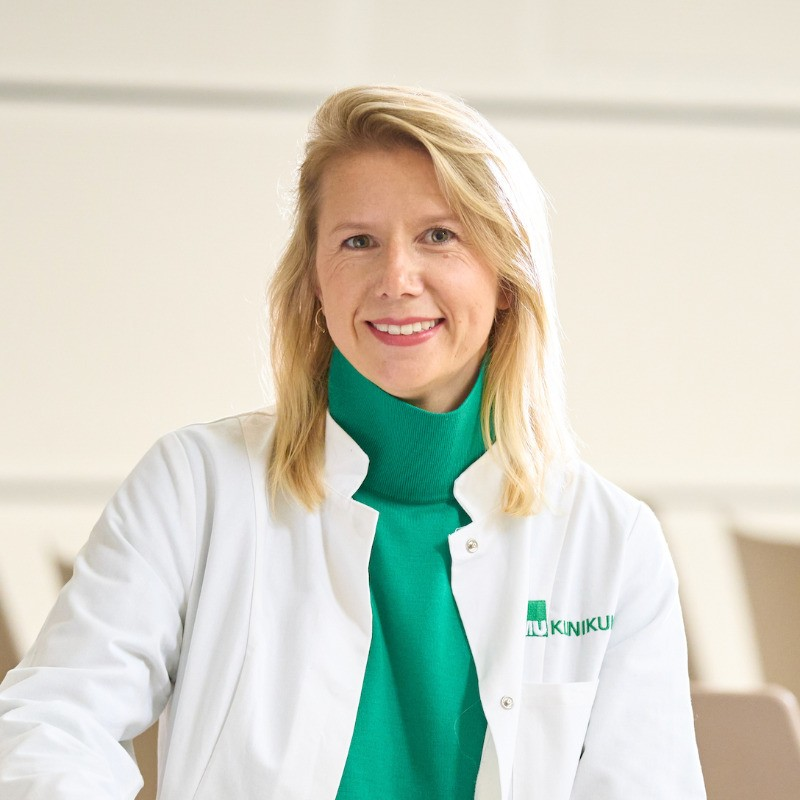

# Saskia Rusche

Researcher

Faculty of Medicine

[Saskia.Rusche@med.uni-muenchen.de](mailto:Saskia.Rusche@med.uni-muenchen.de)

[Professional Profile](https://pediatric-neuroimaging.de/researchers)

## Mission Statement

I am passionate about open science because it advances knowledge and democratizes research. By making scientific data, methodologies, and findings freely accessible to everyone, open science fosters transparency, reproducibility, and collaboration across disciplines and borders. This collaborative approach is essential for producing excellent research, as it brings together diverse perspectives and expertise, accelerating scientific progress and innovation.
