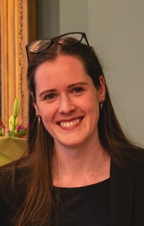

# Sarah von Grebmer zu Wolfsthurn

Train-the-Trainer Program Coordinator

[s.grebmer@lmu.de](mailto:s.grebmer@lmu.de)

[LMU Profile](https://www.lmu.de/psy/de/personen/kontaktseite/sarah-von-grebmer-zu-wolfsthurn-cb1fec68.html)

 

## Mission Statement

Sarah von Grebmer zu Wolfsthurn is an Open Science program coordinator at the LMU Open Science Center (OSC). She coordinates the Train-the-Trainer program. She is involved in:

- Coordinating, developing and delivering the Train-the-Trainer program at LMU to train future Open Science ambassadors and Open Science trainers.
- Facilitating interdisciplinary workshops, seminars, and networking events for students, researchers, and support staff to engage and support participants in adopting open research practices.
- Supporting the adoption of open research practices at the LMU and beyond.

Before her work at the LMU Open Science Centre, Sarah was a Marie Skłodowska-Curie PhD Fellow within the [Horizon2020](https://research-and-innovation.ec.europa.eu/funding/funding-opportunities/funding-programmes-and-open-calls/horizon-2020_en) programme at Leiden University (NL). She holds a PhD in Cognitive Psychology and Neurolinguistics and taught experimental methods as well as psycho- and neurolinguistics during and after her PhD at Leiden University.

Please get in touch with Sarah at <s.grebmer@lmu.de> if you have any questions, thoughts, or ideas related to her role or Open Science at LMU.

**Links**

- BlueSky – @sarahvongrebmer.bsky.social
- LinkedIn – [www.linkedin.com/in/svongrebmer](https://www.linkedin.com/in/svongrebmer)

**Contact**

- Email – <s.grebmer@lmu.de>
- Phone – +49 89 2180 5872

**Working days** – Wednesdays, Thursdays, and Fridays

## Research Interests

Open Science

Cognitive Psychology

Experimental Methods

EEG

Neurolinguistics
