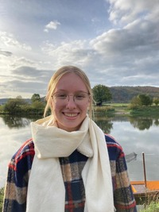

# Viktoria Wiegelmann

B.Sc. Student

Faculty of Psychology & Education

[v.wiegelmann@campus.lmu.de](mailto:v.wiegelmann@campus.lmu.de)

## Mission Statement

I’m currently studying Psychology at the LMU. I first heard about the Open Science movement in my Statistics Course during my first semester and was excited to be already able to implement some of the ideas during my first Research Practical (e.g. preregistration, open data). Ever since I am interested in what it means to conduct good (psychological) scientific research. This is also why I joined the organisation team of the Open Science Journal Club this semester, which I find a great way to broaden my horizon in the world of Open Science. I believe that in order to make a difference it is necessary to start by informing and educating as many people as possible about Open Science, but also keep discussing the challenges and limitations it may face.
