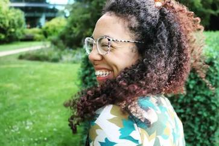

# Staff

[Become a Research Assistant (HiWi)](mailto:malika.ihle@lmu.de?subject=Research%20Assistant%20(HiWi)%20Inquiry)

#### LMU Open Science Center Coordinator

- 
- 
- 
- 
- 

#### Malika Ihle

Dr.

I am the Coordinator of the LMU Open Science Center, developing a comprehensive approach to open research that extends across all disciplines, using both bottom-up and top-down strategies. My role is to provide peer-to-peer training and develop an open research curriculum, coordinate grassroots initiatives and organize various events, support meta-research collaborations, liaise with local, national, and international stakeholders to inform the design of incentives and policies, and co-develop a strategic plan to make the LMU Open Science Center a sustainable entity.

[Read More!](../people/people/malika-ihle.llms.md)

#### Train-the-Trainer Program Coordinator

- 
- 

#### Sarah von Grebmer zu Wolfsthurn

Dr.

Sarah von Grebmer zu Wolfsthurn is one of the two Open Science coordinators at the LMU Open Science Centre (OSC). She coordinates the “Train-the-trainer” programme.

[Read More!](../people/people/sarah-von-grebmer-zu-wolfsthurn.llms.md)

#### Training Development Coordinator and Community Engagement Manager

- 

#### Sara Lil Middleton

Dr.

Sara Lil Middleton is the Training Development Coordinator and Community Engagement Manager on the “Train-the-Trainer” programme at LMU in partnership with the Framework for Open and Reproducible Research Training (FORRT).

[Read More!](../people/people/sara-lil-middleton.llms.md)

#### FAIR Research Data Management Consultant

- 
- 
- 

#### Reema Gupta

Ph.D. Candidate

Reema Gupta serves as a training material developer for FAIR research data within the Volkswagen LMU-FORRT project. She specializes in data management, research data standards, and workflows, with a particular focus on neuroscience. As a certified Carpentries instructor and dedicated open science advocate, she is committed to advancing open and reproducible research practices.

[Read More!](../people/people/reema-gupta.llms.md)

#### Software Developer & Research Support

- 
- 

#### Pat Callahan

M.Sc. Epidemiology

I’m a scientific research programmer with a Master’s degree in epidemiology, focused on advancing reproducible and efficient research in the health sciences. I believe that treating scientific analyses as software development projects creates the standard, understandable frameworks necessary to address reproducibility challenges. My work centers on developing tools, creating educational resources, and supporting researchers in adopting computational best practices.

[Read More!](../people/people/pat-callahan.llms.md)

#### Research Assistant - Software Development

- 
- 

#### Riya Lamichhane

M.Sc. Student \| Medicine

I am a Master’s student in Epidemiology at the Institute for Medical Information Processing, Biometry, and Epidemiology (IBE). At the OSC, I primarily support our website development work. As a firm believer in transparency, open access, and reliability in all things science, I aim to both promote and practice open science through my work.

[Read More!](../people/people/riya-lamichhane.llms.md)

#### Research Assistant - Training Development

- 

#### Tejaswini Sharma

M.Sc. Student \| Psychology & Education

I am an M.Sc. student in Psychology: Learning Sciences at LMU Munich, passionate about integrating educational research with Open Science. My broader research interest lies in creating inclusive and research-driven learning environments, and I see Open Science as a key foundation for ensuring that research is transparent, collaborative, and impactful across disciplines.  
At the OSC, I support the development of training materials for the Train-the-Trainer programme, focusing on reproducible workflows, FAIR data principles, and instructional design for academic contexts.

[Read More!](../people/people/tejaswini-sharma.llms.md)

#### Research Assistant - Training Development , Event Logistics & Public Outreach

- 
- 

#### Elizabeth Waterfield

M.Sc. Student \| Psychology & Education

I am an M.Sc. student in Psychology- Learning Sciences at LMU Munich with a background in Psychology and Gender and Development. I value Open and Reproducible Science as a foundation for collaborative research and sustainable knowledge building. My interests focus on education, teaching, and creating environments and resources that empower learners. At the LMU Open Science Center, I support administration, public outreach, and the development of learning materials for the Train-the-Trainer programme.

[Read More!](../people/people/elizabeth-waterfield.llms.md)

## Former Staff

- [Ben Abrahams (2025 - 2025): Research Assistant - Software Developer](../people/people/ben-abrahams.llms.md)
- [Pat Callahan (2024 - 2025): Research Assistant - Training Material and Software Developer](../people/people/pat-callahan.llms.md)
- [Dejana Damjanovic (2024 - 2025): Research Assistant - Members Onboarding, Event Logistics](../people/people/dejana-damjanovic.llms.md)
- [Franka Etzel (2022 - 2023): Research Assistant - Members Onboarding, Public Outreach](../people/people/franka-etzel.llms.md)
- [Lutz Heil (2018 - 2019): Research Assistant - Original Website Content Creator](../people/people/lutz-heil.llms.md)
- [Florian Kohrt (2024 - 2025): Training Material, Software, and Guidelines Developer](../people/people/florian-kohrt.llms.md)
- [Gracia Prüm (2023 - 2025): Research Assistant - Public outreach, Event Logistics](../people/people/gracia-pruem.llms.md)
- [Caterina Sanchez Steinhagen (2025 - 2025): Research Assistant - Training Material Developer](../people/people/caterina-sanchez-steinhagen.llms.md)
- [Leonhard Schramm (2019 - 2022): Research Assistant - Members Onboarding, Guidelines Creator](../people/people/leonhard-schramm.llms.md)
- [Martin Wiehr (2023 - 2024): Research Assistant - Members Onboarding, Event Logistics](../people/people/martin-wiehr.llms.md)

&nbsp;
