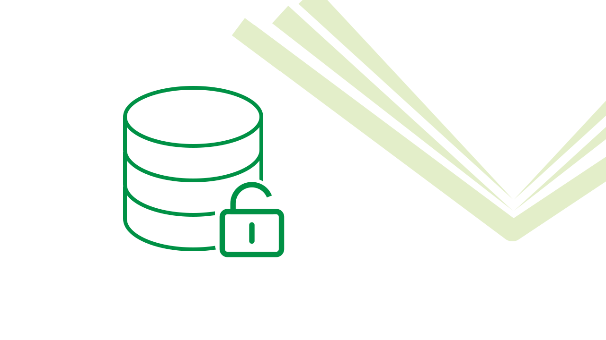
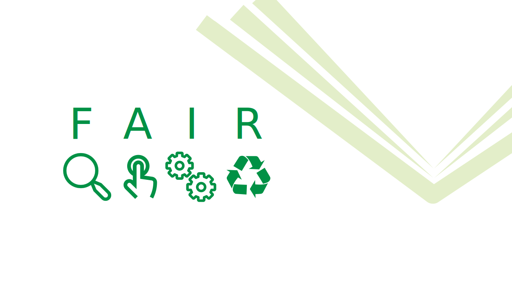
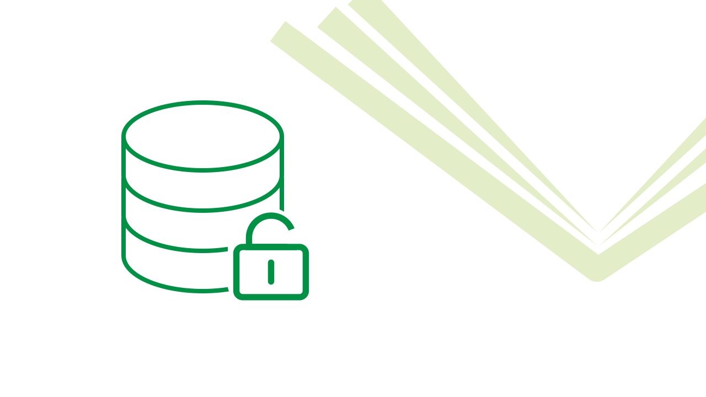
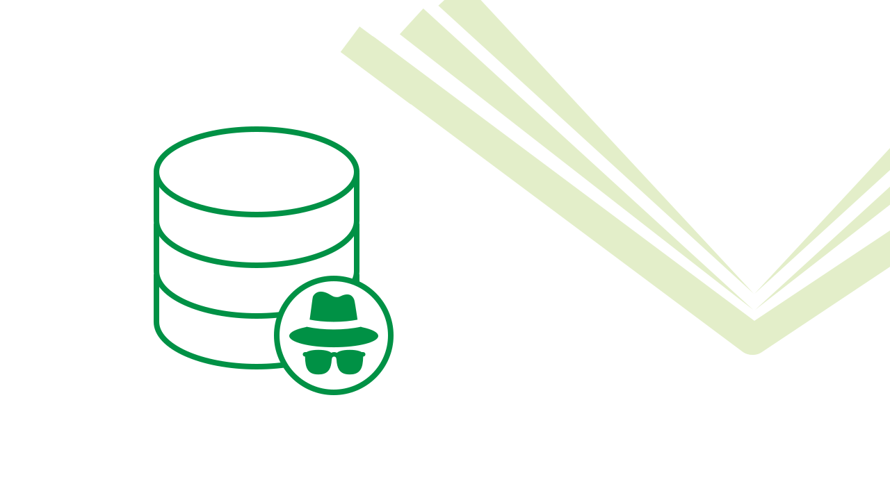
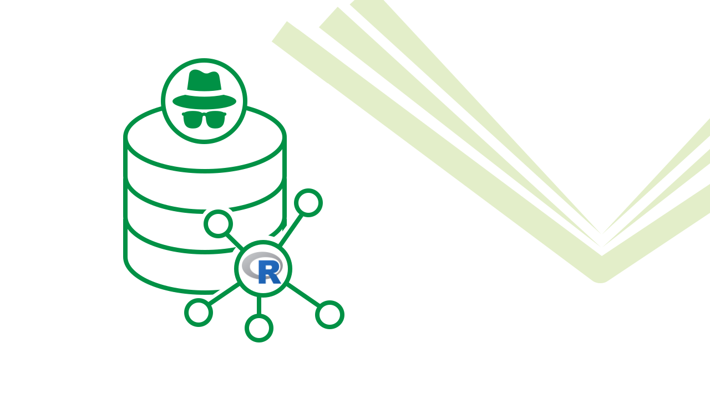

# Data Management

From preserving **anonymity** to **FAIR data sharing**

### [Introduction to Open Data](../../training/data-management/open-data.llms.md)

An introductory presentation on the what, why, and how of making research data open

Lecture

### [FAIR Data Management](https://lmu-osc.github.io/FAIR-Data-Management/)

Take steps towards making your data FAIR: **F**indable, **A**ccessible, **I**nteroperable, **R**eusable

Self-Paced Tutorial

### [Data Documentation & Validation in R](https://lmu-osc.github.io/data-documentation-validation-R/)

How to document, summarize, and validate your research data using R.

Self-Paced Tutorial

### [Maintaining Privacy with Open Data](../../training/data-management/maintaining-privacy-with-open-data.llms.md)

A presentation on how to make data open to the public without revealing sensitive information

Lecture

### [*In Development*: Data Anonymity]()

Implementing and evaluating data anonymization techniques in R for safely sharing sensitive research data

Self-Paced Tutorial

### [Generating Synthetic Data](https://lmu-osc.github.io/synthetic-data-tutorial/)

Generating Synthetic Data in R and balancing utility and privacy-preserving data sharing

Self-Paced Tutorial
