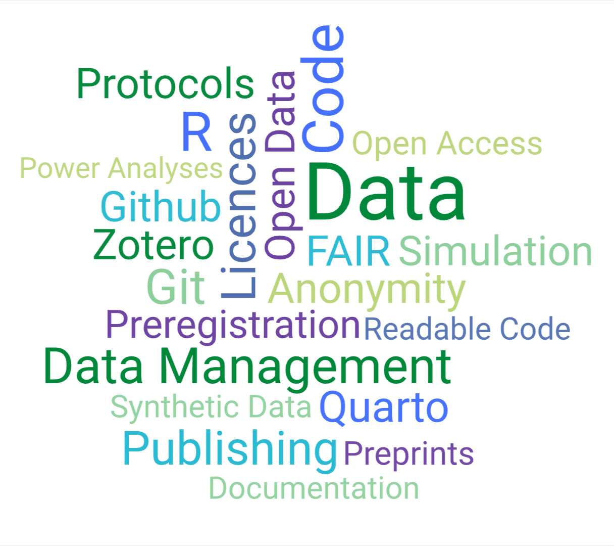
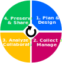
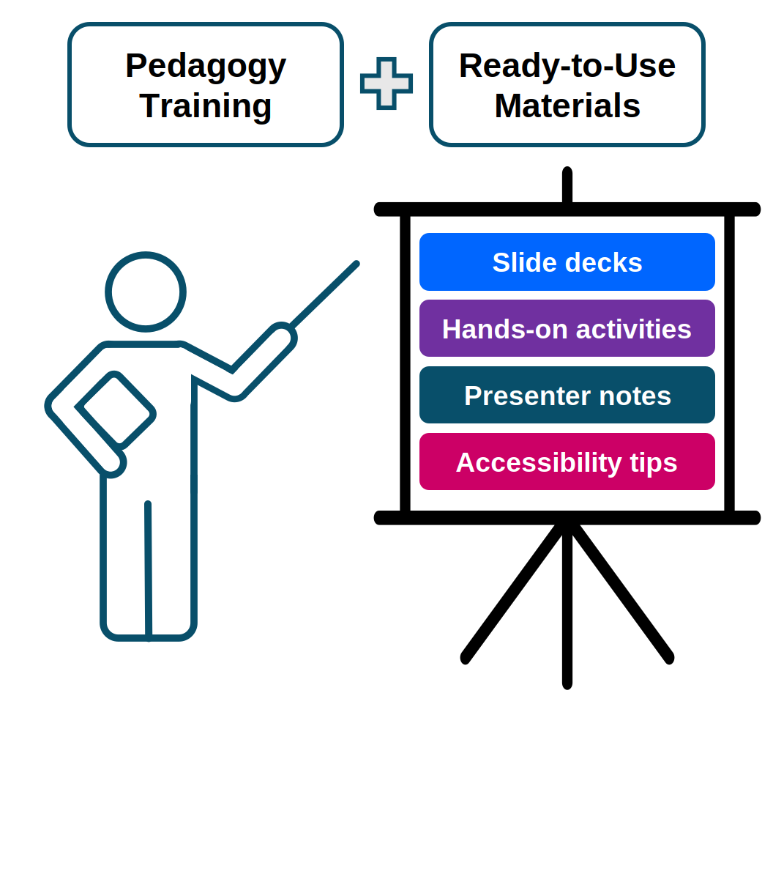

<style>
.training-card .card-title{
  color: #00883A;
  font-size:1.34rem;
  letter-spacing: -0.5px
}

.training-card .card-text{
  line-height: 1.6;
  font-size: 1rem;
}

.training-card {
  transition: transform 0.15s ease;
  overflow: hidden;
  cursor:pointer;
}

.training-card:hover {
  transform: translateY(-3px) scale(1.025);
}
.btn.btn-primary.osf-btn {
  background-color: #00883A!important;
  border:none;
  transition: transform .15s ease;
}

.btn.btn-primary.osf-btn:hover {
  transform: scale(1.05);
}

</style>

::: {.container .bg-light-subtle .rounded-3 .py-3 .mb-3}
::: {.row .row-cols-xl-3 .row-cols-1 .g-4}

::: {.col}
```{=html}
    <div class="card training-card shadow-sm border-success-subtle h-100 rounded-4 p-4 text-center">
      <h3 class="card-title fw-semibold">Self-Learning Catalog</h3>
      <p class="card-text">For researchers or students who want to learn a specific open research practice.</p>
      
      <a href="self-learning.qmd" class="stretched-link"></a>
   </div>
```
:::

::: {.col}
```{=html}
    <div class="card training-card shadow-sm border-success-subtle h-100 rounded-4 p-4 text-center">
      <h3 class="card-title fw-semibold">Research Cycle Handbook</h3>
      <p class = "card-text">Detailed guide to best research practices across the lifecycle of a project.</p>
      
      <a href="research-cycle-handbook.qmd" class="stretched-link"></a>
   </div>
```
:::

::: {.col}
```{=html}
    <div class="card training-card shadow-sm border-success-subtle h-100 rounded-4 p-4 text-center">
      <h3 class="card-title fw-semibold">Educator Toolkit</h3>
      <p class="card-text">Pedagogy training and ready-to-use materials for teaching open research practices.</p>
       
      <a href="educator-toolkit.qmd" class="stretched-link"></a>
   </div>
```
:::

:::
:::


Additional material that is used in our events (lectures, workshops, symposium, and summer schools) can be accessed below.

::: {.d-flex .justify-content-center}
<a href="https://osf.io/zjrhu/overview" rel="noopener" class="btn btn-primary osf-btn"> OSF<i class="fa-solid fa-arrow-up-right-from-square fs-6 text-white"></i></a>

::: 
