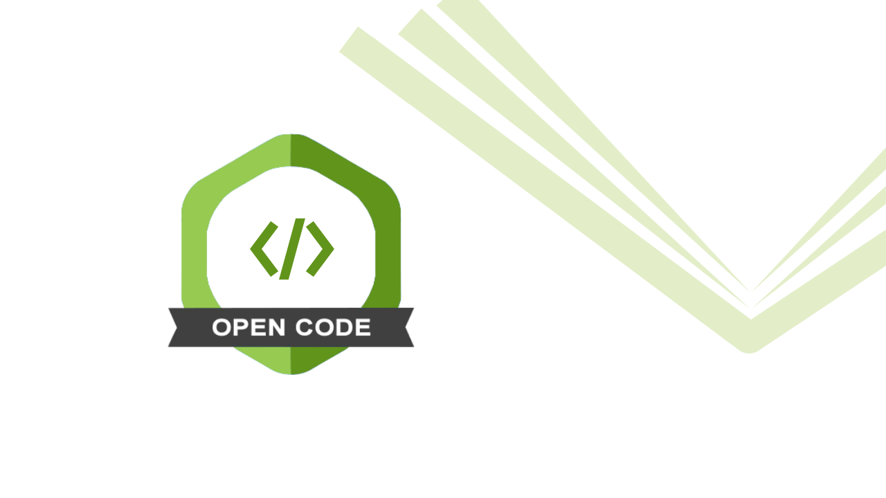

# Publishing Outputs

From sharing **data** and **code** to **publishing articles**

### [Code Publishing](https://lmu-osc.github.io/code-publishing/)

Tie together your skills and publish your work

Self-Paced Tutorial

### [Open Access, Preprints, Postprints](../../training/publishing-outputs/open-access-preprints-postprints.llms.md)

Learn about the different ways to make your publications freely accessible.

Lecture
