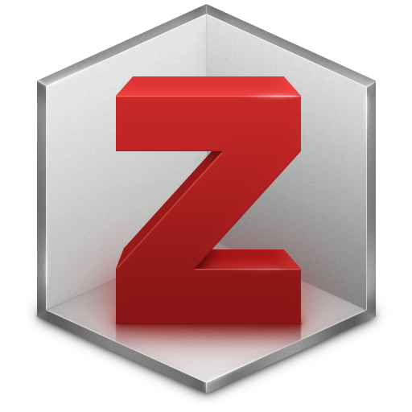
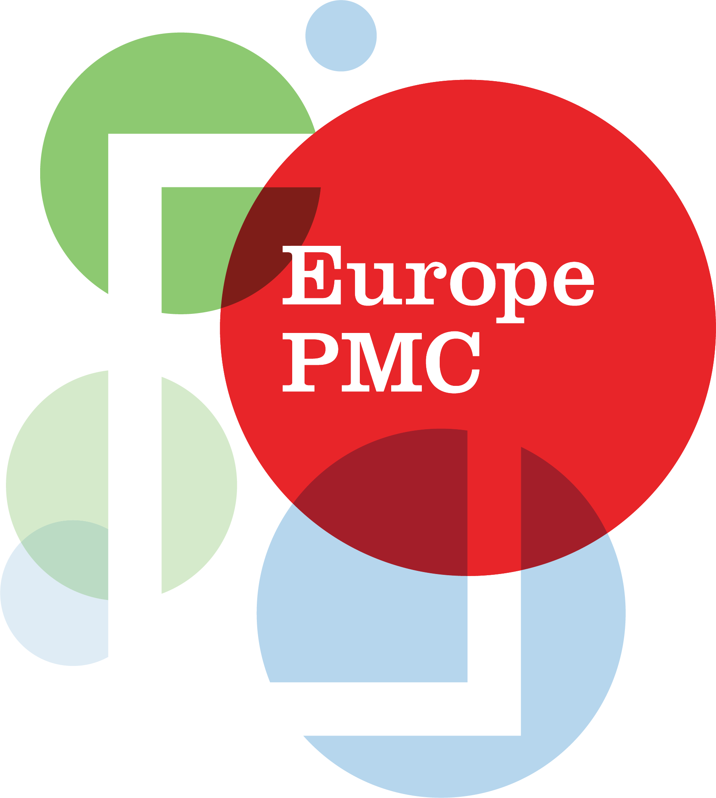
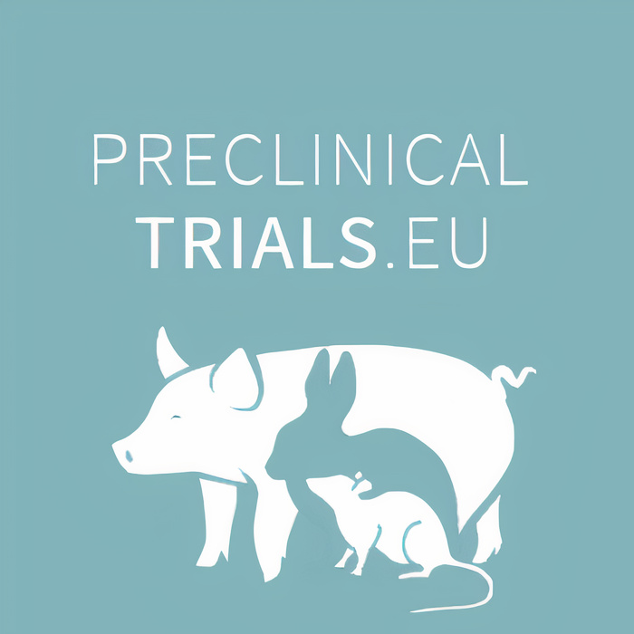
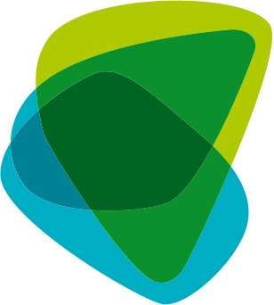
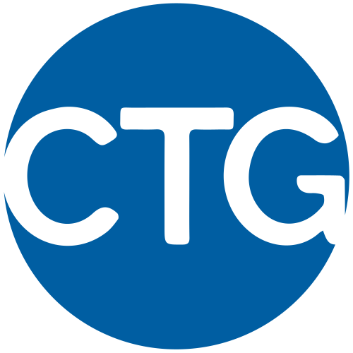

# 1. Plan & Design

![](data:image/svg+xml;base64,PHN2ZyB3aWR0aD0iMTA1Ljk0OTg1bW0iIGhlaWdodD0iMTA2LjM1NjgybW0iIHZpZXdib3g9IjAgMCAxMDUuOTQ5ODUgMTA2LjM1NjgyIiB2ZXJzaW9uPSIxLjEiIGlkPSJzdmcxIiBzcGFjZT0icHJlc2VydmUiIHNvZGlwb2RpOmRvY25hbWU9Im9zLWN5Y2xlLnN2ZyIgaW5rc2NhcGU6dmVyc2lvbj0iMS40LjIgKDE6MS40LjIrMjAyNTA1MTIwNzM3K2ViZjBlOTQwZDApIiB4bWxuczppbmtzY2FwZT0iaHR0cDovL3d3dy5pbmtzY2FwZS5vcmcvbmFtZXNwYWNlcy9pbmtzY2FwZSIgeG1sbnM6c29kaXBvZGk9Imh0dHA6Ly9zb2RpcG9kaS5zb3VyY2Vmb3JnZS5uZXQvRFREL3NvZGlwb2RpLTAuZHRkIiB4bWxucz0iaHR0cDovL3d3dy53My5vcmcvMjAwMC9zdmciIHhtbG5zOnN2Zz0iaHR0cDovL3d3dy53My5vcmcvMjAwMC9zdmciPjxuYW1lZHZpZXcgaWQ9Im5hbWVkdmlldzEiIHBhZ2Vjb2xvcj0iI2ZmZmZmZiIgYm9yZGVyY29sb3I9IiM2NjY2NjYiIGJvcmRlcm9wYWNpdHk9IjEuMCIgaW5rc2NhcGU6c2hvd3BhZ2VzaGFkb3c9IjIiIGlua3NjYXBlOnBhZ2VvcGFjaXR5PSIwLjAiIGlua3NjYXBlOnBhZ2VjaGVja2VyYm9hcmQ9IjAiIGlua3NjYXBlOmRlc2tjb2xvcj0iI2QxZDFkMSIgaW5rc2NhcGU6ZG9jdW1lbnQtdW5pdHM9Im1tIiBpbmtzY2FwZTp6b29tPSIxLjkwMjM4MzEiIGlua3NjYXBlOmN4PSIzNzUuNTgxNTUiIGlua3NjYXBlOmN5PSIyMjIuMDg5ODYiIGlua3NjYXBlOndpbmRvdy13aWR0aD0iMzQ0MCIgaW5rc2NhcGU6d2luZG93LWhlaWdodD0iMTQwMyIgaW5rc2NhcGU6d2luZG93LXg9IjE5MjAiIGlua3NjYXBlOndpbmRvdy15PSIwIiBpbmtzY2FwZTp3aW5kb3ctbWF4aW1pemVkPSIxIiBpbmtzY2FwZTpjdXJyZW50LWxheWVyPSJnMTIiPjwvbmFtZWR2aWV3PjxkZWZzIGlkPSJkZWZzMSI+PHJlY3QgeD0iNDQxLjAyNTc5IiB5PSIxMjYuNjgzMjEiIHdpZHRoPSIxNTguMjIyNiIgaGVpZ2h0PSI5MS45ODk4ODMiIGlkPSJyZWN0MTMiIC8+PGNsaXBwYXRoIGlkPSJwMjUuMyI+PHBhdGggZD0iTSAwLDAgSCAyNTAwIFYgMjUwMCBIIDAgWiIgY2xpcC1ydWxlPSJldmVub2RkIiBpZD0icGF0aDk1IiAvPjwvY2xpcHBhdGg+PHJlY3QgeD0iNDQxLjAyNTc5IiB5PSIxMjYuNjgzMjEiIHdpZHRoPSIyMDguMTU5OTciIGhlaWdodD0iMTA1LjEzMTMiIGlkPSJyZWN0MTMtOSIgLz48cmVjdCB4PSI0NDEuMDI1NzkiIHk9IjEyNi42ODMyMSIgd2lkdGg9IjIwNi41ODI5OSIgaGVpZ2h0PSI5My41NjY4NDkiIGlkPSJyZWN0MTMtMCIgLz48cmVjdCB4PSI0NDEuMDI1NzkiIHk9IjEyNi42ODMyMSIgd2lkdGg9IjE3Mi45NDA5OCIgaGVpZ2h0PSIxMjMuNTI5MjgiIGlkPSJyZWN0MTMtMyIgLz48L2RlZnM+PGcgaW5rc2NhcGU6bGFiZWw9IkxheWVyIDEiIGlua3NjYXBlOmdyb3VwbW9kZT0ibGF5ZXIiIGlkPSJsYXllcjEiIHRyYW5zZm9ybT0idHJhbnNsYXRlKC0zMjkuNzYxMzMsLTY4LjkwODc3MykiPjxnIGlkPSJnMTMiIHRyYW5zZm9ybT0ibWF0cml4KDAuMjY0NTgzMzMsMCwwLDAuMjY0NTgzMzMsLTQ5LjU2NzMxLC01LjMwNjU4ODYpIiBzdHlsZT0iZmlsbDpub25lO3N0cm9rZTpub25lO3N0cm9rZS1saW5lY2FwOnNxdWFyZTtzdHJva2UtbWl0ZXJsaW1pdDoxMCIgaW5rc2NhcGU6bGFiZWw9Im9wZW4tcmVzZWFyY2gtY3ljbGUiPjxnIGlkPSJnMTIiIHRyYW5zZm9ybT0idHJhbnNsYXRlKC0xMS4xMjkxMTEsNC40NTk0MTI5KSIgaW5rc2NhcGU6bGFiZWw9InBoYXNlcyI+PGEgaHJlZj0iLi4vLi4vdHJhaW5pbmcvcmVzZWFyY2gtY3ljbGUtaGFuZGJvb2svMDQtcHJlc2VydmUtYW5kLXNoYXJlLmh0bWwiPjxnIGlkPSJwaGFzZS00IiBpbmtzY2FwZTpsYWJlbD0icGhhc2UtNCIgY2xhc3M9InBoYXNlLWdyb3VwIiByb2xlPSJidXR0b24iIHRhYmluZGV4PSIwIiB0cmFuc2Zvcm09InRyYW5zbGF0ZSgwLC0wLjM0NTkzNSkiIHN0eWxlPSJmaWxsOiMwMGMwNTc7ZmlsbC1vcGFjaXR5OjEiPjxwYXRoIGlkPSJwYXRoNSIgc3R5bGU9ImRpc3BsYXk6aW5saW5lO2ZpbGw6IzAwYzA1NztmaWxsLW9wYWNpdHk6MSIgaW5rc2NhcGU6bGFiZWw9InBoYXNlLTQtcXVhcnRlciIgZD0iTSAxNjM5LjE4NzIgMjc4LjA2NTIyIEMgMTUzMi41NzI4IDI3OC4wNjUyMiAxNDQ2LjE0NjIgMzY0LjQ5MTg2IDE0NDYuMTQ2MiA0NzEuMTA2MjQgTCAxNTkzLjE1MiA0NzEuMTA2MjQgTCAxNjM5LjE4NzIgNDI1LjM4NTUzIEwgMTYzOS4xODcyIDI3OC4wNjUyMiB6ICIgLz48dGV4dCBzcGFjZT0icHJlc2VydmUiIGlkPSJ0ZXh0MTMtMyIgc3R5bGU9ImZvbnQtc3R5bGU6bm9ybWFsO2ZvbnQtdmFyaWFudDpub3JtYWw7Zm9udC13ZWlnaHQ6Ym9sZDtmb250LXN0cmV0Y2g6bm9ybWFsO2ZvbnQtc2l6ZToyOS4zMzMzcHg7bGluZS1oZWlnaHQ6MC45NTtmb250LWZhbWlseTpzYW5zLXNlcmlmOy1pbmtzY2FwZS1mb250LXNwZWNpZmljYXRpb246JiMzOTtTYW5zLCBCb2xkJiMzOTs7Zm9udC12YXJpYW50LWxpZ2F0dXJlczpub3JtYWw7Zm9udC12YXJpYW50LWNhcHM6bm9ybWFsO2ZvbnQtdmFyaWFudC1udW1lcmljOm5vcm1hbDtmb250LXZhcmlhbnQtZWFzdC1hc2lhbjpub3JtYWw7dGV4dC1hbGlnbjpjZW50ZXI7bGV0dGVyLXNwYWNpbmc6MHB4O3dvcmQtc3BhY2luZzowcHg7d2hpdGUtc3BhY2U6cHJlO3NoYXBlLWluc2lkZTp1cmwoI3JlY3QxMy0zKTtkaXNwbGF5OmlubGluZTtmaWxsOiNmZmZmZmY7ZmlsbC1vcGFjaXR5OjE7c3Ryb2tlOm5vbmU7c3Ryb2tlLWxpbmVjYXA6c3F1YXJlO3N0cm9rZS1taXRlcmxpbWl0OjEwIiB0cmFuc2Zvcm09InRyYW5zbGF0ZSgxMDIyLjc2NjcsMjUyLjY2NTQxKSIgaW5rc2NhcGU6bGFiZWw9InBoYXNlLTQtdGV4dCI+PHRzcGFuIHg9IjQ0Ny4yNDAxOCIgeT0iMTQ4Ljk3MzI0IiBpZD0idHNwYW4xIj40LiBQcmVzZXJ2ZSA8L3RzcGFuPjx0c3BhbiB4PSI0NzEuMDczNDkiIHk9IjE3Ni44Mzk4OCIgaWQ9InRzcGFuMiI+JmFtcDsgU2hhcmU8L3RzcGFuPjwvdGV4dD48L2c+PC9hPjxhIGhyZWY9Ii4uLy4uL3RyYWluaW5nL3Jlc2VhcmNoLWN5Y2xlLWhhbmRib29rLzAzLWFuYWx5emUtYW5kLWNvbGxhYm9yYXRlLmh0bWwiPjxnIGlkPSJwaGFzZS0zIiBzdHlsZT0iZmlsbDojZmZjMDAwO2ZpbGwtb3BhY2l0eToxO3N0cm9rZTpub25lO3N0cm9rZS1saW5lY2FwOnNxdWFyZTtzdHJva2UtbWl0ZXJsaW1pdDoxMCIgaW5rc2NhcGU6bGFiZWw9InBoYXNlLTMiIHRyYW5zZm9ybT0idHJhbnNsYXRlKDMuMTMzMjIzMmUtNSwtMC4yNDgxMzUpIiBjbGFzcz0icGhhc2UtZ3JvdXAiIHJvbGU9ImJ1dHRvbiIgdGFiaW5kZXg9IjAiPjxwYXRoIGlkPSJwYXRoMTMiIHN0eWxlPSJkaXNwbGF5OmlubGluZTtmaWxsOiNmZmMwMDA7ZmlsbC1vcGFjaXR5OjEiIGlua3NjYXBlOmxhYmVsPSJwaGFzZS0zLXF1YXJ0ZXIiIGQ9Ik0gMTQ0Ni4xNDYxIDQ4My42NDMyIEMgMTQ0Ni4xNDYxIDU5MC4yNTc1OCAxNTMyLjU3MjcgNjc2LjY4NDIyIDE2MzkuMTg3MSA2NzYuNjg0MjIgTCAxNjM5LjE4NzEgNTI5LjY2MjczIEwgMTU5My40ODAxIDQ4My42NDMyIEwgMTQ0Ni4xNDYxIDQ4My42NDMyIHogIiAvPjx0ZXh0IHNwYWNlPSJwcmVzZXJ2ZSIgaWQ9InRleHQxMy0wIiBzdHlsZT0iZm9udC1zdHlsZTpub3JtYWw7Zm9udC12YXJpYW50Om5vcm1hbDtmb250LXdlaWdodDpib2xkO2ZvbnQtc3RyZXRjaDpub3JtYWw7Zm9udC1zaXplOjI5LjMzMzNweDtsaW5lLWhlaWdodDowLjk1O2ZvbnQtZmFtaWx5OnNhbnMtc2VyaWY7LWlua3NjYXBlLWZvbnQtc3BlY2lmaWNhdGlvbjomIzM5O1NhbnMsIEJvbGQmIzM5Oztmb250LXZhcmlhbnQtbGlnYXR1cmVzOm5vcm1hbDtmb250LXZhcmlhbnQtY2Fwczpub3JtYWw7Zm9udC12YXJpYW50LW51bWVyaWM6bm9ybWFsO2ZvbnQtdmFyaWFudC1lYXN0LWFzaWFuOm5vcm1hbDt0ZXh0LWFsaWduOmNlbnRlcjtsZXR0ZXItc3BhY2luZzowcHg7d29yZC1zcGFjaW5nOjBweDt3aGl0ZS1zcGFjZTpwcmU7c2hhcGUtaW5zaWRlOnVybCgjcmVjdDEzLTApO2Rpc3BsYXk6aW5saW5lO2ZpbGw6I2ZmZmZmZjtmaWxsLW9wYWNpdHk6MSIgdHJhbnNmb3JtPSJ0cmFuc2xhdGUoMTAwNS42Mzc0LDM5My4wMzQ4NykiIGlua3NjYXBlOmxhYmVsPSJwaGFzZS0zLXRleHQiPjx0c3BhbiB4PSI0NTUuNzMwOCIgeT0iMTQ4Ljk3MzI0IiBpZD0idHNwYW4zIj4zLiBBbmFseXplICZhbXA7IDwvdHNwYW4+PHRzcGFuIHg9IjQ1OS40NzA4NCIgeT0iMTc2LjgzOTg4IiBpZD0idHNwYW40Ij5Db2xsYWJvcmF0ZTwvdHNwYW4+PC90ZXh0PjwvZz48L2E+PGEgaHJlZj0iLi4vLi4vdHJhaW5pbmcvcmVzZWFyY2gtY3ljbGUtaGFuZGJvb2svMDItY29sbGVjdC1hbmQtbWFuYWdlLmh0bWwiPjxnIGlkPSJwaGFzZS0yIiBpbmtzY2FwZTpsYWJlbD0icGhhc2UtMiIgY2xhc3M9InBoYXNlLWdyb3VwIiByb2xlPSJidXR0b24iIHRhYmluZGV4PSIwIiB0cmFuc2Zvcm09InRyYW5zbGF0ZSgwLDAuMjQ4MTM1KSIgc3R5bGU9ImZpbGw6I2NjMDA2NjtmaWxsLW9wYWNpdHk6MSI+PHBhdGggaWQ9InBhdGgxMSIgc3R5bGU9ImRpc3BsYXk6aW5saW5lO2ZpbGw6I2NjMDA2NjtmaWxsLW9wYWNpdHk6MSIgaW5rc2NhcGU6bGFiZWw9InBoYXNlLTItcXVhcnRlciIgZD0iTSAxNjk2LjgxNjEgNDgzLjE0NjkzIEwgMTY0OS43MzYgNTI5LjkwNDc0IEwgMTY0OS43MzYgNjc2LjE4Nzk1IEMgMTc1Ni4zNTA0IDY3Ni4xODc5NSAxODQyLjc3OSA1ODkuNzYxMzEgMTg0Mi43NzkgNDgzLjE0NjkzIEwgMTY5Ni44MTYxIDQ4My4xNDY5MyB6ICIgLz48dGV4dCBzcGFjZT0icHJlc2VydmUiIHRyYW5zZm9ybT0idHJhbnNsYXRlKDExOTUuMzkxNSwzOTMuODY2NzgpIiBpZD0idGV4dDEzLTIiIHN0eWxlPSJmb250LXN0eWxlOm5vcm1hbDtmb250LXZhcmlhbnQ6bm9ybWFsO2ZvbnQtd2VpZ2h0OmJvbGQ7Zm9udC1zdHJldGNoOm5vcm1hbDtmb250LXNpemU6MjkuMzMzM3B4O2xpbmUtaGVpZ2h0OjAuOTU7Zm9udC1mYW1pbHk6c2Fucy1zZXJpZjstaW5rc2NhcGUtZm9udC1zcGVjaWZpY2F0aW9uOiYjMzk7U2FucywgQm9sZCYjMzk7O2ZvbnQtdmFyaWFudC1saWdhdHVyZXM6bm9ybWFsO2ZvbnQtdmFyaWFudC1jYXBzOm5vcm1hbDtmb250LXZhcmlhbnQtbnVtZXJpYzpub3JtYWw7Zm9udC12YXJpYW50LWVhc3QtYXNpYW46bm9ybWFsO3RleHQtYWxpZ246Y2VudGVyO2xldHRlci1zcGFjaW5nOjBweDt3b3JkLXNwYWNpbmc6MHB4O3doaXRlLXNwYWNlOnByZTtzaGFwZS1pbnNpZGU6dXJsKCNyZWN0MTMtOSk7ZGlzcGxheTppbmxpbmU7ZmlsbDojZmZmZmZmO2ZpbGwtb3BhY2l0eToxO3N0cm9rZTpub25lO3N0cm9rZS1saW5lY2FwOnNxdWFyZTtzdHJva2UtbWl0ZXJsaW1pdDoxMCIgaW5rc2NhcGU6bGFiZWw9InBoYXNlLTItdGV4dCI+PHRzcGFuIHg9IjQ2My45Njk1NyIgeT0iMTQ4Ljk3MzI0IiBpZD0idHNwYW41Ij4yLiBDb2xsZWN0ICZhbXA7IDwvdHNwYW4+PHRzcGFuIHg9IjQ4NS45Njk1NCIgeT0iMTc2LjgzOTg4IiBpZD0idHNwYW42Ij5NYW5hZ2U8L3RzcGFuPjwvdGV4dD48L2c+PC9hPjxhIGhyZWY9Ii4uLy4uL3RyYWluaW5nL3Jlc2VhcmNoLWN5Y2xlLWhhbmRib29rLzAxLXBsYW4tYW5kLWRlc2lnbi5odG1sIj48ZyBpZD0icGhhc2UtMSIgaW5rc2NhcGU6bGFiZWw9InBoYXNlLTEiIHN0eWxlPSJmaWxsOm5vbmU7c3Ryb2tlOm5vbmU7c3Ryb2tlLWxpbmVjYXA6c3F1YXJlO3N0cm9rZS1taXRlcmxpbWl0OjEwIiB0cmFuc2Zvcm09InRyYW5zbGF0ZSgzLjEzMzIyMzJlLTUsMC4zNDU5MzUpIiBjbGFzcz0icGhhc2UtZ3JvdXAiIHJvbGU9ImJ1dHRvbiIgdGFiaW5kZXg9IjAiPjxwYXRoIGlkPSJwYXRoOSIgc3R5bGU9ImRpc3BsYXk6aW5saW5lO2ZpbGw6IzAwNjZmZjtmaWxsLW9wYWNpdHk6MSIgaW5rc2NhcGU6bGFiZWw9InBoYXNlLTEtcXVhcnRlciIgZD0iTSAxNjUwLjg3NjYgMjc3LjM3MzM1IEwgMTY1MC44NzY2IDQyNC4yOTUyMiBMIDE2OTYuNjgxMyA0NzAuNDE0MzcgTCAxODQzLjkxOTYgNDcwLjQxNDM3IEMgMTg0My45MTk2IDM2My43OTk5OSAxNzU3LjQ5MSAyNzcuMzczMzUgMTY1MC44NzY2IDI3Ny4zNzMzNSB6ICIgLz48dGV4dCBzcGFjZT0icHJlc2VydmUiIHRyYW5zZm9ybT0idHJhbnNsYXRlKDEyMjAuMDUyMywyNDkuOTY2NzIpIiBpZD0idGV4dDEzIiBzdHlsZT0iZm9udC1zdHlsZTpub3JtYWw7Zm9udC12YXJpYW50Om5vcm1hbDtmb250LXdlaWdodDpib2xkO2ZvbnQtc3RyZXRjaDpub3JtYWw7Zm9udC1zaXplOjI5LjMzMzNweDtsaW5lLWhlaWdodDowLjk1O2ZvbnQtZmFtaWx5OnNhbnMtc2VyaWY7LWlua3NjYXBlLWZvbnQtc3BlY2lmaWNhdGlvbjomIzM5O1NhbnMsIEJvbGQmIzM5Oztmb250LXZhcmlhbnQtbGlnYXR1cmVzOm5vcm1hbDtmb250LXZhcmlhbnQtY2Fwczpub3JtYWw7Zm9udC12YXJpYW50LW51bWVyaWM6bm9ybWFsO2ZvbnQtdmFyaWFudC1lYXN0LWFzaWFuOm5vcm1hbDt0ZXh0LWFsaWduOmNlbnRlcjtsZXR0ZXItc3BhY2luZzowcHg7d29yZC1zcGFjaW5nOjBweDt3aGl0ZS1zcGFjZTpwcmU7c2hhcGUtaW5zaWRlOnVybCgjcmVjdDEzKTtkaXNwbGF5OmlubGluZTtmaWxsOm5vbmU7c3Ryb2tlOm5vbmU7c3Ryb2tlLWxpbmVjYXA6c3F1YXJlO3N0cm9rZS1taXRlcmxpbWl0OjEwIiBpbmtzY2FwZTpsYWJlbD0icGhhc2UtMS10ZXh0Ij48dHNwYW4geD0iNDU2Ljc2MjExIiB5PSIxNDguOTczMjQiIGlkPSJ0c3BhbjgiPjx0c3BhbiBzdHlsZT0iZmlsbDojZmZmZmZmIiBpZD0idHNwYW43Ij4xLiBQbGFuICZhbXA7IDwvdHNwYW4+PC90c3Bhbj48dHNwYW4geD0iNDY5LjkzMjgiIHk9IjE3Ni44Mzk4OCIgaWQ9InRzcGFuMTAiPjx0c3BhbiBzdHlsZT0iZmlsbDojZmZmZmZmIiBpZD0idHNwYW45Ij5EZXNpZ248L3RzcGFuPjwvdHNwYW4+PC90ZXh0PjwvZz48L2E+PC9nPjxwYXRoIGQ9Im0gMTYxMS42NjgxLDQ0NC4zNjQxMyAyOC43NzA3LDUuNjg3MTUgLTEyLjk5NTEsMjYuMjkxMSAtNS4xNDYsLTEwLjQzMTM4IGMgLTkuMzMyNiw1Ljg1NzYxIC0xMi45MjM5LDE3Ljk4OTE3IC03Ljk0MjIsMjguMDg3NDUgNS4zMTcsMTAuNzc3OSAxOC40MTA1LDE1LjIyMDUgMjkuMTg2Miw5LjkwNDYzIDEwLjc3NTcsLTUuMzE1ODcgMTUuMjE4MywtMTguNDA5NDQgOS45MDI0LC0yOS4xODUxMSAtMS41MjMxLC0zLjA4NzM5IC0wLjI1NTUsLTYuODIzMTYgMi44MzE4LC04LjM0NjI0IDMuMDg3NCwtMS41MjMwNyA2LjgyMzIsLTAuMjU1NTQgOC4zNDYzLDIuODMxODUgOC4zNTU0LDE2LjkzNzAzIDEuMzczMSwzNy41MjEwOCAtMTUuNTY2MSw0NS44Nzc1OCAtMTYuOTM5Myw4LjM1NjUxIC0zNy41MjIyLDEuMzcwOTQgLTQ1Ljg3NzYsLTE1LjU2NjA5IC04LjAyMTIsLTE2LjI1OTY0IC0xLjg3OTQsLTM1Ljg0ODE2IDEzLjYwMzcsLTQ0Ljc4NDM5IHoiIGlkPSJwYXRoMSIgc3R5bGU9ImZpbGw6IzAwMDAwMDtzdHJva2U6bm9uZTtzdHJva2Utd2lkdGg6Ny41NTkwNjtzdHJva2UtbGluZWNhcDpzcXVhcmU7c3Ryb2tlLW1pdGVybGltaXQ6MTA7c3Ryb2tlLWRhc2hhcnJheTpub25lIiBpbmtzY2FwZTpsYWJlbD0icm90YXRpbmctYXJyb3ciIC8+PC9nPjwvZz48L3N2Zz4=)

Set the foundation for open & reliable research

Explore & Reuse Check Legal Frameworks Write Data Management Plan Design Study

Checkpoints: Study Plan Presentation & Preregistration Submission

### 1.1 Explore & Reuse

Any resource that inspires you or that you want to reuse and/or adapt must minimally be **cited using their persistent identifiers** e.g. DOIs (Digital Object Identifiers) - and otherwise URL with author, date, and time of access - and you must **follow the license and/or usage agreement** provided by the authors. A research output (e.g. data, code) without a license or statement granting your permission for reuse cannot legally be reused even if they appear publicly online.

## 1.1.1. Articles

- **Review existing literature** to come up with a well-founded research question. We recommend to use open source discipline-agnostic registries like [OpenAlex](https://openalex.org/) which contains published articles, thesis, and preprints (scholarly work that are not (yet) peer-reviewed) of all disciplines, or discipline-specific open source registries such as [Europe PubMed Central](https://europepmc.org/) for life sciences preprints and published articles.
- **Use a reference manager** to keep track of your bibliography. [Zotero](https://www.zotero.org/) is an open source software formatting your bibliography in any desired format and that can be integrated within e.g. Microsoft Word, Google Doc, or RStudio for writing reproducible manuscripts (see [3. Analyze & Collaborate](../../training/research-cycle-handbook/03-analyze-and-collaborate.llms.md)).

####  LEARN MORE

OSC Tutorial

#### Introduction to Zotero

Use an open source reference manager. (1h)

####  TOOLS & RESOURCES

#### OpenAlex

All the world's research, connected and open.

#### Europe PubMed Central

Comprehensive access to life sciences literature.

## 1.1.2. Preregistrations

A **preregistration** typically consists of a hypothesis and predictions, a plan for data collection (when relevant), and a plan for data analysis, that researchers upload onto a registry before starting their projects, often in order to increase the rigor of confirmatory research (see [1.4.1. Pre-analysis planning](#sec-study-design-analysis-plan)).

  

- **Get insight into projects that are not (yet) published**, either currently ongoing or abandoned, by looking for projects that were preregistered. Projects that are left unpublished typically have a note attached to their preregistration. Some registries are discipline-specific while others are discipline-agnostic (see below).

####  TOOLS & RESOURCES

#### Open Science Framework

Registry of preregistrations. Widely used across fields.

#### AsPredicted

Registry of simple preregistrations

#### PreclinicalTrials.eu

Registry of preclinical animal study protocols.

#### AnimalStudyRegistry.org

Registry of animal studies.

#### ClinicalTrials.gov

Registry of clinical trial protocols.

## 1.1.3. Data

##### How to find existing datasets?

- **Search for discipline-specific repositories on [re3data](https://www.re3data.org/)** which is a central registry of many repositories
- **Explore subject agnostic repositories** such as [DataCite](https://datacite.org/), [FigShare](https://figshare.com/browse), [Open Science Framework (OSF)](https://osf.io/search), or [Zenodo](https://zenodo.org/).

These platforms either give you access to existing data or provide ***metadata*** and explanations on how to request access to the data.

> **NOTE:**
>
> ***Metadata*** are data about your data, such as author, date, measurement device, unit of measurement, context of data collection, etc.

  

##### How to reuse a dataset?

- **Review the license and data use agreement.** Make sure you understand what you are allowed to do with the data and under what conditions. Even if the license does not request attribution of the authors, scholarly norms require you to cite the source of the data for any of your work based on it.
- **Review metadata and documentation.** Make sure you know where your data comes from, how the data was collected and processed, and reflect on whether any of it poses problems for your research question.
- **Check what additional requirements the data sources have.** Sometimes, data providers request prospective data users to submit a preregistration prior to giving access to the data (see [1.4. Study Design & Analysis Plan](#sec-study-design-analysis-plan)).
- **Use the metadata to plan your analysis.** Review existing data dictionaries (or “codebooks”) and other documentation describing the variables, range of values, etc. If you plan to do a confirmatory analysis, do not look at the data to minimize ***confirmation or hindsight bias***; instead, prepare a pre-analysis plan (see [1.4. Study Design & Analysis Plan](#sec-study-design-analysis-plan)).

> **NOTE:**
>
> ***Confirmation bias***: The tendency to seek, interpret, and remember information that confirms one’s existing beliefs or expectations.
>
>   
>
> ***Hinsight bias*** Seeing past events as predictable after the outcome is known (“I knew it all along”).

####  TOOLS & RESOURCES

#### re3data

Registry of research data repositories.

#### DataCite Commons

Discovery tool connecting works, people, and organizations.

#### Fig Share

General-purpose repository for data, software, reports.

#### Open Science Framework

General-purpose repository for data, materials, reports.

#### Zenodo

General-purpose repository for data, software, reports.

## 1.1.4. Code

**Find code available for reuse** archived on [Zenodo](https://zenodo.org/), [Software Heritage](https://www.softwareheritage.org) or actively developed on [GitHub](https://github.com/) and other code repositories. Start learning Git version control now or learn to take advantage of more collaborative features on the GitHub platform in more details in [3. Analyze & Collaborate](../../training/research-cycle-handbook/03-analyze-and-collaborate.llms.md).

  

> **IMPORTANT:**
>
> Code publicly visible on GitHub without a license or equivalent text explicitly stating permission for reuse cannot be legally reused. It is best to ask the authors to add an **open license** to their repository to explicitly allow reuse (to do this, they can, for instance, add a file called LICENSE.txt with the [Apache 2.0 license text](https://www.apache.org/licenses/LICENSE-2.0.txt) - see our [code publishing tutorial](https://lmu-osc.github.io/code-publishing/choose_license.html) to learn more about licenses).

####  LEARN MORE

OSC Tutorial

#### Git Tutorial

Use version control system Git from within RStudio. (2h)

OSC Tutorial

#### GitHub Tutorial

Collaborative coding with GitHub and RStudio (1h)

OSC Tutorial

#### Code Publishing

Add README and license to a reproducible project (2h)

####  TOOLS & RESOURCES

#### Zenodo

General-purpose repository for data, software, reports.

#### Software Heritage

Collects, preserves, and shares software in source code form.

#### GitHub

Cloud-based platform to collaborate on code.

### 1.2 Legal Requirements

## 1.2.1. LMU guidelines

The [LMU Guidelines for Safeguarding Good Scientific Practice](https://cms-cdn.lmu.de/media/contenthub/amtliche-veroeffentlichungen/gwp-ordnung.pdf) are legally binding for all academics, researchers, research support staff, teachers, and students at LMU Munich. Only the original text in German prevails, but we provide an English summary of relevant aspects for this guide:

  

##### Appropriate level of documentation and standards to allow ***reproduction***:

- **Reproducible methods must be used.** (§11)
- When research software is developed, its source code must be documented. (§12)

##### Appropriate level of documentation and standards to allow ***replication***:

- All information relevant to the production of a research result must be documented comprehensively to enable replication. (§7 and §12)
- If specific professional recommendations exist for review and evaluation, the results must be documented in accordance with these respective specifications. (§12)
- Individual results that do not support the hypothesis must also be documented; **a selection of results is not permitted**. (§12)

##### Public access to research results:

- Apart from specific exceptions, **all findings should be made public**. For this, they must be described in a detailed and comprehensible manner which includes making available the research data, materials and information on which the results are based, as well as the methods used and the software employed (including appropriately licensed self-written software) **according to the *FAIR principles***. (§13)
- Data, material, software made publicly accessible must be appropriately archived, usually for a period of 10 years (§17).

In later sections, you will acquire skills in data management and reproducible workflow that will enable you to comply with these guidelines and the ***FAIR principles***.

  

> **NOTE:**
>
> The ***FAIR principles*** are defined as:
>
> - **F**indable: ***metadata*** should be deposited in a searchable repository and be assigned a permanent identifier  
> - **A**ccessible: the data is either open, or accessible upon some authentication process, or closed, but with open ***metadata***.  
> - **I**nteroperable: the data is described with a standard terminology (so the dataset can be merged with other ones) and saved in a stable file format  
> - **R**eusable: the data is richly documented (e.g. with a data dictionary) and is accompanied by a data usage license See <https://www.go-fair.org/fair-principles/> for more information.
>
> ***Metadata*** are data about your data, such as author, date, measurement device, unit of measurement, context of data collection, etc.
>
>   
>
> ***Reproducibility***: The ability of a researcher to re-derive the same results using the *same data and methods*; also known as computational reproducibility.
>
>   
>
> ***Replicability***: The ability of an independent researcher to achieve results consistent with teh original study by following the same experimental or analytical approach but collecting *new data*.

####  TOOLS & RESOURCES

#### LMU Guidelines for Safeguarding Good Scientific Practice

Implementation of the German Research Foundation's (DFG) Code of Conduct

## 1.2.2. Funders

- **Check all funders’ open science requirements.** Funders may have additional requirements on top of those indicated in the LMU guidelines. For instance, some funding lines request a Research Data Management plan before making their second payment, some specify the extent and timing of data sharing and provide funds for such activity.

- **Contact the [LMU Research Funding Unit](https://www.lmu.de/en/research/research-services/contact.html) to review your grant proposal** and assess if your proposal is meeting your funders’ open science requirements.

## 1.2.3. Ethics

Data collection and analyses involving human participants or animal subjects typically require approval from ethics committees to ensure responsible conduct and the protection of data.

  

#####  Your ethics proposal will typically include information on:

- **Data storage and retention** – outlining how data will be securely stored, backed up, and retained over time. This information can be extracted from a more detailed Research Data Management plan (see [1.3. Research Data Management Plans](#sec-research-data-management)).
- **Risks if the data were leaked** – identifying potential consequences for participants or the research project if confidentiality is breached.
- **Data anonymization** – describing procedures to remove or obscure personally identifiable information to protect participant privacy (see [2.3.2. Anonymization](../../training/research-cycle-handbook/02-collect-and-manage.llms.md#sec-ethics-and-privacy) for options, from simple techniques of anonymization to the creation of synthetic data).
- **Informed consent forms language** – ensuring that participants clearly understand the purpose, procedures, and any potential risks of the study. Conditions for sharing their data should be clearly explained here (see [2.3.1. Informed Consent](../../training/research-cycle-handbook/02-collect-and-manage.llms.md#sec-ethics-and-privacy)).
- **Power analysis** to justify sample size – providing a statistical rationale for the number of participants, which supports the validity and ethical justification of the study. This, and more detailed information on the statistical plan, can be extracted from your pre-analysis plan (see [1.4.1. Pre-analysis planning](#sec-study-design-analysis-plan) and [1.4.3. Power analyses](#sec-study-design-analysis-plan)).

For data protection guidance, contact the [LMU Data Protection Officer](https://www.lmu.de/en/about-lmu/structure/organizational-structure/officers-representatives-and-contact-persons/data-protection-officer.html) or the [Research Data Management team of the University Library](https://www.en.ub.uni-muenchen.de/writing/research_data/research-data-management/index.html).

  

> **TIP:**
>
> - **Share templates and example resources amongst team members.** For example, include previously approved ethics proposals, approved Data Protection Impact Assessment forms, or Data Management Plans on a common server space.
> - **Create Standard Operating Procedures (SOPs) for the team** for processes such as appropriate anonymization technique for a specific data type, power analyses script for common analyses, define when a data management plan must be updated, who is responsible, and how updates are reviewed/approved and communicated.

####  LEARN MORE

OSC Tutorial

#### Data Management Plans

Overview of components, tips, and tools. (30 min)

OSC Tutorial

#### TBA: Data Anonymization

Implement data anonymization techniques in R. (X h)

OSC Tutorial

#### Power Analysis

Data simulations for GLMs, LMEs, and SEMs in R. (6h)

### 1.3 Research Data Management Plans

A **Data Management Plan (DMP)** documents how you will handle research data throughout your project. Writing a DMP prompts you to think and document decisions you might otherwise leave implicit.

- **Decide *before* data collection whether you will eventually share your data publicly (and where)**, in order to (i) get ethics approval on the right plan, (ii) design consent forms for participants, (iii) collect appropriate metadata for the target repository, etc.
- **Start with what you know, and refine the details as your project develops.** Your DMP is a living document that you will refine to match the reality of your project while ensuring data protection and streamline collaborations (see [2.2. Data Management](../../training/research-cycle-handbook/02-collect-and-manage.llms.md#sec-data-management), [3.1. Data Processing & Analysis](../../training/research-cycle-handbook/03-analyze-and-collaborate.llms.md#sec-data-processing-analysis), and [4.1. FAIR Data Sharing](../../training/research-cycle-handbook/04-preserve-and-share.llms.md#sec-fair-data-sharing)).

#####  Your DMP will ask:

- **What data** will you collect or generate (types, formats, volume, sources)? See [2.1. Data Collection](../../training/research-cycle-handbook/02-collect-and-manage.llms.md#sec-data-collection).
- **How will you describe it** (metadata standards, documentation practices)? See [2.2. Data Management](../../training/research-cycle-handbook/02-collect-and-manage.llms.md#sec-data-management) for these and the next questions.
- **How will you organize files** (naming conventions, folder structure, versioning)?
- **Where will you store it** (locations, backups, access controls)?
- **How will you ensure quality** (validation checks, error-handling)?
- **How will you share outputs** (repositories, licenses, embargo periods)? See our lecture “[Why share data openly?](https://lmu-osc.github.io/training/data-management/open-data.html)” and [4.1. FAIR Data Sharing](../../training/research-cycle-handbook/04-preserve-and-share.llms.md#sec-fair-data-sharing)
- **What constraints apply** (consent, anonymization, GDPR, data use agreements)? See our lecture “[Maintaining privacy with open data](https://lmu-osc.github.io/training/data-management/maintaining-privacy-with-open-data.html)”, [1.2.3. Ethics](#sec-legal-requirements) and [2.3. Ethics & Privacy](../../training/research-cycle-handbook/02-collect-and-manage.llms.md#sec-ethics-and-privacy).

  

The specific questions vary by discipline, data type, and funder requirements. DMP tools like [RDMO](https://rdmo.ub.lmu.de/) guide you through the relevant questions with funder-specific templates.

  

> **TIP:**
>
> - **Share templates and example DMP amongst team members** on a common server space.
> - **Create Standard Operating Procedures for the team.** Define when a data management plan must be updated, who is responsible, and how updates are reviewed/approved and communicated.

####  LEARN MORE

OSC Lecture

#### Why share data openly?

An introduction to the what, why, and how to make data open (30 min)

OSC Lecture

#### Maintaining Privacy with Open Data

How to make data open without revealing sensitive information (1h)

OSC Tutorial

#### Data Management Plans

Overview of components, tips, and tools. (30 min)

####  TOOLS & RESOURCES

Supported at LMU

#### RDMO

Funder-compliant DMP templates (e.g. DFG, ERC).

#### RIOjournal

Examples of DMPs by discipline.

### 1.4 Study Design & Analysis Plan

## 1.4.1. Pre-analysis planning

##### Why should you plan your statistical plan prior to collecting data?

Humans are prone to cognitive biases such as **confirmation bias** (seeking information that supports existing beliefs) and **hindsight bias** (believing outcomes were predictable after the fact). In research, these biases can distort findings, especially when researchers make analytic decisions after seeing results. Although statistical testing typically accepts a 5% false positive rate, **“researcher degrees of freedom”** — choices about data collection, exclusions, transformations, sample size, covariates, etc. — can dramatically inflate false positives when decisions are made post hoc. Practices like increasing sample size until reaching statistical significance, selectively removing outliers, or trying multiple analytic strategies **increase the likelihood of false-positive results**. See how easy it is to find false “significant” results by using our [p-hacking tool](https://shinyapps.org/apps/p-hacker/).

  

The core problem is that analyses guided by observed outcomes allow biases to influence decisions, making many reported effects unreliable. A key **remedy is transparency and preregistration.**

  

##### Benefits of preregistration

Preregistration, that is, specifying hypotheses, methods, and analysis plans before data collection or analysis, limits bias in confirmatory testing while still allowing exploratory analyses, clearly **distinguishing robust hypothesis tests from hypothesis-generating work**. This improves credibility, limits false positives, and often leads to better study design through **early methodological feedback**.

  

Preregistration can be beneficial for various type of studies, including:

- experimental studies (i.e. studies with a manipulated variable): it will define what will be your confirmatory analysis and strengthens your claim
- observational or exploratory studies: it will help you move along the exploratory-confirmatory continuum
- qualitative studies: it will provide a way to document e.g. your positionality towards a subject in the course of a project.

  

#####  What is included in a preregistration?

Several [preregistration templates](https://help.osf.io/article/330-welcome-to-registrations) exist. While the [standard Open Science Framework (OSF) preregistration template](https://docs.google.com/document/d/1gkN0Jp6Gu7GIA4Ne4YCDZ61nCLQRgt32moRdUg9AnVg/edit?tab=t.0#heading=h.fwbi14d4b65g) is most commonly used, some are tailored for specific field or specific methods (e.g. systematic review, qualitative work, secondary data analysis).

  

Your preregistration will define your study’s:  

- **Hypothesis and predictions**
- **Data collection procedures**
- **Sample size and stopping rule**
- **Variables** (manipulated, measured, indices)
- **Statistical method** (model, dependent and independent variables, covariables, transformations)
- **Data exclusion criteria**
- **How to deal with missing data**  

A great tool to create your statistical plan, especially for early career researchers still learning statistics and needing feedback from supervisors, collaborators, or statisticians on their design, is to **simulate data, and write the possible statistical tests to analyze that data** (see [1.4.2. Simulation of data](#sec-study-design-analysis-plan) and [1.4.3. Power analyses](#sec-study-design-analysis-plan)). Including an analyses script (developed on simulated data) with your preregistration is optional but recommended.

  

To get support with planning your analytical approach, you can book a consultation with the [LMU statistical consulting unit (StaBLab)](https://www.stat.lmu.de/stablab/de/).

  

##### Publishing process

Once your study plan is finalized:

  

- **Submit your preregistration before collecting new or analyzing existing data.** You can do so on discipline specific registries (see [1.1.2. Preregistrations](#sec-explore-and-reuse)) or discipline agnostic repositories such as the [OSF](https://osf.io/).
- **Embargo your plan if you are concerned about scooping.** On the OSF, your preregistration can be kept private for a predetermined amount of time, and for a maximum of 4 years.
- **Include your preregistration’s DOI in your manuscript.** Make your registration public upon the publication of your manuscript.

Creating a preregistration improves transparency and allows for valuable **early feedback from collaborators**. An even stronger approach is **submitting preregistrations directly to journals** (then called **“Registered Reports”**), enabling peer review at a stage where methodological adjustments are still possible.

  

##### Registered Reports

Registered Reports are a publication format, now adopted by over 300 journals (see [participating journals](https://www.cos.io/initiatives/registered-reports)), where **preregistrations are peer-reviewed before data collection**. Reviewers evaluate the hypotheses, methods, and planned analyses, allowing methodological improvements. If the plan is approved, the journal grants in-principle acceptance, meaning publication is guaranteed provided researchers follow the protocol.

  

After completing the study, authors add results and discussion sections, clearly separating preregistered confirmatory analyses from exploratory ones. Final review focuses on adherence to the approved plan and the validity of conclusions, not on whether results are significant. This model **shifts incentives toward asking important questions and using rigorous methods rather than chasing striking or ‘novel’ outcomes**.

####  LEARN MORE

OSC Tutorial

#### TBA: Preregistration tutorial

Step-by-step guide to creating preregistration. (Xh)

####  TOOLS & RESOURCES

OSC Tool

#### P-hacking tool

Interactive app to realize how easy it is to find false "significant" results.

#### Center for Open Science

List of journals offering Registered Reports.

#### Open Science Framework

Preregistration templates, embargoes, file storage.

## 1.4.2. Simulation of Data

In our context, a computer simulation is the generation of artificial data to build up an understanding of real data and the statistical models we use to analyze them. You can simulate data to:

  

- **Test your statistical intuition or demonstrate mathematical properties you cannot easily anticipate**.  
  *Example: Check whether there are more than 5% significant effects (assuming \\\alpha = .05\\) when random data from \\H_0\\ are generated.*

- **Understand sampling theory and probability distributions or test whether you understand the underlying processes of your system.**  
  *Example: See whether simulated data drawn from specific distributions is comparable to real data.*

- **Perform power analyses.**  
  *Example: Assess whether the sample size (within a simulation repetition) is high enough to detect a simulated effect in more than 80% of the cases. (see [1.4.3. Power analyses](#sec-explore-and-reuse))*

- **Prepare a pre-analysis plan.**  
  *Example: To strengthen your planned confirmatory analyses before collecting data, consider sharing a simulated dataset with a statistician or mentor. This allows for specific feedback on suitable statistical tests. The resulting analysis code can accompany your preregistration or registered report (see [1.4.1. Pre-analysis planning](#sec-explore-and-reuse)) so reviewers can clearly see your intended approach. When real data are collected, they can be directly substituted into the code to generate results.*

  

Generating an artificial dataset in R (see our [simulation tutorial](https://lmu-osc.github.io/Introduction-Simulations-in-R/)) is much easier than you might think and is often very helpful, even when you need to make assumptions about variable distribution or when the parameter space is not well known.

####  LEARN MORE

OSC Tutorial

#### R Tutorial

Learn R programming. (3h)

OSC Tutorial

#### Data simulation in R

Easy data simulations in R. (2h)

## 1.4.3. Power analyses

Power analysis is relevant whether you are designing a project from scratch or running an analysis on already existing data. There are two main types of power analyses:

  

##### A priori power analysis

**Simulate data to calculate the smallest sample size required to detect the smallest effect of interest.** See our [advanced power analyses tutorial using R](https://lmu-osc.github.io/Simulations-for-Advanced-Power-Analyses/).

  

For a very basic power calculation, you can use simple R functions if you know 3 out of 4 of these parameters:

- required sample size *n* (usually the one missing)
- desired power *1 - β* (default 0.80)
- the alpha level *α* (default 0.05)
- the expected effect size (has to be estimated or extracted from the literature on the form of *d*, *f*, etc.)

To get support with pre-analysis planning, you can book a consultation with the [LMU statistical consulting unit (StaBLab)](https://www.stat.lmu.de/stablab/de/).

  

##### Post-hoc power analysis

**Compute a post-hoc power when you are not be able to control the sample size for your project.** Beware: This power computation comes in two flavors - one is legitimate, and one is flawed and not defensible.

  

The **legitimate post-hoc power** is computed with your actual *n*, and the same effect size that you plugged into your a-priori power analysis. This analysis gives you the achieved power to detect your assumed effect.

  

The **flawed version of post-hoc power** is called **“observed power”**: If an analysis yields a non-significant result, some researchers calculate the post-hoc power, but plug in the observed effect size. “Observed power”, however, is just a one‑to‑one function of the *p*‑value (a non-significant *p*-value returns a low power \< 50 %, a just significant *p*‑value of .05 always yields a power of exactly 50%). Observed power adds no new information to the *p*‑value and is essentially meaningless. Do not compute this type of post-hoc power!

####  LEARN MORE

OSC Tutorial

#### R Tutorial

Learn R programming. (3h)

OSC Tutorial

#### Power Analyses

Data simulations for GLMs, LMEs, and SEMs in R. (6h)

##  Plan & Design Checklist

To complete before presenting your final study plan to your research group and, if applicable, submitting your ethics proposal and/or preregistration. Not all items are relevant for all fields of research or study types.

**Background Information**

Literature reviewed

Existing research outputs searched

Funder’s Open Science requirements identified

Ethics committee instructions consulted

**Study Design**

Research questions clearly defined

Hypotheses and predictions specified

Study design chosen and justified

Variables and measures to collect identified

Analysis plan prepared (with simulated data)

Sample size determined (with power analysis)

Inclusion/exclusion criteria defined

Handling of missing data defined

**Data Management Planning**

Data storage and backup solutions documented

File organization and naming conventions established

Anonymization procedures defined

Repository for data publishing selected

**Project Management**

Team roles and responsibilities defined

Resources needed for the project identified

Timeline estimated and milestones defined

**Before Data Collection**

Data Management Plan completed

Consent forms prepared

Preregistration submitted

Ethical approval obtained

[Download checklist ](assets/checklists/01-Plan-Design-Checklist.docx)
