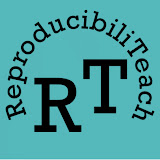
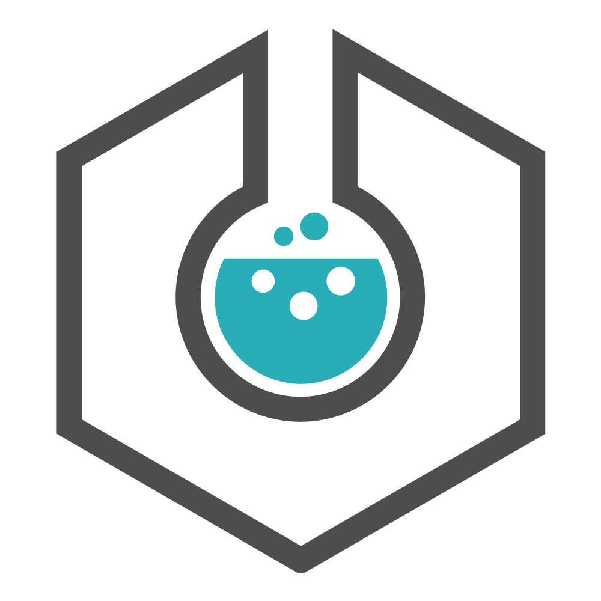
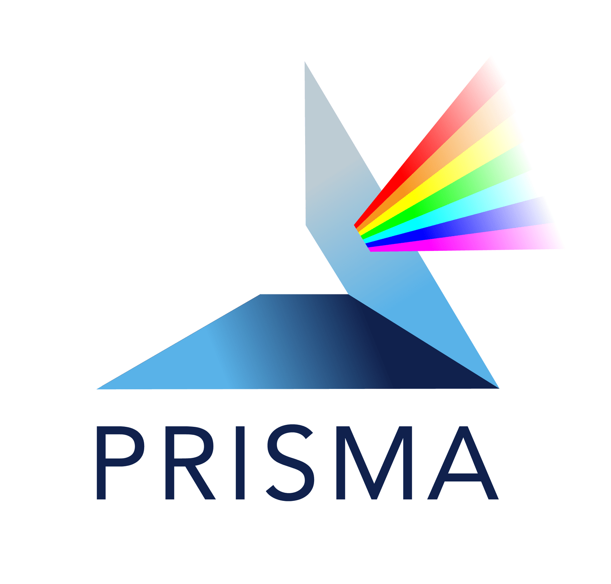

# 2. Collect & Manage

![](data:image/svg+xml;base64,PHN2ZyB3aWR0aD0iMTA1Ljk0OTg1bW0iIGhlaWdodD0iMTA2LjM1NjgybW0iIHZpZXdib3g9IjAgMCAxMDUuOTQ5ODUgMTA2LjM1NjgyIiB2ZXJzaW9uPSIxLjEiIGlkPSJzdmcxIiBzcGFjZT0icHJlc2VydmUiIHNvZGlwb2RpOmRvY25hbWU9Im9zLWN5Y2xlLnN2ZyIgaW5rc2NhcGU6dmVyc2lvbj0iMS40LjIgKDE6MS40LjIrMjAyNTA1MTIwNzM3K2ViZjBlOTQwZDApIiB4bWxuczppbmtzY2FwZT0iaHR0cDovL3d3dy5pbmtzY2FwZS5vcmcvbmFtZXNwYWNlcy9pbmtzY2FwZSIgeG1sbnM6c29kaXBvZGk9Imh0dHA6Ly9zb2RpcG9kaS5zb3VyY2Vmb3JnZS5uZXQvRFREL3NvZGlwb2RpLTAuZHRkIiB4bWxucz0iaHR0cDovL3d3dy53My5vcmcvMjAwMC9zdmciIHhtbG5zOnN2Zz0iaHR0cDovL3d3dy53My5vcmcvMjAwMC9zdmciPjxuYW1lZHZpZXcgaWQ9Im5hbWVkdmlldzEiIHBhZ2Vjb2xvcj0iI2ZmZmZmZiIgYm9yZGVyY29sb3I9IiM2NjY2NjYiIGJvcmRlcm9wYWNpdHk9IjEuMCIgaW5rc2NhcGU6c2hvd3BhZ2VzaGFkb3c9IjIiIGlua3NjYXBlOnBhZ2VvcGFjaXR5PSIwLjAiIGlua3NjYXBlOnBhZ2VjaGVja2VyYm9hcmQ9IjAiIGlua3NjYXBlOmRlc2tjb2xvcj0iI2QxZDFkMSIgaW5rc2NhcGU6ZG9jdW1lbnQtdW5pdHM9Im1tIiBpbmtzY2FwZTp6b29tPSIxLjkwMjM4MzEiIGlua3NjYXBlOmN4PSIzNzUuNTgxNTUiIGlua3NjYXBlOmN5PSIyMjIuMDg5ODYiIGlua3NjYXBlOndpbmRvdy13aWR0aD0iMzQ0MCIgaW5rc2NhcGU6d2luZG93LWhlaWdodD0iMTQwMyIgaW5rc2NhcGU6d2luZG93LXg9IjE5MjAiIGlua3NjYXBlOndpbmRvdy15PSIwIiBpbmtzY2FwZTp3aW5kb3ctbWF4aW1pemVkPSIxIiBpbmtzY2FwZTpjdXJyZW50LWxheWVyPSJnMTIiPjwvbmFtZWR2aWV3PjxkZWZzIGlkPSJkZWZzMSI+PHJlY3QgeD0iNDQxLjAyNTc5IiB5PSIxMjYuNjgzMjEiIHdpZHRoPSIxNTguMjIyNiIgaGVpZ2h0PSI5MS45ODk4ODMiIGlkPSJyZWN0MTMiIC8+PGNsaXBwYXRoIGlkPSJwMjUuMyI+PHBhdGggZD0iTSAwLDAgSCAyNTAwIFYgMjUwMCBIIDAgWiIgY2xpcC1ydWxlPSJldmVub2RkIiBpZD0icGF0aDk1IiAvPjwvY2xpcHBhdGg+PHJlY3QgeD0iNDQxLjAyNTc5IiB5PSIxMjYuNjgzMjEiIHdpZHRoPSIyMDguMTU5OTciIGhlaWdodD0iMTA1LjEzMTMiIGlkPSJyZWN0MTMtOSIgLz48cmVjdCB4PSI0NDEuMDI1NzkiIHk9IjEyNi42ODMyMSIgd2lkdGg9IjIwNi41ODI5OSIgaGVpZ2h0PSI5My41NjY4NDkiIGlkPSJyZWN0MTMtMCIgLz48cmVjdCB4PSI0NDEuMDI1NzkiIHk9IjEyNi42ODMyMSIgd2lkdGg9IjE3Mi45NDA5OCIgaGVpZ2h0PSIxMjMuNTI5MjgiIGlkPSJyZWN0MTMtMyIgLz48L2RlZnM+PGcgaW5rc2NhcGU6bGFiZWw9IkxheWVyIDEiIGlua3NjYXBlOmdyb3VwbW9kZT0ibGF5ZXIiIGlkPSJsYXllcjEiIHRyYW5zZm9ybT0idHJhbnNsYXRlKC0zMjkuNzYxMzMsLTY4LjkwODc3MykiPjxnIGlkPSJnMTMiIHRyYW5zZm9ybT0ibWF0cml4KDAuMjY0NTgzMzMsMCwwLDAuMjY0NTgzMzMsLTQ5LjU2NzMxLC01LjMwNjU4ODYpIiBzdHlsZT0iZmlsbDpub25lO3N0cm9rZTpub25lO3N0cm9rZS1saW5lY2FwOnNxdWFyZTtzdHJva2UtbWl0ZXJsaW1pdDoxMCIgaW5rc2NhcGU6bGFiZWw9Im9wZW4tcmVzZWFyY2gtY3ljbGUiPjxnIGlkPSJnMTIiIHRyYW5zZm9ybT0idHJhbnNsYXRlKC0xMS4xMjkxMTEsNC40NTk0MTI5KSIgaW5rc2NhcGU6bGFiZWw9InBoYXNlcyI+PGEgaHJlZj0iLi4vLi4vdHJhaW5pbmcvcmVzZWFyY2gtY3ljbGUtaGFuZGJvb2svMDQtcHJlc2VydmUtYW5kLXNoYXJlLmh0bWwiPjxnIGlkPSJwaGFzZS00IiBpbmtzY2FwZTpsYWJlbD0icGhhc2UtNCIgY2xhc3M9InBoYXNlLWdyb3VwIiByb2xlPSJidXR0b24iIHRhYmluZGV4PSIwIiB0cmFuc2Zvcm09InRyYW5zbGF0ZSgwLC0wLjM0NTkzNSkiIHN0eWxlPSJmaWxsOiMwMGMwNTc7ZmlsbC1vcGFjaXR5OjEiPjxwYXRoIGlkPSJwYXRoNSIgc3R5bGU9ImRpc3BsYXk6aW5saW5lO2ZpbGw6IzAwYzA1NztmaWxsLW9wYWNpdHk6MSIgaW5rc2NhcGU6bGFiZWw9InBoYXNlLTQtcXVhcnRlciIgZD0iTSAxNjM5LjE4NzIgMjc4LjA2NTIyIEMgMTUzMi41NzI4IDI3OC4wNjUyMiAxNDQ2LjE0NjIgMzY0LjQ5MTg2IDE0NDYuMTQ2MiA0NzEuMTA2MjQgTCAxNTkzLjE1MiA0NzEuMTA2MjQgTCAxNjM5LjE4NzIgNDI1LjM4NTUzIEwgMTYzOS4xODcyIDI3OC4wNjUyMiB6ICIgLz48dGV4dCBzcGFjZT0icHJlc2VydmUiIGlkPSJ0ZXh0MTMtMyIgc3R5bGU9ImZvbnQtc3R5bGU6bm9ybWFsO2ZvbnQtdmFyaWFudDpub3JtYWw7Zm9udC13ZWlnaHQ6Ym9sZDtmb250LXN0cmV0Y2g6bm9ybWFsO2ZvbnQtc2l6ZToyOS4zMzMzcHg7bGluZS1oZWlnaHQ6MC45NTtmb250LWZhbWlseTpzYW5zLXNlcmlmOy1pbmtzY2FwZS1mb250LXNwZWNpZmljYXRpb246JiMzOTtTYW5zLCBCb2xkJiMzOTs7Zm9udC12YXJpYW50LWxpZ2F0dXJlczpub3JtYWw7Zm9udC12YXJpYW50LWNhcHM6bm9ybWFsO2ZvbnQtdmFyaWFudC1udW1lcmljOm5vcm1hbDtmb250LXZhcmlhbnQtZWFzdC1hc2lhbjpub3JtYWw7dGV4dC1hbGlnbjpjZW50ZXI7bGV0dGVyLXNwYWNpbmc6MHB4O3dvcmQtc3BhY2luZzowcHg7d2hpdGUtc3BhY2U6cHJlO3NoYXBlLWluc2lkZTp1cmwoI3JlY3QxMy0zKTtkaXNwbGF5OmlubGluZTtmaWxsOiNmZmZmZmY7ZmlsbC1vcGFjaXR5OjE7c3Ryb2tlOm5vbmU7c3Ryb2tlLWxpbmVjYXA6c3F1YXJlO3N0cm9rZS1taXRlcmxpbWl0OjEwIiB0cmFuc2Zvcm09InRyYW5zbGF0ZSgxMDIyLjc2NjcsMjUyLjY2NTQxKSIgaW5rc2NhcGU6bGFiZWw9InBoYXNlLTQtdGV4dCI+PHRzcGFuIHg9IjQ0Ny4yNDAxOCIgeT0iMTQ4Ljk3MzI0IiBpZD0idHNwYW4xIj40LiBQcmVzZXJ2ZSA8L3RzcGFuPjx0c3BhbiB4PSI0NzEuMDczNDkiIHk9IjE3Ni44Mzk4OCIgaWQ9InRzcGFuMiI+JmFtcDsgU2hhcmU8L3RzcGFuPjwvdGV4dD48L2c+PC9hPjxhIGhyZWY9Ii4uLy4uL3RyYWluaW5nL3Jlc2VhcmNoLWN5Y2xlLWhhbmRib29rLzAzLWFuYWx5emUtYW5kLWNvbGxhYm9yYXRlLmh0bWwiPjxnIGlkPSJwaGFzZS0zIiBzdHlsZT0iZmlsbDojZmZjMDAwO2ZpbGwtb3BhY2l0eToxO3N0cm9rZTpub25lO3N0cm9rZS1saW5lY2FwOnNxdWFyZTtzdHJva2UtbWl0ZXJsaW1pdDoxMCIgaW5rc2NhcGU6bGFiZWw9InBoYXNlLTMiIHRyYW5zZm9ybT0idHJhbnNsYXRlKDMuMTMzMjIzMmUtNSwtMC4yNDgxMzUpIiBjbGFzcz0icGhhc2UtZ3JvdXAiIHJvbGU9ImJ1dHRvbiIgdGFiaW5kZXg9IjAiPjxwYXRoIGlkPSJwYXRoMTMiIHN0eWxlPSJkaXNwbGF5OmlubGluZTtmaWxsOiNmZmMwMDA7ZmlsbC1vcGFjaXR5OjEiIGlua3NjYXBlOmxhYmVsPSJwaGFzZS0zLXF1YXJ0ZXIiIGQ9Ik0gMTQ0Ni4xNDYxIDQ4My42NDMyIEMgMTQ0Ni4xNDYxIDU5MC4yNTc1OCAxNTMyLjU3MjcgNjc2LjY4NDIyIDE2MzkuMTg3MSA2NzYuNjg0MjIgTCAxNjM5LjE4NzEgNTI5LjY2MjczIEwgMTU5My40ODAxIDQ4My42NDMyIEwgMTQ0Ni4xNDYxIDQ4My42NDMyIHogIiAvPjx0ZXh0IHNwYWNlPSJwcmVzZXJ2ZSIgaWQ9InRleHQxMy0wIiBzdHlsZT0iZm9udC1zdHlsZTpub3JtYWw7Zm9udC12YXJpYW50Om5vcm1hbDtmb250LXdlaWdodDpib2xkO2ZvbnQtc3RyZXRjaDpub3JtYWw7Zm9udC1zaXplOjI5LjMzMzNweDtsaW5lLWhlaWdodDowLjk1O2ZvbnQtZmFtaWx5OnNhbnMtc2VyaWY7LWlua3NjYXBlLWZvbnQtc3BlY2lmaWNhdGlvbjomIzM5O1NhbnMsIEJvbGQmIzM5Oztmb250LXZhcmlhbnQtbGlnYXR1cmVzOm5vcm1hbDtmb250LXZhcmlhbnQtY2Fwczpub3JtYWw7Zm9udC12YXJpYW50LW51bWVyaWM6bm9ybWFsO2ZvbnQtdmFyaWFudC1lYXN0LWFzaWFuOm5vcm1hbDt0ZXh0LWFsaWduOmNlbnRlcjtsZXR0ZXItc3BhY2luZzowcHg7d29yZC1zcGFjaW5nOjBweDt3aGl0ZS1zcGFjZTpwcmU7c2hhcGUtaW5zaWRlOnVybCgjcmVjdDEzLTApO2Rpc3BsYXk6aW5saW5lO2ZpbGw6I2ZmZmZmZjtmaWxsLW9wYWNpdHk6MSIgdHJhbnNmb3JtPSJ0cmFuc2xhdGUoMTAwNS42Mzc0LDM5My4wMzQ4NykiIGlua3NjYXBlOmxhYmVsPSJwaGFzZS0zLXRleHQiPjx0c3BhbiB4PSI0NTUuNzMwOCIgeT0iMTQ4Ljk3MzI0IiBpZD0idHNwYW4zIj4zLiBBbmFseXplICZhbXA7IDwvdHNwYW4+PHRzcGFuIHg9IjQ1OS40NzA4NCIgeT0iMTc2LjgzOTg4IiBpZD0idHNwYW40Ij5Db2xsYWJvcmF0ZTwvdHNwYW4+PC90ZXh0PjwvZz48L2E+PGEgaHJlZj0iLi4vLi4vdHJhaW5pbmcvcmVzZWFyY2gtY3ljbGUtaGFuZGJvb2svMDItY29sbGVjdC1hbmQtbWFuYWdlLmh0bWwiPjxnIGlkPSJwaGFzZS0yIiBpbmtzY2FwZTpsYWJlbD0icGhhc2UtMiIgY2xhc3M9InBoYXNlLWdyb3VwIiByb2xlPSJidXR0b24iIHRhYmluZGV4PSIwIiB0cmFuc2Zvcm09InRyYW5zbGF0ZSgwLDAuMjQ4MTM1KSIgc3R5bGU9ImZpbGw6I2NjMDA2NjtmaWxsLW9wYWNpdHk6MSI+PHBhdGggaWQ9InBhdGgxMSIgc3R5bGU9ImRpc3BsYXk6aW5saW5lO2ZpbGw6I2NjMDA2NjtmaWxsLW9wYWNpdHk6MSIgaW5rc2NhcGU6bGFiZWw9InBoYXNlLTItcXVhcnRlciIgZD0iTSAxNjk2LjgxNjEgNDgzLjE0NjkzIEwgMTY0OS43MzYgNTI5LjkwNDc0IEwgMTY0OS43MzYgNjc2LjE4Nzk1IEMgMTc1Ni4zNTA0IDY3Ni4xODc5NSAxODQyLjc3OSA1ODkuNzYxMzEgMTg0Mi43NzkgNDgzLjE0NjkzIEwgMTY5Ni44MTYxIDQ4My4xNDY5MyB6ICIgLz48dGV4dCBzcGFjZT0icHJlc2VydmUiIHRyYW5zZm9ybT0idHJhbnNsYXRlKDExOTUuMzkxNSwzOTMuODY2NzgpIiBpZD0idGV4dDEzLTIiIHN0eWxlPSJmb250LXN0eWxlOm5vcm1hbDtmb250LXZhcmlhbnQ6bm9ybWFsO2ZvbnQtd2VpZ2h0OmJvbGQ7Zm9udC1zdHJldGNoOm5vcm1hbDtmb250LXNpemU6MjkuMzMzM3B4O2xpbmUtaGVpZ2h0OjAuOTU7Zm9udC1mYW1pbHk6c2Fucy1zZXJpZjstaW5rc2NhcGUtZm9udC1zcGVjaWZpY2F0aW9uOiYjMzk7U2FucywgQm9sZCYjMzk7O2ZvbnQtdmFyaWFudC1saWdhdHVyZXM6bm9ybWFsO2ZvbnQtdmFyaWFudC1jYXBzOm5vcm1hbDtmb250LXZhcmlhbnQtbnVtZXJpYzpub3JtYWw7Zm9udC12YXJpYW50LWVhc3QtYXNpYW46bm9ybWFsO3RleHQtYWxpZ246Y2VudGVyO2xldHRlci1zcGFjaW5nOjBweDt3b3JkLXNwYWNpbmc6MHB4O3doaXRlLXNwYWNlOnByZTtzaGFwZS1pbnNpZGU6dXJsKCNyZWN0MTMtOSk7ZGlzcGxheTppbmxpbmU7ZmlsbDojZmZmZmZmO2ZpbGwtb3BhY2l0eToxO3N0cm9rZTpub25lO3N0cm9rZS1saW5lY2FwOnNxdWFyZTtzdHJva2UtbWl0ZXJsaW1pdDoxMCIgaW5rc2NhcGU6bGFiZWw9InBoYXNlLTItdGV4dCI+PHRzcGFuIHg9IjQ2My45Njk1NyIgeT0iMTQ4Ljk3MzI0IiBpZD0idHNwYW41Ij4yLiBDb2xsZWN0ICZhbXA7IDwvdHNwYW4+PHRzcGFuIHg9IjQ4NS45Njk1NCIgeT0iMTc2LjgzOTg4IiBpZD0idHNwYW42Ij5NYW5hZ2U8L3RzcGFuPjwvdGV4dD48L2c+PC9hPjxhIGhyZWY9Ii4uLy4uL3RyYWluaW5nL3Jlc2VhcmNoLWN5Y2xlLWhhbmRib29rLzAxLXBsYW4tYW5kLWRlc2lnbi5odG1sIj48ZyBpZD0icGhhc2UtMSIgaW5rc2NhcGU6bGFiZWw9InBoYXNlLTEiIHN0eWxlPSJmaWxsOm5vbmU7c3Ryb2tlOm5vbmU7c3Ryb2tlLWxpbmVjYXA6c3F1YXJlO3N0cm9rZS1taXRlcmxpbWl0OjEwIiB0cmFuc2Zvcm09InRyYW5zbGF0ZSgzLjEzMzIyMzJlLTUsMC4zNDU5MzUpIiBjbGFzcz0icGhhc2UtZ3JvdXAiIHJvbGU9ImJ1dHRvbiIgdGFiaW5kZXg9IjAiPjxwYXRoIGlkPSJwYXRoOSIgc3R5bGU9ImRpc3BsYXk6aW5saW5lO2ZpbGw6IzAwNjZmZjtmaWxsLW9wYWNpdHk6MSIgaW5rc2NhcGU6bGFiZWw9InBoYXNlLTEtcXVhcnRlciIgZD0iTSAxNjUwLjg3NjYgMjc3LjM3MzM1IEwgMTY1MC44NzY2IDQyNC4yOTUyMiBMIDE2OTYuNjgxMyA0NzAuNDE0MzcgTCAxODQzLjkxOTYgNDcwLjQxNDM3IEMgMTg0My45MTk2IDM2My43OTk5OSAxNzU3LjQ5MSAyNzcuMzczMzUgMTY1MC44NzY2IDI3Ny4zNzMzNSB6ICIgLz48dGV4dCBzcGFjZT0icHJlc2VydmUiIHRyYW5zZm9ybT0idHJhbnNsYXRlKDEyMjAuMDUyMywyNDkuOTY2NzIpIiBpZD0idGV4dDEzIiBzdHlsZT0iZm9udC1zdHlsZTpub3JtYWw7Zm9udC12YXJpYW50Om5vcm1hbDtmb250LXdlaWdodDpib2xkO2ZvbnQtc3RyZXRjaDpub3JtYWw7Zm9udC1zaXplOjI5LjMzMzNweDtsaW5lLWhlaWdodDowLjk1O2ZvbnQtZmFtaWx5OnNhbnMtc2VyaWY7LWlua3NjYXBlLWZvbnQtc3BlY2lmaWNhdGlvbjomIzM5O1NhbnMsIEJvbGQmIzM5Oztmb250LXZhcmlhbnQtbGlnYXR1cmVzOm5vcm1hbDtmb250LXZhcmlhbnQtY2Fwczpub3JtYWw7Zm9udC12YXJpYW50LW51bWVyaWM6bm9ybWFsO2ZvbnQtdmFyaWFudC1lYXN0LWFzaWFuOm5vcm1hbDt0ZXh0LWFsaWduOmNlbnRlcjtsZXR0ZXItc3BhY2luZzowcHg7d29yZC1zcGFjaW5nOjBweDt3aGl0ZS1zcGFjZTpwcmU7c2hhcGUtaW5zaWRlOnVybCgjcmVjdDEzKTtkaXNwbGF5OmlubGluZTtmaWxsOm5vbmU7c3Ryb2tlOm5vbmU7c3Ryb2tlLWxpbmVjYXA6c3F1YXJlO3N0cm9rZS1taXRlcmxpbWl0OjEwIiBpbmtzY2FwZTpsYWJlbD0icGhhc2UtMS10ZXh0Ij48dHNwYW4geD0iNDU2Ljc2MjExIiB5PSIxNDguOTczMjQiIGlkPSJ0c3BhbjgiPjx0c3BhbiBzdHlsZT0iZmlsbDojZmZmZmZmIiBpZD0idHNwYW43Ij4xLiBQbGFuICZhbXA7IDwvdHNwYW4+PC90c3Bhbj48dHNwYW4geD0iNDY5LjkzMjgiIHk9IjE3Ni44Mzk4OCIgaWQ9InRzcGFuMTAiPjx0c3BhbiBzdHlsZT0iZmlsbDojZmZmZmZmIiBpZD0idHNwYW45Ij5EZXNpZ248L3RzcGFuPjwvdHNwYW4+PC90ZXh0PjwvZz48L2E+PC9nPjxwYXRoIGQ9Im0gMTYxMS42NjgxLDQ0NC4zNjQxMyAyOC43NzA3LDUuNjg3MTUgLTEyLjk5NTEsMjYuMjkxMSAtNS4xNDYsLTEwLjQzMTM4IGMgLTkuMzMyNiw1Ljg1NzYxIC0xMi45MjM5LDE3Ljk4OTE3IC03Ljk0MjIsMjguMDg3NDUgNS4zMTcsMTAuNzc3OSAxOC40MTA1LDE1LjIyMDUgMjkuMTg2Miw5LjkwNDYzIDEwLjc3NTcsLTUuMzE1ODcgMTUuMjE4MywtMTguNDA5NDQgOS45MDI0LC0yOS4xODUxMSAtMS41MjMxLC0zLjA4NzM5IC0wLjI1NTUsLTYuODIzMTYgMi44MzE4LC04LjM0NjI0IDMuMDg3NCwtMS41MjMwNyA2LjgyMzIsLTAuMjU1NTQgOC4zNDYzLDIuODMxODUgOC4zNTU0LDE2LjkzNzAzIDEuMzczMSwzNy41MjEwOCAtMTUuNTY2MSw0NS44Nzc1OCAtMTYuOTM5Myw4LjM1NjUxIC0zNy41MjIyLDEuMzcwOTQgLTQ1Ljg3NzYsLTE1LjU2NjA5IC04LjAyMTIsLTE2LjI1OTY0IC0xLjg3OTQsLTM1Ljg0ODE2IDEzLjYwMzcsLTQ0Ljc4NDM5IHoiIGlkPSJwYXRoMSIgc3R5bGU9ImZpbGw6IzAwMDAwMDtzdHJva2U6bm9uZTtzdHJva2Utd2lkdGg6Ny41NTkwNjtzdHJva2UtbGluZWNhcDpzcXVhcmU7c3Ryb2tlLW1pdGVybGltaXQ6MTA7c3Ryb2tlLWRhc2hhcnJheTpub25lIiBpbmtzY2FwZTpsYWJlbD0icm90YXRpbmctYXJyb3ciIC8+PC9nPjwvZz48L3N2Zz4=)

Build quality into your data from the start

Data Collection Data Management Ethics & Privacy Quality Control

Checkpoint: Data quality validation meeting

### 2.1 Data Collection

Your data acquisition procedures must be documented in sufficient detail to allow replication by another researcher (see [LMU Guidelines for Safeguarding Good Scientific Practice](https://cms-cdn.lmu.de/media/contenthub/amtliche-veroeffentlichungen/gwp-ordnung.pdf)). Reproducible data collection processes build team expertise, reduce errors, and improve data quality and consistency.

State-of-the-art practices for reproducible data acquisition include:

- **creating standard operating procedures**
- **recording *metadata* as data collection is taking place**
- **build in automation through programming**

> **NOTE:**
>
> ***Metadata*** are data about data; they provide context to your data. Metadata such as equipment settings, environmental conditions, software versions, and calibration records should be recorded contemporaneously, not reconstructed afterward. Electronic lab notebooks, instrument logs, and automated logging all help to document your metadata.

> **TIP:**
>
> - **Create standard data acquisition procedures within the team.** From step-by-step wet-lab procedure, to the settings of measuring devices and the reproducible data pre-processing using script, all regularly repeated steps should be documented and standardized to be replicated precisely by all team members.
> - **Share standard operating procedures** through common server space such as [LRZ Sync & Share](https://syncandshare.lrz.de/login), specialized online tools like [protocols.io](https://www.protocols.io/) or electronic lab notebooks, or [LRZ GitLab](https://gitlab.lrz.de/users/sign_in) for scripts.

## 2.1.1. Lab Protocols

Your protocol should specify materials with identifying details (e.g. lot numbers, versions, sources), equipment settings, step-by-step instructions with timing, and expected outcomes at each stage. What counts as “materials” varies by field: reagent concentrations in wet lab work, scanner parameters in neuroimaging, sampling coordinates in field ecology. But the principle is the same: enough detail that someone else could replicate your procedure exactly.

  

- **Write detailed methods and reusable protocols.** Write your protocol before you start, with all the details that would be needed for an exact replication (see the ReproducibiliTeach [lecture on reusable protocols](https://youtu.be/aKiXFzj15dg?si=ilB8aOsXArphMpfm))

- **Track deviations in real time.** Follow your protocol precisely, and record any deviations as they happen. When you need to adapt, note it immediately. These deviations often explain unexpected results and guide protocol improvements. **Electronic lab notebooks (ELNs)** make this easier by creating version-controlled, timestamped records automatically, providing an audit trail that paper cannot match.

- **Publish your protocols.** A detailed, tested protocol is a contribution to your field. Publishing establishes priority, enables citation, and makes your methods reusable. Platforms like [protocols.io](https://www.protocols.io/) provide version control and DOI assignment.

####  LEARN MORE

#### Write reusable protocols

Understand the level of details needed for your protocols.

####  TOOLS & RESOURCES

Supported at LMU

#### eLabFTW

Electronic Lab Notebook hosted by LMU Munich.

Supported at LMU

#### Chemotion

ELN hosted by the Faculty for Chemistry and Pharmacy.

#### Protocols.io

Share, discover, cite, and improve research protocols.

## 2.1.2. Questionnaires

**Document both the instrument and the administration procedure completely.** The data dictionary (or ‘codebook’) should record the exact version of the questionnaire used; if copyright allows it, document the item wording itself.

  

Questionnaires should be objective, reliable, and valid:

  

- **Objective:** Results should not depend on who administers or scores the questionnaire.
- **Reliable:** Responses should be consistent across repeated measurements when the underlying construct is unchanged (i.e., they should have low measurement error)
- **Valid:** Items should measure the intended construct rather than something else. Typical ways to assess validity include content validity, convergent and divergent construct validity, and criterion-related validity.

For well-validated instruments, published studies extensively assess reliability and validity across several populations and contexts. If these quality criteria of measurement instruments are met, your effect size and statistical power will be increased.

## 2.1.3. Software-based data acquisition

When data comes from instruments, sensors, or APIs (Application Programming Interface), scripting the acquisition creates a reproducible record of exactly what was collected and how. Programming languages like R or Python work well for straightforward pipelines. For more complex multi-step workflows which are common in e.g. in bioinformatics and neuroimaging, workflow managers like [Snakemake](https://snakemake.readthedocs.io/) ensure steps run in the correct order and can resume after failures.

  

- **Structure data correctly from the start.** Variables in columns, observations in rows. This makes your data immediately interoperable with analysis tools rather than requiring cleanup later. Scripts can also automate organization, file renaming, and conversion to open formats. See [2.2 Data Management](#sec-data-management) for guidelines.

- **Keep records of what ran and when.** Include error handling so failures are recorded rather than silently corrupting data. When something fails months later, you need to know what happened. Always test acquisition scripts on sample data before production runs. A bug in your collection pipeline can invalidate an entire dataset.

- **Version control your code and data.** This makes your methods reproducible and shareable. See [2.2.6. Version Control](#sec-data-management) for details.

####  LEARN MORE

OSC Tutorial

#### Introduction to R

Programming fundamentals for research data processing (3h)

OSC Tutorial

#### Introduction to Git

Learn Git basics integrated with RStudio (2h).

## 2.1.4. Field and lab work

Field and sometimes lab researchers have to work with analogue notebooks first, and use temporary storage solution for images and video-recordings.

  

- **Digitalize your data soon after data collection**, e.g. using data entry form from a relational database such as [postgreSQL](https://www.postgresql.org/)
- **Create automatic validation checks** for data entry so e.g. values outside of expected range get immediately identified (see [2.4. Quality control](#sec-quality-control))
- **Transfer digital data** (e.g. pictures, video recordings) from temporary storage solutions (e.g. camera storage) to permanent storage solutions (see [2.1.1. Storage](#sec-data-management))
- **Check your data entries**, e.g. after a day, to correct possible mistakes in transcription
- **Keep analogue records** to correct data entries errors at the end of the season or experiment

####  TOOLS & RESOURCES

#### postgreSQL

Open source relational database software

## 2.1.5. Systematic reviews

A high-quality systematic review, whether it includes a meta-analysis or not, uses a **rigorous, transparent, and reproducible methodology to select the relevant literature** and later provide a thorough summary and critical evaluation of research within a given field. Its defining features include:

  

- clearly defined objectives supported by an explicit and reproducible methodology
- a comprehensive, systematic search designed to identify all studies meeting the eligibility criteria
- a critical appraisal of the validity of included studies, such as through risk-of-bias assessment
- a structured presentation and synthesis of the characteristics and findings of the included studies

Data collection, in this context, consists in developing a judicious reproducible methods to selecting relevant literature.

  

- **Use tools** such as

  - [CAMARADES](https://camarades.de/) which provide a supporting framework for the conduct of systematic reviews of animal studies, and
  - [PRISMA](https://www.prisma-statement.org/) (Preferred Reporting Items for Systematic review and Meta-Analysis Protocols) and its extensions such as [PRISMA-P](https://www.prisma-statement.org/protocols) which offers checklist for systematic review protocol reporting.

- **Learn more** from our colleagues at the Berlin Institute of Health QUEST Center for Responsible Research using their [resources for systematic reviews in biomedical research](https://www.bihealth.org/en/quest/service/service/resources-for-systematic-reviews-in-biomedical-research) and the material of their [systematic review workshop at our previous OSC summer school](https://osf.io/589yn/overview).

####  LEARN MORE

OSC Workshop

#### Systematic review

Slides and additional resources of workshop delivered at OSSS23.

####  TOOLS & RESOURCES

#### PRISMA

Preferred Reporting Items for Systematic review and Meta-Analysis Protocols

#### CAMARADES

Step-by-step guide to Preclinical Systematic Review.

### 2.2 Data Management

In [1. Plan & Design](../../training/research-cycle-handbook/01-plan-and-design.llms.md) you created a Research Data Management Plan. It’s now time to put this plan into practice, refining it as you learn what actually works for your project.

- **Keep your raw data as read-only files.** The unmodified output of your instruments, surveys, or observations should never be modified directly. You should provide enough documentation to recreate your processed datasets and results from your raw data (see [3.1. Data Processing & Analyses](../../training/research-cycle-handbook/03-analyze-and-collaborate.llms.md#sec-data-processing-analysis)).

- **Organize, document, and store your research files so they remain usable, and become FAIR upon sharing.** Beyond raw data, you will generate processed data, code, documentation, and metadata. How you organize, describe, and store these determines whether your work remains usable and reproducible. The [FAIR principles](https://www.go-fair.org/fair-principles/) guide these decisions: making outputs Findable, Accessible, Interoperable, and Reusable.

What follows are general practices. Your domain has specific conventions for file formats, folder structure, and metadata. [RDMkit](https://rdmkit.elixir-europe.org/your_domain) provides detailed guidance organized by research area.

> **TIP:**
>
> - **Create standard operating procedures (SOPs) within the team.** For instance: where and when data back up should be made and in which file format, what project folder structure and conventions for naming files should be adopted, which metadata should routinely be acquired, what documentation should be created and when, and how and where a history of versions should be preserved.
> - **Assign responsibilities.** For developing such SOPs for a specific kind of project and for checking all members have implemented those SOPs at a specified time point in their project (e.g. hold a data quality validation meeting prior to starting data analyses, see [Collect & Manage Checklist](#collect-manage-checklist)).

## 2.2.1. Storage

This section covers storage for data you are actively collecting. Long-term archiving for sharing is covered in [4. Preserve & Share](../../training/research-cycle-handbook/04-preserve-and-share.llms.md).

  

- **Use institutional storage.** LMU Munich provides storage such as [LRZ Sync and Share](https://syncandshare.lrz.de/login) or [LRZ DSS](https://doku.lrz.de/data-science-storage-10745685.html) with automated backups, access controls, and GDPR compliance. Additional options vary by department. Contact the [Research Data Management team of the University Library](https://www.en.ub.uni-muenchen.de/writing/research_data/research-data-management/index.html) to find what is available to you. When choosing, consider how much data you will generate, who needs access, and whether your data includes personal information requiring stricter controls.
- **Follow the 3-2-1 backup rule.** Keep three copies on two media types with one off-site. Designate one location as the master copy, the authoritative version everything else syncs from. Working with multiple “equal” copies creates version conflicts. Remember that syncing is not backup: if you delete a file from a synced folder, the deletion propagates everywhere. True backups preserve previous versions independently.
- **Control access from the start.** Grant access only to those who need it. Use institutional sharing tools, not email attachments or personal cloud links. For collaborations, agree at the start who can read, who can edit, and who manages permissions. When team members leave, remove their access promptly.
- **Test your backups.** A backup you cannot restore is not a backup. Test restoration at least once. Archive inactive data periodically and review access lists when team composition changes.

> **IMPORTANT:**
>
> Personal laptops as primary storage, external drives as only copy, consumer cloud services (Dropbox, Google Drive) for sensitive data, and USB drives except for temporary transport.

####  LEARN MORE

Supported at LMU

#### LRZ Sync & Share

Cloud storage service for LMU Munich

Supported at LMU

#### LRZ DSS

Long-term archival storage for LMU Munich

#### OSF

Research project management platform including storage.

## 2.2.2. Organization

Your folder structure and file naming conventions determine whether you and others can navigate your project months or years later. Establish these conventions at the start of your project and document them. When collaborating, ensure everyone follows the same system.

  

- **Separate raw from processed data.** Raw data should not be modified: once collected, these files should never be touched. All cleaning, data processing, transformations, and analyses happen on copies or through scripts in a separate folder. This preserves your ability to verify results or reprocess from the original source.

- **Develop a file naming convention.** Good file names identify contents at a glance and sort correctly. Balance specificity with readability: too many elements make names unwieldy, too few make them ambiguous. Order elements from general to specific.

  - Use underscores or hyphens to separate elements, never spaces or special characters (`? ! & * % # @`)
  - Use ISO 8601 dates (`YYYY-MM-DD`) so files sort chronologically
  - Include version numbers with leading zeros (`v01`, `v02`) so `v10` sorts after `v09`
  - Use meaningful abbreviations and document what they mean

A pattern like `YYYY-MM-DD_project_condition_type_v01.ext` places files in chronological order while preserving context. For example, `2024-03-15_sleep-study_control_survey_v02.csv` immediately tells you when it was created, which project it belongs to, the experimental condition, data type, and revision. Document your convention in a README file stored next to your data files so collaborators can parse filenames without asking.  

- **Follow domain standards where they exist.** Many fields have established organizational conventions that tools and collaborators expect. Using these means your data can immediately be integrated in existing analysis pipelines and reviewers recognize the structure. Search [RDMkit](https://rdmkit.elixir-europe.org/your_domain) for standards in your domain.

####  LEARN MORE

OSC Tutorial

#### Data Organization

Folder structure and naming conventions. (30 min)

####  TOOLS & RESOURCES

OSC Tool

#### Research Project Template

Project folder separating raw & processed data, code, and outputs.

#### RDMkit

Domain-specific data management standards

## 2.2.3. File Formats

File format choices affect who can work with your data now and whether it remains readable in the future. Open formats have publicly documented specifications that anyone can implement, so many programs can read them and they remain accessible even if the original software disappears. Proprietary formats lock you into specific tools, complicate collaboration, and risk becoming unreadable if the company stops supporting them.

  

- **Keep raw data in its original format.** Whatever your instrument or source produces, preserve that original as your ground truth. Even if it is proprietary, you need it for verification and potential reprocessing.

- **Work in open formats.** For analysis, convert to open formats like CSV, JSON, or plain text. This makes your workflow reproducible, enables collaboration across different tools, and ensures your data can be shared. If conversion loses important information (metadata, precision, structure), document what is lost and keep both versions.

- **Be careful with spreadsheets.** Excel is convenient for data entry but causes real problems. It silently converts data: gene names like MARCH1 become dates, leading zeros in IDs disappear, and long numbers lose precision. Formatting (colors, merged cells) breaks machine-readability since scripts cannot see it. If you use spreadsheets for entry, keep them simple (one header row, one observation per row, no merged cells) and export to CSV immediately. Save CSVs with UTF-8 encoding to avoid character corruption when sharing across systems. For more guidance on spreadsheet best practices, see [The Turing Way](https://book.the-turing-way.org/reproducible-research/rdm/rdm-spreadsheets/) and [UC Davis DataLab](https://ucdavisdatalab.github.io/workshop_keeping_data_tidy/#spreadsheet-best-practices).

- **Check domain recommendations.** Your field likely has established conventions balancing openness with practical needs like performance or metadata preservation. Consult the [RDMKit](https://rdmkit.elixir-europe.org/your_domain) to find conventions for your field.

  

Format issues often surface during quality control. The [2.4. Quality Control](#sec-quality-control) panel below covers validation checks that can catch encoding problems, unexpected conversions, and structural inconsistencies early.

####  TOOLS & RESOURCES

#### RDMkit

Domain-specific file formats and conventions

## 2.2.4. Documentation

Without documentation, a dataset is just a collection of files. Six months from now, you will not remember what each column means, why certain values are missing, or how files relate to each other. Documentation makes your data usable by your future self, your collaborators, and any other researchers.

  

- **Create a README file (as .md or .txt) early and update it as you go.** Your README is the entry point to your project. Start it when you begin, not when preparing to publish. A good README answers the essential questions: who created the data, what it contains, when and where it was collected, why it was generated, how it was produced, and whether it can be reused. These answers let someone unfamiliar with your project understand and work with your data.
- **Create a data dictionary defining every variable.** A data dictionary (or “codebook”) makes your dataset self-explanatory. For each variable, document what it measures, its data type, valid values, units of measurement, and how missing data is coded. Use appropriate missing codes to distinguish why data is absent (declined to answer, not applicable, technical failure) since this distinction matters for analysis.

####  LEARN MORE

OSC Tutorial

#### Principles of Data Documentation

Principles of README files and data dictionaries.

OSC Tutorial

#### Data Documentation & Validation

Create READMEs, data dictionaries, and validation checks for your data. (1h)

## 2.2.5. Standards

Standards are community agreements on how to organize and describe research data. Using them means others in your field immediately understand your data. Three types of standards matter here:

  

- **Organizational standards** specify how to structure files and folders. Some fields have well-established conventions, like [BIDS](https://bids.neuroimaging.io/) for neuroimaging data. When such standards exist, use them. Your data will work immediately with existing tools, and collaborators will recognize the structure without explanation. If no standard exists for your domain, create a consistent structure and document it in your README. See for instance our [research project template](https://github.com/lmu-osc/research-project-template).

- **Reporting guidelines** specify what methodological details to document for different study types. The [EQUATOR Network](https://www.equator-network.org/) maintains a searchable database of guidelines for clinical trials, observational studies, animal research, and many other study types. Following these ensures you capture everything others need to understand or replicate your work.

- **Metadata standards** define what descriptive information to record and how to structure it. Scientific metadata describes how your data was produced: equipment specifications, acquisition parameters, protocols followed. This is distinct from discovery metadata (titles, keywords, descriptions) which you will prepare when sharing in [4. Preserve & Share](../../training/research-cycle-handbook/04-preserve-and-share.llms.md). Your field has conventions for which parameters matter. [FAIRsharing](https://fairsharing.org/) catalogs metadata standards by discipline.

  

**Think of your data as a first-class research output.** Comprehensive metadata transforms a project artifact into a reusable resource. Someone reanalyzing your data years later needs to understand exactly how it was produced.

####  TOOLS & RESOURCES

#### EQUATOR Network

Comprehensive database of reporting guidelines.

#### FAIRsharing

Search by discipline to find metadata standards, reporting guidelines, and data policies for your field.

#### RDMkit

Domain-specific metadata standards

OSC Tool

#### Research Project Template

Project folder separating raw & processed data, code, and outputs.

## 2.2.6. Version Control

Version control system like Git tracks changes to files over time. You can see what changed, when, and why. You can revert to previous versions. Collaborators can work without overwriting each other.

  

- **Git usually suffices for data files.** Text-based formats (CSV, JSON, plain text) and smaller binary files work well in standard Git repositories. You get a complete history of changes and can share easily via GitHub or GitLab.

- **Use specialized tools for large or frequently changing binary files.** Standard Git stores each version in full, so repositories become unwieldy with large datasets. Git LFS (Large File Storage) stores large files separately while keeping them tracked. Git-annex manages files across multiple storage locations. [DataLad](https://www.datalad.org/) builds on git-annex and works with standard Git workflows.

> **NOTE:**
>
> - **Git** is a version control system that tracks changes in text files (e.g. CSV, plain text, R, Python). The Git software and your Git repositories should be, respectively, installed and located in your local environment (i.e. on your computer, not on a drive, see [Git tutorial](https://lmu-osc.github.io/Introduction-RStudio-Git-GitHub/)).
>
> - **GitHub** is the most popular, free but proprietary and US-based cloud-based platform for software development with Git, providing collaboration features like pull requests and issues (see [GitHub tutorial](https://lmu-osc.github.io/Collaborative-RStudio-GitHub/)). **You should not have any sensitive data on GitHub even in a private repository.**
>
> - **LRZ GitLab** is a cloud-based hosting platform that provides essentially the same features as GitHub but is open source and is installed on the LRZ servers for LMU Munich and can therefore be considered secure when the repository is private.
>
> While your LRZ GitLab account is associated with your LMU Munich affiliation, your GitHub account can be associated with your private email, be included in your CV, and be used for public sharing of your data and code (see [3. Analyze & Collaborate](../../training/research-cycle-handbook/03-analyze-and-collaborate.llms.md) and [4. Preserve & Share](../../training/research-cycle-handbook/04-preserve-and-share.llms.md)).
>
>   
>
> In a version controlled workflow, you back up your local Git repositories on either GitHub or LRZ GitLab through a secure SSH connection (see [GitHub tutorial](https://lmu-osc.github.io/Collaborative-RStudio-GitHub/)) and share access to your repositories with your collaborators through the cloud-based platform GitHub or LRZ GitLab.

####  LEARN MORE

OSC Tutorial

#### Introduction to Git

Learn Git basics integrated with RStudio (2h).

OSC Tutorial

#### Introduction to GitHub

Connect to GitHub from Git within RStudio (1h).

####  TOOLS & RESOURCES

Supported at LMU

#### LRZ Gitlab

Institutional Git hosting for LMU Munich.

#### DataLad

Version control for large datasets

### 2.3 Ethics & Privacy

Research involving human participants requires ethics approval and data protection compliance. In your ethics proposal (see [1.2.3. Ethics](../../training/research-cycle-handbook/01-plan-and-design.llms.md#sec-legal-requirements)) you planned for safeguards for the people contributing to your research and you now need to implement them before or while collecting your data.

## 2.3.1. Informed Consent

Participants have the right to understand what they are agreeing to. Your consent form should explain the research purpose in plain language, describe what data you will collect and how you will protect it, specify who will have access and for how long, and make clear that participation is voluntary. See “[How to write an informed consent form](https://www.uu.nl/en/research/research-data-management/guides/legal-considerations/how-to-write-an-informed-consent-form)” from the University to Utrecht and an [example template from the LMU Psychology Department](https://osf.io/mgwk8/files/fvgsx).

  

- **Use tiered consent when you plan to share data.** Some participants may consent to their data being used for your study but not shared publicly. Others may be comfortable with broader sharing. Giving options respects autonomy while maximizing what you can eventually share.

- **Store consent forms separately from data.** The consent form links a name to participation. Keeping it with your data undermines any pseudonymization you apply.

> **TIP:**
>
> **Maintain a centralized log of all ethics approvals, consent forms, and compliance certifications for easy reference by team members.**

####  TOOLS & RESOURCES

#### How to write an informed consent form

University of Utrecht RDM guide.

## 2.3.2. Anonymization

Anonymization protects privacy and determines what you can share.

  

- **Remove direct identifiers during collection.** Names, addresses, ID numbers, photographs, email addresses. Replace these with codes.

- **Assess indirect identifiers carefully.** A combination of age, location, profession, and a rare condition might identify someone even without their name. Timestamps reveal patterns. Free-text responses often contain identifying details participants did not intend to share. Follow our [data anonymization tutorial](https://lmu-osc.github.io/data-anonymization/) to learn to evaluate and implement anonymization techniques in R.

- **Generate synthetic data when full anonymization or real data sharing is not possible.** Synthetic data is artificially generated data that can serve as a privacy-preserving alternative to sensitive datasets, enabling researchers to reproduce analyses, verify findings, and initiate model development when access to real data is restricted. Sharing synthetic data together with code, rather than sharing no data at all, increases the utility of your research (see [4. Preserve & Share](../../training/research-cycle-handbook/04-preserve-and-share.llms.md)).

> **NOTE:**
>
> - **Pseudonymization** replaces identifiers with codes while retaining a key that links back to individuals. Pseudonymized data is still personal data under GDPR because re-identification is possible, at least by some persons.
>
> - **Anonymization** removes all possibility of re-identification. Only truly anonymized data falls outside GDPR scope. Achieving this is harder than it appears, especially with rich datasets.

####  LEARN MORE

OSC Tutorial

#### TBA: Data Anonymization

Implement data anonymization techniques in R. (X h)

OSC Tutorial

#### Synthetic Data

Synthetic data creation in R to balance utility and privacy when sharing data. (3h)

## 2.3.3. GDPR Compliance

Research at LMU Munich must comply with EU data protection regulations. The core principles: have a lawful basis for processing personal data (usually consent or legitimate research interest), use data only for stated purposes, collect only what you need, delete data when you no longer need it, and protect it against unauthorized access.

  

**In practice:** document your lawful basis, include data protection language in consent forms, use institutional storage rather than personal cloud services, restrict access to those who need it, and plan when and how you will delete data.

  

For data protection guidance, contact the [LMU Data Protection Officer](https://www.lmu.de/en/about-lmu/structure/organizational-structure/officers-representatives-and-contact-persons/data-protection-officer.html) or the [Research Data Management team of the University Library](https://www.en.ub.uni-muenchen.de/writing/research_data/research-data-management/index.html).

### 2.4 Quality Control

Quality control catches problems before they propagate into your analysis. The practices here ensure your data is trustworthy and your exclusions are well-founded.

**Define criteria before looking at your data.** This prevents unconscious bias in what you keep and exclude, and demonstrates that your decisions are principled rather than convenient (see [1.4. Study Design & Analysis Plan](../../training/research-cycle-handbook/01-plan-and-design.llms.md#sec-study-design-analysis-plan)).

## 2.4.1. Validation

Validation checks whether your data meets specifications. For example, values can be verified to fall within valid ranges (e.g., age ≥ 0), required fields can be checked for missing entries, categorical variables can be restricted to allowed levels (e.g., “yes/no”), dates can be validated for proper format, and cross-variable constraints can be enforced (e.g., discharge date ≥ admission date). Run checks during collection to catch problems immediately, after collection for systematic review, and after any processing to verify transformations worked correctly.

  

- **Automate what you can.** Check that data types are correct, values fall within expected ranges, required fields are populated, and formats are consistent. These checks should run automatically and flag problems for review.

- **Catch what automation misses with manual review.** Sample your data and verify it against the source. Inspect outliers to determine whether they are errors or genuine extreme values. Look for suspicious patterns: survey responses that alternate predictably, reaction times that are impossibly fast.

####  LEARN MORE

OSC Tutorial

#### Data Documentation & Validation

Create validation rules and automated checks for your research data. (1h)

## 2.4.2. Cleaning

Data cleaning handles errors, inconsistencies, and missing values. The cardinal rule: never modify your raw data. All cleaning happens on copies, ideally by scripts and not through manual changes.

  

- **Correct unambiguous errors.** Clear typos, obvious data entry mistakes. For ambiguous cases, flag them for review rather than making assumptions. Document your reasoning for every judgment call.

- **Handle missing data consistently.** Decide on a coding scheme (NA, -999, blank) and apply it uniformly. When you know why data is missing, record that information. It may matter for analysis.

- **Investigate outliers before acting.** An extreme value might be an error, or it might be genuine. Understand the cause before deciding whether to remove, transform, or retain it.

- **Write cleaning as a script.** A script documents exactly what you did and lets you reproduce it. Keep a decision log for choices that cannot be automated.

## 2.4.3. Exclusions

Exclusion criteria specify which data points will be removed from analysis and why. Define these before you see your results (see [1.4. Study Design & Analysis Plan](../../training/research-cycle-handbook/01-plan-and-design.llms.md#sec-study-design-analysis-plan)).

  

- **Review common exclusion criteria.** Technical failures (equipment malfunction, incomplete recording), protocol violations (wrong procedure followed, participant did not comply), quality thresholds (too much missing data, failed attention checks), and participant criteria (did not meet stated inclusion criteria).

- **Document everything.** Record criteria before analysis begins. Report how many data points were excluded for each criterion in a log with the date and reviewer’s identity. Plan sensitivity analyses comparing results with and without exclusions to show your findings are robust.

##  Collect & Manage Checklist

To complete before conducting a data validation meeting with members of the project. Not all items are relevant for all fields of research or study types.

**Throughout Data Collection**

Document data collection procedures

Maintain organized directory structure

Follow file naming conventions

Back up data regularly (3-2-1 rule)

Update data dictionary as needed

Version control data and scripts

Apply data (pseudo)anonymization procedures

Apply quality control procedures

**Before Moving to Analysis**

All raw data backed up in multiple locations

Data (pseudo)anonymized

README files document project organization

Data dictionary defines all variables

Version control repository up to date

Data quality control completed and documented

[Download checklist ](assets/checklists/02-Collect-Manage-Checklist.docx)
