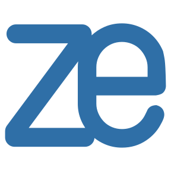
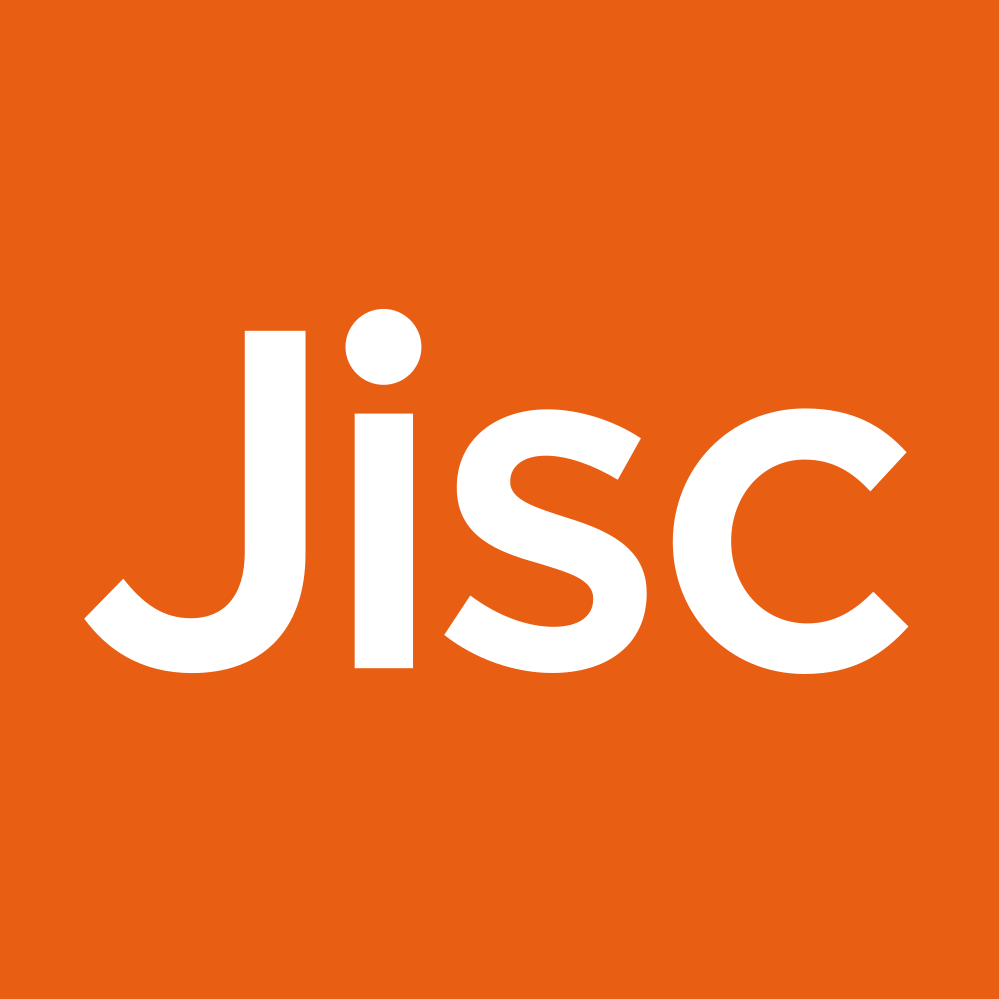
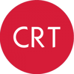

# 4. Preserve & Share

![](data:image/svg+xml;base64,PHN2ZyB3aWR0aD0iMTA1Ljk0OTg1bW0iIGhlaWdodD0iMTA2LjM1NjgybW0iIHZpZXdib3g9IjAgMCAxMDUuOTQ5ODUgMTA2LjM1NjgyIiB2ZXJzaW9uPSIxLjEiIGlkPSJzdmcxIiBzcGFjZT0icHJlc2VydmUiIHNvZGlwb2RpOmRvY25hbWU9Im9zLWN5Y2xlLnN2ZyIgaW5rc2NhcGU6dmVyc2lvbj0iMS40LjIgKDE6MS40LjIrMjAyNTA1MTIwNzM3K2ViZjBlOTQwZDApIiB4bWxuczppbmtzY2FwZT0iaHR0cDovL3d3dy5pbmtzY2FwZS5vcmcvbmFtZXNwYWNlcy9pbmtzY2FwZSIgeG1sbnM6c29kaXBvZGk9Imh0dHA6Ly9zb2RpcG9kaS5zb3VyY2Vmb3JnZS5uZXQvRFREL3NvZGlwb2RpLTAuZHRkIiB4bWxucz0iaHR0cDovL3d3dy53My5vcmcvMjAwMC9zdmciIHhtbG5zOnN2Zz0iaHR0cDovL3d3dy53My5vcmcvMjAwMC9zdmciPjxuYW1lZHZpZXcgaWQ9Im5hbWVkdmlldzEiIHBhZ2Vjb2xvcj0iI2ZmZmZmZiIgYm9yZGVyY29sb3I9IiM2NjY2NjYiIGJvcmRlcm9wYWNpdHk9IjEuMCIgaW5rc2NhcGU6c2hvd3BhZ2VzaGFkb3c9IjIiIGlua3NjYXBlOnBhZ2VvcGFjaXR5PSIwLjAiIGlua3NjYXBlOnBhZ2VjaGVja2VyYm9hcmQ9IjAiIGlua3NjYXBlOmRlc2tjb2xvcj0iI2QxZDFkMSIgaW5rc2NhcGU6ZG9jdW1lbnQtdW5pdHM9Im1tIiBpbmtzY2FwZTp6b29tPSIxLjkwMjM4MzEiIGlua3NjYXBlOmN4PSIzNzUuNTgxNTUiIGlua3NjYXBlOmN5PSIyMjIuMDg5ODYiIGlua3NjYXBlOndpbmRvdy13aWR0aD0iMzQ0MCIgaW5rc2NhcGU6d2luZG93LWhlaWdodD0iMTQwMyIgaW5rc2NhcGU6d2luZG93LXg9IjE5MjAiIGlua3NjYXBlOndpbmRvdy15PSIwIiBpbmtzY2FwZTp3aW5kb3ctbWF4aW1pemVkPSIxIiBpbmtzY2FwZTpjdXJyZW50LWxheWVyPSJnMTIiPjwvbmFtZWR2aWV3PjxkZWZzIGlkPSJkZWZzMSI+PHJlY3QgeD0iNDQxLjAyNTc5IiB5PSIxMjYuNjgzMjEiIHdpZHRoPSIxNTguMjIyNiIgaGVpZ2h0PSI5MS45ODk4ODMiIGlkPSJyZWN0MTMiIC8+PGNsaXBwYXRoIGlkPSJwMjUuMyI+PHBhdGggZD0iTSAwLDAgSCAyNTAwIFYgMjUwMCBIIDAgWiIgY2xpcC1ydWxlPSJldmVub2RkIiBpZD0icGF0aDk1IiAvPjwvY2xpcHBhdGg+PHJlY3QgeD0iNDQxLjAyNTc5IiB5PSIxMjYuNjgzMjEiIHdpZHRoPSIyMDguMTU5OTciIGhlaWdodD0iMTA1LjEzMTMiIGlkPSJyZWN0MTMtOSIgLz48cmVjdCB4PSI0NDEuMDI1NzkiIHk9IjEyNi42ODMyMSIgd2lkdGg9IjIwNi41ODI5OSIgaGVpZ2h0PSI5My41NjY4NDkiIGlkPSJyZWN0MTMtMCIgLz48cmVjdCB4PSI0NDEuMDI1NzkiIHk9IjEyNi42ODMyMSIgd2lkdGg9IjE3Mi45NDA5OCIgaGVpZ2h0PSIxMjMuNTI5MjgiIGlkPSJyZWN0MTMtMyIgLz48L2RlZnM+PGcgaW5rc2NhcGU6bGFiZWw9IkxheWVyIDEiIGlua3NjYXBlOmdyb3VwbW9kZT0ibGF5ZXIiIGlkPSJsYXllcjEiIHRyYW5zZm9ybT0idHJhbnNsYXRlKC0zMjkuNzYxMzMsLTY4LjkwODc3MykiPjxnIGlkPSJnMTMiIHRyYW5zZm9ybT0ibWF0cml4KDAuMjY0NTgzMzMsMCwwLDAuMjY0NTgzMzMsLTQ5LjU2NzMxLC01LjMwNjU4ODYpIiBzdHlsZT0iZmlsbDpub25lO3N0cm9rZTpub25lO3N0cm9rZS1saW5lY2FwOnNxdWFyZTtzdHJva2UtbWl0ZXJsaW1pdDoxMCIgaW5rc2NhcGU6bGFiZWw9Im9wZW4tcmVzZWFyY2gtY3ljbGUiPjxnIGlkPSJnMTIiIHRyYW5zZm9ybT0idHJhbnNsYXRlKC0xMS4xMjkxMTEsNC40NTk0MTI5KSIgaW5rc2NhcGU6bGFiZWw9InBoYXNlcyI+PGEgaHJlZj0iLi4vLi4vdHJhaW5pbmcvcmVzZWFyY2gtY3ljbGUtaGFuZGJvb2svMDQtcHJlc2VydmUtYW5kLXNoYXJlLmh0bWwiPjxnIGlkPSJwaGFzZS00IiBpbmtzY2FwZTpsYWJlbD0icGhhc2UtNCIgY2xhc3M9InBoYXNlLWdyb3VwIiByb2xlPSJidXR0b24iIHRhYmluZGV4PSIwIiB0cmFuc2Zvcm09InRyYW5zbGF0ZSgwLC0wLjM0NTkzNSkiIHN0eWxlPSJmaWxsOiMwMGMwNTc7ZmlsbC1vcGFjaXR5OjEiPjxwYXRoIGlkPSJwYXRoNSIgc3R5bGU9ImRpc3BsYXk6aW5saW5lO2ZpbGw6IzAwYzA1NztmaWxsLW9wYWNpdHk6MSIgaW5rc2NhcGU6bGFiZWw9InBoYXNlLTQtcXVhcnRlciIgZD0iTSAxNjM5LjE4NzIgMjc4LjA2NTIyIEMgMTUzMi41NzI4IDI3OC4wNjUyMiAxNDQ2LjE0NjIgMzY0LjQ5MTg2IDE0NDYuMTQ2MiA0NzEuMTA2MjQgTCAxNTkzLjE1MiA0NzEuMTA2MjQgTCAxNjM5LjE4NzIgNDI1LjM4NTUzIEwgMTYzOS4xODcyIDI3OC4wNjUyMiB6ICIgLz48dGV4dCBzcGFjZT0icHJlc2VydmUiIGlkPSJ0ZXh0MTMtMyIgc3R5bGU9ImZvbnQtc3R5bGU6bm9ybWFsO2ZvbnQtdmFyaWFudDpub3JtYWw7Zm9udC13ZWlnaHQ6Ym9sZDtmb250LXN0cmV0Y2g6bm9ybWFsO2ZvbnQtc2l6ZToyOS4zMzMzcHg7bGluZS1oZWlnaHQ6MC45NTtmb250LWZhbWlseTpzYW5zLXNlcmlmOy1pbmtzY2FwZS1mb250LXNwZWNpZmljYXRpb246JiMzOTtTYW5zLCBCb2xkJiMzOTs7Zm9udC12YXJpYW50LWxpZ2F0dXJlczpub3JtYWw7Zm9udC12YXJpYW50LWNhcHM6bm9ybWFsO2ZvbnQtdmFyaWFudC1udW1lcmljOm5vcm1hbDtmb250LXZhcmlhbnQtZWFzdC1hc2lhbjpub3JtYWw7dGV4dC1hbGlnbjpjZW50ZXI7bGV0dGVyLXNwYWNpbmc6MHB4O3dvcmQtc3BhY2luZzowcHg7d2hpdGUtc3BhY2U6cHJlO3NoYXBlLWluc2lkZTp1cmwoI3JlY3QxMy0zKTtkaXNwbGF5OmlubGluZTtmaWxsOiNmZmZmZmY7ZmlsbC1vcGFjaXR5OjE7c3Ryb2tlOm5vbmU7c3Ryb2tlLWxpbmVjYXA6c3F1YXJlO3N0cm9rZS1taXRlcmxpbWl0OjEwIiB0cmFuc2Zvcm09InRyYW5zbGF0ZSgxMDIyLjc2NjcsMjUyLjY2NTQxKSIgaW5rc2NhcGU6bGFiZWw9InBoYXNlLTQtdGV4dCI+PHRzcGFuIHg9IjQ0Ny4yNDAxOCIgeT0iMTQ4Ljk3MzI0IiBpZD0idHNwYW4xIj40LiBQcmVzZXJ2ZSA8L3RzcGFuPjx0c3BhbiB4PSI0NzEuMDczNDkiIHk9IjE3Ni44Mzk4OCIgaWQ9InRzcGFuMiI+JmFtcDsgU2hhcmU8L3RzcGFuPjwvdGV4dD48L2c+PC9hPjxhIGhyZWY9Ii4uLy4uL3RyYWluaW5nL3Jlc2VhcmNoLWN5Y2xlLWhhbmRib29rLzAzLWFuYWx5emUtYW5kLWNvbGxhYm9yYXRlLmh0bWwiPjxnIGlkPSJwaGFzZS0zIiBzdHlsZT0iZmlsbDojZmZjMDAwO2ZpbGwtb3BhY2l0eToxO3N0cm9rZTpub25lO3N0cm9rZS1saW5lY2FwOnNxdWFyZTtzdHJva2UtbWl0ZXJsaW1pdDoxMCIgaW5rc2NhcGU6bGFiZWw9InBoYXNlLTMiIHRyYW5zZm9ybT0idHJhbnNsYXRlKDMuMTMzMjIzMmUtNSwtMC4yNDgxMzUpIiBjbGFzcz0icGhhc2UtZ3JvdXAiIHJvbGU9ImJ1dHRvbiIgdGFiaW5kZXg9IjAiPjxwYXRoIGlkPSJwYXRoMTMiIHN0eWxlPSJkaXNwbGF5OmlubGluZTtmaWxsOiNmZmMwMDA7ZmlsbC1vcGFjaXR5OjEiIGlua3NjYXBlOmxhYmVsPSJwaGFzZS0zLXF1YXJ0ZXIiIGQ9Ik0gMTQ0Ni4xNDYxIDQ4My42NDMyIEMgMTQ0Ni4xNDYxIDU5MC4yNTc1OCAxNTMyLjU3MjcgNjc2LjY4NDIyIDE2MzkuMTg3MSA2NzYuNjg0MjIgTCAxNjM5LjE4NzEgNTI5LjY2MjczIEwgMTU5My40ODAxIDQ4My42NDMyIEwgMTQ0Ni4xNDYxIDQ4My42NDMyIHogIiAvPjx0ZXh0IHNwYWNlPSJwcmVzZXJ2ZSIgaWQ9InRleHQxMy0wIiBzdHlsZT0iZm9udC1zdHlsZTpub3JtYWw7Zm9udC12YXJpYW50Om5vcm1hbDtmb250LXdlaWdodDpib2xkO2ZvbnQtc3RyZXRjaDpub3JtYWw7Zm9udC1zaXplOjI5LjMzMzNweDtsaW5lLWhlaWdodDowLjk1O2ZvbnQtZmFtaWx5OnNhbnMtc2VyaWY7LWlua3NjYXBlLWZvbnQtc3BlY2lmaWNhdGlvbjomIzM5O1NhbnMsIEJvbGQmIzM5Oztmb250LXZhcmlhbnQtbGlnYXR1cmVzOm5vcm1hbDtmb250LXZhcmlhbnQtY2Fwczpub3JtYWw7Zm9udC12YXJpYW50LW51bWVyaWM6bm9ybWFsO2ZvbnQtdmFyaWFudC1lYXN0LWFzaWFuOm5vcm1hbDt0ZXh0LWFsaWduOmNlbnRlcjtsZXR0ZXItc3BhY2luZzowcHg7d29yZC1zcGFjaW5nOjBweDt3aGl0ZS1zcGFjZTpwcmU7c2hhcGUtaW5zaWRlOnVybCgjcmVjdDEzLTApO2Rpc3BsYXk6aW5saW5lO2ZpbGw6I2ZmZmZmZjtmaWxsLW9wYWNpdHk6MSIgdHJhbnNmb3JtPSJ0cmFuc2xhdGUoMTAwNS42Mzc0LDM5My4wMzQ4NykiIGlua3NjYXBlOmxhYmVsPSJwaGFzZS0zLXRleHQiPjx0c3BhbiB4PSI0NTUuNzMwOCIgeT0iMTQ4Ljk3MzI0IiBpZD0idHNwYW4zIj4zLiBBbmFseXplICZhbXA7IDwvdHNwYW4+PHRzcGFuIHg9IjQ1OS40NzA4NCIgeT0iMTc2LjgzOTg4IiBpZD0idHNwYW40Ij5Db2xsYWJvcmF0ZTwvdHNwYW4+PC90ZXh0PjwvZz48L2E+PGEgaHJlZj0iLi4vLi4vdHJhaW5pbmcvcmVzZWFyY2gtY3ljbGUtaGFuZGJvb2svMDItY29sbGVjdC1hbmQtbWFuYWdlLmh0bWwiPjxnIGlkPSJwaGFzZS0yIiBpbmtzY2FwZTpsYWJlbD0icGhhc2UtMiIgY2xhc3M9InBoYXNlLWdyb3VwIiByb2xlPSJidXR0b24iIHRhYmluZGV4PSIwIiB0cmFuc2Zvcm09InRyYW5zbGF0ZSgwLDAuMjQ4MTM1KSIgc3R5bGU9ImZpbGw6I2NjMDA2NjtmaWxsLW9wYWNpdHk6MSI+PHBhdGggaWQ9InBhdGgxMSIgc3R5bGU9ImRpc3BsYXk6aW5saW5lO2ZpbGw6I2NjMDA2NjtmaWxsLW9wYWNpdHk6MSIgaW5rc2NhcGU6bGFiZWw9InBoYXNlLTItcXVhcnRlciIgZD0iTSAxNjk2LjgxNjEgNDgzLjE0NjkzIEwgMTY0OS43MzYgNTI5LjkwNDc0IEwgMTY0OS43MzYgNjc2LjE4Nzk1IEMgMTc1Ni4zNTA0IDY3Ni4xODc5NSAxODQyLjc3OSA1ODkuNzYxMzEgMTg0Mi43NzkgNDgzLjE0NjkzIEwgMTY5Ni44MTYxIDQ4My4xNDY5MyB6ICIgLz48dGV4dCBzcGFjZT0icHJlc2VydmUiIHRyYW5zZm9ybT0idHJhbnNsYXRlKDExOTUuMzkxNSwzOTMuODY2NzgpIiBpZD0idGV4dDEzLTIiIHN0eWxlPSJmb250LXN0eWxlOm5vcm1hbDtmb250LXZhcmlhbnQ6bm9ybWFsO2ZvbnQtd2VpZ2h0OmJvbGQ7Zm9udC1zdHJldGNoOm5vcm1hbDtmb250LXNpemU6MjkuMzMzM3B4O2xpbmUtaGVpZ2h0OjAuOTU7Zm9udC1mYW1pbHk6c2Fucy1zZXJpZjstaW5rc2NhcGUtZm9udC1zcGVjaWZpY2F0aW9uOiYjMzk7U2FucywgQm9sZCYjMzk7O2ZvbnQtdmFyaWFudC1saWdhdHVyZXM6bm9ybWFsO2ZvbnQtdmFyaWFudC1jYXBzOm5vcm1hbDtmb250LXZhcmlhbnQtbnVtZXJpYzpub3JtYWw7Zm9udC12YXJpYW50LWVhc3QtYXNpYW46bm9ybWFsO3RleHQtYWxpZ246Y2VudGVyO2xldHRlci1zcGFjaW5nOjBweDt3b3JkLXNwYWNpbmc6MHB4O3doaXRlLXNwYWNlOnByZTtzaGFwZS1pbnNpZGU6dXJsKCNyZWN0MTMtOSk7ZGlzcGxheTppbmxpbmU7ZmlsbDojZmZmZmZmO2ZpbGwtb3BhY2l0eToxO3N0cm9rZTpub25lO3N0cm9rZS1saW5lY2FwOnNxdWFyZTtzdHJva2UtbWl0ZXJsaW1pdDoxMCIgaW5rc2NhcGU6bGFiZWw9InBoYXNlLTItdGV4dCI+PHRzcGFuIHg9IjQ2My45Njk1NyIgeT0iMTQ4Ljk3MzI0IiBpZD0idHNwYW41Ij4yLiBDb2xsZWN0ICZhbXA7IDwvdHNwYW4+PHRzcGFuIHg9IjQ4NS45Njk1NCIgeT0iMTc2LjgzOTg4IiBpZD0idHNwYW42Ij5NYW5hZ2U8L3RzcGFuPjwvdGV4dD48L2c+PC9hPjxhIGhyZWY9Ii4uLy4uL3RyYWluaW5nL3Jlc2VhcmNoLWN5Y2xlLWhhbmRib29rLzAxLXBsYW4tYW5kLWRlc2lnbi5odG1sIj48ZyBpZD0icGhhc2UtMSIgaW5rc2NhcGU6bGFiZWw9InBoYXNlLTEiIHN0eWxlPSJmaWxsOm5vbmU7c3Ryb2tlOm5vbmU7c3Ryb2tlLWxpbmVjYXA6c3F1YXJlO3N0cm9rZS1taXRlcmxpbWl0OjEwIiB0cmFuc2Zvcm09InRyYW5zbGF0ZSgzLjEzMzIyMzJlLTUsMC4zNDU5MzUpIiBjbGFzcz0icGhhc2UtZ3JvdXAiIHJvbGU9ImJ1dHRvbiIgdGFiaW5kZXg9IjAiPjxwYXRoIGlkPSJwYXRoOSIgc3R5bGU9ImRpc3BsYXk6aW5saW5lO2ZpbGw6IzAwNjZmZjtmaWxsLW9wYWNpdHk6MSIgaW5rc2NhcGU6bGFiZWw9InBoYXNlLTEtcXVhcnRlciIgZD0iTSAxNjUwLjg3NjYgMjc3LjM3MzM1IEwgMTY1MC44NzY2IDQyNC4yOTUyMiBMIDE2OTYuNjgxMyA0NzAuNDE0MzcgTCAxODQzLjkxOTYgNDcwLjQxNDM3IEMgMTg0My45MTk2IDM2My43OTk5OSAxNzU3LjQ5MSAyNzcuMzczMzUgMTY1MC44NzY2IDI3Ny4zNzMzNSB6ICIgLz48dGV4dCBzcGFjZT0icHJlc2VydmUiIHRyYW5zZm9ybT0idHJhbnNsYXRlKDEyMjAuMDUyMywyNDkuOTY2NzIpIiBpZD0idGV4dDEzIiBzdHlsZT0iZm9udC1zdHlsZTpub3JtYWw7Zm9udC12YXJpYW50Om5vcm1hbDtmb250LXdlaWdodDpib2xkO2ZvbnQtc3RyZXRjaDpub3JtYWw7Zm9udC1zaXplOjI5LjMzMzNweDtsaW5lLWhlaWdodDowLjk1O2ZvbnQtZmFtaWx5OnNhbnMtc2VyaWY7LWlua3NjYXBlLWZvbnQtc3BlY2lmaWNhdGlvbjomIzM5O1NhbnMsIEJvbGQmIzM5Oztmb250LXZhcmlhbnQtbGlnYXR1cmVzOm5vcm1hbDtmb250LXZhcmlhbnQtY2Fwczpub3JtYWw7Zm9udC12YXJpYW50LW51bWVyaWM6bm9ybWFsO2ZvbnQtdmFyaWFudC1lYXN0LWFzaWFuOm5vcm1hbDt0ZXh0LWFsaWduOmNlbnRlcjtsZXR0ZXItc3BhY2luZzowcHg7d29yZC1zcGFjaW5nOjBweDt3aGl0ZS1zcGFjZTpwcmU7c2hhcGUtaW5zaWRlOnVybCgjcmVjdDEzKTtkaXNwbGF5OmlubGluZTtmaWxsOm5vbmU7c3Ryb2tlOm5vbmU7c3Ryb2tlLWxpbmVjYXA6c3F1YXJlO3N0cm9rZS1taXRlcmxpbWl0OjEwIiBpbmtzY2FwZTpsYWJlbD0icGhhc2UtMS10ZXh0Ij48dHNwYW4geD0iNDU2Ljc2MjExIiB5PSIxNDguOTczMjQiIGlkPSJ0c3BhbjgiPjx0c3BhbiBzdHlsZT0iZmlsbDojZmZmZmZmIiBpZD0idHNwYW43Ij4xLiBQbGFuICZhbXA7IDwvdHNwYW4+PC90c3Bhbj48dHNwYW4geD0iNDY5LjkzMjgiIHk9IjE3Ni44Mzk4OCIgaWQ9InRzcGFuMTAiPjx0c3BhbiBzdHlsZT0iZmlsbDojZmZmZmZmIiBpZD0idHNwYW45Ij5EZXNpZ248L3RzcGFuPjwvdHNwYW4+PC90ZXh0PjwvZz48L2E+PC9nPjxwYXRoIGQ9Im0gMTYxMS42NjgxLDQ0NC4zNjQxMyAyOC43NzA3LDUuNjg3MTUgLTEyLjk5NTEsMjYuMjkxMSAtNS4xNDYsLTEwLjQzMTM4IGMgLTkuMzMyNiw1Ljg1NzYxIC0xMi45MjM5LDE3Ljk4OTE3IC03Ljk0MjIsMjguMDg3NDUgNS4zMTcsMTAuNzc3OSAxOC40MTA1LDE1LjIyMDUgMjkuMTg2Miw5LjkwNDYzIDEwLjc3NTcsLTUuMzE1ODcgMTUuMjE4MywtMTguNDA5NDQgOS45MDI0LC0yOS4xODUxMSAtMS41MjMxLC0zLjA4NzM5IC0wLjI1NTUsLTYuODIzMTYgMi44MzE4LC04LjM0NjI0IDMuMDg3NCwtMS41MjMwNyA2LjgyMzIsLTAuMjU1NTQgOC4zNDYzLDIuODMxODUgOC4zNTU0LDE2LjkzNzAzIDEuMzczMSwzNy41MjEwOCAtMTUuNTY2MSw0NS44Nzc1OCAtMTYuOTM5Myw4LjM1NjUxIC0zNy41MjIyLDEuMzcwOTQgLTQ1Ljg3NzYsLTE1LjU2NjA5IC04LjAyMTIsLTE2LjI1OTY0IC0xLjg3OTQsLTM1Ljg0ODE2IDEzLjYwMzcsLTQ0Ljc4NDM5IHoiIGlkPSJwYXRoMSIgc3R5bGU9ImZpbGw6IzAwMDAwMDtzdHJva2U6bm9uZTtzdHJva2Utd2lkdGg6Ny41NTkwNjtzdHJva2UtbGluZWNhcDpzcXVhcmU7c3Ryb2tlLW1pdGVybGltaXQ6MTA7c3Ryb2tlLWRhc2hhcnJheTpub25lIiBpbmtzY2FwZTpsYWJlbD0icm90YXRpbmctYXJyb3ciIC8+PC9nPjwvZz48L3N2Zz4=)

Make your research outputs accessible, reusable, and citable

Data Sharing Code Publishing Open Access Persistent Identifiers

Checkpoint: Manuscript submission with DOIs for preregistration, data, and code

### 4.1 FAIR Data Sharing

Sharing your data allows others to verify your findings, build on your work, and increase the impact of your research. But sharing does not always mean making everything publicly available. What you can share depends on the consent you obtained, the sensitivity of your data, and your ethics approval.

In [1. Plan & Design](../../training/research-cycle-handbook/01-plan-and-design.llms.md), you wrote a Data Management Plan, in [2. Collect & Manage](../../training/research-cycle-handbook/02-collect-and-manage.llms.md), you created documentation for yourself, and in [3. Analyze & Collaborate](../../training/research-cycle-handbook/03-analyze-and-collaborate.llms.md) you updated that documentation for your collaborators. Now you prepare that documentation for people who have no prior knowledge of your project and reassess you plan:

- **Make a final decision on how openly your data will be shared.**
- **Select an appropriate repository** for publishing your data type.
- **Apply a license** that tells others how they may reuse your work.

These steps are straightforward if you followed previous recommendations: by this stage, you should already have a README, a data dictionary (codebook), organized files, and clear metadata.

## 4.1.1. Open vs Restricted

Not all data can or should be shared openly. Your sharing options depend on what consent participants gave and what your ethics approval permits (see [1.2.3. Ethics](../../training/research-cycle-handbook/01-plan-and-design.llms.md#sec-legal-requirements)).

  

- **Open data** can be downloaded by anyone without restrictions. This maximizes reuse but is only appropriate when data contains no personal information or has been fully anonymized.

- **Restricted access** means the metadata is available on a professional repository and clear instructions of the conditions of access to the data are provided. Requesting the data often requires describing the purpose of reuse (sometimes in the form of a preregistration, see [1.4.1. Pre-analysis planning](../../training/research-cycle-handbook/01-plan-and-design.llms.md#sec-study-design-analysis-plan)), signing a Data Use Agreement, and agreeing to further conditions. This can be organized automatically through the repository or through contacting the authors. This balances reuse with protection.

- **Metadata only** describes what data exists without sharing the data itself. Others can discover your work and contact you to discuss access. This is appropriate when data cannot be shared due to legal or ethical constraints. Making your data Findable by sharing your metadata on a professional repository is the first step to making your data FAIR, as emphasized by the [LMU Guidelines for Safeguarding Good Scientific Practice](https://cms-cdn.lmu.de/media/contenthub/amtliche-veroeffentlichungen/gwp-ordnung.pdf) (see also [1.2. Legal Requirements](../../training/research-cycle-handbook/01-plan-and-design.llms.md#sec-legal-requirements))

  

When deciding whether data should be shared, consider the following:

- Ensure that data sharing is compatible with the **informed consent** provided by participants.
- Check what your **ethics approval** allows.
- Consider whether the data can be **anonymized** without losing scientific value (see [2.3.2. Anonymization](../../training/research-cycle-handbook/02-collect-and-manage.llms.md#sec-ethics-and-privacy)).
- If you work with **sensitive data**, you may consult the University’s [data protection officer](https://www.lmu.de/en/about-lmu/structure/organizational-structure/officers-representatives-and-contact-persons/data-protection-officer.html).
- If your research outputs could have **dual-use** implications (e.g. that could also be applied for military or malicious purposes), consult the relevant regulations (e.g. European Commission’s policy ([Dual-Use Regulation 2021/821](https://eur-lex.europa.eu/legal-content/EN/TXT/PDF/?uri=OJ:L:2021:206:FULL&from=EN))) and contact the University’s [Export Control service](mailto:Exportkontrolle@Verwaltung.Uni-Muenchen.DE).
- If your research may lead to **patents or commercialization**, contact the the University’s [IP Management team](https://www.lmu.de/en/research/research-transfer/inventions-patents-and-exploitation-rights/) before sharing data. Early consultation helps ensure that intellectual property rights are not compromised.

####  LEARN MORE

OSC Lecture

#### Why share data openly?

An introduction to the what, why, and how to make data open (30 min)

OSC Lecture

#### Maintaining Privacy with Open Data

How to make data open without revealing sensitive information (1h)

OSC Tutorial

#### TBA: Data Anonymization

Implement data anonymization techniques in R. (X h)

####  TOOLS & RESOURCES

#### LMU Guidelines for Safeguarding Good Scientific Practice

Implementation of the German Research Foundation's (DFG) Code of Conduct

#### EU Dual-Use Regulation 2021/821

List of regulated research outputs that could lead to military or malicious purposes.

## 4.1.2. Preparing Your Data

During the course of data collection and analyses, you created a README and data dictionary for yourself and collaborators. Before sharing publicly, review them from the perspective of someone who knows nothing about your project.

  

- **Expand your README** to include the research context (who created the data, what it contains, when and where it was collected, why it was generated, how it was produced), how to cite the dataset, and any access conditions.

- **Review your data dictionary** to ensure every variable is fully described. What was obvious to you during analysis may need explanation for others.

- **Confirm you follow community standards.** Many fields have established formats for sharing data (e.g., [BIDS](https://bids.neuroimaging.io/index.html) for neuroimaging, see [FAIRsharing](https://fairsharing.org/) and [RDMkit](https://rdmkit.elixir-europe.org/your_domain) to review discipline specific organizational and metadata standards). Using these makes your data immediately usable with existing tools (see also [2.2.5. Standards](../../training/research-cycle-handbook/02-collect-and-manage.llms.md#sec-data-management)).

- **Verify anonymization.** Check that no personal information remains in the data files, metadata, or filenames.

####  LEARN MORE

OSC Tutorial

#### FAIR Data Management

Manage data following FAIR principles. Covers READMEs, data dictionaries, file formats, and standards. (2h)

OSC Tutorial

#### Data Documentation & Validation

Create data dictionaries and READMEs for your data. (1h)

OSC Tutorial

#### TBA: Data Anonymization

Implement data anonymization techniques in R. (X h)

####  TOOLS & RESOURCES

#### FAIRsharing

Search by discipline to find metadata standards, reporting guidelines, and data policies for your field.

#### RDMkit

Domain-specific metadata standards

## 4.1.3. Where to Deposit

Choose a repository that suits your data type, your field’s expectations, and your access requirements.

  

- **Discipline-specific repositories** are often the best choice. They use metadata standards your community expects, making your data findable by researchers in your field. Search [re3data](https://www.re3data.org/) to find repositories for your domain.

- **General-purpose repositories** like [Zenodo](https://zenodo.org/) or [OSF](https://osf.io/) accept any data type. They provide DOIs and long-term preservation, but may lack the specialized metadata fields of discipline-specific options.

- **Institutional repositories** may be required by your funder. Choosing the LMU repository [Open Data LMU](https://data.ub.uni-muenchen.de/) also ensures you can get the support of the [Research Data Management team of the University Library](https://www.en.ub.uni-muenchen.de/writing/research_data/research-data-management/index.html).

  

Whichever you choose, ensure the repository provides a **DOI** (Digital Object Identifier) so your data can be cited and tracked.

####  TOOLS & RESOURCES

#### re3data

Registry of research data repositories.

#### Open Science Framework

General-purpose repository for data, materials, reports.

#### Zenodo

General-purpose repository for data, software, reports.

Supported at LMU

#### Open Data LMU

Institutional data repository.

## 4.1.4. Data Licenses

A license tells others what they can do with your data. Licensing your data consists in adding a file called LICENSE.txt next to your data, that contains the appropriate legal text. Without one, or equivalent statements, others cannot legally reuse your research outputs, even if it is publicly available.

  

Common open licenses for data are:

- **CC0 (Public Domain)** places no restrictions. Anyone can use, modify, and redistribute without attribution. Recommended for factual data where maximum reuse is the goal.
- **CC BY (Attribution)** requires users to credit you. A good default when you want recognition while enabling broad reuse.
- **CC BY-NC (Non-Commercial)** adds a restriction against commercial use. Consider whether this limitation actually serves your goals.
- A **Scientific Use License (Public Use)** only allows re-use for scientific purposes (but with all freedoms within that scope). The Leibniz Institute for Psychology (ZPID) developed such a [standard license](https://www.psycharchives.org/en/item/7466aa16-69bd-49ea-baef-7f828f5b223f) together with legal experts.

  

Learn more about open licenses for data and code in our [code publishing tutorial](https://lmu-osc.github.io/code-publishing/choose_license.html).

  

For restricted-access data, a **Data Use Agreement** specifies conditions beyond a standard license: approved purposes, security requirements, publication terms, and data destruction timelines.

####  LEARN MORE

OSC Tutorial

#### Choose a License

License decision flowchart for data and code.

## 4.1.5. Data Use Agreements

*in construction*

- Description of what it is, when it is needed, what the process to create one is (Team SOP for handling access requests (who receives them, how decisions are made, what must be documented, and response timelines))
- LMU contact for legal department
- Examples DUA

### 4.2 Open Source Code

Making code publicly available demonstrates the reproducibility of your results and enables others to understand, verify, and build upon your analytical methods.

So far, your code was either backed up on the secured [LRZ Gitlab](https://gitlab.lrz.de/) (e.g. if your data and/or code are sensitive), or on [GitHub](https://github.com/) (see [3. Analyze & Collaborate](../../training/research-cycle-handbook/03-analyze-and-collaborate.llms.md)). Before the submission of a manuscript to a journal and/or upon the acceptance of a manuscript, there are small additional steps that need to be done to publish your code.

- **verify** the structure of your repository, the readability of your scripts, the completeness of the documentation (see [Analyze & Collaborate Checklist](../../training/research-cycle-handbook/03-analyze-and-collaborate.llms.md#analyze-collaborate-checklist)).
- **make a clean version public**, e.g. on [GitHub](https://github.com/)
- **add a license**
- **get a DOI**, e.g. through [Zenodo](https://zenodo.org/)

If you work with **sensitive data that cannot be anonymized** and shared:

- **generate a simulated random dataset** to allow for the published code to run (which you may have already done if you simulated data in order to prepare a preregistration, see [1.4. Study Design & Analysis Plan](../../training/research-cycle-handbook/01-plan-and-design.llms.md#sec-study-design-analysis-plan)), *or*
- **create a synthetic dataset with the same properties as the original dataset** to allow others to re-derive an approximation of the original results and conduct further exploratory analyses.

## 4.2.1. Preparing Your Code Repository

During the course of data analyses, you created scripts and documentation such as README and data dictionary for yourself and collaborators. Before sharing publicly, review them from the perspective of someone who knows nothing about your project.

  

- **Expand your README** to include a description, involved data, computational requirements and dependencies (i.e. what software, packages, and their version, need to be installed to run the analyses), list of results.
- **Document your code** from an external perspective, using literate programming (e.g. Quarto) or comments.
- **Double check that no sensitive information remains in your repository** (e.g. code comments, history of sensitive data)

See our [code publishing tutorial](https://lmu-osc.github.io/code-publishing/) for more information on how to prepare your code repository for sharing.

  

> **IMPORTANT:**
>
> If you work with **sensitive data**, you must not include the raw or processed data in the version-controlled repository to be shared.
>
>   
>
> Instead, explicitly **exclude the data directory using the .gitignore file from the start**. An easy solution (which, however, discards the version history for all files), is to **create a new local repository that contains all project files except the data** and only push that to the public repository.
>
>   
>
> Importantly, if data are removed from an existing repository, they may still remain accessible in the repository’s history, since previous states of the project can be restored. If sensitive data are accidentally committed and pushed, it is possible to [rewrite the repository history](https://docs.github.com/en/authentication/keeping-your-account-and-data-secure/removing-sensitive-data-from-a-repository) to remove them retrospectively. However, this process is complex and error-prone, so it is best avoided by ensuring that sensitive data are excluded from version control from the outset.

####  LEARN MORE

OSC Tutorial

#### Code Publishing

Add all elements of a reproducible project to your repository.

## 4.2.2. Real, Simulated, or Synthetic Data

Sharing your code allows for other researchers to clearly see which analytic methods were applied to the data. Ideally, they should also be able to rerun the code and verify the reproducibility of the reported results.

  

You can provide the data required to run the code in several ways:

- **The real (anonymized) data.** This can be done either (1) by including the dataset in the repository so that the code can access it locally and run directly, or (2) by configuring the code to retrieve the data from an external source, such as a database, API, or external data repository. A practical workflow is to include “small”/one-shot datasets directly into a combined code/data-project (e.g. on GitHub), and to store “large”/reusable datasets (which deserve their own DOI) separately in a repository specialized for research data.
- **Simulated random data.** This option mainly demonstrates that the code runs without errors. However, the original results cannot be verified and further analyses are not meaningful. See our [data simulation tutorial](https://lmu-osc.github.io/Introduction-Simulations-in-R/).
- **Synthetic data that mimic key properties of the real data.** When privacy-sensitive data cannot be shared, synthetic datasets can provide a useful alternative. Compared with purely random simulated data, synthetic data can resemble the structure and characteristics of the original dataset, allowing other researchers to rerun the analyses and assess whether the main results can be reproduced. In addition, openly shared synthetic data enable exploratory analyses that may generate new hypotheses, and in some cases analyses conducted on synthetic data can approximate results obtained from the real data.

####  LEARN MORE

OSC Tutorial

#### FAIR Data Management

Manage data following FAIR principles. Covers READMEs, data dictionaries, file formats, and standards. (2h)

OSC Tutorial

#### Data simulation in R

Easy data simulations in R. (2h)

OSC Tutorial

#### Synthetic Data

Synthetic data creation in R to balance utility and privacy when sharing data. (3h)

## 4.2.3. Code Licenses

A license tells others what they can do with your code. Licensing your code consists in adding a file called LICENSE.txt next to your code, that contains the appropriate legal text. Without one, or equivalent statements, others cannot legally reuse your code, even if it is publicly available e.g. on [GitHub](https://github.com/). Common open licenses for code are:

  

- **CC0 (Public Domain)** places no restrictions. Anyone can use, modify, and redistribute without attribution. Recommended for generic code where maximum reuse is the goal.
- **MIT** is a simple license that requires users to credit you when they reuse, modify, and redistribute your code.
- **Apache 2.0** is a safer license (covering more legal cases) that requires users to credit you and state the changes you made to the code.

  

Learn more about open licenses for data and code in our [code publishing tutorial](https://lmu-osc.github.io/code-publishing/choose_license.html) or using the tool ‘[Choose an open source license](https://choosealicense.com/licenses/)’.

####  LEARN MORE

OSC Tutorial

#### Choose a License

License decision flowchart for data and code.

#### Choose an open source license

Tool comparing open software licenses.

## 4.2.4. Archiving & DOIs

To publish you code on Zenodo, we recommend to

- **Push your clean repository to GitHub** (see GitHub tutorial).
- **Create an account on [Zenodo](https://zenodo.org/).**
- **Link your GitHub account to Zenodo.** Navigate to your profile \> account settings \> link external accounts \> GitHub \> authorize Zenodo to access your GitHub account \> a list of your GitHub repositories should appear. Enable the repository by toggling the switch next to it; refresh the page to check to see if the visual indicator that the repository is connected appears
- **Go to GitHub and create a release.** Zenodo will automatically download a .zip-ball of each new release and register a DOI.
- **Add DOI badge to your README.** After your first release, a DOI badge that you can include in GitHub README will appear next to your repository in your list of GitHub repositories on Zenodo. This allows others to easily find and cite your archived code
- **Create new release when needed.** If you make a new release, it will create a new version on Zenodo, under the same overall DOI, with a ‘sub-DOI’ to identify a specific version.

> **TIP:**
>
> **Create a Zenodo “community” for the team.** After team members connect their repositories from their personal GitHub account to Zenodo, and archive releases with a DOI, these records can be added to a shared Zenodo *community*. A community provides a central space where all software and other research outputs produced by the group can be collected and displayed, making them easier to find, cite, and showcase at the team level.

####  LEARN MORE

OSC Tutorial

#### Code Publishing

Add all elements of a reproducible project to your repository.

####  TOOLS & RESOURCES

#### Zenodo

General-purpose repository for data, software, reports.

### 4.3 Open Materials

Any material needed to reproduce or replicate your study should also be shared openly unless there are dual-use, patent, or privacy concerns.

## 4.3.1. Digital materials

For instance, you can share your:

- **Share wet-lab protocols** on e.g. [protocols.io](https://www.protocols.io/), see [2.1.1. Lab Protocols](../../training/research-cycle-handbook/02-collect-and-manage.llms.md#sec-data-collection).
- **Share survey text, instructions, or scoring sheets** on e.g. [OSF](https://osf.io/)

We recommend to use a creative Common license such as

- **CC-BY** to allow reuse, modification and redistribution, while getting attribution; or one of its derivatives e.g.
- **CC-BY-SA (ShareAlike)** under which credit must be given to the creator *and* adaptations must be shared under the same terms.

See the [Creative Common license chooser](https://creativecommons.org/chooser/) to explore more.

####  TOOLS & RESOURCES

#### Protocols.io

Share, discover, cite, and improve research protocols.

#### OSF

Project management platform including storage and DOI.

#### Creative Commons licenses

Tool comparing licenses for diverse creative work.

## 4.3.2. Physical materials

Repositories for physical research materials (e.g., biological samples, chemicals, specimens, hardware, or other tangible resources) are usually called biobanks, material repositories, or research infrastructure collections and are domain specific or specialized to one kind of material (e.g. DNA).

  

For instance, [Addgene](https://www.addgene.org/) is a nonprofit plasmid repository deposited by thousands of research labs around the world, while [ARIADNE](https://www.ariadne-research-infrastructure.eu/)’s mission is to create a sustainable infrastructure for archaeological data sharing across institutions and nations.

  

Regardless of your discipline:

- **Use repositories that assign persistent identifiers** for proper citation.
- **Provide detailed metadata**, including provenance, storage conditions, and usage restrictions.
- **Check legal and ethical requirements** (biosafety, export control, patient consent).
- **Document links between materials and associated datasets or publications.**

### 4.4 Open Access Articles

Publishing open access articles (i.e. which are free to readers) **increases the visibility, citation, and impact** of research by removing paywall barriers, enabling scholars, practitioners, and policymakers worldwide to access and build upon the work without restriction. It also **accelerates knowledge dissemination and promotes equity** in scholarship by providing institutions and researchers - especially in low-resource settings - free and immediate access to scientific findings. Finally, tax-payer funded projects often have particular requirements for open access.

## 4.4.1. Pathways to Open Access

They are several pathways to make your your articles free to read, e.g.:

- **Diamond Open Access**: journals that provide immediate open access without charging authors any Article Processing Charges (APCs), as publication costs are covered by institutions, consortia, or public funding. Visit the [Directory of Open Access Journals (DOAJ)](https://doaj.org/) to find them.
- **Gold Open Access**: the publication of the final version of record as immediately open access on the publisher’s platform, against payment of an Article Processing Charges (APCs) by the authors.
- **Green Open Access**: self-archiving of a ***preprint or postprint*** in an institutional or disciplinary repository, either immediately or after an embargo period imposed by the publisher, without cost to the author. Visit the [Open Policy Finder](https://openpolicyfinder.jisc.ac.uk/) to know whether and where your publishers allow you to publish preprint or postprints.

Depending on the contract negotiated by the University and each publisher (see [4.4.2. Contract with Publishers](#sec-open-access-articles)), the payment of APCs can also be requested by publishers regardless of the article’s accessibility status.

> **NOTE:**
>
> ***preprint***: article, book chapter, book, or other scholarly work that is deposited in a repository with unrestricted access (i.e. available to the public to view online, or download, without registration, payment, or approval) ahead of peer review. Equivalent terms used in some disciplines are ‘working paper’ and ‘unpublished manuscript’.
>
>   
>
> ***postprint***: accepted version of an article, book chapter, book, or other scholarly work that is released by the author(s) on a repository with unrestricted access (i.e. available to the public to view online, or download, without registration, payment, or approval)

####  TOOLS & RESOURCES

#### Directory of Open Access Journals (DOAJ)

Index of trusted open access journals.

#### Jisc' Open Policy Finder

Clear summary of journals' open access policies.

## 4.4.2. Contracts with Publishers

Until 2024, authors publishing in legacy (subscription-based) journals were required to pay an **Article Processing Charge (APC)** to make their work immediately open access upon publication, the model commonly referred to as ‘*gold open access*’. To **avoid these fees** while still ensuring public accessibility, authors were encouraged to disseminate a **preprint and/or postprint**, or to deposit the publisher’s version in an institutional repository after the embargo period had expired. These procedures, which are **free to the authors**, are collectively known as ‘*green open access*’.

  

**Since 2025**, however, at LMU Munich and other universities that are part of the [DEAL Konsortium](https://deal-konsortium.de/en/) in Germany, the agreements with Elsevier, Wiley, and Springer Nature, stipulate that the **authors publishing in hybrid journals** (i.e., journals offering both subscription-based and open access options) **incur an Article Processing Charge (APC) regardless of whether the article is published closed or open access**. Consequently, authors who elect to publish in these venues and pay the APC are generally advised to opt for immediate open access through the publisher. Although preprinting remains possible and may expedite dissemination, it no longer constitutes a cost-free alternative for hybrid journals operating under these uniform APC conditions.

  

The current contract conditions for LMU Munich can be accessed on the [University Library Publication Fees Webpage (in german)](https://www.ub.lmu.de/en/open-access-publishing/financing-open-access/). To get support with Article Processing Charges and open access policies, contact the [University Library Open Access team](https://www.en.ub.uni-muenchen.de/writing/open-access-publishing/oa-auxiliary-page/index.html).

####  TOOLS & RESOURCES

Supported at LMU

#### LMU University Library

Publisher contracts and publication fees.

## 4.4.3. Publishing Preprints and Retaining Rights

To increase the accessibility and impact of your article we recommend you to:

  

- **Check what your target journal’s open access policies are.** [Jisc’ Open Policy Finder](https://openpolicyfinder.jisc.ac.uk/) provides clear information about whether you are allowed to archive various versions of manuscripts. For instance, your target journal may, or may not, allow you to deposit:

  - the version submitted to the journal (preprint)
  - the accepted manuscript version (postprint)
  - the published version
    - on a specific location (e.g. preprint repository, institutional repository, funders repository, author’s personal website)
    - after a specific amount of time (e.g. 6 or 12-month embargo)
    - under a specific license (e.g. CC-BY (recommended for maximum reuse), CC-BY-NC-ND)

- **Disclose the state of peer review on each preprint version.** Use watermarks such as ‘Draft’ and ‘Revised Draft’ for your preprint, with a statement on the title page highlighting that the work has not been peer reviewed. For postprints, indicate that the version was accepted through peer review, and link to the DOI of the official journal version.

- **Get a DOI for each public version of your manuscript.** When updating your preprint through the revision cycle, get a citable DOI (as provided by the repository).

- **Maintain as much rights to your own work as possible**.

  - Prior to submitting your manuscript, deposit your manuscript’s conceptual figures on a repository (e.g. [Zenodo](https://zenodo.org/), [OSF](https://osf.io/)), under an open license (e.g. [CC.BY 4.0](https://creativecommons.org/licenses/by/4.0/deed.en) allowing reuse and modification while requiring authors to get credited), and get a DOI for it to cite your own figure in your manuscript. This way, you (and possibly other researchers), can reuse them in future manuscripts without asking permission from the publisher, by indicating the DOI and license in the figure legend.
  - When given the choice, request your publisher to publish your manuscript under a CC.BY 4.0 license, so your right to distribution is included. It is possible that your publisher will request a CC.BY. NC (Non-Commercial) license which means you cannot deposit it on commercial platforms, but you would typically still be allowed to deposit it on preprint servers or institutional repositories (see [Jisc’ Open Policy Finder](https://openpolicyfinder.jisc.ac.uk/) for the policy of your specific journal)

Preprint flow

In practice, we recommend to follow the process of version releases illustrated in the figure, starting with a manuscript draft, should you wish to obtain feedback from your community, or preprinting the submitted version, should you want to e.g. accelerate dissemination of findings that are unlikely to change during revision, or postprinting the accepted version to have a free peer-reviewed version available to anyone. Note that submissions to some preprint servers are moderated (e.g. to prevent submission out of scope or generated by AI) which can take a few days.

  

To get support for [Open Access LMU](https://epub.ub.uni-muenchen.de/), the LMU Munich institutional repository for articles and books, contact the [University Library Open Access team](https://www.en.ub.uni-muenchen.de/writing/open-access-publishing/oa-auxiliary-page/index.html).

####  TOOLS & RESOURCES

#### Jisc' Open Policy Finder

Clear summary of journals' open access policies.

Supported at LMU

#### Open Access LMU

Institutional publication repository.

#### OSF Preprints

Multidisciplinary preprint service.

#### bioRxiv

Biological sciences preprints.

#### medRxiv

Medical and health sciences preprints.

#### medRxiv

Physics, mathematics, computer science preprints.

### 4.5 Attributions & Persistent Identifiers

All research outputs and their specific versions should be linked to their authors, organisations, and funders through persistent identifiers.

## 4.5.1. Authorship, Contributorship, and ORCID

##### Authorship

According to §14 of the [LMU Guidelines for Safeguarding Good Scientific Practice](https://cms-cdn.lmu.de/media/contenthub/amtliche-veroeffentlichungen/gwp-ordnung.pdf), an author must:

- make a genuine, **verifiable contribution** to the content of a scientific publication, data, or software, and **not solely have a managerial or supervisory position** in the project;
- **agree to the final version** of the work to be published and **bear joint responsibility** for the publication unless explicitly stated otherwise.

Publishers can provide additional guidance on authorship decisions (often based on the recommendations of the [International Committee of Medical Journal Editors](https://www.icmje.org/recommendations/browse/roles-and-responsibilities/defining-the-role-of-authors-and-contributors.html).

  

We recommend to **start discussions on authorship, roles, and responsibilities as early as possible**. First discussions can for instance take place at the end of [1. Plan & Design](../../training/research-cycle-handbook/01-plan-and-design.llms.md), e.g. during the presentation of the study plan to the research group (see [Plan & Design Checklist](../../training/research-cycle-handbook/01-plan-and-design.llms.md#plan-design-checklist)). As roles may shift in the course of a project, a review is warranted at the write-up stage.

  

##### Contributorship

- **Use the [Contributor Role Taxonomy (CRediT)](https://credit.niso.org/)** to increase transparency and accountability, and acknowledge what contribution to a research project each person has made: ‘Conceptualization’, ‘Data curation’, ‘Formal analysis’, ‘Funding acquisition’, ‘Investigation’, ‘Methodology’, ‘Project administration’, ‘Resources’, ‘Software’, ‘Supervision’, ‘Validation’, ‘Visualization’, ‘Writing—original draft’, and ‘Writing—review & editing’.
  - Use the [Tenzing App](https://rollercoaster.shinyapps.io/tenzing/) to keep track of contributorships in large collaborations and export the information into various reusable formats.
  - Include the CRediT statement in the acknowledgement section of your manuscript if your publisher is not a [formal CRediT adopter](https://credit.niso.org/adopters/) and does not otherwise prompt you upon submission of your article.
- **Use the [Method Reporting with Initials for Transparency (MeRIT)](https://doi.org/10.1038/s41467-023-37039-1)** when relevant. This consists in adding initials to the Methods section, identifying with greater transparency who did what when several team members contributed to e.g. data curation or software.

  

##### ORCID

- **Create an Open Researcher and Contributor ID** ([ORCID](https://orcid.org/)), a free, unique, persistent identifier for individuals, to distinguish yourself and claim credit for your work automatically, no matter how many people have your same (or similar) name.
- **Associate your ORCID to all your research outputs.** The vast majority of publishers, funders, and data and code repositories prompt for authors and contributors’ ORCID. You can also sign in to many academic and institutional services with your ORCID (e.g. [Zenodo](https://zenodo.org/), [OSF](https://osf.io/), [RDMO](https://rdmo.ub.lmu.de/)).

####  TOOLS & RESOURCES

#### LMU Guidelines for Safeguarding Good Scientific Practice

Implementation of the German Research Foundation's (DFG) Code of Conduct

#### CRediT

Contributor Role Taxonomy.

#### ORCID

Free, unique, persistent identifier for researchers.

## 4.5.2. Institution, Funders, and ROR

- **Disclose your institutional affiliations and funders** as part of the metadata of all your research outputs. To be machine-readable and automatically connected to people’s profile or their organization, this must include the official name of the organization and ideally (one of) its persistent identifier.
- **Use your institution and funders’ ROR**. The [Research Organization Registry (ROR)](https://ror.org/) is a global, community-led registry of open persistent identifiers for research and funding organizations.

> **NOTE:**
>
> The official names of LMU Munich are Ludwig-Maximilians-Universität München in German, and LMU Munich in English. This university’s ROR ID is <https://ror.org/05591te55>.
>
>   
>
> LMU Munich is mostly funded by the German Research Foundation, whose ROR ID is <https://ror.org/018mejw64>
>
>   
>
> The LMU Open Science Center is one of the many child organizations of LMU Munich; its ROR ID is <https://ror.org/029e6qe04>. The funder of this handbook’s project is the Volkswagen Foundation, <https://ror.org/03bsmfz84>.

####  TOOLS & RESOURCES

#### Research Organization Registry (ROR)

Persistent identifiers for research and funding organizations

## 4.5.3. Connecting Your Work

- **Request a Digital Object Identifiers (DOI) for each of your research outputs** (data, code, preprint, preregistration)
  - you automatically get a DOI from professional repository for outputs you make public
  - for a code repository you first want to keep private on e.g. [Zenodo](https://zenodo.org/), you can request a DOI (by ticking a box) to reserve a DOI link and already cite it in your manuscript.
  - for a preregistration you first embargoed (i.e. kept private for a set period of time) on e.g. the [OSF](https://osf.io/), you must first make it public to obtain a DOI to include in your manuscript.
- **Add persistent identifiers of connected outputs in their reciprocal metadata** to connect all parts of a project.
  - include the DOI of your data, code, and preregistration in your manuscript and in the metadata field provided by your publisher if prompted.
  - add the DOI of your code repository in the metadata of your published data and reciprocally, either in the description text or in the metadata fields provided by repositories like [Zenodo](https://zenodo.org/).
- **Add the persistent identifier of a published version of an output to all public versions of that output**
  - add the DOI of the published article (provided by your publisher) in the metadata of your preprint.
  - add the DOI provided by e.g. [Zenodo](https://zenodo.org/) when publishing your code from [GitHub](https://github.com/), back into your GitHub README file.

##  Preserve & Share Checklist

Not all items are relevant for all fields of research or study types.

**Before sharing resources**

Complete metadata, README (with instructions), and documentation (e.g. data dictionary)

No sensitive information in any files to be shared

Simulated or synthetic data created to run the code instead of real data (if needed)

Data quality validated, code peer-reviewed, materials checked and cleaned

Results reproducible, following reporting guidelines, separated in preregistered vs exploratory

All authors have an ORCID

**Upon publishing resources**

Add an open license (e.g. CC-BY 4.0 for data and materials, Apache 2.0 for code)

Fill out the metadata of the repository where the resources are deposited

Link authors’ ORCID, and the ROR of their organizations and funders to all resources

Release publicly and get a DOI

Modify the metadata of all resources to include the DOIs of other connected resources

**Upon submitting an article**

Include the DOI of all resources (data, code, materials, conceptual figures) in the manuscript

Use CRediT taxonomy to give attribution to all contributors

Deposit a preprint (if allowed) on preprint server or institutional repository

Request an open licence (CC-BY 4.0) for the article if possible to allow redistribution

**After acceptance of an article**

Update the preprint with a postprint (if allowed)

Link the DOI of the published article to the preprint/postprint

Handle data access requests if only metadata were shared

Monitor citations and usage metrics of all research otuputs

[Download checklist ](assets/checklists/04-Preserve-Share-Checklist.docx)
