# Research Cycle Handbook

##### What is this handbook?

This open research cycle handbook provides **detailed practical guidance for making research open, responsible, and reproducible by design**. It covers the full research life cycle, from formulating questions and preregistering studies to publishing articles, data, and code. It links to our self-paced tutorials, LMU support services, and essential tools to support open research in everyday practice.

##### Who is it for?

This manual can be used by **individual researchers in any scientific field** but is primarily designed to be adapted and adopted by **research groups** as a whole. Each section outlines concrete actions for ongoing projects and concludes with a team checkpoint.

##### Navigate our open research cycle handbook

![](data:image/svg+xml;base64,PHN2ZyB3aWR0aD0iMTA1Ljk0OTg1bW0iIGhlaWdodD0iMTA2LjM1NjgybW0iIHZpZXdib3g9IjAgMCAxMDUuOTQ5ODUgMTA2LjM1NjgyIiB2ZXJzaW9uPSIxLjEiIGlkPSJzdmcxIiBzcGFjZT0icHJlc2VydmUiIHNvZGlwb2RpOmRvY25hbWU9Im9zLWN5Y2xlLnN2ZyIgaW5rc2NhcGU6dmVyc2lvbj0iMS40LjIgKDE6MS40LjIrMjAyNTA1MTIwNzM3K2ViZjBlOTQwZDApIiB4bWxuczppbmtzY2FwZT0iaHR0cDovL3d3dy5pbmtzY2FwZS5vcmcvbmFtZXNwYWNlcy9pbmtzY2FwZSIgeG1sbnM6c29kaXBvZGk9Imh0dHA6Ly9zb2RpcG9kaS5zb3VyY2Vmb3JnZS5uZXQvRFREL3NvZGlwb2RpLTAuZHRkIiB4bWxucz0iaHR0cDovL3d3dy53My5vcmcvMjAwMC9zdmciIHhtbG5zOnN2Zz0iaHR0cDovL3d3dy53My5vcmcvMjAwMC9zdmciPjxuYW1lZHZpZXcgaWQ9Im5hbWVkdmlldzEiIHBhZ2Vjb2xvcj0iI2ZmZmZmZiIgYm9yZGVyY29sb3I9IiM2NjY2NjYiIGJvcmRlcm9wYWNpdHk9IjEuMCIgaW5rc2NhcGU6c2hvd3BhZ2VzaGFkb3c9IjIiIGlua3NjYXBlOnBhZ2VvcGFjaXR5PSIwLjAiIGlua3NjYXBlOnBhZ2VjaGVja2VyYm9hcmQ9IjAiIGlua3NjYXBlOmRlc2tjb2xvcj0iI2QxZDFkMSIgaW5rc2NhcGU6ZG9jdW1lbnQtdW5pdHM9Im1tIiBpbmtzY2FwZTp6b29tPSIxLjkwMjM4MzEiIGlua3NjYXBlOmN4PSIzNzUuNTgxNTUiIGlua3NjYXBlOmN5PSIyMjIuMDg5ODYiIGlua3NjYXBlOndpbmRvdy13aWR0aD0iMzQ0MCIgaW5rc2NhcGU6d2luZG93LWhlaWdodD0iMTQwMyIgaW5rc2NhcGU6d2luZG93LXg9IjE5MjAiIGlua3NjYXBlOndpbmRvdy15PSIwIiBpbmtzY2FwZTp3aW5kb3ctbWF4aW1pemVkPSIxIiBpbmtzY2FwZTpjdXJyZW50LWxheWVyPSJnMTIiPjwvbmFtZWR2aWV3PjxkZWZzIGlkPSJkZWZzMSI+PHJlY3QgeD0iNDQxLjAyNTc5IiB5PSIxMjYuNjgzMjEiIHdpZHRoPSIxNTguMjIyNiIgaGVpZ2h0PSI5MS45ODk4ODMiIGlkPSJyZWN0MTMiIC8+PGNsaXBwYXRoIGlkPSJwMjUuMyI+PHBhdGggZD0iTSAwLDAgSCAyNTAwIFYgMjUwMCBIIDAgWiIgY2xpcC1ydWxlPSJldmVub2RkIiBpZD0icGF0aDk1IiAvPjwvY2xpcHBhdGg+PHJlY3QgeD0iNDQxLjAyNTc5IiB5PSIxMjYuNjgzMjEiIHdpZHRoPSIyMDguMTU5OTciIGhlaWdodD0iMTA1LjEzMTMiIGlkPSJyZWN0MTMtOSIgLz48cmVjdCB4PSI0NDEuMDI1NzkiIHk9IjEyNi42ODMyMSIgd2lkdGg9IjIwNi41ODI5OSIgaGVpZ2h0PSI5My41NjY4NDkiIGlkPSJyZWN0MTMtMCIgLz48cmVjdCB4PSI0NDEuMDI1NzkiIHk9IjEyNi42ODMyMSIgd2lkdGg9IjE3Mi45NDA5OCIgaGVpZ2h0PSIxMjMuNTI5MjgiIGlkPSJyZWN0MTMtMyIgLz48L2RlZnM+PGcgaW5rc2NhcGU6bGFiZWw9IkxheWVyIDEiIGlua3NjYXBlOmdyb3VwbW9kZT0ibGF5ZXIiIGlkPSJsYXllcjEiIHRyYW5zZm9ybT0idHJhbnNsYXRlKC0zMjkuNzYxMzMsLTY4LjkwODc3MykiPjxnIGlkPSJnMTMiIHRyYW5zZm9ybT0ibWF0cml4KDAuMjY0NTgzMzMsMCwwLDAuMjY0NTgzMzMsLTQ5LjU2NzMxLC01LjMwNjU4ODYpIiBzdHlsZT0iZmlsbDpub25lO3N0cm9rZTpub25lO3N0cm9rZS1saW5lY2FwOnNxdWFyZTtzdHJva2UtbWl0ZXJsaW1pdDoxMCIgaW5rc2NhcGU6bGFiZWw9Im9wZW4tcmVzZWFyY2gtY3ljbGUiPjxnIGlkPSJnMTIiIHRyYW5zZm9ybT0idHJhbnNsYXRlKC0xMS4xMjkxMTEsNC40NTk0MTI5KSIgaW5rc2NhcGU6bGFiZWw9InBoYXNlcyI+PGEgaHJlZj0iLi4vLi4vdHJhaW5pbmcvcmVzZWFyY2gtY3ljbGUtaGFuZGJvb2svMDQtcHJlc2VydmUtYW5kLXNoYXJlLmh0bWwiPjxnIGlkPSJwaGFzZS00IiBpbmtzY2FwZTpsYWJlbD0icGhhc2UtNCIgY2xhc3M9InBoYXNlLWdyb3VwIiByb2xlPSJidXR0b24iIHRhYmluZGV4PSIwIiB0cmFuc2Zvcm09InRyYW5zbGF0ZSgwLC0wLjM0NTkzNSkiIHN0eWxlPSJmaWxsOiMwMGMwNTc7ZmlsbC1vcGFjaXR5OjEiPjxwYXRoIGlkPSJwYXRoNSIgc3R5bGU9ImRpc3BsYXk6aW5saW5lO2ZpbGw6IzAwYzA1NztmaWxsLW9wYWNpdHk6MSIgaW5rc2NhcGU6bGFiZWw9InBoYXNlLTQtcXVhcnRlciIgZD0iTSAxNjM5LjE4NzIgMjc4LjA2NTIyIEMgMTUzMi41NzI4IDI3OC4wNjUyMiAxNDQ2LjE0NjIgMzY0LjQ5MTg2IDE0NDYuMTQ2MiA0NzEuMTA2MjQgTCAxNTkzLjE1MiA0NzEuMTA2MjQgTCAxNjM5LjE4NzIgNDI1LjM4NTUzIEwgMTYzOS4xODcyIDI3OC4wNjUyMiB6ICIgLz48dGV4dCBzcGFjZT0icHJlc2VydmUiIGlkPSJ0ZXh0MTMtMyIgc3R5bGU9ImZvbnQtc3R5bGU6bm9ybWFsO2ZvbnQtdmFyaWFudDpub3JtYWw7Zm9udC13ZWlnaHQ6Ym9sZDtmb250LXN0cmV0Y2g6bm9ybWFsO2ZvbnQtc2l6ZToyOS4zMzMzcHg7bGluZS1oZWlnaHQ6MC45NTtmb250LWZhbWlseTpzYW5zLXNlcmlmOy1pbmtzY2FwZS1mb250LXNwZWNpZmljYXRpb246JiMzOTtTYW5zLCBCb2xkJiMzOTs7Zm9udC12YXJpYW50LWxpZ2F0dXJlczpub3JtYWw7Zm9udC12YXJpYW50LWNhcHM6bm9ybWFsO2ZvbnQtdmFyaWFudC1udW1lcmljOm5vcm1hbDtmb250LXZhcmlhbnQtZWFzdC1hc2lhbjpub3JtYWw7dGV4dC1hbGlnbjpjZW50ZXI7bGV0dGVyLXNwYWNpbmc6MHB4O3dvcmQtc3BhY2luZzowcHg7d2hpdGUtc3BhY2U6cHJlO3NoYXBlLWluc2lkZTp1cmwoI3JlY3QxMy0zKTtkaXNwbGF5OmlubGluZTtmaWxsOiNmZmZmZmY7ZmlsbC1vcGFjaXR5OjE7c3Ryb2tlOm5vbmU7c3Ryb2tlLWxpbmVjYXA6c3F1YXJlO3N0cm9rZS1taXRlcmxpbWl0OjEwIiB0cmFuc2Zvcm09InRyYW5zbGF0ZSgxMDIyLjc2NjcsMjUyLjY2NTQxKSIgaW5rc2NhcGU6bGFiZWw9InBoYXNlLTQtdGV4dCI+PHRzcGFuIHg9IjQ0Ny4yNDAxOCIgeT0iMTQ4Ljk3MzI0IiBpZD0idHNwYW4xIj40LiBQcmVzZXJ2ZSA8L3RzcGFuPjx0c3BhbiB4PSI0NzEuMDczNDkiIHk9IjE3Ni44Mzk4OCIgaWQ9InRzcGFuMiI+JmFtcDsgU2hhcmU8L3RzcGFuPjwvdGV4dD48L2c+PC9hPjxhIGhyZWY9Ii4uLy4uL3RyYWluaW5nL3Jlc2VhcmNoLWN5Y2xlLWhhbmRib29rLzAzLWFuYWx5emUtYW5kLWNvbGxhYm9yYXRlLmh0bWwiPjxnIGlkPSJwaGFzZS0zIiBzdHlsZT0iZmlsbDojZmZjMDAwO2ZpbGwtb3BhY2l0eToxO3N0cm9rZTpub25lO3N0cm9rZS1saW5lY2FwOnNxdWFyZTtzdHJva2UtbWl0ZXJsaW1pdDoxMCIgaW5rc2NhcGU6bGFiZWw9InBoYXNlLTMiIHRyYW5zZm9ybT0idHJhbnNsYXRlKDMuMTMzMjIzMmUtNSwtMC4yNDgxMzUpIiBjbGFzcz0icGhhc2UtZ3JvdXAiIHJvbGU9ImJ1dHRvbiIgdGFiaW5kZXg9IjAiPjxwYXRoIGlkPSJwYXRoMTMiIHN0eWxlPSJkaXNwbGF5OmlubGluZTtmaWxsOiNmZmMwMDA7ZmlsbC1vcGFjaXR5OjEiIGlua3NjYXBlOmxhYmVsPSJwaGFzZS0zLXF1YXJ0ZXIiIGQ9Ik0gMTQ0Ni4xNDYxIDQ4My42NDMyIEMgMTQ0Ni4xNDYxIDU5MC4yNTc1OCAxNTMyLjU3MjcgNjc2LjY4NDIyIDE2MzkuMTg3MSA2NzYuNjg0MjIgTCAxNjM5LjE4NzEgNTI5LjY2MjczIEwgMTU5My40ODAxIDQ4My42NDMyIEwgMTQ0Ni4xNDYxIDQ4My42NDMyIHogIiAvPjx0ZXh0IHNwYWNlPSJwcmVzZXJ2ZSIgaWQ9InRleHQxMy0wIiBzdHlsZT0iZm9udC1zdHlsZTpub3JtYWw7Zm9udC12YXJpYW50Om5vcm1hbDtmb250LXdlaWdodDpib2xkO2ZvbnQtc3RyZXRjaDpub3JtYWw7Zm9udC1zaXplOjI5LjMzMzNweDtsaW5lLWhlaWdodDowLjk1O2ZvbnQtZmFtaWx5OnNhbnMtc2VyaWY7LWlua3NjYXBlLWZvbnQtc3BlY2lmaWNhdGlvbjomIzM5O1NhbnMsIEJvbGQmIzM5Oztmb250LXZhcmlhbnQtbGlnYXR1cmVzOm5vcm1hbDtmb250LXZhcmlhbnQtY2Fwczpub3JtYWw7Zm9udC12YXJpYW50LW51bWVyaWM6bm9ybWFsO2ZvbnQtdmFyaWFudC1lYXN0LWFzaWFuOm5vcm1hbDt0ZXh0LWFsaWduOmNlbnRlcjtsZXR0ZXItc3BhY2luZzowcHg7d29yZC1zcGFjaW5nOjBweDt3aGl0ZS1zcGFjZTpwcmU7c2hhcGUtaW5zaWRlOnVybCgjcmVjdDEzLTApO2Rpc3BsYXk6aW5saW5lO2ZpbGw6I2ZmZmZmZjtmaWxsLW9wYWNpdHk6MSIgdHJhbnNmb3JtPSJ0cmFuc2xhdGUoMTAwNS42Mzc0LDM5My4wMzQ4NykiIGlua3NjYXBlOmxhYmVsPSJwaGFzZS0zLXRleHQiPjx0c3BhbiB4PSI0NTUuNzMwOCIgeT0iMTQ4Ljk3MzI0IiBpZD0idHNwYW4zIj4zLiBBbmFseXplICZhbXA7IDwvdHNwYW4+PHRzcGFuIHg9IjQ1OS40NzA4NCIgeT0iMTc2LjgzOTg4IiBpZD0idHNwYW40Ij5Db2xsYWJvcmF0ZTwvdHNwYW4+PC90ZXh0PjwvZz48L2E+PGEgaHJlZj0iLi4vLi4vdHJhaW5pbmcvcmVzZWFyY2gtY3ljbGUtaGFuZGJvb2svMDItY29sbGVjdC1hbmQtbWFuYWdlLmh0bWwiPjxnIGlkPSJwaGFzZS0yIiBpbmtzY2FwZTpsYWJlbD0icGhhc2UtMiIgY2xhc3M9InBoYXNlLWdyb3VwIiByb2xlPSJidXR0b24iIHRhYmluZGV4PSIwIiB0cmFuc2Zvcm09InRyYW5zbGF0ZSgwLDAuMjQ4MTM1KSIgc3R5bGU9ImZpbGw6I2NjMDA2NjtmaWxsLW9wYWNpdHk6MSI+PHBhdGggaWQ9InBhdGgxMSIgc3R5bGU9ImRpc3BsYXk6aW5saW5lO2ZpbGw6I2NjMDA2NjtmaWxsLW9wYWNpdHk6MSIgaW5rc2NhcGU6bGFiZWw9InBoYXNlLTItcXVhcnRlciIgZD0iTSAxNjk2LjgxNjEgNDgzLjE0NjkzIEwgMTY0OS43MzYgNTI5LjkwNDc0IEwgMTY0OS43MzYgNjc2LjE4Nzk1IEMgMTc1Ni4zNTA0IDY3Ni4xODc5NSAxODQyLjc3OSA1ODkuNzYxMzEgMTg0Mi43NzkgNDgzLjE0NjkzIEwgMTY5Ni44MTYxIDQ4My4xNDY5MyB6ICIgLz48dGV4dCBzcGFjZT0icHJlc2VydmUiIHRyYW5zZm9ybT0idHJhbnNsYXRlKDExOTUuMzkxNSwzOTMuODY2NzgpIiBpZD0idGV4dDEzLTIiIHN0eWxlPSJmb250LXN0eWxlOm5vcm1hbDtmb250LXZhcmlhbnQ6bm9ybWFsO2ZvbnQtd2VpZ2h0OmJvbGQ7Zm9udC1zdHJldGNoOm5vcm1hbDtmb250LXNpemU6MjkuMzMzM3B4O2xpbmUtaGVpZ2h0OjAuOTU7Zm9udC1mYW1pbHk6c2Fucy1zZXJpZjstaW5rc2NhcGUtZm9udC1zcGVjaWZpY2F0aW9uOiYjMzk7U2FucywgQm9sZCYjMzk7O2ZvbnQtdmFyaWFudC1saWdhdHVyZXM6bm9ybWFsO2ZvbnQtdmFyaWFudC1jYXBzOm5vcm1hbDtmb250LXZhcmlhbnQtbnVtZXJpYzpub3JtYWw7Zm9udC12YXJpYW50LWVhc3QtYXNpYW46bm9ybWFsO3RleHQtYWxpZ246Y2VudGVyO2xldHRlci1zcGFjaW5nOjBweDt3b3JkLXNwYWNpbmc6MHB4O3doaXRlLXNwYWNlOnByZTtzaGFwZS1pbnNpZGU6dXJsKCNyZWN0MTMtOSk7ZGlzcGxheTppbmxpbmU7ZmlsbDojZmZmZmZmO2ZpbGwtb3BhY2l0eToxO3N0cm9rZTpub25lO3N0cm9rZS1saW5lY2FwOnNxdWFyZTtzdHJva2UtbWl0ZXJsaW1pdDoxMCIgaW5rc2NhcGU6bGFiZWw9InBoYXNlLTItdGV4dCI+PHRzcGFuIHg9IjQ2My45Njk1NyIgeT0iMTQ4Ljk3MzI0IiBpZD0idHNwYW41Ij4yLiBDb2xsZWN0ICZhbXA7IDwvdHNwYW4+PHRzcGFuIHg9IjQ4NS45Njk1NCIgeT0iMTc2LjgzOTg4IiBpZD0idHNwYW42Ij5NYW5hZ2U8L3RzcGFuPjwvdGV4dD48L2c+PC9hPjxhIGhyZWY9Ii4uLy4uL3RyYWluaW5nL3Jlc2VhcmNoLWN5Y2xlLWhhbmRib29rLzAxLXBsYW4tYW5kLWRlc2lnbi5odG1sIj48ZyBpZD0icGhhc2UtMSIgaW5rc2NhcGU6bGFiZWw9InBoYXNlLTEiIHN0eWxlPSJmaWxsOm5vbmU7c3Ryb2tlOm5vbmU7c3Ryb2tlLWxpbmVjYXA6c3F1YXJlO3N0cm9rZS1taXRlcmxpbWl0OjEwIiB0cmFuc2Zvcm09InRyYW5zbGF0ZSgzLjEzMzIyMzJlLTUsMC4zNDU5MzUpIiBjbGFzcz0icGhhc2UtZ3JvdXAiIHJvbGU9ImJ1dHRvbiIgdGFiaW5kZXg9IjAiPjxwYXRoIGlkPSJwYXRoOSIgc3R5bGU9ImRpc3BsYXk6aW5saW5lO2ZpbGw6IzAwNjZmZjtmaWxsLW9wYWNpdHk6MSIgaW5rc2NhcGU6bGFiZWw9InBoYXNlLTEtcXVhcnRlciIgZD0iTSAxNjUwLjg3NjYgMjc3LjM3MzM1IEwgMTY1MC44NzY2IDQyNC4yOTUyMiBMIDE2OTYuNjgxMyA0NzAuNDE0MzcgTCAxODQzLjkxOTYgNDcwLjQxNDM3IEMgMTg0My45MTk2IDM2My43OTk5OSAxNzU3LjQ5MSAyNzcuMzczMzUgMTY1MC44NzY2IDI3Ny4zNzMzNSB6ICIgLz48dGV4dCBzcGFjZT0icHJlc2VydmUiIHRyYW5zZm9ybT0idHJhbnNsYXRlKDEyMjAuMDUyMywyNDkuOTY2NzIpIiBpZD0idGV4dDEzIiBzdHlsZT0iZm9udC1zdHlsZTpub3JtYWw7Zm9udC12YXJpYW50Om5vcm1hbDtmb250LXdlaWdodDpib2xkO2ZvbnQtc3RyZXRjaDpub3JtYWw7Zm9udC1zaXplOjI5LjMzMzNweDtsaW5lLWhlaWdodDowLjk1O2ZvbnQtZmFtaWx5OnNhbnMtc2VyaWY7LWlua3NjYXBlLWZvbnQtc3BlY2lmaWNhdGlvbjomIzM5O1NhbnMsIEJvbGQmIzM5Oztmb250LXZhcmlhbnQtbGlnYXR1cmVzOm5vcm1hbDtmb250LXZhcmlhbnQtY2Fwczpub3JtYWw7Zm9udC12YXJpYW50LW51bWVyaWM6bm9ybWFsO2ZvbnQtdmFyaWFudC1lYXN0LWFzaWFuOm5vcm1hbDt0ZXh0LWFsaWduOmNlbnRlcjtsZXR0ZXItc3BhY2luZzowcHg7d29yZC1zcGFjaW5nOjBweDt3aGl0ZS1zcGFjZTpwcmU7c2hhcGUtaW5zaWRlOnVybCgjcmVjdDEzKTtkaXNwbGF5OmlubGluZTtmaWxsOm5vbmU7c3Ryb2tlOm5vbmU7c3Ryb2tlLWxpbmVjYXA6c3F1YXJlO3N0cm9rZS1taXRlcmxpbWl0OjEwIiBpbmtzY2FwZTpsYWJlbD0icGhhc2UtMS10ZXh0Ij48dHNwYW4geD0iNDU2Ljc2MjExIiB5PSIxNDguOTczMjQiIGlkPSJ0c3BhbjgiPjx0c3BhbiBzdHlsZT0iZmlsbDojZmZmZmZmIiBpZD0idHNwYW43Ij4xLiBQbGFuICZhbXA7IDwvdHNwYW4+PC90c3Bhbj48dHNwYW4geD0iNDY5LjkzMjgiIHk9IjE3Ni44Mzk4OCIgaWQ9InRzcGFuMTAiPjx0c3BhbiBzdHlsZT0iZmlsbDojZmZmZmZmIiBpZD0idHNwYW45Ij5EZXNpZ248L3RzcGFuPjwvdHNwYW4+PC90ZXh0PjwvZz48L2E+PC9nPjxwYXRoIGQ9Im0gMTYxMS42NjgxLDQ0NC4zNjQxMyAyOC43NzA3LDUuNjg3MTUgLTEyLjk5NTEsMjYuMjkxMSAtNS4xNDYsLTEwLjQzMTM4IGMgLTkuMzMyNiw1Ljg1NzYxIC0xMi45MjM5LDE3Ljk4OTE3IC03Ljk0MjIsMjguMDg3NDUgNS4zMTcsMTAuNzc3OSAxOC40MTA1LDE1LjIyMDUgMjkuMTg2Miw5LjkwNDYzIDEwLjc3NTcsLTUuMzE1ODcgMTUuMjE4MywtMTguNDA5NDQgOS45MDI0LC0yOS4xODUxMSAtMS41MjMxLC0zLjA4NzM5IC0wLjI1NTUsLTYuODIzMTYgMi44MzE4LC04LjM0NjI0IDMuMDg3NCwtMS41MjMwNyA2LjgyMzIsLTAuMjU1NTQgOC4zNDYzLDIuODMxODUgOC4zNTU0LDE2LjkzNzAzIDEuMzczMSwzNy41MjEwOCAtMTUuNTY2MSw0NS44Nzc1OCAtMTYuOTM5Myw4LjM1NjUxIC0zNy41MjIyLDEuMzcwOTQgLTQ1Ljg3NzYsLTE1LjU2NjA5IC04LjAyMTIsLTE2LjI1OTY0IC0xLjg3OTQsLTM1Ljg0ODE2IDEzLjYwMzcsLTQ0Ljc4NDM5IHoiIGlkPSJwYXRoMSIgc3R5bGU9ImZpbGw6IzAwMDAwMDtzdHJva2U6bm9uZTtzdHJva2Utd2lkdGg6Ny41NTkwNjtzdHJva2UtbGluZWNhcDpzcXVhcmU7c3Ryb2tlLW1pdGVybGltaXQ6MTA7c3Ryb2tlLWRhc2hhcnJheTpub25lIiBpbmtzY2FwZTpsYWJlbD0icm90YXRpbmctYXJyb3ciIC8+PC9nPjwvZz48L3N2Zz4=)

##### How to build your own lab handbook?

Based on our material, it is easy to build a tailored research practice handbook for your own research group (see [example](https://doi.org/10.5281/zenodo.16262260)):

- review the core discipline-agnostic sections by clicking on one of the quadrants in the figure above
- consult discipline-specific guidance (in development - ETA end 2026)
- tailor the [overview checklist figure](https://doi.org/10.5281/zenodo.15630229)
- use our lab-handbook template as a starting place (in development - ETA end 2026)

You can request a consultation with the LMU Open Science Center: ranging from a 1h one-on-one consultation up to a 6-month training and consultation program for your entire research group (see [About this Project](#about-orc-project) below).

## About this project

This work is part of the **“Switch-to-Open Program”** (SwOP) funded by the [Volkswagen Foundation](https://www.volkswagenstiftung.de/en).

This program consists of a **6-month structured development program for research groups**, centered on the co-creation of a tailored research practices lab handbook and culminating in a departmental seminar to facilitate adoption by other groups.

This program is designed to:

- improve workflow efficiency and reproducibility by establishing clear, standardized procedures and documentation
- facilitate onboarding and collaboration through a shared, practice-oriented lab handbook
- support compliance with FAIR and Open Science requirements (see e.g. [LMU good research practice guidelines](https://cms-cdn.lmu.de/media/contenthub/amtliche-veroeffentlichungen/gwp-ordnung.pdf) ) and enable researchers to meet evolving recruitment and funding expectations

##### Interested in entering the Switch-to-Open Program (SwOP) with your research group?

[Contact us](mailto:Malika.ihle@lmu.de?subject=Interest%20in%20the%20Switch-to-Open%20Program)

##### How to cite our handbook

Our handbook and other material are licensed [CC-BY-SA 4.0](https://creativecommons.org/licenses/by-sa/4.0/deed.en). Please feel free to reuse, adapt, and share openly by citing\
**Ihle Malika, Gupta Reema, Schönbrodt Felix, April 2026, Open Research Cycle Handbook <https://lmu-osc.github.io/training/research-cycle-handbook.html> CC-BY-SA 4.0 LMU Open Science Center**

##### Acknowledgements

The following people contributed to the writing and revisions of this handbook: Alberto Villagran Asiares, Anja Betz, Pat Callahan, Sara Lil Middleton, Sarah Von Grebmer Zu Wolfsthurn.

#####  1. Plan & Design

- Explore / reuse research outputs
- Check legal frameworks
- Write Research Data Management (RDM) plan
- Design study and plan statistical analyses

------------------------------------------------------------------------

**Team checkpoints:** study plan presentation + preregistration submission

Close

[Go to Handbook - Plan & Design](../../training/research-cycle-handbook/01-plan-and-design.llms.md)

#####  2. Collect & Manage

- Collect data following standard protocols
- Manage data efficiently, and FAIR-ly by design
- Anonymise data
- Control data quality

------------------------------------------------------------------------

**Team checkpoint:** data quality validation meeting

Close

[Go to Handbook - Collect & Manage](../../training/research-cycle-handbook/02-collect-and-manage.llms.md)

#####  3. Analyze & Collaborate

- Process and analyze data reproducibly
- Write reproducible reports and follow reporting guidelines

------------------------------------------------------------------------

**Team checkpoints:** repository & code peer-review + result presentation

Close

[Go to Handbook - Analyze & Collaborate](../../training/research-cycle-handbook/03-analyze-and-collaborate.llms.md)

#####  4. Preserve & Share

- Publish data and/or metadata and data use agreement
- Publish code (with real, simulated or synthetic data)
- Deposit a preprint

each with contributorships, persistent identifiers, license.

------------------------------------------------------------------------

**Team checkpoint:** manuscript submission with DOIs for all materials

Close

[Go to Handbook - Preserve & Share](../../training/research-cycle-handbook/04-preserve-and-share.llms.md)

# 1 Plan & Design

![](data:image/svg+xml;base64,PHN2ZyB3aWR0aD0iMTA1Ljk0OTg1bW0iIGhlaWdodD0iMTA2LjM1NjgybW0iIHZpZXdib3g9IjAgMCAxMDUuOTQ5ODUgMTA2LjM1NjgyIiB2ZXJzaW9uPSIxLjEiIGlkPSJzdmcxIiBzcGFjZT0icHJlc2VydmUiIHNvZGlwb2RpOmRvY25hbWU9Im9zLWN5Y2xlLnN2ZyIgaW5rc2NhcGU6dmVyc2lvbj0iMS40LjIgKDE6MS40LjIrMjAyNTA1MTIwNzM3K2ViZjBlOTQwZDApIiB4bWxuczppbmtzY2FwZT0iaHR0cDovL3d3dy5pbmtzY2FwZS5vcmcvbmFtZXNwYWNlcy9pbmtzY2FwZSIgeG1sbnM6c29kaXBvZGk9Imh0dHA6Ly9zb2RpcG9kaS5zb3VyY2Vmb3JnZS5uZXQvRFREL3NvZGlwb2RpLTAuZHRkIiB4bWxucz0iaHR0cDovL3d3dy53My5vcmcvMjAwMC9zdmciIHhtbG5zOnN2Zz0iaHR0cDovL3d3dy53My5vcmcvMjAwMC9zdmciPjxuYW1lZHZpZXcgaWQ9Im5hbWVkdmlldzEiIHBhZ2Vjb2xvcj0iI2ZmZmZmZiIgYm9yZGVyY29sb3I9IiM2NjY2NjYiIGJvcmRlcm9wYWNpdHk9IjEuMCIgaW5rc2NhcGU6c2hvd3BhZ2VzaGFkb3c9IjIiIGlua3NjYXBlOnBhZ2VvcGFjaXR5PSIwLjAiIGlua3NjYXBlOnBhZ2VjaGVja2VyYm9hcmQ9IjAiIGlua3NjYXBlOmRlc2tjb2xvcj0iI2QxZDFkMSIgaW5rc2NhcGU6ZG9jdW1lbnQtdW5pdHM9Im1tIiBpbmtzY2FwZTp6b29tPSIxLjkwMjM4MzEiIGlua3NjYXBlOmN4PSIzNzUuNTgxNTUiIGlua3NjYXBlOmN5PSIyMjIuMDg5ODYiIGlua3NjYXBlOndpbmRvdy13aWR0aD0iMzQ0MCIgaW5rc2NhcGU6d2luZG93LWhlaWdodD0iMTQwMyIgaW5rc2NhcGU6d2luZG93LXg9IjE5MjAiIGlua3NjYXBlOndpbmRvdy15PSIwIiBpbmtzY2FwZTp3aW5kb3ctbWF4aW1pemVkPSIxIiBpbmtzY2FwZTpjdXJyZW50LWxheWVyPSJnMTIiPjwvbmFtZWR2aWV3PjxkZWZzIGlkPSJkZWZzMSI+PHJlY3QgeD0iNDQxLjAyNTc5IiB5PSIxMjYuNjgzMjEiIHdpZHRoPSIxNTguMjIyNiIgaGVpZ2h0PSI5MS45ODk4ODMiIGlkPSJyZWN0MTMiIC8+PGNsaXBwYXRoIGlkPSJwMjUuMyI+PHBhdGggZD0iTSAwLDAgSCAyNTAwIFYgMjUwMCBIIDAgWiIgY2xpcC1ydWxlPSJldmVub2RkIiBpZD0icGF0aDk1IiAvPjwvY2xpcHBhdGg+PHJlY3QgeD0iNDQxLjAyNTc5IiB5PSIxMjYuNjgzMjEiIHdpZHRoPSIyMDguMTU5OTciIGhlaWdodD0iMTA1LjEzMTMiIGlkPSJyZWN0MTMtOSIgLz48cmVjdCB4PSI0NDEuMDI1NzkiIHk9IjEyNi42ODMyMSIgd2lkdGg9IjIwNi41ODI5OSIgaGVpZ2h0PSI5My41NjY4NDkiIGlkPSJyZWN0MTMtMCIgLz48cmVjdCB4PSI0NDEuMDI1NzkiIHk9IjEyNi42ODMyMSIgd2lkdGg9IjE3Mi45NDA5OCIgaGVpZ2h0PSIxMjMuNTI5MjgiIGlkPSJyZWN0MTMtMyIgLz48L2RlZnM+PGcgaW5rc2NhcGU6bGFiZWw9IkxheWVyIDEiIGlua3NjYXBlOmdyb3VwbW9kZT0ibGF5ZXIiIGlkPSJsYXllcjEiIHRyYW5zZm9ybT0idHJhbnNsYXRlKC0zMjkuNzYxMzMsLTY4LjkwODc3MykiPjxnIGlkPSJnMTMiIHRyYW5zZm9ybT0ibWF0cml4KDAuMjY0NTgzMzMsMCwwLDAuMjY0NTgzMzMsLTQ5LjU2NzMxLC01LjMwNjU4ODYpIiBzdHlsZT0iZmlsbDpub25lO3N0cm9rZTpub25lO3N0cm9rZS1saW5lY2FwOnNxdWFyZTtzdHJva2UtbWl0ZXJsaW1pdDoxMCIgaW5rc2NhcGU6bGFiZWw9Im9wZW4tcmVzZWFyY2gtY3ljbGUiPjxnIGlkPSJnMTIiIHRyYW5zZm9ybT0idHJhbnNsYXRlKC0xMS4xMjkxMTEsNC40NTk0MTI5KSIgaW5rc2NhcGU6bGFiZWw9InBoYXNlcyI+PGEgaHJlZj0iLi4vLi4vdHJhaW5pbmcvcmVzZWFyY2gtY3ljbGUtaGFuZGJvb2svMDQtcHJlc2VydmUtYW5kLXNoYXJlLmh0bWwiPjxnIGlkPSJwaGFzZS00IiBpbmtzY2FwZTpsYWJlbD0icGhhc2UtNCIgY2xhc3M9InBoYXNlLWdyb3VwIiByb2xlPSJidXR0b24iIHRhYmluZGV4PSIwIiB0cmFuc2Zvcm09InRyYW5zbGF0ZSgwLC0wLjM0NTkzNSkiIHN0eWxlPSJmaWxsOiMwMGMwNTc7ZmlsbC1vcGFjaXR5OjEiPjxwYXRoIGlkPSJwYXRoNSIgc3R5bGU9ImRpc3BsYXk6aW5saW5lO2ZpbGw6IzAwYzA1NztmaWxsLW9wYWNpdHk6MSIgaW5rc2NhcGU6bGFiZWw9InBoYXNlLTQtcXVhcnRlciIgZD0iTSAxNjM5LjE4NzIgMjc4LjA2NTIyIEMgMTUzMi41NzI4IDI3OC4wNjUyMiAxNDQ2LjE0NjIgMzY0LjQ5MTg2IDE0NDYuMTQ2MiA0NzEuMTA2MjQgTCAxNTkzLjE1MiA0NzEuMTA2MjQgTCAxNjM5LjE4NzIgNDI1LjM4NTUzIEwgMTYzOS4xODcyIDI3OC4wNjUyMiB6ICIgLz48dGV4dCBzcGFjZT0icHJlc2VydmUiIGlkPSJ0ZXh0MTMtMyIgc3R5bGU9ImZvbnQtc3R5bGU6bm9ybWFsO2ZvbnQtdmFyaWFudDpub3JtYWw7Zm9udC13ZWlnaHQ6Ym9sZDtmb250LXN0cmV0Y2g6bm9ybWFsO2ZvbnQtc2l6ZToyOS4zMzMzcHg7bGluZS1oZWlnaHQ6MC45NTtmb250LWZhbWlseTpzYW5zLXNlcmlmOy1pbmtzY2FwZS1mb250LXNwZWNpZmljYXRpb246JiMzOTtTYW5zLCBCb2xkJiMzOTs7Zm9udC12YXJpYW50LWxpZ2F0dXJlczpub3JtYWw7Zm9udC12YXJpYW50LWNhcHM6bm9ybWFsO2ZvbnQtdmFyaWFudC1udW1lcmljOm5vcm1hbDtmb250LXZhcmlhbnQtZWFzdC1hc2lhbjpub3JtYWw7dGV4dC1hbGlnbjpjZW50ZXI7bGV0dGVyLXNwYWNpbmc6MHB4O3dvcmQtc3BhY2luZzowcHg7d2hpdGUtc3BhY2U6cHJlO3NoYXBlLWluc2lkZTp1cmwoI3JlY3QxMy0zKTtkaXNwbGF5OmlubGluZTtmaWxsOiNmZmZmZmY7ZmlsbC1vcGFjaXR5OjE7c3Ryb2tlOm5vbmU7c3Ryb2tlLWxpbmVjYXA6c3F1YXJlO3N0cm9rZS1taXRlcmxpbWl0OjEwIiB0cmFuc2Zvcm09InRyYW5zbGF0ZSgxMDIyLjc2NjcsMjUyLjY2NTQxKSIgaW5rc2NhcGU6bGFiZWw9InBoYXNlLTQtdGV4dCI+PHRzcGFuIHg9IjQ0Ny4yNDAxOCIgeT0iMTQ4Ljk3MzI0IiBpZD0idHNwYW4xIj40LiBQcmVzZXJ2ZSA8L3RzcGFuPjx0c3BhbiB4PSI0NzEuMDczNDkiIHk9IjE3Ni44Mzk4OCIgaWQ9InRzcGFuMiI+JmFtcDsgU2hhcmU8L3RzcGFuPjwvdGV4dD48L2c+PC9hPjxhIGhyZWY9Ii4uLy4uL3RyYWluaW5nL3Jlc2VhcmNoLWN5Y2xlLWhhbmRib29rLzAzLWFuYWx5emUtYW5kLWNvbGxhYm9yYXRlLmh0bWwiPjxnIGlkPSJwaGFzZS0zIiBzdHlsZT0iZmlsbDojZmZjMDAwO2ZpbGwtb3BhY2l0eToxO3N0cm9rZTpub25lO3N0cm9rZS1saW5lY2FwOnNxdWFyZTtzdHJva2UtbWl0ZXJsaW1pdDoxMCIgaW5rc2NhcGU6bGFiZWw9InBoYXNlLTMiIHRyYW5zZm9ybT0idHJhbnNsYXRlKDMuMTMzMjIzMmUtNSwtMC4yNDgxMzUpIiBjbGFzcz0icGhhc2UtZ3JvdXAiIHJvbGU9ImJ1dHRvbiIgdGFiaW5kZXg9IjAiPjxwYXRoIGlkPSJwYXRoMTMiIHN0eWxlPSJkaXNwbGF5OmlubGluZTtmaWxsOiNmZmMwMDA7ZmlsbC1vcGFjaXR5OjEiIGlua3NjYXBlOmxhYmVsPSJwaGFzZS0zLXF1YXJ0ZXIiIGQ9Ik0gMTQ0Ni4xNDYxIDQ4My42NDMyIEMgMTQ0Ni4xNDYxIDU5MC4yNTc1OCAxNTMyLjU3MjcgNjc2LjY4NDIyIDE2MzkuMTg3MSA2NzYuNjg0MjIgTCAxNjM5LjE4NzEgNTI5LjY2MjczIEwgMTU5My40ODAxIDQ4My42NDMyIEwgMTQ0Ni4xNDYxIDQ4My42NDMyIHogIiAvPjx0ZXh0IHNwYWNlPSJwcmVzZXJ2ZSIgaWQ9InRleHQxMy0wIiBzdHlsZT0iZm9udC1zdHlsZTpub3JtYWw7Zm9udC12YXJpYW50Om5vcm1hbDtmb250LXdlaWdodDpib2xkO2ZvbnQtc3RyZXRjaDpub3JtYWw7Zm9udC1zaXplOjI5LjMzMzNweDtsaW5lLWhlaWdodDowLjk1O2ZvbnQtZmFtaWx5OnNhbnMtc2VyaWY7LWlua3NjYXBlLWZvbnQtc3BlY2lmaWNhdGlvbjomIzM5O1NhbnMsIEJvbGQmIzM5Oztmb250LXZhcmlhbnQtbGlnYXR1cmVzOm5vcm1hbDtmb250LXZhcmlhbnQtY2Fwczpub3JtYWw7Zm9udC12YXJpYW50LW51bWVyaWM6bm9ybWFsO2ZvbnQtdmFyaWFudC1lYXN0LWFzaWFuOm5vcm1hbDt0ZXh0LWFsaWduOmNlbnRlcjtsZXR0ZXItc3BhY2luZzowcHg7d29yZC1zcGFjaW5nOjBweDt3aGl0ZS1zcGFjZTpwcmU7c2hhcGUtaW5zaWRlOnVybCgjcmVjdDEzLTApO2Rpc3BsYXk6aW5saW5lO2ZpbGw6I2ZmZmZmZjtmaWxsLW9wYWNpdHk6MSIgdHJhbnNmb3JtPSJ0cmFuc2xhdGUoMTAwNS42Mzc0LDM5My4wMzQ4NykiIGlua3NjYXBlOmxhYmVsPSJwaGFzZS0zLXRleHQiPjx0c3BhbiB4PSI0NTUuNzMwOCIgeT0iMTQ4Ljk3MzI0IiBpZD0idHNwYW4zIj4zLiBBbmFseXplICZhbXA7IDwvdHNwYW4+PHRzcGFuIHg9IjQ1OS40NzA4NCIgeT0iMTc2LjgzOTg4IiBpZD0idHNwYW40Ij5Db2xsYWJvcmF0ZTwvdHNwYW4+PC90ZXh0PjwvZz48L2E+PGEgaHJlZj0iLi4vLi4vdHJhaW5pbmcvcmVzZWFyY2gtY3ljbGUtaGFuZGJvb2svMDItY29sbGVjdC1hbmQtbWFuYWdlLmh0bWwiPjxnIGlkPSJwaGFzZS0yIiBpbmtzY2FwZTpsYWJlbD0icGhhc2UtMiIgY2xhc3M9InBoYXNlLWdyb3VwIiByb2xlPSJidXR0b24iIHRhYmluZGV4PSIwIiB0cmFuc2Zvcm09InRyYW5zbGF0ZSgwLDAuMjQ4MTM1KSIgc3R5bGU9ImZpbGw6I2NjMDA2NjtmaWxsLW9wYWNpdHk6MSI+PHBhdGggaWQ9InBhdGgxMSIgc3R5bGU9ImRpc3BsYXk6aW5saW5lO2ZpbGw6I2NjMDA2NjtmaWxsLW9wYWNpdHk6MSIgaW5rc2NhcGU6bGFiZWw9InBoYXNlLTItcXVhcnRlciIgZD0iTSAxNjk2LjgxNjEgNDgzLjE0NjkzIEwgMTY0OS43MzYgNTI5LjkwNDc0IEwgMTY0OS43MzYgNjc2LjE4Nzk1IEMgMTc1Ni4zNTA0IDY3Ni4xODc5NSAxODQyLjc3OSA1ODkuNzYxMzEgMTg0Mi43NzkgNDgzLjE0NjkzIEwgMTY5Ni44MTYxIDQ4My4xNDY5MyB6ICIgLz48dGV4dCBzcGFjZT0icHJlc2VydmUiIHRyYW5zZm9ybT0idHJhbnNsYXRlKDExOTUuMzkxNSwzOTMuODY2NzgpIiBpZD0idGV4dDEzLTIiIHN0eWxlPSJmb250LXN0eWxlOm5vcm1hbDtmb250LXZhcmlhbnQ6bm9ybWFsO2ZvbnQtd2VpZ2h0OmJvbGQ7Zm9udC1zdHJldGNoOm5vcm1hbDtmb250LXNpemU6MjkuMzMzM3B4O2xpbmUtaGVpZ2h0OjAuOTU7Zm9udC1mYW1pbHk6c2Fucy1zZXJpZjstaW5rc2NhcGUtZm9udC1zcGVjaWZpY2F0aW9uOiYjMzk7U2FucywgQm9sZCYjMzk7O2ZvbnQtdmFyaWFudC1saWdhdHVyZXM6bm9ybWFsO2ZvbnQtdmFyaWFudC1jYXBzOm5vcm1hbDtmb250LXZhcmlhbnQtbnVtZXJpYzpub3JtYWw7Zm9udC12YXJpYW50LWVhc3QtYXNpYW46bm9ybWFsO3RleHQtYWxpZ246Y2VudGVyO2xldHRlci1zcGFjaW5nOjBweDt3b3JkLXNwYWNpbmc6MHB4O3doaXRlLXNwYWNlOnByZTtzaGFwZS1pbnNpZGU6dXJsKCNyZWN0MTMtOSk7ZGlzcGxheTppbmxpbmU7ZmlsbDojZmZmZmZmO2ZpbGwtb3BhY2l0eToxO3N0cm9rZTpub25lO3N0cm9rZS1saW5lY2FwOnNxdWFyZTtzdHJva2UtbWl0ZXJsaW1pdDoxMCIgaW5rc2NhcGU6bGFiZWw9InBoYXNlLTItdGV4dCI+PHRzcGFuIHg9IjQ2My45Njk1NyIgeT0iMTQ4Ljk3MzI0IiBpZD0idHNwYW41Ij4yLiBDb2xsZWN0ICZhbXA7IDwvdHNwYW4+PHRzcGFuIHg9IjQ4NS45Njk1NCIgeT0iMTc2LjgzOTg4IiBpZD0idHNwYW42Ij5NYW5hZ2U8L3RzcGFuPjwvdGV4dD48L2c+PC9hPjxhIGhyZWY9Ii4uLy4uL3RyYWluaW5nL3Jlc2VhcmNoLWN5Y2xlLWhhbmRib29rLzAxLXBsYW4tYW5kLWRlc2lnbi5odG1sIj48ZyBpZD0icGhhc2UtMSIgaW5rc2NhcGU6bGFiZWw9InBoYXNlLTEiIHN0eWxlPSJmaWxsOm5vbmU7c3Ryb2tlOm5vbmU7c3Ryb2tlLWxpbmVjYXA6c3F1YXJlO3N0cm9rZS1taXRlcmxpbWl0OjEwIiB0cmFuc2Zvcm09InRyYW5zbGF0ZSgzLjEzMzIyMzJlLTUsMC4zNDU5MzUpIiBjbGFzcz0icGhhc2UtZ3JvdXAiIHJvbGU9ImJ1dHRvbiIgdGFiaW5kZXg9IjAiPjxwYXRoIGlkPSJwYXRoOSIgc3R5bGU9ImRpc3BsYXk6aW5saW5lO2ZpbGw6IzAwNjZmZjtmaWxsLW9wYWNpdHk6MSIgaW5rc2NhcGU6bGFiZWw9InBoYXNlLTEtcXVhcnRlciIgZD0iTSAxNjUwLjg3NjYgMjc3LjM3MzM1IEwgMTY1MC44NzY2IDQyNC4yOTUyMiBMIDE2OTYuNjgxMyA0NzAuNDE0MzcgTCAxODQzLjkxOTYgNDcwLjQxNDM3IEMgMTg0My45MTk2IDM2My43OTk5OSAxNzU3LjQ5MSAyNzcuMzczMzUgMTY1MC44NzY2IDI3Ny4zNzMzNSB6ICIgLz48dGV4dCBzcGFjZT0icHJlc2VydmUiIHRyYW5zZm9ybT0idHJhbnNsYXRlKDEyMjAuMDUyMywyNDkuOTY2NzIpIiBpZD0idGV4dDEzIiBzdHlsZT0iZm9udC1zdHlsZTpub3JtYWw7Zm9udC12YXJpYW50Om5vcm1hbDtmb250LXdlaWdodDpib2xkO2ZvbnQtc3RyZXRjaDpub3JtYWw7Zm9udC1zaXplOjI5LjMzMzNweDtsaW5lLWhlaWdodDowLjk1O2ZvbnQtZmFtaWx5OnNhbnMtc2VyaWY7LWlua3NjYXBlLWZvbnQtc3BlY2lmaWNhdGlvbjomIzM5O1NhbnMsIEJvbGQmIzM5Oztmb250LXZhcmlhbnQtbGlnYXR1cmVzOm5vcm1hbDtmb250LXZhcmlhbnQtY2Fwczpub3JtYWw7Zm9udC12YXJpYW50LW51bWVyaWM6bm9ybWFsO2ZvbnQtdmFyaWFudC1lYXN0LWFzaWFuOm5vcm1hbDt0ZXh0LWFsaWduOmNlbnRlcjtsZXR0ZXItc3BhY2luZzowcHg7d29yZC1zcGFjaW5nOjBweDt3aGl0ZS1zcGFjZTpwcmU7c2hhcGUtaW5zaWRlOnVybCgjcmVjdDEzKTtkaXNwbGF5OmlubGluZTtmaWxsOm5vbmU7c3Ryb2tlOm5vbmU7c3Ryb2tlLWxpbmVjYXA6c3F1YXJlO3N0cm9rZS1taXRlcmxpbWl0OjEwIiBpbmtzY2FwZTpsYWJlbD0icGhhc2UtMS10ZXh0Ij48dHNwYW4geD0iNDU2Ljc2MjExIiB5PSIxNDguOTczMjQiIGlkPSJ0c3BhbjgiPjx0c3BhbiBzdHlsZT0iZmlsbDojZmZmZmZmIiBpZD0idHNwYW43Ij4xLiBQbGFuICZhbXA7IDwvdHNwYW4+PC90c3Bhbj48dHNwYW4geD0iNDY5LjkzMjgiIHk9IjE3Ni44Mzk4OCIgaWQ9InRzcGFuMTAiPjx0c3BhbiBzdHlsZT0iZmlsbDojZmZmZmZmIiBpZD0idHNwYW45Ij5EZXNpZ248L3RzcGFuPjwvdHNwYW4+PC90ZXh0PjwvZz48L2E+PC9nPjxwYXRoIGQ9Im0gMTYxMS42NjgxLDQ0NC4zNjQxMyAyOC43NzA3LDUuNjg3MTUgLTEyLjk5NTEsMjYuMjkxMSAtNS4xNDYsLTEwLjQzMTM4IGMgLTkuMzMyNiw1Ljg1NzYxIC0xMi45MjM5LDE3Ljk4OTE3IC03Ljk0MjIsMjguMDg3NDUgNS4zMTcsMTAuNzc3OSAxOC40MTA1LDE1LjIyMDUgMjkuMTg2Miw5LjkwNDYzIDEwLjc3NTcsLTUuMzE1ODcgMTUuMjE4MywtMTguNDA5NDQgOS45MDI0LC0yOS4xODUxMSAtMS41MjMxLC0zLjA4NzM5IC0wLjI1NTUsLTYuODIzMTYgMi44MzE4LC04LjM0NjI0IDMuMDg3NCwtMS41MjMwNyA2LjgyMzIsLTAuMjU1NTQgOC4zNDYzLDIuODMxODUgOC4zNTU0LDE2LjkzNzAzIDEuMzczMSwzNy41MjEwOCAtMTUuNTY2MSw0NS44Nzc1OCAtMTYuOTM5Myw4LjM1NjUxIC0zNy41MjIyLDEuMzcwOTQgLTQ1Ljg3NzYsLTE1LjU2NjA5IC04LjAyMTIsLTE2LjI1OTY0IC0xLjg3OTQsLTM1Ljg0ODE2IDEzLjYwMzcsLTQ0Ljc4NDM5IHoiIGlkPSJwYXRoMSIgc3R5bGU9ImZpbGw6IzAwMDAwMDtzdHJva2U6bm9uZTtzdHJva2Utd2lkdGg6Ny41NTkwNjtzdHJva2UtbGluZWNhcDpzcXVhcmU7c3Ryb2tlLW1pdGVybGltaXQ6MTA7c3Ryb2tlLWRhc2hhcnJheTpub25lIiBpbmtzY2FwZTpsYWJlbD0icm90YXRpbmctYXJyb3ciIC8+PC9nPjwvZz48L3N2Zz4=)

Set the foundation for open & reliable research

Explore & Reuse Check Legal Frameworks Write Data Management Plan Design Study

Checkpoints: Study Plan Presentation & Preregistration Submission

## 1.1 Explore & Reuse

Any resource that inspires you or that you want to reuse and/or adapt must minimally be **cited using their persistent identifiers** e.g. DOIs (Digital Object Identifiers) - and otherwise URL with author, date, and time of access - and you must **follow the license and/or usage agreement** provided by the authors. A research output (e.g. data, code) without a license or statement granting your permission for reuse cannot legally be redistributed, and reusing it in work you publish yourself requires the authors’ agreement, even if it appears publicly online.

### 1.1.1 Articles

- **Review existing literature** to come up with a well-founded research question. We recommend to use open source discipline-agnostic registries like [OpenAlex](https://openalex.org/) which contains published articles, thesis, and preprints (scholarly work that are not (yet) peer-reviewed) of all disciplines, or discipline-specific open source registries such as [Europe PubMed Central](https://europepmc.org/) for life sciences preprints and published articles.

- **Use a reference manager** to keep track of your bibliography. [Zotero](https://www.zotero.org/) is an open source software formatting your bibliography in any desired format and that can be integrated within e.g. Microsoft Word, Google Doc, or RStudio for writing reproducible manuscripts see ([3. Analyze & Collaborate](../../training/research-cycle-handbook/03-analyze-and-collaborate.llms.md)).

####  LEARN MORE


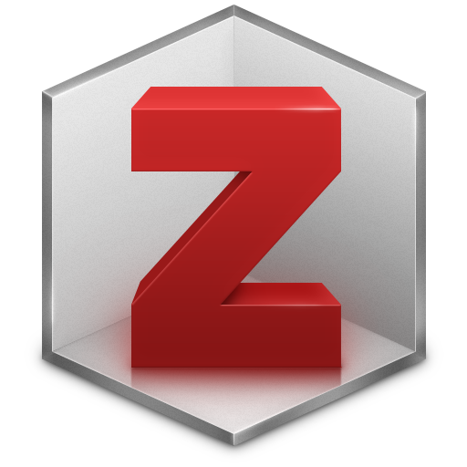

OSC Tutorial

#### Introduction to Zotero

Use an open source reference manager. (1h)

####  TOOLS & RESOURCES


#### OpenAlex

All the world's research, connected and open.

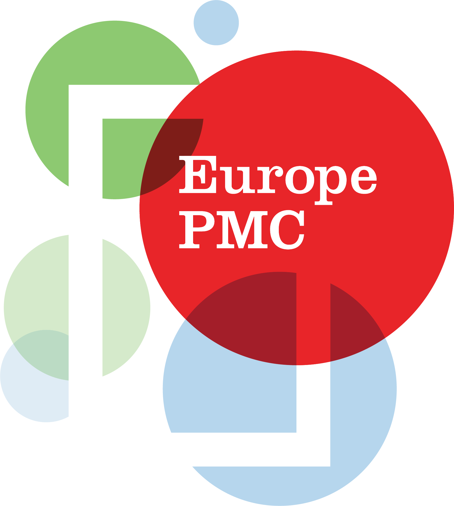

#### Europe PubMed Central

Comprehensive access to life sciences literature.

### 1.1.2 Preregistrations

A **preregistration** typically consists of a hypothesis and predictions, a plan for data collection (when relevant), and a plan for data analysis, that researchers upload onto a registry before starting their projects, often in order to increase the rigor of confirmatory research (see [1.4.1. Pre-analysis planning](#sec-study-design-analysis-plan)).

- **Get insight into projects that are not (yet) published**, either currently ongoing or abandoned, by looking for projects that were preregistered. Projects that are left unpublished typically have a note attached to their preregistration. Some registries are discipline-specific while others are discipline-agnostic (see below).

####  TOOLS & RESOURCES


#### Open Science Framework

Registry of preregistrations. Widely used across fields.


#### AsPredicted

Registry of simple preregistrations

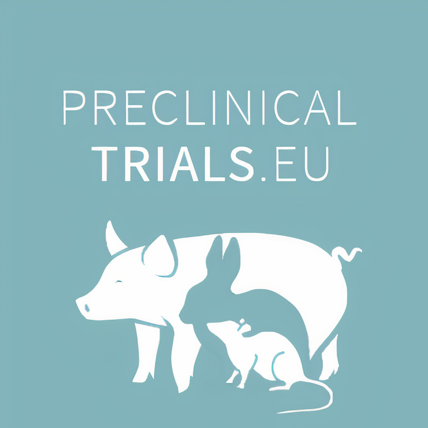

#### PreclinicalTrials.eu

Registry of preclinical animal study protocols.

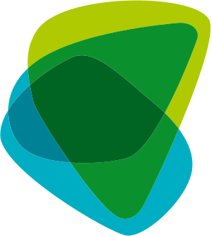

#### AnimalStudyRegistry.org

Registry of animal studies.

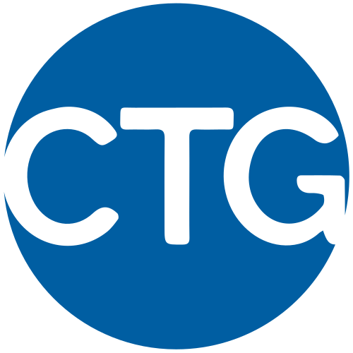

#### ClinicalTrials.gov

Registry of clinical trial protocols.

### 1.1.3 Data

##### How to find existing datasets?

- **Search for discipline-specific repositories on [re3data](https://www.re3data.org/)** which is a central registry of many repositories
- **Explore subject agnostic repositories** such as [DataCite](https://datacite.org/), [FigShare](https://figshare.com/browse), [Open Science Framework (OSF)](https://osf.io/search), or [Zenodo](https://zenodo.org/).

These platforms either give you access to existing data or provide ***metadata*** and explanations on how to request access to the data.

> **NOTE:**
>
> ***Metadata*** are data about your data, such as author, date, measurement device, unit of measurement, context of data collection, etc.

##### How to reuse a dataset?

- **Review the license and data use agreement.** Make sure you understand what you are allowed to do with the data and under what conditions. Even if the license does not request attribution of the authors, scholarly norms require you to cite the source of the data for any of your work based on it.
- **Review metadata and documentation.** Make sure you know where your data comes from, how the data was collected and processed, and reflect on whether any of it poses problems for your research question.
- **Check what additional requirements the data sources have.** Sometimes, data providers request prospective data users to submit a preregistration prior to giving access to the data (see [1.4. Study Design & Analysis Plan](#sec-study-design-analysis-plan)).
- **Use the metadata to plan your analysis.** Review existing data dictionaries (or “codebooks”) and other documentation describing the variables, range of values, etc. If you plan to do a confirmatory analysis, do not look at the data to minimize ***confirmation or hindsight bias***; instead, prepare a pre-analysis plan (see [1.4. Study Design & Analysis Plan](#sec-study-design-analysis-plan)).

> **NOTE:**
>
> ***Confirmation bias***: The tendency to seek, interpret, and remember information that confirms one’s existing beliefs or expectations.
>
> ***Hindsight bias*** Seeing past events as predictable after the outcome is known (“I knew it all along”).

####  TOOLS & RESOURCES


#### re3data

Registry of research data repositories.


#### DataCite Commons

Discovery tool connecting works, people, and organizations.


#### Fig Share

General-purpose repository for data, software, reports.


#### Open Science Framework

General-purpose repository for data, materials, reports.


#### Zenodo

General-purpose repository for data, software, reports.

### 1.1.4 Code

**Find code available for reuse** archived on [Zenodo](https://zenodo.org/), [Software Heritage](https://www.softwareheritage.org) or actively developed on [GitHub](https://github.com/) and other code repositories. Start learning Git version control now or learn to take advantage of more collaborative features on the GitHub platform in more details in [3. Analyze & Collaborate](../../training/research-cycle-handbook/03-analyze-and-collaborate.llms.md).

> **IMPORTANT:**
>
> Code publicly visible on GitHub without a license or equivalent text explicitly stating permission for reuse cannot legally be redistributed, and reusing it in work you publish yourself requires the authors’ permission. It is best to ask the authors to add an **open license** to their repository to explicitly allow reuse (to do this, they can, for instance, add a file called LICENSE.txt with the [Apache 2.0 license text](https://www.apache.org/licenses/LICENSE-2.0.txt) - see our [code publishing tutorial](https://lmu-osc.github.io/code-publishing/choose-license.html) to learn more about licenses).

####  LEARN MORE


OSC Tutorial

#### Git Tutorial

Use version control system Git from within RStudio. (2h)


OSC Tutorial

#### GitHub Tutorial

Collaborative coding with GitHub and RStudio (1h)


OSC Tutorial

#### Code Publishing

Add README and license to a reproducible project (2h)

####  TOOLS & RESOURCES


#### Zenodo

General-purpose repository for data, software, reports.

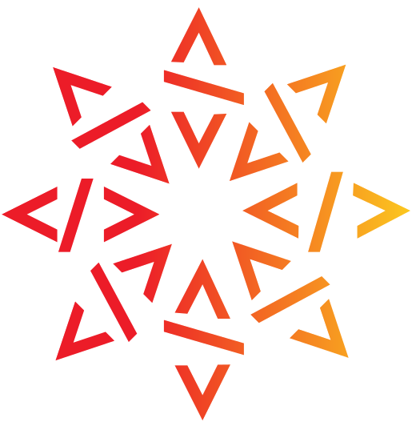

#### Software Heritage

Collects, preserves, and shares software in source code form.


#### GitHub

Cloud-based platform to collaborate on code.

## 1.2 Legal Requirements

### 1.2.1 LMU guidelines

The [LMU Guidelines for Safeguarding Good Scientific Practice](https://cms-cdn.lmu.de/media/contenthub/amtliche-veroeffentlichungen/gwp-ordnung.pdf) are legally binding for all academics, researchers, research support staff, teachers, and students at LMU Munich. Only the original text in German prevails, but we provide an English summary of relevant aspects for this guide:

##### Appropriate level of documentation and standards to allow ***reproduction***:

- **Reproducible methods must be used.** (§11)
- When research software is developed, its source code must be documented. (§12)

##### Appropriate level of documentation and standards to allow ***replication***:

- All information relevant to the production of a research result must be documented comprehensively to enable replication. (§7 and §12)
- If specific professional recommendations exist for review and evaluation, the results must be documented in accordance with these respective specifications. (§12)
- Individual results that do not support the hypothesis must also be documented; **a selection of results is not permitted**. (§12)

##### Public access to research results:

- Apart from specific exceptions, **all findings should be made public**. For this, they must be described in a detailed and comprehensible manner which includes making available the research data, materials and information on which the results are based, as well as the methods used and the software employed (including appropriately licensed self-written software) **according to the *FAIR principles***. (§13)
- Data, material, software made publicly accessible must be appropriately archived, usually for a period of 10 years (§17).

In later sections, you will acquire skills in data management and reproducible workflow that will enable you to comply with these guidelines and the ***FAIR principles***.

> **NOTE:**
>
> The ***FAIR principles*** are defined as:
>
> - **F**indable: ***metadata*** should be deposited in a searchable repository and be assigned a permanent identifier\
> - **A**ccessible: the data is either open, or accessible upon some authentication process, or closed, but with open ***metadata***.\
> - **I**nteroperable: the data is described with a standard terminology (so the dataset can be merged with other ones) and saved in a stable file format\
> - **R**eusable: the data is richly documented (e.g. with a data dictionary) and is accompanied by a data usage license See <https://www.go-fair.org/fair-principles/> for more information.
>
> ***Metadata*** are data about your data, such as author, date, measurement device, unit of measurement, context of data collection, etc.
>
> ***Reproducibility***: The ability of a researcher to re-derive the same results using the *same data and methods*; also known as computational reproducibility.
>
> ***Replicability***: The ability of an independent researcher to achieve results consistent with the original study by following the same experimental or analytical approach but collecting *new data*.

####  TOOLS & RESOURCES


#### LMU Guidelines for Safeguarding Good Scientific Practice

Implementation of the German Research Foundation's (DFG) Code of Conduct

### 1.2.2 Funders

- **Check all funders’ open science requirements.** Funders may have additional requirements on top of those indicated in the LMU guidelines. For instance, some funding lines request a Research Data Management plan before making their second payment, some specify the extent and timing of data sharing and provide funds for such activity.

- **Contact the [LMU Research Funding Unit](https://www.lmu.de/en/research/research-services/contact.html) to review your grant proposal** and assess if your proposal is meeting your funders’ open science requirements.

### 1.2.3 Ethics

Data collection and analyses involving human participants or animal subjects typically require approval from ethics committees to ensure responsible conduct and the protection of data.

#####  Your ethics proposal will typically include information on:

- **Data storage and retention** – outlining how data will be securely stored, backed up, and retained over time. This information can be extracted from a more detailed Research Data Management plan (see [1.3. Research Data Management Plans](#sec-research-data-management)).
- **Risks if the data were leaked** – identifying potential consequences for participants or the research project if confidentiality is breached.
- **Data anonymization** – describing procedures to remove or obscure personally identifiable information to protect participant privacy (see [2.3.2. Anonymization](../../training/research-cycle-handbook/02-collect-and-manage.llms.md#sec-ethics-and-privacy) for options, from simple techniques of anonymization to the creation of synthetic data).
- **Informed consent forms language** – ensuring that participants clearly understand the purpose, procedures, and any potential risks of the study. Conditions for sharing their data should be clearly explained here (see [2.3.1. Informed Consent](../../training/research-cycle-handbook/02-collect-and-manage.llms.md#sec-ethics-and-privacy)).
- **Power analysis** to justify sample size – providing a statistical rationale for the number of participants, which supports the validity and ethical justification of the study. This, and more detailed information on the statistical plan, can be extracted from your pre-analysis plan (see [1.4.1. Pre-analysis planning](#sec-study-design-analysis-plan) and [1.4.3. Power analyses](#sec-study-design-analysis-plan)).

For data protection guidance, contact the [LMU Data Protection Officer](https://www.lmu.de/en/about-lmu/structure/organizational-structure/officers-representatives-and-contact-persons/data-protection-officer.html) or the [Research Data Management team of the University Library](https://www.en.ub.uni-muenchen.de/writing/research_data/research-data-management/index.html).

> **TIP:**
>
> - **Share templates and example resources amongst team members.** For example, include previously approved ethics proposals, approved Data Protection Impact Assessment forms, or Data Management Plans on a common server space.
> - **Create Standard Operating Procedures (SOPs) for the team** for processes such as appropriate anonymization technique for a specific data type, power analyses script for common analyses, define when a data management plan must be updated, who is responsible, and how updates are reviewed/approved and communicated.

####  LEARN MORE


OSC Tutorial

#### Data Management Plans

Overview of components, tips, and tools. (30 min)


OSC Tutorial

#### Data Anonymization

Implement data anonymization techniques in R. (3h)


OSC Tutorial

#### Power Analysis

Data simulations for GLMs, LMEs, and SEMs in R. (6h)

## 1.3 Research Data Management Plans

A **Data Management Plan (DMP)** documents how you will handle research data throughout your project. Writing a DMP prompts you to think and document decisions you might otherwise leave implicit.

- **Decide *before* data collection whether you will eventually share your data publicly (and where)**, in order to (i) get ethics approval on the right plan, (ii) design consent forms for participants, (iii) collect appropriate metadata for the target repository, etc.
- **Start with what you know, and refine the details as your project develops.** Your DMP is a living document that you will refine to match the reality of your project while ensuring data protection and streamline collaborations (see [2.2. Data Management](../../training/research-cycle-handbook/02-collect-and-manage.llms.md#sec-data-management), [3.1. Data Processing & Analysis](../../training/research-cycle-handbook/03-analyze-and-collaborate.llms.md#sec-data-processing-analysis), and [4.1. FAIR Data Sharing](../../training/research-cycle-handbook/04-preserve-and-share.llms.md#sec-fair-data-sharing)).

###  Your DMP will ask:

- **What data** will you collect or generate (types, formats, volume, sources)? See [2.1. Data Collection](../../training/research-cycle-handbook/02-collect-and-manage.llms.md#sec-data-collection).
- **How will you describe it** (metadata standards, documentation practices)? See [2.2. Data Management](../../training/research-cycle-handbook/02-collect-and-manage.llms.md#sec-data-management) for these and the next questions.
- **How will you organize files** (naming conventions, folder structure, versioning)?
- **Where will you store it** (locations, backups, access controls)?
- **How will you ensure quality** (validation checks, error-handling)?
- **How will you share outputs** (repositories, licenses, embargo periods)? See our lecture “[Why share data openly?](https://lmu-osc.github.io/training/data-management/open-data.html)” and [4.1. FAIR Data Sharing](../../training/research-cycle-handbook/04-preserve-and-share.llms.md#sec-fair-data-sharing)
- **What constraints apply** (consent, anonymization, GDPR, data use agreements)? See our lecture “[Maintaining privacy with open data](https://lmu-osc.github.io/training/data-management/maintaining-privacy-with-open-data.html)”, [1.2.3. Ethics](#sec-legal-requirements) and [2.3. Ethics & Privacy](../../training/research-cycle-handbook/02-collect-and-manage.llms.md#sec-ethics-and-privacy).

The specific questions vary by discipline, data type, and funder requirements. DMP tools like [RDMO](https://rdmo.ub.lmu.de/) guide you through the relevant questions with funder-specific templates.

> **TIP:**
>
> - **Share templates and example DMP amongst team members** on a common server space.
> - **Create Standard Operating Procedures for the team.** Define when a data management plan must be updated, who is responsible, and how updates are reviewed/approved and communicated.

####  LEARN MORE


OSC Lecture

#### Why share data openly?

An introduction to the what, why, and how to make data open (30 min)


OSC Lecture

#### Maintaining Privacy with Open Data

How to make data open without revealing sensitive information (1h)


OSC Tutorial

#### Data Management Plans

Overview of components, tips, and tools. (30 min)

####  TOOLS & RESOURCES


Supported at LMU

#### RDMO

Funder-compliant DMP templates (e.g. DFG, ERC).


#### RIOjournal

Examples of DMPs by discipline.

## 1.4 Study Design & Analysis Plan

### 1.4.1 Pre-analysis planning

##### Why should you plan your statistical plan prior to collecting data?

Humans are prone to cognitive biases such as **confirmation bias** (seeking information that supports existing beliefs) and **hindsight bias** (believing outcomes were predictable after the fact). In research, these biases can distort findings, especially when researchers make analytic decisions after seeing results. Although statistical testing typically accepts a 5% false positive rate, **“researcher degrees of freedom”** — choices about data collection, exclusions, transformations, sample size, covariates, etc. — can dramatically inflate false positives when decisions are made post hoc. Practices like increasing sample size until reaching statistical significance, selectively removing outliers, or trying multiple analytic strategies **increase the likelihood of false-positive results**. See how easy it is to find false “significant” results by using our [p-hacking tool](https://shinyapps.org/apps/p-hacker/).

The core problem is that analyses guided by observed outcomes allow biases to influence decisions, making many reported effects unreliable. A key **remedy is transparency and preregistration.**

##### Benefits of preregistration

Preregistration, that is, specifying hypotheses, methods, and analysis plans before data collection or analysis, limits bias in confirmatory testing while still allowing exploratory analyses, clearly **distinguishing robust hypothesis tests from hypothesis-generating work**. This improves credibility, limits false positives, and often leads to better study design through **early methodological feedback**.

Preregistration can be beneficial for various type of studies, including:

- experimental studies (i.e. studies with a manipulated variable): it will define what will be your confirmatory analysis and strengthens your claim
- observational or exploratory studies: it will help you move along the exploratory-confirmatory continuum
- qualitative studies: it will provide a way to document e.g. your positionality towards a subject in the course of a project.

#####  What is included in a preregistration?

Several [preregistration templates](https://help.osf.io/article/330-welcome-to-registrations) exist. While the [standard Open Science Framework (OSF) preregistration template](https://docs.google.com/document/d/1gkN0Jp6Gu7GIA4Ne4YCDZ61nCLQRgt32moRdUg9AnVg/edit?tab=t.0#heading=h.fwbi14d4b65g) is most commonly used, some are tailored for specific field or specific methods (e.g. systematic review, qualitative work, secondary data analysis).

Your preregistration will define your study’s:

- **Hypothesis and predictions**
- **Data collection procedures**
- **Sample size and stopping rule**
- **Variables** (manipulated, measured, indices)
- **Statistical method** (model, dependent and independent variables, covariables, transformations)
- **Data exclusion criteria**
- **How to deal with missing data**

A great tool to create your statistical plan, especially for early career researchers still learning statistics and needing feedback from supervisors, collaborators, or statisticians on their design, is to **simulate data, and write the possible statistical tests to analyze that data** (see [1.4.2. Simulation of data](#sec-study-design-analysis-plan) and [1.4.3. Power analyses](#sec-study-design-analysis-plan)). Including an analyses script (developed on simulated data) with your preregistration is optional but recommended.

To get support with planning your analytical approach, you can book a consultation with the [LMU statistical consulting unit (StaBLab)](https://www.stat.lmu.de/stablab/de/).

##### Publishing process

Once your study plan is finalized:

- **Submit your preregistration before collecting new or analyzing existing data.** You can do so on discipline specific registries (see [1.1.2. Preregistrations](#sec-explore-and-reuse)) or discipline agnostic repositories such as the [OSF](https://osf.io/).
- **Embargo your plan if you are concerned about scooping.** On the OSF, your preregistration can be kept private for a predetermined amount of time, and for a maximum of 4 years.
- **Include your preregistration’s DOI in your manuscript.** Make your registration public upon the publication of your manuscript.

Creating a preregistration improves transparency and allows for valuable **early feedback from collaborators**. An even stronger approach is **submitting preregistrations directly to journals** (then called **“Registered Reports”**), enabling peer review at a stage where methodological adjustments are still possible.

##### Registered Reports

Registered Reports are a publication format, now adopted by over 300 journals (see [participating journals](https://www.cos.io/initiatives/registered-reports)), where **preregistrations are peer-reviewed before data collection**. Reviewers evaluate the hypotheses, methods, and planned analyses, allowing methodological improvements. If the plan is approved, the journal grants in-principle acceptance, meaning publication is guaranteed provided researchers follow the protocol.

After completing the study, authors add results and discussion sections, clearly separating preregistered confirmatory analyses from exploratory ones. Final review focuses on adherence to the approved plan and the validity of conclusions, not on whether results are significant. This model **shifts incentives toward asking important questions and using rigorous methods rather than chasing striking or ‘novel’ outcomes**.

####  LEARN MORE


OSC Tutorial

#### TBA: Preregistration tutorial

Step-by-step guide to creating preregistration. (Xh)

####  TOOLS & RESOURCES


OSC Tool

#### P-hacking tool

Interactive app to realize how easy it is to find false "significant" results.


#### Center for Open Science

List of journals offering Registered Reports.


#### Open Science Framework

Preregistration templates, embargoes, file storage.

### 1.4.2 Simulation of Data

In our context, a computer simulation is the generation of artificial data to build up an understanding of real data and the statistical models we use to analyze them. You can simulate data to:

- **Test your statistical intuition or demonstrate mathematical properties you cannot easily anticipate**.\
  *Example: Check whether there are more than 5% significant effects (assuming \\\alpha = .05\\) when random data from \\H_0\\ are generated.*

- **Understand sampling theory and probability distributions or test whether you understand the underlying processes of your system.**\
  *Example: See whether simulated data drawn from specific distributions is comparable to real data.*

- **Perform power analyses.**\
  *Example: Assess whether the sample size (within a simulation repetition) is high enough to detect a simulated effect in more than 80% of the cases. (see [1.4.3. Power analyses](#sec-explore-and-reuse))*

- **Prepare a pre-analysis plan.**\
  *Example: To strengthen your planned confirmatory analyses before collecting data, consider sharing a simulated dataset with a statistician or mentor. This allows for specific feedback on suitable statistical tests. The resulting analysis code can accompany your preregistration or registered report (see [1.4.1. Pre-analysis planning](#sec-explore-and-reuse)) so reviewers can clearly see your intended approach. When real data are collected, they can be directly substituted into the code to generate results.*

Generating an artificial dataset in R (see our [simulation tutorial](https://lmu-osc.github.io/Introduction-Simulations-in-R/)) is much easier than you might think and is often very helpful, even when you need to make assumptions about variable distribution or when the parameter space is not well known.

####  LEARN MORE


OSC Tutorial

#### R Tutorial

Learn R programming. (3h)


OSC Tutorial

#### Data simulation in R

Easy data simulations in R. (2h)

### 1.4.3 Power analyses

Power analysis is relevant whether you are designing a project from scratch or running an analysis on already existing data. There are two main types of power analyses:

##### A priori power analysis

**Simulate data to calculate the smallest sample size required to detect the smallest effect of interest.** See our [advanced power analyses tutorial using R](https://lmu-osc.github.io/Simulations-for-Advanced-Power-Analyses/).

For a very basic power calculation, you can use simple R functions if you know 3 out of 4 of these parameters:

- required sample size *n* (usually the one missing)
- desired power *1 - β* (default 0.80)
- the alpha level *α* (default 0.05)
- the expected effect size (has to be estimated or extracted from the literature on the form of *d*, *f*, etc.)

To get support with pre-analysis planning, you can book a consultation with the [LMU statistical consulting unit (StaBLab)](https://www.stat.lmu.de/stablab/de/).

##### Post-hoc power analysis

**Compute a post-hoc power when you are not be able to control the sample size for your project.** Beware: This power computation comes in two flavors - one is legitimate, and one is flawed and not defensible.

The **legitimate post-hoc power** is computed with your actual *n*, and the same effect size that you plugged into your a-priori power analysis. This analysis gives you the achieved power to detect your assumed effect.

The **flawed version of post-hoc power** is called **“observed power”**: If an analysis yields a non-significant result, some researchers calculate the post-hoc power, but plug in the observed effect size. “Observed power”, however, is just a one‑to‑one function of the *p*‑value (a non-significant *p*-value returns a low power \< 50 %, a just significant *p*‑value of .05 always yields a power of exactly 50%). Observed power adds no new information to the *p*‑value and is essentially meaningless. Do not compute this type of post-hoc power!

####  LEARN MORE


OSC Tutorial

#### R Tutorial

Learn R programming. (3h)


OSC Tutorial

#### Power Analyses

Data simulations for GLMs, LMEs, and SEMs in R. (6h)

##  Plan & Design Checklist

To complete before presenting your final study plan to your research group and, if applicable, submitting your ethics proposal and/or preregistration. Not all items are relevant for all fields of research or study types.

**Background Information**

Literature reviewed

Existing research outputs searched

Funder’s Open Science requirements identified

Ethics committee instructions consulted

**Study Design**

Research questions clearly defined

Hypotheses and predictions specified

Study design chosen and justified

Variables and measures to collect identified

Analysis plan prepared (with simulated data)

Sample size determined (with power analysis)

Inclusion/exclusion criteria defined

Handling of missing data defined

**Data Management Planning**

Data storage and backup solutions documented

File organization and naming conventions established

Anonymization procedures defined

Repository for data publishing selected

**Project Management**

Team roles and responsibilities defined

Resources needed for the project identified

Timeline estimated and milestones defined

**Before Data Collection**

Data Management Plan completed

Consent forms prepared

Preregistration submitted

Ethical approval obtained

[Download checklist ](assets/checklists/01-Plan-Design-Checklist.docx)

# 2 Collect & Manage

![](data:image/svg+xml;base64,PHN2ZyB3aWR0aD0iMTA1Ljk0OTg1bW0iIGhlaWdodD0iMTA2LjM1NjgybW0iIHZpZXdib3g9IjAgMCAxMDUuOTQ5ODUgMTA2LjM1NjgyIiB2ZXJzaW9uPSIxLjEiIGlkPSJzdmcxIiBzcGFjZT0icHJlc2VydmUiIHNvZGlwb2RpOmRvY25hbWU9Im9zLWN5Y2xlLnN2ZyIgaW5rc2NhcGU6dmVyc2lvbj0iMS40LjIgKDE6MS40LjIrMjAyNTA1MTIwNzM3K2ViZjBlOTQwZDApIiB4bWxuczppbmtzY2FwZT0iaHR0cDovL3d3dy5pbmtzY2FwZS5vcmcvbmFtZXNwYWNlcy9pbmtzY2FwZSIgeG1sbnM6c29kaXBvZGk9Imh0dHA6Ly9zb2RpcG9kaS5zb3VyY2Vmb3JnZS5uZXQvRFREL3NvZGlwb2RpLTAuZHRkIiB4bWxucz0iaHR0cDovL3d3dy53My5vcmcvMjAwMC9zdmciIHhtbG5zOnN2Zz0iaHR0cDovL3d3dy53My5vcmcvMjAwMC9zdmciPjxuYW1lZHZpZXcgaWQ9Im5hbWVkdmlldzEiIHBhZ2Vjb2xvcj0iI2ZmZmZmZiIgYm9yZGVyY29sb3I9IiM2NjY2NjYiIGJvcmRlcm9wYWNpdHk9IjEuMCIgaW5rc2NhcGU6c2hvd3BhZ2VzaGFkb3c9IjIiIGlua3NjYXBlOnBhZ2VvcGFjaXR5PSIwLjAiIGlua3NjYXBlOnBhZ2VjaGVja2VyYm9hcmQ9IjAiIGlua3NjYXBlOmRlc2tjb2xvcj0iI2QxZDFkMSIgaW5rc2NhcGU6ZG9jdW1lbnQtdW5pdHM9Im1tIiBpbmtzY2FwZTp6b29tPSIxLjkwMjM4MzEiIGlua3NjYXBlOmN4PSIzNzUuNTgxNTUiIGlua3NjYXBlOmN5PSIyMjIuMDg5ODYiIGlua3NjYXBlOndpbmRvdy13aWR0aD0iMzQ0MCIgaW5rc2NhcGU6d2luZG93LWhlaWdodD0iMTQwMyIgaW5rc2NhcGU6d2luZG93LXg9IjE5MjAiIGlua3NjYXBlOndpbmRvdy15PSIwIiBpbmtzY2FwZTp3aW5kb3ctbWF4aW1pemVkPSIxIiBpbmtzY2FwZTpjdXJyZW50LWxheWVyPSJnMTIiPjwvbmFtZWR2aWV3PjxkZWZzIGlkPSJkZWZzMSI+PHJlY3QgeD0iNDQxLjAyNTc5IiB5PSIxMjYuNjgzMjEiIHdpZHRoPSIxNTguMjIyNiIgaGVpZ2h0PSI5MS45ODk4ODMiIGlkPSJyZWN0MTMiIC8+PGNsaXBwYXRoIGlkPSJwMjUuMyI+PHBhdGggZD0iTSAwLDAgSCAyNTAwIFYgMjUwMCBIIDAgWiIgY2xpcC1ydWxlPSJldmVub2RkIiBpZD0icGF0aDk1IiAvPjwvY2xpcHBhdGg+PHJlY3QgeD0iNDQxLjAyNTc5IiB5PSIxMjYuNjgzMjEiIHdpZHRoPSIyMDguMTU5OTciIGhlaWdodD0iMTA1LjEzMTMiIGlkPSJyZWN0MTMtOSIgLz48cmVjdCB4PSI0NDEuMDI1NzkiIHk9IjEyNi42ODMyMSIgd2lkdGg9IjIwNi41ODI5OSIgaGVpZ2h0PSI5My41NjY4NDkiIGlkPSJyZWN0MTMtMCIgLz48cmVjdCB4PSI0NDEuMDI1NzkiIHk9IjEyNi42ODMyMSIgd2lkdGg9IjE3Mi45NDA5OCIgaGVpZ2h0PSIxMjMuNTI5MjgiIGlkPSJyZWN0MTMtMyIgLz48L2RlZnM+PGcgaW5rc2NhcGU6bGFiZWw9IkxheWVyIDEiIGlua3NjYXBlOmdyb3VwbW9kZT0ibGF5ZXIiIGlkPSJsYXllcjEiIHRyYW5zZm9ybT0idHJhbnNsYXRlKC0zMjkuNzYxMzMsLTY4LjkwODc3MykiPjxnIGlkPSJnMTMiIHRyYW5zZm9ybT0ibWF0cml4KDAuMjY0NTgzMzMsMCwwLDAuMjY0NTgzMzMsLTQ5LjU2NzMxLC01LjMwNjU4ODYpIiBzdHlsZT0iZmlsbDpub25lO3N0cm9rZTpub25lO3N0cm9rZS1saW5lY2FwOnNxdWFyZTtzdHJva2UtbWl0ZXJsaW1pdDoxMCIgaW5rc2NhcGU6bGFiZWw9Im9wZW4tcmVzZWFyY2gtY3ljbGUiPjxnIGlkPSJnMTIiIHRyYW5zZm9ybT0idHJhbnNsYXRlKC0xMS4xMjkxMTEsNC40NTk0MTI5KSIgaW5rc2NhcGU6bGFiZWw9InBoYXNlcyI+PGEgaHJlZj0iLi4vLi4vdHJhaW5pbmcvcmVzZWFyY2gtY3ljbGUtaGFuZGJvb2svMDQtcHJlc2VydmUtYW5kLXNoYXJlLmh0bWwiPjxnIGlkPSJwaGFzZS00IiBpbmtzY2FwZTpsYWJlbD0icGhhc2UtNCIgY2xhc3M9InBoYXNlLWdyb3VwIiByb2xlPSJidXR0b24iIHRhYmluZGV4PSIwIiB0cmFuc2Zvcm09InRyYW5zbGF0ZSgwLC0wLjM0NTkzNSkiIHN0eWxlPSJmaWxsOiMwMGMwNTc7ZmlsbC1vcGFjaXR5OjEiPjxwYXRoIGlkPSJwYXRoNSIgc3R5bGU9ImRpc3BsYXk6aW5saW5lO2ZpbGw6IzAwYzA1NztmaWxsLW9wYWNpdHk6MSIgaW5rc2NhcGU6bGFiZWw9InBoYXNlLTQtcXVhcnRlciIgZD0iTSAxNjM5LjE4NzIgMjc4LjA2NTIyIEMgMTUzMi41NzI4IDI3OC4wNjUyMiAxNDQ2LjE0NjIgMzY0LjQ5MTg2IDE0NDYuMTQ2MiA0NzEuMTA2MjQgTCAxNTkzLjE1MiA0NzEuMTA2MjQgTCAxNjM5LjE4NzIgNDI1LjM4NTUzIEwgMTYzOS4xODcyIDI3OC4wNjUyMiB6ICIgLz48dGV4dCBzcGFjZT0icHJlc2VydmUiIGlkPSJ0ZXh0MTMtMyIgc3R5bGU9ImZvbnQtc3R5bGU6bm9ybWFsO2ZvbnQtdmFyaWFudDpub3JtYWw7Zm9udC13ZWlnaHQ6Ym9sZDtmb250LXN0cmV0Y2g6bm9ybWFsO2ZvbnQtc2l6ZToyOS4zMzMzcHg7bGluZS1oZWlnaHQ6MC45NTtmb250LWZhbWlseTpzYW5zLXNlcmlmOy1pbmtzY2FwZS1mb250LXNwZWNpZmljYXRpb246JiMzOTtTYW5zLCBCb2xkJiMzOTs7Zm9udC12YXJpYW50LWxpZ2F0dXJlczpub3JtYWw7Zm9udC12YXJpYW50LWNhcHM6bm9ybWFsO2ZvbnQtdmFyaWFudC1udW1lcmljOm5vcm1hbDtmb250LXZhcmlhbnQtZWFzdC1hc2lhbjpub3JtYWw7dGV4dC1hbGlnbjpjZW50ZXI7bGV0dGVyLXNwYWNpbmc6MHB4O3dvcmQtc3BhY2luZzowcHg7d2hpdGUtc3BhY2U6cHJlO3NoYXBlLWluc2lkZTp1cmwoI3JlY3QxMy0zKTtkaXNwbGF5OmlubGluZTtmaWxsOiNmZmZmZmY7ZmlsbC1vcGFjaXR5OjE7c3Ryb2tlOm5vbmU7c3Ryb2tlLWxpbmVjYXA6c3F1YXJlO3N0cm9rZS1taXRlcmxpbWl0OjEwIiB0cmFuc2Zvcm09InRyYW5zbGF0ZSgxMDIyLjc2NjcsMjUyLjY2NTQxKSIgaW5rc2NhcGU6bGFiZWw9InBoYXNlLTQtdGV4dCI+PHRzcGFuIHg9IjQ0Ny4yNDAxOCIgeT0iMTQ4Ljk3MzI0IiBpZD0idHNwYW4xIj40LiBQcmVzZXJ2ZSA8L3RzcGFuPjx0c3BhbiB4PSI0NzEuMDczNDkiIHk9IjE3Ni44Mzk4OCIgaWQ9InRzcGFuMiI+JmFtcDsgU2hhcmU8L3RzcGFuPjwvdGV4dD48L2c+PC9hPjxhIGhyZWY9Ii4uLy4uL3RyYWluaW5nL3Jlc2VhcmNoLWN5Y2xlLWhhbmRib29rLzAzLWFuYWx5emUtYW5kLWNvbGxhYm9yYXRlLmh0bWwiPjxnIGlkPSJwaGFzZS0zIiBzdHlsZT0iZmlsbDojZmZjMDAwO2ZpbGwtb3BhY2l0eToxO3N0cm9rZTpub25lO3N0cm9rZS1saW5lY2FwOnNxdWFyZTtzdHJva2UtbWl0ZXJsaW1pdDoxMCIgaW5rc2NhcGU6bGFiZWw9InBoYXNlLTMiIHRyYW5zZm9ybT0idHJhbnNsYXRlKDMuMTMzMjIzMmUtNSwtMC4yNDgxMzUpIiBjbGFzcz0icGhhc2UtZ3JvdXAiIHJvbGU9ImJ1dHRvbiIgdGFiaW5kZXg9IjAiPjxwYXRoIGlkPSJwYXRoMTMiIHN0eWxlPSJkaXNwbGF5OmlubGluZTtmaWxsOiNmZmMwMDA7ZmlsbC1vcGFjaXR5OjEiIGlua3NjYXBlOmxhYmVsPSJwaGFzZS0zLXF1YXJ0ZXIiIGQ9Ik0gMTQ0Ni4xNDYxIDQ4My42NDMyIEMgMTQ0Ni4xNDYxIDU5MC4yNTc1OCAxNTMyLjU3MjcgNjc2LjY4NDIyIDE2MzkuMTg3MSA2NzYuNjg0MjIgTCAxNjM5LjE4NzEgNTI5LjY2MjczIEwgMTU5My40ODAxIDQ4My42NDMyIEwgMTQ0Ni4xNDYxIDQ4My42NDMyIHogIiAvPjx0ZXh0IHNwYWNlPSJwcmVzZXJ2ZSIgaWQ9InRleHQxMy0wIiBzdHlsZT0iZm9udC1zdHlsZTpub3JtYWw7Zm9udC12YXJpYW50Om5vcm1hbDtmb250LXdlaWdodDpib2xkO2ZvbnQtc3RyZXRjaDpub3JtYWw7Zm9udC1zaXplOjI5LjMzMzNweDtsaW5lLWhlaWdodDowLjk1O2ZvbnQtZmFtaWx5OnNhbnMtc2VyaWY7LWlua3NjYXBlLWZvbnQtc3BlY2lmaWNhdGlvbjomIzM5O1NhbnMsIEJvbGQmIzM5Oztmb250LXZhcmlhbnQtbGlnYXR1cmVzOm5vcm1hbDtmb250LXZhcmlhbnQtY2Fwczpub3JtYWw7Zm9udC12YXJpYW50LW51bWVyaWM6bm9ybWFsO2ZvbnQtdmFyaWFudC1lYXN0LWFzaWFuOm5vcm1hbDt0ZXh0LWFsaWduOmNlbnRlcjtsZXR0ZXItc3BhY2luZzowcHg7d29yZC1zcGFjaW5nOjBweDt3aGl0ZS1zcGFjZTpwcmU7c2hhcGUtaW5zaWRlOnVybCgjcmVjdDEzLTApO2Rpc3BsYXk6aW5saW5lO2ZpbGw6I2ZmZmZmZjtmaWxsLW9wYWNpdHk6MSIgdHJhbnNmb3JtPSJ0cmFuc2xhdGUoMTAwNS42Mzc0LDM5My4wMzQ4NykiIGlua3NjYXBlOmxhYmVsPSJwaGFzZS0zLXRleHQiPjx0c3BhbiB4PSI0NTUuNzMwOCIgeT0iMTQ4Ljk3MzI0IiBpZD0idHNwYW4zIj4zLiBBbmFseXplICZhbXA7IDwvdHNwYW4+PHRzcGFuIHg9IjQ1OS40NzA4NCIgeT0iMTc2LjgzOTg4IiBpZD0idHNwYW40Ij5Db2xsYWJvcmF0ZTwvdHNwYW4+PC90ZXh0PjwvZz48L2E+PGEgaHJlZj0iLi4vLi4vdHJhaW5pbmcvcmVzZWFyY2gtY3ljbGUtaGFuZGJvb2svMDItY29sbGVjdC1hbmQtbWFuYWdlLmh0bWwiPjxnIGlkPSJwaGFzZS0yIiBpbmtzY2FwZTpsYWJlbD0icGhhc2UtMiIgY2xhc3M9InBoYXNlLWdyb3VwIiByb2xlPSJidXR0b24iIHRhYmluZGV4PSIwIiB0cmFuc2Zvcm09InRyYW5zbGF0ZSgwLDAuMjQ4MTM1KSIgc3R5bGU9ImZpbGw6I2NjMDA2NjtmaWxsLW9wYWNpdHk6MSI+PHBhdGggaWQ9InBhdGgxMSIgc3R5bGU9ImRpc3BsYXk6aW5saW5lO2ZpbGw6I2NjMDA2NjtmaWxsLW9wYWNpdHk6MSIgaW5rc2NhcGU6bGFiZWw9InBoYXNlLTItcXVhcnRlciIgZD0iTSAxNjk2LjgxNjEgNDgzLjE0NjkzIEwgMTY0OS43MzYgNTI5LjkwNDc0IEwgMTY0OS43MzYgNjc2LjE4Nzk1IEMgMTc1Ni4zNTA0IDY3Ni4xODc5NSAxODQyLjc3OSA1ODkuNzYxMzEgMTg0Mi43NzkgNDgzLjE0NjkzIEwgMTY5Ni44MTYxIDQ4My4xNDY5MyB6ICIgLz48dGV4dCBzcGFjZT0icHJlc2VydmUiIHRyYW5zZm9ybT0idHJhbnNsYXRlKDExOTUuMzkxNSwzOTMuODY2NzgpIiBpZD0idGV4dDEzLTIiIHN0eWxlPSJmb250LXN0eWxlOm5vcm1hbDtmb250LXZhcmlhbnQ6bm9ybWFsO2ZvbnQtd2VpZ2h0OmJvbGQ7Zm9udC1zdHJldGNoOm5vcm1hbDtmb250LXNpemU6MjkuMzMzM3B4O2xpbmUtaGVpZ2h0OjAuOTU7Zm9udC1mYW1pbHk6c2Fucy1zZXJpZjstaW5rc2NhcGUtZm9udC1zcGVjaWZpY2F0aW9uOiYjMzk7U2FucywgQm9sZCYjMzk7O2ZvbnQtdmFyaWFudC1saWdhdHVyZXM6bm9ybWFsO2ZvbnQtdmFyaWFudC1jYXBzOm5vcm1hbDtmb250LXZhcmlhbnQtbnVtZXJpYzpub3JtYWw7Zm9udC12YXJpYW50LWVhc3QtYXNpYW46bm9ybWFsO3RleHQtYWxpZ246Y2VudGVyO2xldHRlci1zcGFjaW5nOjBweDt3b3JkLXNwYWNpbmc6MHB4O3doaXRlLXNwYWNlOnByZTtzaGFwZS1pbnNpZGU6dXJsKCNyZWN0MTMtOSk7ZGlzcGxheTppbmxpbmU7ZmlsbDojZmZmZmZmO2ZpbGwtb3BhY2l0eToxO3N0cm9rZTpub25lO3N0cm9rZS1saW5lY2FwOnNxdWFyZTtzdHJva2UtbWl0ZXJsaW1pdDoxMCIgaW5rc2NhcGU6bGFiZWw9InBoYXNlLTItdGV4dCI+PHRzcGFuIHg9IjQ2My45Njk1NyIgeT0iMTQ4Ljk3MzI0IiBpZD0idHNwYW41Ij4yLiBDb2xsZWN0ICZhbXA7IDwvdHNwYW4+PHRzcGFuIHg9IjQ4NS45Njk1NCIgeT0iMTc2LjgzOTg4IiBpZD0idHNwYW42Ij5NYW5hZ2U8L3RzcGFuPjwvdGV4dD48L2c+PC9hPjxhIGhyZWY9Ii4uLy4uL3RyYWluaW5nL3Jlc2VhcmNoLWN5Y2xlLWhhbmRib29rLzAxLXBsYW4tYW5kLWRlc2lnbi5odG1sIj48ZyBpZD0icGhhc2UtMSIgaW5rc2NhcGU6bGFiZWw9InBoYXNlLTEiIHN0eWxlPSJmaWxsOm5vbmU7c3Ryb2tlOm5vbmU7c3Ryb2tlLWxpbmVjYXA6c3F1YXJlO3N0cm9rZS1taXRlcmxpbWl0OjEwIiB0cmFuc2Zvcm09InRyYW5zbGF0ZSgzLjEzMzIyMzJlLTUsMC4zNDU5MzUpIiBjbGFzcz0icGhhc2UtZ3JvdXAiIHJvbGU9ImJ1dHRvbiIgdGFiaW5kZXg9IjAiPjxwYXRoIGlkPSJwYXRoOSIgc3R5bGU9ImRpc3BsYXk6aW5saW5lO2ZpbGw6IzAwNjZmZjtmaWxsLW9wYWNpdHk6MSIgaW5rc2NhcGU6bGFiZWw9InBoYXNlLTEtcXVhcnRlciIgZD0iTSAxNjUwLjg3NjYgMjc3LjM3MzM1IEwgMTY1MC44NzY2IDQyNC4yOTUyMiBMIDE2OTYuNjgxMyA0NzAuNDE0MzcgTCAxODQzLjkxOTYgNDcwLjQxNDM3IEMgMTg0My45MTk2IDM2My43OTk5OSAxNzU3LjQ5MSAyNzcuMzczMzUgMTY1MC44NzY2IDI3Ny4zNzMzNSB6ICIgLz48dGV4dCBzcGFjZT0icHJlc2VydmUiIHRyYW5zZm9ybT0idHJhbnNsYXRlKDEyMjAuMDUyMywyNDkuOTY2NzIpIiBpZD0idGV4dDEzIiBzdHlsZT0iZm9udC1zdHlsZTpub3JtYWw7Zm9udC12YXJpYW50Om5vcm1hbDtmb250LXdlaWdodDpib2xkO2ZvbnQtc3RyZXRjaDpub3JtYWw7Zm9udC1zaXplOjI5LjMzMzNweDtsaW5lLWhlaWdodDowLjk1O2ZvbnQtZmFtaWx5OnNhbnMtc2VyaWY7LWlua3NjYXBlLWZvbnQtc3BlY2lmaWNhdGlvbjomIzM5O1NhbnMsIEJvbGQmIzM5Oztmb250LXZhcmlhbnQtbGlnYXR1cmVzOm5vcm1hbDtmb250LXZhcmlhbnQtY2Fwczpub3JtYWw7Zm9udC12YXJpYW50LW51bWVyaWM6bm9ybWFsO2ZvbnQtdmFyaWFudC1lYXN0LWFzaWFuOm5vcm1hbDt0ZXh0LWFsaWduOmNlbnRlcjtsZXR0ZXItc3BhY2luZzowcHg7d29yZC1zcGFjaW5nOjBweDt3aGl0ZS1zcGFjZTpwcmU7c2hhcGUtaW5zaWRlOnVybCgjcmVjdDEzKTtkaXNwbGF5OmlubGluZTtmaWxsOm5vbmU7c3Ryb2tlOm5vbmU7c3Ryb2tlLWxpbmVjYXA6c3F1YXJlO3N0cm9rZS1taXRlcmxpbWl0OjEwIiBpbmtzY2FwZTpsYWJlbD0icGhhc2UtMS10ZXh0Ij48dHNwYW4geD0iNDU2Ljc2MjExIiB5PSIxNDguOTczMjQiIGlkPSJ0c3BhbjgiPjx0c3BhbiBzdHlsZT0iZmlsbDojZmZmZmZmIiBpZD0idHNwYW43Ij4xLiBQbGFuICZhbXA7IDwvdHNwYW4+PC90c3Bhbj48dHNwYW4geD0iNDY5LjkzMjgiIHk9IjE3Ni44Mzk4OCIgaWQ9InRzcGFuMTAiPjx0c3BhbiBzdHlsZT0iZmlsbDojZmZmZmZmIiBpZD0idHNwYW45Ij5EZXNpZ248L3RzcGFuPjwvdHNwYW4+PC90ZXh0PjwvZz48L2E+PC9nPjxwYXRoIGQ9Im0gMTYxMS42NjgxLDQ0NC4zNjQxMyAyOC43NzA3LDUuNjg3MTUgLTEyLjk5NTEsMjYuMjkxMSAtNS4xNDYsLTEwLjQzMTM4IGMgLTkuMzMyNiw1Ljg1NzYxIC0xMi45MjM5LDE3Ljk4OTE3IC03Ljk0MjIsMjguMDg3NDUgNS4zMTcsMTAuNzc3OSAxOC40MTA1LDE1LjIyMDUgMjkuMTg2Miw5LjkwNDYzIDEwLjc3NTcsLTUuMzE1ODcgMTUuMjE4MywtMTguNDA5NDQgOS45MDI0LC0yOS4xODUxMSAtMS41MjMxLC0zLjA4NzM5IC0wLjI1NTUsLTYuODIzMTYgMi44MzE4LC04LjM0NjI0IDMuMDg3NCwtMS41MjMwNyA2LjgyMzIsLTAuMjU1NTQgOC4zNDYzLDIuODMxODUgOC4zNTU0LDE2LjkzNzAzIDEuMzczMSwzNy41MjEwOCAtMTUuNTY2MSw0NS44Nzc1OCAtMTYuOTM5Myw4LjM1NjUxIC0zNy41MjIyLDEuMzcwOTQgLTQ1Ljg3NzYsLTE1LjU2NjA5IC04LjAyMTIsLTE2LjI1OTY0IC0xLjg3OTQsLTM1Ljg0ODE2IDEzLjYwMzcsLTQ0Ljc4NDM5IHoiIGlkPSJwYXRoMSIgc3R5bGU9ImZpbGw6IzAwMDAwMDtzdHJva2U6bm9uZTtzdHJva2Utd2lkdGg6Ny41NTkwNjtzdHJva2UtbGluZWNhcDpzcXVhcmU7c3Ryb2tlLW1pdGVybGltaXQ6MTA7c3Ryb2tlLWRhc2hhcnJheTpub25lIiBpbmtzY2FwZTpsYWJlbD0icm90YXRpbmctYXJyb3ciIC8+PC9nPjwvZz48L3N2Zz4=)

Build quality into your data from the start

Data Collection Data Management Ethics & Privacy Quality Control

Checkpoint: Data quality validation meeting

## 2.1 Data Collection

Your data acquisition procedures must be documented in sufficient detail to allow replication by another researcher (see [LMU Guidelines for Safeguarding Good Scientific Practice](https://cms-cdn.lmu.de/media/contenthub/amtliche-veroeffentlichungen/gwp-ordnung.pdf)). Reproducible data collection processes build team expertise, reduce errors, and improve data quality and consistency.

State-of-the-art practices for reproducible data acquisition include:

- **creating standard operating procedures**
- **recording *metadata* as data collection is taking place**
- **build in automation through programming**

> **NOTE:**
>
> ***Metadata*** are data about data; they provide context to your data. Metadata such as equipment settings, environmental conditions, software versions, and calibration records should be recorded contemporaneously, not reconstructed afterward. Electronic lab notebooks, instrument logs, and automated logging all help to document your metadata.

> **TIP:**
>
> - **Create standard data acquisition procedures within the team.** From step-by-step wet-lab procedure, to the settings of measuring devices and the reproducible data pre-processing using script, all regularly repeated steps should be documented and standardized to be replicated precisely by all team members.
> - **Share standard operating procedures** through common server space such as [LRZ Sync & Share](https://syncandshare.lrz.de/login), specialized online tools like [protocols.io](https://www.protocols.io/) or electronic lab notebooks, or [LRZ GitLab](https://gitlab.lrz.de/users/sign_in) for scripts.

### 2.1.1 Lab Protocols

Your protocol should specify materials with identifying details (e.g. lot numbers, versions, sources), equipment settings, step-by-step instructions with timing, and expected outcomes at each stage. What counts as “materials” varies by field: reagent concentrations in wet lab work, scanner parameters in neuroimaging, sampling coordinates in field ecology. But the principle is the same: enough detail that someone else could replicate your procedure exactly.

- **Write detailed methods and reusable protocols.** Write your protocol before you start, with all the details that would be needed for an exact replication (see the ReproducibiliTeach [lecture on reusable protocols](https://youtu.be/aKiXFzj15dg?si=ilB8aOsXArphMpfm))

- **Track deviations in real time.** Follow your protocol precisely, and record any deviations as they happen. When you need to adapt, note it immediately. These deviations often explain unexpected results and guide protocol improvements. **Electronic lab notebooks (ELNs)** make this easier by creating version-controlled, timestamped records automatically, providing an audit trail that paper cannot match.

- **Publish your protocols.** A detailed, tested protocol is a contribution to your field. Publishing establishes priority, enables citation, and makes your methods reusable. Platforms like [protocols.io](https://www.protocols.io/) provide version control and DOI assignment.

####  LEARN MORE

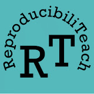

#### Write reusable protocols

Understand the level of details needed for your protocols.

####  TOOLS & RESOURCES

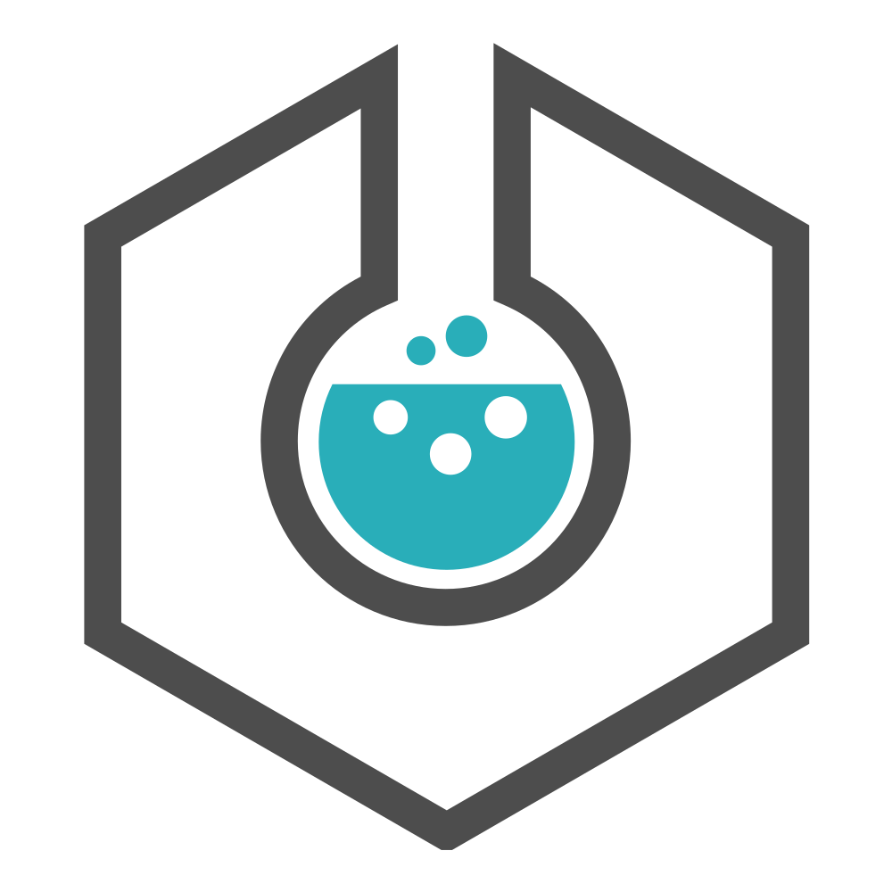

Supported at LMU

#### eLabFTW

Electronic Lab Notebook hosted by LMU Munich.

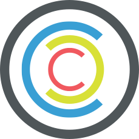

Supported at LMU

#### Chemotion

ELN hosted by the Faculty for Chemistry and Pharmacy.


#### Protocols.io

Share, discover, cite, and improve research protocols.

### 2.1.2 Questionnaires

**Document both the instrument and the administration procedure completely.** The data dictionary (or ‘codebook’) should record the exact version of the questionnaire used; if copyright allows it, document the item wording itself.

Questionnaires should be objective, reliable, and valid:

- **Objective:** Results should not depend on who administers or scores the questionnaire.
- **Reliable:** Responses should be consistent across repeated measurements when the underlying construct is unchanged (i.e., they should have low measurement error)
- **Valid:** Items should measure the intended construct rather than something else. Typical ways to assess validity include content validity, convergent and divergent construct validity, and criterion-related validity.

For well-validated instruments, published studies extensively assess reliability and validity across several populations and contexts. If these quality criteria of measurement instruments are met, your effect size and statistical power will be increased.

### 2.1.3 Software-based data acquisition

When data comes from instruments, sensors, or APIs (Application Programming Interface), scripting the acquisition creates a reproducible record of exactly what was collected and how. Programming languages like R or Python work well for straightforward pipelines. For more complex multi-step workflows which are common in e.g. in bioinformatics and neuroimaging, workflow managers like [Snakemake](https://snakemake.readthedocs.io/) ensure steps run in the correct order and can resume after failures.

- **Structure data correctly from the start.** Variables in columns, observations in rows. This makes your data immediately interoperable with analysis tools rather than requiring cleanup later. Scripts can also automate organization, file renaming, and conversion to open formats. See [2.2 Data Management](#sec-data-management) for guidelines.

- **Keep records of what ran and when.** Include error handling so failures are recorded rather than silently corrupting data. When something fails months later, you need to know what happened. Always test acquisition scripts on sample data before production runs. A bug in your collection pipeline can invalidate an entire dataset.

- **Version control your code and data.** This makes your methods reproducible and shareable. See [2.2.6. Version Control](#sec-data-management) for details.

####  LEARN MORE


OSC Tutorial

#### Introduction to R

Programming fundamentals for research data processing (3h)


OSC Tutorial

#### Introduction to Git

Learn Git basics integrated with RStudio (2h).

### 2.1.4 Field and lab work

Field and sometimes lab researchers have to work with analogue notebooks first, and use temporary storage solution for images and video-recordings.

- **Digitalize your data soon after data collection**, e.g. using a data entry form from a relational database such as [PostgreSQL](https://www.postgresql.org/) or [SQLite](https://sqlite.org/). Any relational database would work, and Excel/CSV files are also common options
- **Match the tool to the size of your project.** A relational database pays off for ongoing, multi-site, or long-term data entry, but for small or one-off projects a structured spreadsheet template is enough (see [2.2.3. File Formats](#sec-data-management) for the pitfalls to avoid)
- **Create automatic validation checks** for data entry so e.g. values outside of expected range get immediately identified (see [2.4. Quality control](#sec-quality-control))
- **Transfer digital data** (e.g. pictures, video recordings) from temporary storage solutions (e.g. camera storage) to permanent storage solutions (see [2.1.1. Storage](#sec-data-management))
- **Check your data entries**, e.g. after a day, to correct possible mistakes in transcription
- **Keep analogue records** to correct data entries errors at the end of the season or experiment

####  TOOLS & RESOURCES


#### PostgreSQL

Open source relational database software

### 2.1.5 Systematic reviews

A high-quality systematic review, whether it includes a meta-analysis or not, uses a **rigorous, transparent, and reproducible methodology to select the relevant literature** and later provide a thorough summary and critical evaluation of research within a given field. Its defining features include:

- clearly defined objectives supported by an explicit and reproducible methodology
- a comprehensive, systematic search designed to identify all studies meeting the eligibility criteria
- a critical appraisal of the validity of included studies, such as through risk-of-bias assessment
- a structured presentation and synthesis of the characteristics and findings of the included studies

Data collection, in this context, consists in developing a judicious reproducible methods to selecting relevant literature.

- **Use tools** such as

  - [CAMARADES](https://camarades.de/) which provide a supporting framework for the conduct of systematic reviews of animal studies, and
  - [PRISMA](https://www.prisma-statement.org/) (Preferred Reporting Items for Systematic review and Meta-Analysis Protocols) and its extensions such as [PRISMA-P](https://www.prisma-statement.org/protocols) which offers checklist for systematic review protocol reporting.

- **Learn more** from our colleagues at the Berlin Institute of Health QUEST Center for Responsible Research using their [resources for systematic reviews in biomedical research](https://www.bihealth.org/en/quest/service/service/resources-for-systematic-reviews-in-biomedical-research) and the material of their [systematic review workshop at our previous OSC summer school](https://osf.io/589yn/overview).

####  LEARN MORE


OSC Workshop

#### Systematic review

Slides and additional resources of workshop delivered at OSSS23.

####  TOOLS & RESOURCES

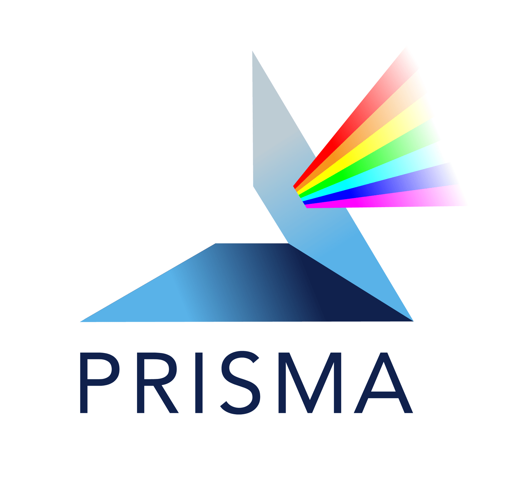

#### PRISMA

Preferred Reporting Items for Systematic review and Meta-Analysis Protocols


#### CAMARADES

Step-by-step guide to Preclinical Systematic Review.

## 2.2 Data Management

In [1. Plan & Design](../../training/research-cycle-handbook/01-plan-and-design.llms.md) you created a Research Data Management Plan. It’s now time to put this plan into practice, refining it as you learn what actually works for your project.

- **Keep your raw data as read-only files.** The unmodified output of your instruments, surveys, or observations should never be modified directly. You should provide enough documentation to recreate your processed datasets and results from your raw data (see [3.1. Data Processing & Analyses](../../training/research-cycle-handbook/03-analyze-and-collaborate.llms.md#sec-data-processing-analysis)).

- **Organize, document, and store your research files so they remain usable, and become FAIR upon sharing.** Beyond raw data, you will generate processed data, code, documentation, and metadata. How you organize, describe, and store these determines whether your work remains usable and reproducible. The [FAIR principles](https://www.go-fair.org/fair-principles/) guide these decisions: making outputs Findable, Accessible, Interoperable, and Reusable.

What follows are general practices. Your domain has specific conventions for file formats, folder structure, and metadata. [RDMkit](https://rdmkit.elixir-europe.org/your_domain) provides detailed guidance organized by research area.

> **TIP:**
>
> - **Create standard operating procedures (SOPs) within the team.** For instance: where and when data back up should be made and in which file format, what project folder structure and conventions for naming files should be adopted, which metadata should routinely be acquired, what documentation should be created and when, and how and where a history of versions should be preserved.
> - **Assign responsibilities.** For developing such SOPs for a specific kind of project and for checking all members have implemented those SOPs at a specified time point in their project (e.g. hold a data quality validation meeting prior to starting data analyses, see [Collect & Manage Checklist](#sec-collect-and-manage-checklist)).

### 2.2.1 Storage

This section covers storage for data you are actively collecting. Long-term archiving for sharing is covered in [4. Preserve & Share](../../training/research-cycle-handbook/04-preserve-and-share.llms.md).

- **Use institutional storage.** LMU Munich provides storage such as [LRZ Sync and Share](https://syncandshare.lrz.de/login) or [LRZ DSS](https://doku.lrz.de/data-science-storage-10745685.html) with automated backups, access controls, and GDPR compliance. Additional options vary by department. Contact the [Research Data Management team of the University Library](https://www.en.ub.uni-muenchen.de/writing/research_data/research-data-management/index.html) to find what is available to you. When choosing, consider how much data you will generate, who needs access, and whether your data includes personal information requiring stricter controls.
- **Follow the 3-2-1 backup rule.** Keep three copies on two media types with one off-site. Designate one location as the master copy, the authoritative version everything else syncs from. Working with multiple “equal” copies creates version conflicts. Remember that syncing is not backup: if you delete a file from a synced folder, the deletion propagates everywhere. True backups preserve previous versions independently.
- **Control access from the start.** Grant access only to those who need it. Use institutional sharing tools, not email attachments or personal cloud links. For collaborations, agree at the start who can read, who can edit, and who manages permissions. When team members leave, remove their access promptly.
- **Test your backups.** A backup you cannot restore is not a backup. Test restoration at least once. Archive inactive data periodically and review access lists when team composition changes.

> **IMPORTANT:**
>
> Personal laptops as primary storage, external drives as only copy, consumer cloud services (Dropbox, Google Drive) for sensitive data, and USB drives except for temporary transport.

####  LEARN MORE


Supported at LMU

#### LRZ Sync & Share

Cloud storage service for LMU Munich


Supported at LMU

#### LRZ DSS

Long-term archival storage for LMU Munich


#### OSF

Research project management platform including storage.

### 2.2.2 Organization

Your folder structure and file naming conventions determine whether you and others can navigate your project months or years later. Establish these conventions at the start of your project and document them. When collaborating, ensure everyone follows the same system.

- **Separate raw from processed data.** Raw data should not be modified: once collected, these files should never be touched. All cleaning, data processing, transformations, and analyses happen on copies or through scripts in a separate folder. This preserves your ability to verify results or reprocess from the original source.

- **Develop a file naming convention.** Good file names identify contents at a glance and sort correctly. Balance specificity with readability: too many elements make names unwieldy, too few make them ambiguous. Order elements from general to specific.

  - Use underscores or hyphens to separate elements, never spaces or special characters (`? ! & * % # @`)
  - Use ISO 8601 dates (`YYYY-MM-DD`) so files sort chronologically
  - Include version numbers with leading zeros (`v01`, `v02`) so `v10` sorts after `v09`
  - Use meaningful abbreviations and document what they mean

A pattern like `YYYY-MM-DD_project_condition_type_v01.ext` places files in chronological order while preserving context. For example, `2024-03-15_sleep-study_control_survey_v02.csv` immediately tells you when it was created, which project it belongs to, the experimental condition, data type, and revision. Document your convention in a README file stored next to your data files so collaborators can parse filenames without asking.

- **Follow domain standards where they exist.** Many fields have established organizational conventions that tools and collaborators expect. Using these means your data can immediately be integrated in existing analysis pipelines and reviewers recognize the structure. Search [RDMkit](https://rdmkit.elixir-europe.org/your_domain) for standards in your domain.

####  LEARN MORE


OSC Tutorial

#### Data Organization

Folder structure and naming conventions. (30 min)

####  TOOLS & RESOURCES


OSC Tool

#### Research Project Template

Project folder separating raw & processed data, code, and outputs.


#### RDMkit

Domain-specific data management standards

### 2.2.3 File Formats

File format choices affect who can work with your data now and whether it remains readable in the future. Open formats have publicly documented specifications that anyone can implement, so many programs can read them and they remain accessible even if the original software disappears. Proprietary formats lock you into specific tools, complicate collaboration, and risk becoming unreadable if the company stops supporting them.

- **Keep raw data in its original format.** Whatever your instrument or source produces, preserve that original as your ground truth. Even if it is proprietary, you need it for verification and potential reprocessing.

- **Work in open formats.** For analysis, convert to open formats like CSV, JSON, or plain text. This makes your workflow reproducible, enables collaboration across different tools, and ensures your data can be shared. If conversion loses important information (metadata, precision, structure), document what is lost and keep both versions.

- **Be careful with spreadsheets.** Excel is convenient for data entry but causes real problems. It silently converts data: gene names like MARCH1 become dates, leading zeros in IDs disappear, and long numbers lose precision. Formatting (colors, merged cells) breaks machine-readability since scripts cannot see it. If you use spreadsheets for entry, keep them simple (one header row, one observation per row, no merged cells) and export to CSV immediately. Save CSVs with UTF-8 encoding to avoid character corruption when sharing across systems. For more guidance on spreadsheet best practices, see [The Turing Way](https://book.the-turing-way.org/reproducible-research/rdm/rdm-spreadsheets/) and [UC Davis DataLab](https://ucdavisdatalab.github.io/workshop_keeping_data_tidy/#spreadsheet-best-practices).

- **Check domain recommendations.** Your field likely has established conventions balancing openness with practical needs like performance or metadata preservation. Consult the [RDMKit](https://rdmkit.elixir-europe.org/your_domain) to find conventions for your field.

Format issues often surface during quality control. The [2.4. Quality Control](#sec-quality-control) panel below covers validation checks that can catch encoding problems, unexpected conversions, and structural inconsistencies early.

####  TOOLS & RESOURCES


#### RDMkit

Domain-specific file formats and conventions

### 2.2.4 Documentation

Without documentation, a dataset is just a collection of files. Six months from now, you will not remember what each column means, why certain values are missing, or how files relate to each other. Documentation makes your data usable by your future self, your collaborators, and any other researchers.

- **Create a README file (as .md or .txt) early and update it as you go.** Your README is the entry point to your project. Start it when you begin, not when preparing to publish. A good README answers the essential questions: who created the data, what it contains, when and where it was collected, why it was generated, how it was produced, and whether it can be reused. These answers let someone unfamiliar with your project understand and work with your data.
- **Create a data dictionary defining every variable.** A data dictionary (or “codebook”) makes your dataset self-explanatory. For each variable, document what it measures, its data type, valid values, units of measurement, and how missing data is coded. Use appropriate missing codes to distinguish why data is absent (declined to answer, not applicable, technical failure) since this distinction matters for analysis.

####  LEARN MORE


OSC Tutorial

#### Principles of Data Documentation

Principles of README files and data dictionaries.


OSC Tutorial

#### Data Documentation & Validation

Create READMEs, data dictionaries, and validation checks for your data. (1h)

### 2.2.5 Standards

Standards are community agreements on how to organize and describe research data. Using them means others in your field immediately understand your data. Three types of standards matter here:

- **Organizational standards** specify how to structure files and folders. Some fields have well-established conventions, like [BIDS](https://bids.neuroimaging.io/) for neuroimaging data. When such standards exist, use them. Your data will work immediately with existing tools, and collaborators will recognize the structure without explanation. If no standard exists for your domain, create a consistent structure and document it in your README. See for instance our [research project template](https://github.com/lmu-osc/research-project-template).

- **Reporting guidelines** specify what methodological details to document for different study types. The [EQUATOR Network](https://www.equator-network.org/) maintains a searchable database of guidelines for clinical trials, observational studies, animal research, and many other study types. Following these ensures you capture everything others need to understand or replicate your work.

- **Metadata standards** define what descriptive information to record and how to structure it. Scientific metadata describes how your data was produced: equipment specifications, acquisition parameters, protocols followed. This is distinct from discovery metadata (titles, keywords, descriptions) which you will prepare when sharing in [4. Preserve & Share](../../training/research-cycle-handbook/04-preserve-and-share.llms.md). Your field has conventions for which parameters matter. [FAIRsharing](https://fairsharing.org/) catalogs metadata standards by discipline.

**Think of your data as a first-class research output.** Comprehensive metadata transforms a project artifact into a reusable resource. Someone reanalyzing your data years later needs to understand exactly how it was produced.

####  TOOLS & RESOURCES


#### EQUATOR Network

Comprehensive database of reporting guidelines.

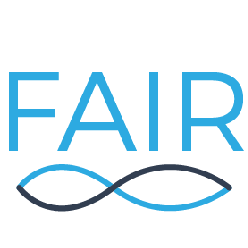

#### FAIRsharing

Search by discipline to find metadata standards, reporting guidelines, and data policies for your field.


#### RDMkit

Domain-specific metadata standards


OSC Tool

#### Research Project Template

Project folder separating raw & processed data, code, and outputs.

### 2.2.6 Version Control

Version control system like Git tracks changes to files over time. You can see what changed, when, and why. You can revert to previous versions. Collaborators can work without overwriting each other.

- **Git usually suffices for data files.** Text-based formats (CSV, JSON, plain text) and smaller binary files work well in standard Git repositories. You get a complete history of changes and can share easily via GitHub or GitLab.

- **Use specialized tools for large or frequently changing binary files.** Standard Git stores each version in full, so repositories become unwieldy with large datasets. Git LFS (Large File Storage) stores large files separately while keeping them tracked. Git-annex manages files across multiple storage locations. [DataLad](https://www.datalad.org/) builds on git-annex and works with standard Git workflows.

> **NOTE:**
>
> - **Git** is a version control system that tracks changes in text files (e.g. CSV, plain text, R, Python). The Git software and your Git repositories should be, respectively, installed and located in your local environment (i.e. on your computer, not on a drive, see [Git tutorial](https://lmu-osc.github.io/Introduction-RStudio-Git-GitHub/)).
>
> - **GitHub** is the most popular, free but proprietary and US-based cloud-based platform for software development with Git, providing collaboration features like pull requests and issues (see [GitHub tutorial](https://lmu-osc.github.io/Collaborative-RStudio-GitHub/)). **You should not have any sensitive data on GitHub even in a private repository.**
>
> - **LRZ GitLab** is a cloud-based hosting platform that provides essentially the same features as GitHub but is open source and is installed on the LRZ servers for LMU Munich and can therefore be considered secure when the repository is private.
>
> While your LRZ GitLab account is associated with your LMU Munich affiliation, your GitHub account can be associated with your private email, be included in your CV, and be used for public sharing of your data and code (see [3. Analyze & Collaborate](../../training/research-cycle-handbook/03-analyze-and-collaborate.llms.md) and [4. Preserve & Share](../../training/research-cycle-handbook/04-preserve-and-share.llms.md)).
>
> In a version controlled workflow, you back up your local Git repositories on either GitHub or LRZ GitLab through a secure SSH connection (see [GitHub tutorial](https://lmu-osc.github.io/Collaborative-RStudio-GitHub/)) and share access to your repositories with your collaborators through the cloud-based platform GitHub or LRZ GitLab.

####  LEARN MORE


OSC Tutorial

#### Introduction to Git

Learn Git basics integrated with RStudio (2h).


OSC Tutorial

#### Introduction to GitHub

Connect to GitHub from Git within RStudio (1h).

####  TOOLS & RESOURCES


Supported at LMU

#### LRZ Gitlab

Institutional Git hosting for LMU Munich.


#### DataLad

Version control for large datasets

## 2.3 Ethics & Privacy

Research involving human participants requires ethics approval and data protection compliance. In your ethics proposal (see [1.2.3. Ethics](../../training/research-cycle-handbook/01-plan-and-design.llms.md#sec-legal-requirements)) you planned for safeguards for the people contributing to your research and you now need to implement them before or while collecting your data.

### 2.3.1 Informed Consent

Participants have the right to understand what they are agreeing to. Your consent form should explain the research purpose in plain language, describe what data you will collect and how you will protect it, specify who will have access and for how long, and make clear that participation is voluntary. See “[How to write an informed consent form](https://www.uu.nl/en/research/research-data-management/guides/legal-considerations/how-to-write-an-informed-consent-form)” from the University to Utrecht and an [example template from the LMU Psychology Department](https://osf.io/mgwk8/files/fvgsx).

- **Use tiered consent when you plan to share data.** Some participants may consent to their data being used for your study but not shared publicly. Others may be comfortable with broader sharing. Giving options respects autonomy while maximizing what you can eventually share.

- **Store consent forms separately from data.** The consent form links a name to participation. Keeping it with your data undermines any pseudonymization you apply.

> **TIP:**
>
> **Maintain a centralized log of all ethics approvals, consent forms, and compliance certifications for easy reference by team members.**

####  TOOLS & RESOURCES


#### How to write an informed consent form

University of Utrecht RDM guide.

### 2.3.2 Anonymization

Anonymization protects privacy and determines what you can share.

- **Remove direct identifiers during collection.** Names, addresses, ID numbers, photographs, email addresses. Replace these with codes.

- **Assess indirect identifiers carefully.** A combination of age, location, profession, and a rare condition might identify someone even without their name. Timestamps reveal patterns. Free-text responses often contain identifying details participants did not intend to share. Follow our [data anonymization tutorial](https://lmu-osc.github.io/data-anonymization/) to learn to evaluate and implement anonymization techniques in R.

- **Generate synthetic data when full anonymization or real data sharing is not possible.** Synthetic data is artificially generated data that can serve as a privacy-preserving alternative to sensitive datasets, enabling researchers to reproduce analyses, verify findings, and initiate model development when access to real data is restricted. Sharing synthetic data together with code, rather than sharing no data at all, increases the utility of your research (see [4. Preserve & Share](../../training/research-cycle-handbook/04-preserve-and-share.llms.md)).

> **NOTE:**
>
> - **Pseudonymization** replaces identifiers with codes while retaining a key that links back to individuals. Pseudonymized data is still personal data under GDPR because re-identification is possible, at least by some persons.
>
> - **Anonymization** removes all possibility of re-identification. Only truly anonymized data falls outside GDPR scope. Achieving this is harder than it appears, especially with rich datasets.

####  LEARN MORE


OSC Tutorial

#### Data Anonymization

Implement data anonymization techniques in R. (3h)


OSC Tutorial

#### Synthetic Data

Synthetic data creation in R to balance utility and privacy when sharing data. (3h)

### 2.3.3 GDPR Compliance

Research at LMU Munich must comply with EU data protection regulations. The core principles: have a lawful basis for processing personal data (usually consent or legitimate research interest), use data only for stated purposes, collect only what you need, delete data when you no longer need it, and protect it against unauthorized access.

**In practice:** document your lawful basis, include data protection language in consent forms, use institutional storage rather than personal cloud services, restrict access to those who need it, and plan when and how you will delete data.

For data protection guidance, contact the [LMU Data Protection Officer](https://www.lmu.de/en/about-lmu/structure/organizational-structure/officers-representatives-and-contact-persons/data-protection-officer.html) or the [Research Data Management team of the University Library](https://www.en.ub.uni-muenchen.de/writing/research_data/research-data-management/index.html).

## 2.4 Quality Control

Quality control catches problems before they propagate into your analysis. The practices here ensure your data is trustworthy and your exclusions are well-founded.

**Define criteria before looking at your data.** This prevents unconscious bias in what you keep and exclude, and demonstrates that your decisions are principled rather than convenient (see [1.4. Study Design & Analysis Plan](../../training/research-cycle-handbook/01-plan-and-design.llms.md#sec-study-design-analysis-plan)).

### 2.4.1 Validation

Validation checks whether your data meets specifications. For example, values can be verified to fall within valid ranges (e.g., age ≥ 0), required fields can be checked for missing entries, categorical variables can be restricted to allowed levels (e.g., “yes/no”), dates can be validated for proper format, and cross-variable constraints can be enforced (e.g., discharge date ≥ admission date). Run checks during collection to catch problems immediately, after collection for systematic review, and after any processing to verify transformations worked correctly.

- **Automate what you can.** Check that data types are correct, values fall within expected ranges, required fields are populated, and formats are consistent. These checks should run automatically and flag problems for review.

- **Catch what automation misses with manual review.** Sample your data and verify it against the source. Inspect outliers to determine whether they are errors or genuine extreme values. Look for suspicious patterns: survey responses that alternate predictably, reaction times that are impossibly fast.

####  LEARN MORE


OSC Tutorial

#### Data Documentation & Validation

Create validation rules and automated checks for your research data. (1h)

### 2.4.2 Cleaning

Data cleaning handles errors, inconsistencies, and missing values. The cardinal rule: never modify your raw data. All cleaning happens on copies, ideally by scripts and not through manual changes.

- **Correct unambiguous errors.** Clear typos, obvious data entry mistakes. For ambiguous cases, flag them for review rather than making assumptions. Document your reasoning for every judgment call.

- **Handle missing data consistently.** Decide on a coding scheme (NA, -999, blank) and apply it uniformly. When you know why data is missing, record that information. It may matter for analysis.

- **Investigate outliers before acting.** An extreme value might be an error, or it might be genuine. Understand the cause before deciding whether to remove, transform, or retain it.

- **Write cleaning as a script.** A script documents exactly what you did and lets you reproduce it. Keep a decision log for choices that cannot be automated.

### 2.4.3 Exclusions

Exclusion criteria specify which data points will be removed from analysis and why. Define these before you see your results (see [1.4. Study Design & Analysis Plan](../../training/research-cycle-handbook/01-plan-and-design.llms.md#sec-study-design-analysis-plan)).

- **Review common exclusion criteria.** Technical failures (equipment malfunction, incomplete recording), protocol violations (wrong procedure followed, participant did not comply), quality thresholds (too much missing data, failed attention checks), and participant criteria (did not meet stated inclusion criteria).

- **Document everything.** Record criteria before analysis begins. Report how many data points were excluded for each criterion in a log with the date and reviewer’s identity. Plan sensitivity analyses comparing results with and without exclusions to show your findings are robust.

##  Collect & Manage Checklist

To complete before conducting a data validation meeting with members of the project. Not all items are relevant for all fields of research or study types.

**Throughout Data Collection**

Document data collection procedures

Maintain organized directory structure

Follow file naming conventions

Back up data regularly (3-2-1 rule)

Update data dictionary as needed

Version control data and scripts

Apply data (pseudo)anonymization procedures

Apply quality control procedures

**Before Moving to Analysis**

All raw data backed up in multiple locations

Data (pseudo)anonymized

README files document project organization

Data dictionary defines all variables

Version control repository up to date

Data quality control completed and documented

[Download checklist ](assets/checklists/02-Collect-Manage-Checklist.docx)

# 3 Analyze & Collaborate

![](data:image/svg+xml;base64,PHN2ZyB3aWR0aD0iMTA1Ljk0OTg1bW0iIGhlaWdodD0iMTA2LjM1NjgybW0iIHZpZXdib3g9IjAgMCAxMDUuOTQ5ODUgMTA2LjM1NjgyIiB2ZXJzaW9uPSIxLjEiIGlkPSJzdmcxIiBzcGFjZT0icHJlc2VydmUiIHNvZGlwb2RpOmRvY25hbWU9Im9zLWN5Y2xlLnN2ZyIgaW5rc2NhcGU6dmVyc2lvbj0iMS40LjIgKDE6MS40LjIrMjAyNTA1MTIwNzM3K2ViZjBlOTQwZDApIiB4bWxuczppbmtzY2FwZT0iaHR0cDovL3d3dy5pbmtzY2FwZS5vcmcvbmFtZXNwYWNlcy9pbmtzY2FwZSIgeG1sbnM6c29kaXBvZGk9Imh0dHA6Ly9zb2RpcG9kaS5zb3VyY2Vmb3JnZS5uZXQvRFREL3NvZGlwb2RpLTAuZHRkIiB4bWxucz0iaHR0cDovL3d3dy53My5vcmcvMjAwMC9zdmciIHhtbG5zOnN2Zz0iaHR0cDovL3d3dy53My5vcmcvMjAwMC9zdmciPjxuYW1lZHZpZXcgaWQ9Im5hbWVkdmlldzEiIHBhZ2Vjb2xvcj0iI2ZmZmZmZiIgYm9yZGVyY29sb3I9IiM2NjY2NjYiIGJvcmRlcm9wYWNpdHk9IjEuMCIgaW5rc2NhcGU6c2hvd3BhZ2VzaGFkb3c9IjIiIGlua3NjYXBlOnBhZ2VvcGFjaXR5PSIwLjAiIGlua3NjYXBlOnBhZ2VjaGVja2VyYm9hcmQ9IjAiIGlua3NjYXBlOmRlc2tjb2xvcj0iI2QxZDFkMSIgaW5rc2NhcGU6ZG9jdW1lbnQtdW5pdHM9Im1tIiBpbmtzY2FwZTp6b29tPSIxLjkwMjM4MzEiIGlua3NjYXBlOmN4PSIzNzUuNTgxNTUiIGlua3NjYXBlOmN5PSIyMjIuMDg5ODYiIGlua3NjYXBlOndpbmRvdy13aWR0aD0iMzQ0MCIgaW5rc2NhcGU6d2luZG93LWhlaWdodD0iMTQwMyIgaW5rc2NhcGU6d2luZG93LXg9IjE5MjAiIGlua3NjYXBlOndpbmRvdy15PSIwIiBpbmtzY2FwZTp3aW5kb3ctbWF4aW1pemVkPSIxIiBpbmtzY2FwZTpjdXJyZW50LWxheWVyPSJnMTIiPjwvbmFtZWR2aWV3PjxkZWZzIGlkPSJkZWZzMSI+PHJlY3QgeD0iNDQxLjAyNTc5IiB5PSIxMjYuNjgzMjEiIHdpZHRoPSIxNTguMjIyNiIgaGVpZ2h0PSI5MS45ODk4ODMiIGlkPSJyZWN0MTMiIC8+PGNsaXBwYXRoIGlkPSJwMjUuMyI+PHBhdGggZD0iTSAwLDAgSCAyNTAwIFYgMjUwMCBIIDAgWiIgY2xpcC1ydWxlPSJldmVub2RkIiBpZD0icGF0aDk1IiAvPjwvY2xpcHBhdGg+PHJlY3QgeD0iNDQxLjAyNTc5IiB5PSIxMjYuNjgzMjEiIHdpZHRoPSIyMDguMTU5OTciIGhlaWdodD0iMTA1LjEzMTMiIGlkPSJyZWN0MTMtOSIgLz48cmVjdCB4PSI0NDEuMDI1NzkiIHk9IjEyNi42ODMyMSIgd2lkdGg9IjIwNi41ODI5OSIgaGVpZ2h0PSI5My41NjY4NDkiIGlkPSJyZWN0MTMtMCIgLz48cmVjdCB4PSI0NDEuMDI1NzkiIHk9IjEyNi42ODMyMSIgd2lkdGg9IjE3Mi45NDA5OCIgaGVpZ2h0PSIxMjMuNTI5MjgiIGlkPSJyZWN0MTMtMyIgLz48L2RlZnM+PGcgaW5rc2NhcGU6bGFiZWw9IkxheWVyIDEiIGlua3NjYXBlOmdyb3VwbW9kZT0ibGF5ZXIiIGlkPSJsYXllcjEiIHRyYW5zZm9ybT0idHJhbnNsYXRlKC0zMjkuNzYxMzMsLTY4LjkwODc3MykiPjxnIGlkPSJnMTMiIHRyYW5zZm9ybT0ibWF0cml4KDAuMjY0NTgzMzMsMCwwLDAuMjY0NTgzMzMsLTQ5LjU2NzMxLC01LjMwNjU4ODYpIiBzdHlsZT0iZmlsbDpub25lO3N0cm9rZTpub25lO3N0cm9rZS1saW5lY2FwOnNxdWFyZTtzdHJva2UtbWl0ZXJsaW1pdDoxMCIgaW5rc2NhcGU6bGFiZWw9Im9wZW4tcmVzZWFyY2gtY3ljbGUiPjxnIGlkPSJnMTIiIHRyYW5zZm9ybT0idHJhbnNsYXRlKC0xMS4xMjkxMTEsNC40NTk0MTI5KSIgaW5rc2NhcGU6bGFiZWw9InBoYXNlcyI+PGEgaHJlZj0iLi4vLi4vdHJhaW5pbmcvcmVzZWFyY2gtY3ljbGUtaGFuZGJvb2svMDQtcHJlc2VydmUtYW5kLXNoYXJlLmh0bWwiPjxnIGlkPSJwaGFzZS00IiBpbmtzY2FwZTpsYWJlbD0icGhhc2UtNCIgY2xhc3M9InBoYXNlLWdyb3VwIiByb2xlPSJidXR0b24iIHRhYmluZGV4PSIwIiB0cmFuc2Zvcm09InRyYW5zbGF0ZSgwLC0wLjM0NTkzNSkiIHN0eWxlPSJmaWxsOiMwMGMwNTc7ZmlsbC1vcGFjaXR5OjEiPjxwYXRoIGlkPSJwYXRoNSIgc3R5bGU9ImRpc3BsYXk6aW5saW5lO2ZpbGw6IzAwYzA1NztmaWxsLW9wYWNpdHk6MSIgaW5rc2NhcGU6bGFiZWw9InBoYXNlLTQtcXVhcnRlciIgZD0iTSAxNjM5LjE4NzIgMjc4LjA2NTIyIEMgMTUzMi41NzI4IDI3OC4wNjUyMiAxNDQ2LjE0NjIgMzY0LjQ5MTg2IDE0NDYuMTQ2MiA0NzEuMTA2MjQgTCAxNTkzLjE1MiA0NzEuMTA2MjQgTCAxNjM5LjE4NzIgNDI1LjM4NTUzIEwgMTYzOS4xODcyIDI3OC4wNjUyMiB6ICIgLz48dGV4dCBzcGFjZT0icHJlc2VydmUiIGlkPSJ0ZXh0MTMtMyIgc3R5bGU9ImZvbnQtc3R5bGU6bm9ybWFsO2ZvbnQtdmFyaWFudDpub3JtYWw7Zm9udC13ZWlnaHQ6Ym9sZDtmb250LXN0cmV0Y2g6bm9ybWFsO2ZvbnQtc2l6ZToyOS4zMzMzcHg7bGluZS1oZWlnaHQ6MC45NTtmb250LWZhbWlseTpzYW5zLXNlcmlmOy1pbmtzY2FwZS1mb250LXNwZWNpZmljYXRpb246JiMzOTtTYW5zLCBCb2xkJiMzOTs7Zm9udC12YXJpYW50LWxpZ2F0dXJlczpub3JtYWw7Zm9udC12YXJpYW50LWNhcHM6bm9ybWFsO2ZvbnQtdmFyaWFudC1udW1lcmljOm5vcm1hbDtmb250LXZhcmlhbnQtZWFzdC1hc2lhbjpub3JtYWw7dGV4dC1hbGlnbjpjZW50ZXI7bGV0dGVyLXNwYWNpbmc6MHB4O3dvcmQtc3BhY2luZzowcHg7d2hpdGUtc3BhY2U6cHJlO3NoYXBlLWluc2lkZTp1cmwoI3JlY3QxMy0zKTtkaXNwbGF5OmlubGluZTtmaWxsOiNmZmZmZmY7ZmlsbC1vcGFjaXR5OjE7c3Ryb2tlOm5vbmU7c3Ryb2tlLWxpbmVjYXA6c3F1YXJlO3N0cm9rZS1taXRlcmxpbWl0OjEwIiB0cmFuc2Zvcm09InRyYW5zbGF0ZSgxMDIyLjc2NjcsMjUyLjY2NTQxKSIgaW5rc2NhcGU6bGFiZWw9InBoYXNlLTQtdGV4dCI+PHRzcGFuIHg9IjQ0Ny4yNDAxOCIgeT0iMTQ4Ljk3MzI0IiBpZD0idHNwYW4xIj40LiBQcmVzZXJ2ZSA8L3RzcGFuPjx0c3BhbiB4PSI0NzEuMDczNDkiIHk9IjE3Ni44Mzk4OCIgaWQ9InRzcGFuMiI+JmFtcDsgU2hhcmU8L3RzcGFuPjwvdGV4dD48L2c+PC9hPjxhIGhyZWY9Ii4uLy4uL3RyYWluaW5nL3Jlc2VhcmNoLWN5Y2xlLWhhbmRib29rLzAzLWFuYWx5emUtYW5kLWNvbGxhYm9yYXRlLmh0bWwiPjxnIGlkPSJwaGFzZS0zIiBzdHlsZT0iZmlsbDojZmZjMDAwO2ZpbGwtb3BhY2l0eToxO3N0cm9rZTpub25lO3N0cm9rZS1saW5lY2FwOnNxdWFyZTtzdHJva2UtbWl0ZXJsaW1pdDoxMCIgaW5rc2NhcGU6bGFiZWw9InBoYXNlLTMiIHRyYW5zZm9ybT0idHJhbnNsYXRlKDMuMTMzMjIzMmUtNSwtMC4yNDgxMzUpIiBjbGFzcz0icGhhc2UtZ3JvdXAiIHJvbGU9ImJ1dHRvbiIgdGFiaW5kZXg9IjAiPjxwYXRoIGlkPSJwYXRoMTMiIHN0eWxlPSJkaXNwbGF5OmlubGluZTtmaWxsOiNmZmMwMDA7ZmlsbC1vcGFjaXR5OjEiIGlua3NjYXBlOmxhYmVsPSJwaGFzZS0zLXF1YXJ0ZXIiIGQ9Ik0gMTQ0Ni4xNDYxIDQ4My42NDMyIEMgMTQ0Ni4xNDYxIDU5MC4yNTc1OCAxNTMyLjU3MjcgNjc2LjY4NDIyIDE2MzkuMTg3MSA2NzYuNjg0MjIgTCAxNjM5LjE4NzEgNTI5LjY2MjczIEwgMTU5My40ODAxIDQ4My42NDMyIEwgMTQ0Ni4xNDYxIDQ4My42NDMyIHogIiAvPjx0ZXh0IHNwYWNlPSJwcmVzZXJ2ZSIgaWQ9InRleHQxMy0wIiBzdHlsZT0iZm9udC1zdHlsZTpub3JtYWw7Zm9udC12YXJpYW50Om5vcm1hbDtmb250LXdlaWdodDpib2xkO2ZvbnQtc3RyZXRjaDpub3JtYWw7Zm9udC1zaXplOjI5LjMzMzNweDtsaW5lLWhlaWdodDowLjk1O2ZvbnQtZmFtaWx5OnNhbnMtc2VyaWY7LWlua3NjYXBlLWZvbnQtc3BlY2lmaWNhdGlvbjomIzM5O1NhbnMsIEJvbGQmIzM5Oztmb250LXZhcmlhbnQtbGlnYXR1cmVzOm5vcm1hbDtmb250LXZhcmlhbnQtY2Fwczpub3JtYWw7Zm9udC12YXJpYW50LW51bWVyaWM6bm9ybWFsO2ZvbnQtdmFyaWFudC1lYXN0LWFzaWFuOm5vcm1hbDt0ZXh0LWFsaWduOmNlbnRlcjtsZXR0ZXItc3BhY2luZzowcHg7d29yZC1zcGFjaW5nOjBweDt3aGl0ZS1zcGFjZTpwcmU7c2hhcGUtaW5zaWRlOnVybCgjcmVjdDEzLTApO2Rpc3BsYXk6aW5saW5lO2ZpbGw6I2ZmZmZmZjtmaWxsLW9wYWNpdHk6MSIgdHJhbnNmb3JtPSJ0cmFuc2xhdGUoMTAwNS42Mzc0LDM5My4wMzQ4NykiIGlua3NjYXBlOmxhYmVsPSJwaGFzZS0zLXRleHQiPjx0c3BhbiB4PSI0NTUuNzMwOCIgeT0iMTQ4Ljk3MzI0IiBpZD0idHNwYW4zIj4zLiBBbmFseXplICZhbXA7IDwvdHNwYW4+PHRzcGFuIHg9IjQ1OS40NzA4NCIgeT0iMTc2LjgzOTg4IiBpZD0idHNwYW40Ij5Db2xsYWJvcmF0ZTwvdHNwYW4+PC90ZXh0PjwvZz48L2E+PGEgaHJlZj0iLi4vLi4vdHJhaW5pbmcvcmVzZWFyY2gtY3ljbGUtaGFuZGJvb2svMDItY29sbGVjdC1hbmQtbWFuYWdlLmh0bWwiPjxnIGlkPSJwaGFzZS0yIiBpbmtzY2FwZTpsYWJlbD0icGhhc2UtMiIgY2xhc3M9InBoYXNlLWdyb3VwIiByb2xlPSJidXR0b24iIHRhYmluZGV4PSIwIiB0cmFuc2Zvcm09InRyYW5zbGF0ZSgwLDAuMjQ4MTM1KSIgc3R5bGU9ImZpbGw6I2NjMDA2NjtmaWxsLW9wYWNpdHk6MSI+PHBhdGggaWQ9InBhdGgxMSIgc3R5bGU9ImRpc3BsYXk6aW5saW5lO2ZpbGw6I2NjMDA2NjtmaWxsLW9wYWNpdHk6MSIgaW5rc2NhcGU6bGFiZWw9InBoYXNlLTItcXVhcnRlciIgZD0iTSAxNjk2LjgxNjEgNDgzLjE0NjkzIEwgMTY0OS43MzYgNTI5LjkwNDc0IEwgMTY0OS43MzYgNjc2LjE4Nzk1IEMgMTc1Ni4zNTA0IDY3Ni4xODc5NSAxODQyLjc3OSA1ODkuNzYxMzEgMTg0Mi43NzkgNDgzLjE0NjkzIEwgMTY5Ni44MTYxIDQ4My4xNDY5MyB6ICIgLz48dGV4dCBzcGFjZT0icHJlc2VydmUiIHRyYW5zZm9ybT0idHJhbnNsYXRlKDExOTUuMzkxNSwzOTMuODY2NzgpIiBpZD0idGV4dDEzLTIiIHN0eWxlPSJmb250LXN0eWxlOm5vcm1hbDtmb250LXZhcmlhbnQ6bm9ybWFsO2ZvbnQtd2VpZ2h0OmJvbGQ7Zm9udC1zdHJldGNoOm5vcm1hbDtmb250LXNpemU6MjkuMzMzM3B4O2xpbmUtaGVpZ2h0OjAuOTU7Zm9udC1mYW1pbHk6c2Fucy1zZXJpZjstaW5rc2NhcGUtZm9udC1zcGVjaWZpY2F0aW9uOiYjMzk7U2FucywgQm9sZCYjMzk7O2ZvbnQtdmFyaWFudC1saWdhdHVyZXM6bm9ybWFsO2ZvbnQtdmFyaWFudC1jYXBzOm5vcm1hbDtmb250LXZhcmlhbnQtbnVtZXJpYzpub3JtYWw7Zm9udC12YXJpYW50LWVhc3QtYXNpYW46bm9ybWFsO3RleHQtYWxpZ246Y2VudGVyO2xldHRlci1zcGFjaW5nOjBweDt3b3JkLXNwYWNpbmc6MHB4O3doaXRlLXNwYWNlOnByZTtzaGFwZS1pbnNpZGU6dXJsKCNyZWN0MTMtOSk7ZGlzcGxheTppbmxpbmU7ZmlsbDojZmZmZmZmO2ZpbGwtb3BhY2l0eToxO3N0cm9rZTpub25lO3N0cm9rZS1saW5lY2FwOnNxdWFyZTtzdHJva2UtbWl0ZXJsaW1pdDoxMCIgaW5rc2NhcGU6bGFiZWw9InBoYXNlLTItdGV4dCI+PHRzcGFuIHg9IjQ2My45Njk1NyIgeT0iMTQ4Ljk3MzI0IiBpZD0idHNwYW41Ij4yLiBDb2xsZWN0ICZhbXA7IDwvdHNwYW4+PHRzcGFuIHg9IjQ4NS45Njk1NCIgeT0iMTc2LjgzOTg4IiBpZD0idHNwYW42Ij5NYW5hZ2U8L3RzcGFuPjwvdGV4dD48L2c+PC9hPjxhIGhyZWY9Ii4uLy4uL3RyYWluaW5nL3Jlc2VhcmNoLWN5Y2xlLWhhbmRib29rLzAxLXBsYW4tYW5kLWRlc2lnbi5odG1sIj48ZyBpZD0icGhhc2UtMSIgaW5rc2NhcGU6bGFiZWw9InBoYXNlLTEiIHN0eWxlPSJmaWxsOm5vbmU7c3Ryb2tlOm5vbmU7c3Ryb2tlLWxpbmVjYXA6c3F1YXJlO3N0cm9rZS1taXRlcmxpbWl0OjEwIiB0cmFuc2Zvcm09InRyYW5zbGF0ZSgzLjEzMzIyMzJlLTUsMC4zNDU5MzUpIiBjbGFzcz0icGhhc2UtZ3JvdXAiIHJvbGU9ImJ1dHRvbiIgdGFiaW5kZXg9IjAiPjxwYXRoIGlkPSJwYXRoOSIgc3R5bGU9ImRpc3BsYXk6aW5saW5lO2ZpbGw6IzAwNjZmZjtmaWxsLW9wYWNpdHk6MSIgaW5rc2NhcGU6bGFiZWw9InBoYXNlLTEtcXVhcnRlciIgZD0iTSAxNjUwLjg3NjYgMjc3LjM3MzM1IEwgMTY1MC44NzY2IDQyNC4yOTUyMiBMIDE2OTYuNjgxMyA0NzAuNDE0MzcgTCAxODQzLjkxOTYgNDcwLjQxNDM3IEMgMTg0My45MTk2IDM2My43OTk5OSAxNzU3LjQ5MSAyNzcuMzczMzUgMTY1MC44NzY2IDI3Ny4zNzMzNSB6ICIgLz48dGV4dCBzcGFjZT0icHJlc2VydmUiIHRyYW5zZm9ybT0idHJhbnNsYXRlKDEyMjAuMDUyMywyNDkuOTY2NzIpIiBpZD0idGV4dDEzIiBzdHlsZT0iZm9udC1zdHlsZTpub3JtYWw7Zm9udC12YXJpYW50Om5vcm1hbDtmb250LXdlaWdodDpib2xkO2ZvbnQtc3RyZXRjaDpub3JtYWw7Zm9udC1zaXplOjI5LjMzMzNweDtsaW5lLWhlaWdodDowLjk1O2ZvbnQtZmFtaWx5OnNhbnMtc2VyaWY7LWlua3NjYXBlLWZvbnQtc3BlY2lmaWNhdGlvbjomIzM5O1NhbnMsIEJvbGQmIzM5Oztmb250LXZhcmlhbnQtbGlnYXR1cmVzOm5vcm1hbDtmb250LXZhcmlhbnQtY2Fwczpub3JtYWw7Zm9udC12YXJpYW50LW51bWVyaWM6bm9ybWFsO2ZvbnQtdmFyaWFudC1lYXN0LWFzaWFuOm5vcm1hbDt0ZXh0LWFsaWduOmNlbnRlcjtsZXR0ZXItc3BhY2luZzowcHg7d29yZC1zcGFjaW5nOjBweDt3aGl0ZS1zcGFjZTpwcmU7c2hhcGUtaW5zaWRlOnVybCgjcmVjdDEzKTtkaXNwbGF5OmlubGluZTtmaWxsOm5vbmU7c3Ryb2tlOm5vbmU7c3Ryb2tlLWxpbmVjYXA6c3F1YXJlO3N0cm9rZS1taXRlcmxpbWl0OjEwIiBpbmtzY2FwZTpsYWJlbD0icGhhc2UtMS10ZXh0Ij48dHNwYW4geD0iNDU2Ljc2MjExIiB5PSIxNDguOTczMjQiIGlkPSJ0c3BhbjgiPjx0c3BhbiBzdHlsZT0iZmlsbDojZmZmZmZmIiBpZD0idHNwYW43Ij4xLiBQbGFuICZhbXA7IDwvdHNwYW4+PC90c3Bhbj48dHNwYW4geD0iNDY5LjkzMjgiIHk9IjE3Ni44Mzk4OCIgaWQ9InRzcGFuMTAiPjx0c3BhbiBzdHlsZT0iZmlsbDojZmZmZmZmIiBpZD0idHNwYW45Ij5EZXNpZ248L3RzcGFuPjwvdHNwYW4+PC90ZXh0PjwvZz48L2E+PC9nPjxwYXRoIGQ9Im0gMTYxMS42NjgxLDQ0NC4zNjQxMyAyOC43NzA3LDUuNjg3MTUgLTEyLjk5NTEsMjYuMjkxMSAtNS4xNDYsLTEwLjQzMTM4IGMgLTkuMzMyNiw1Ljg1NzYxIC0xMi45MjM5LDE3Ljk4OTE3IC03Ljk0MjIsMjguMDg3NDUgNS4zMTcsMTAuNzc3OSAxOC40MTA1LDE1LjIyMDUgMjkuMTg2Miw5LjkwNDYzIDEwLjc3NTcsLTUuMzE1ODcgMTUuMjE4MywtMTguNDA5NDQgOS45MDI0LC0yOS4xODUxMSAtMS41MjMxLC0zLjA4NzM5IC0wLjI1NTUsLTYuODIzMTYgMi44MzE4LC04LjM0NjI0IDMuMDg3NCwtMS41MjMwNyA2LjgyMzIsLTAuMjU1NTQgOC4zNDYzLDIuODMxODUgOC4zNTU0LDE2LjkzNzAzIDEuMzczMSwzNy41MjEwOCAtMTUuNTY2MSw0NS44Nzc1OCAtMTYuOTM5Myw4LjM1NjUxIC0zNy41MjIyLDEuMzcwOTQgLTQ1Ljg3NzYsLTE1LjU2NjA5IC04LjAyMTIsLTE2LjI1OTY0IC0xLjg3OTQsLTM1Ljg0ODE2IDEzLjYwMzcsLTQ0Ljc4NDM5IHoiIGlkPSJwYXRoMSIgc3R5bGU9ImZpbGw6IzAwMDAwMDtzdHJva2U6bm9uZTtzdHJva2Utd2lkdGg6Ny41NTkwNjtzdHJva2UtbGluZWNhcDpzcXVhcmU7c3Ryb2tlLW1pdGVybGltaXQ6MTA7c3Ryb2tlLWRhc2hhcnJheTpub25lIiBpbmtzY2FwZTpsYWJlbD0icm90YXRpbmctYXJyb3ciIC8+PC9nPjwvZz48L3N2Zz4=)

Create reproducible analyses and collaborate effectively

Readable Code Version Control Reproducible Computational Environment Reproducible Manuscript

Checkpoints: Repository & Code Peer-Review + Result Presentation

## 3.1 Data Processing & Analysis

Data processing and analysis should be reproducible – independent of which software, programming language, or operating system you use. This is best achieved by choosing automated **script-based workflows** (over manual point-and-click procedures), and supported by **adequate documentation** and shared code that allows others to regenerate results. Because analysis scripts are run repeatedly, due to iterative development through corrections and refinements, automation is **essential for both reproducibility and efficiency**. This section outlines a recommended workflow for R users.

### 3.1.1 Programming

- **Create a self-contained project folder**. Include data, code, documentation, and outputs in a single structured environment, ensuring the project remains understandable, reproducible, and portable across systems and collaborators. If you use the free and open source software RStudio to manage your R project, your project directory (or folder) should contain a .Rproj file (see [R tutorial](https://lmu-osc.github.io/introduction-to-R/)). **Use relative paths** (i.e. `“./subfolder”`, where `.` represents the root of your .Rproj directory) or the library `here`, so the project stays portable to another environment
- **Use a standard folder structure**. Your code repository should include a standard folder structure that make sense for your type of research, ideally shared across your team members. You can for instance use our [research project template](https://github.com/lmu-osc/research-project-template).
- **Stop clicking, start coding**. Automatize all possible steps, including data acquisition (see [2.1. Data Collection](../../training/research-cycle-handbook/02-collect-and-manage.llms.md#sec-data-collection)), data processing and transformation, data analyses, data visualization, and results reporting (see [3.2. Reporting Results](#sec-reporting-results))
- **Structure, comment, and standardize your scripts.** R scripts themselves should follow current standards to increase their readability (see [Readable Code Lecture](https://lmu-osc.github.io/training/reproducible-processes/readable-code.html)). Use meaningful names for variables, functions, and scripts. Add comments to your code explaining *why* you made a decision, any known limitations to your code, and citations of methods. **Do not include sensitive information such as credentials or name of excluded patient as comments in your code!**
  - **Define your own functions** rather than copy pasting pieces of code which makes it hard to maintain error-free. Functions are ‘self-contained’ sets of commands that accomplish a specific task. They usually ‘take in’ data or parameter values (these inputs are called ‘function arguments’), process them, and ‘return’ a result. See our [R tutorial](https://lmu-osc.github.io/introduction-to-R/) and [data simulation tutorial](https://lmu-osc.github.io/Introduction-Simulations-in-R/) for examples.
  - **Set seeds for random processes** to enable exact replication. A seed is a number used to initialize a pseudorandom number generator algorithm. It serves as the starting point for a sequence of numbers that appear random but are actually produced by a deterministic, fixed algorithm. See e.g. our [data simulation tutorial](https://lmu-osc.github.io/Introduction-Simulations-in-R/) for examples.
  - **Follow accessibility standards when generating outputs** (e.g. use colorblind-friendly color scheme for figures)
  - **Follow a style guide** to increase readability. Use automated styling tools (e.g. [`styler`](https://styler.r-lib.org/), [`lintr`](https://lintr.r-lib.org/), and [`Air`](https://posit-dev.github.io/air/) for R).
- **Use LRZ Compute Cloud for data-intensive analyses**. [LRZ Supercomputing](https://www.lrz.de/en/technologies/supercomputing) provide virtual machines, high-performance computing, and storage to researchers of LMU Munich.

####  LEARN MORE


OSC Tutorial

#### R Tutorial

Process your data reproducibly in R. (3h)


OSC Tutorial

#### Data simulation in R

Set seeds and define functions to generate random data (2h)


OSC Lecture

#### Readable code lecture

Tips to write clear, understandable, and maintainable code. (1h)

####  TOOLS & RESOURCES


OSC Tool

#### Research Project Template

Project folder separating raw & processed data, code, and outputs.


Supported at LMU

#### LRZ Supercomputing

Virtual machines and HPC for LMU Munich

### 3.1.2 Version Control

Version control tracks changes to files over time. You can see what changed, when, and why. You can revert to previous versions. Collaborators can work without overwriting each other.

In a version controlled workflow, you back up your local Git repositories on the cloud-based platforms GitHub or LRZ GitLab and share access to the online version of your repositories with your collaborators.

- **Learn to create git branches to collaborate on the same piece of code in a unique repository.** i.e. temporary copies where you can work without breaking the original source code, which you later merge back to the main branch (see [Advanced Git tutorial](https://lmu-osc.github.io/training/reproducible-processes/advanced-git.html)).

- **Maintain efficient communication to coordinate collaborative work.** GitHub or GitLab facilitate collaboration through “issues” (a precise description of something to fix), “discussions” (asynchronous thinking through figuring out how to resolve a problem), and can still very well resolve “conflicts” (i.e. collaborators wanting to merge changes on the exact same line of script). To complement this, LMU Munich offers [LMU chat (Matrix)](https://www.lmu.de/de/die-lmu/struktur/zentrale-universitaetsverwaltung/informations-und-kommunikationstechnik-dezernat-vi/it-servicedesk/zentrale-it-angebote/lmu-chat-matrix/), a secured open source chat service with all LMU members on which you can also invite external collaborators.

> **NOTE:**
>
> - **Git** is a version control system that tracks changes in text files (e.g. CSV, plain text, R, Python). The Git software and your Git repositories should be, respectively, installed and located in your local environment (i.e. on your computer, not on a drive, see [Git tutorial](https://lmu-osc.github.io/Introduction-RStudio-Git-GitHub/)).\
> - **GitHub** is the most popular, free but proprietary and US-based cloud-based platform for software development with Git, providing collaboration features like pull requests and issues (see [GitHub tutorial](https://lmu-osc.github.io/Collaborative-RStudio-GitHub/)). **You should not have any sensitive information on GitHub even in a private repository.**
> - **LRZ GitLab** is a cloud-based hosting platform that works exactly the same as GitHub but is free and open source and is installed on the LRZ servers for LMU Munich and can therefore be considered secure when the repository is private.
>
> While your LRZ GitLab account is associated with your LMU Munich affiliation, your GitHub account can be associated with your private email, be included in your CV, and be used for public sharing of your data and code (see [4. Preserve & Share](../../training/research-cycle-handbook/04-preserve-and-share.llms.md)).
>
> In a version controlled workflow, you back up your local Git repositories on either GitHub or LRZ GitLab through a secure SSH connection (see GitHub tutorial) and share access to your repositories with your collaborators through the cloud-based platform GitHub or LRZ GitLab.

> **IMPORTANT:**
>
> If you work with **sensitive data**, you must not include the raw or processed data in the version-controlled repository that will end up being shared publicly.
>
> Instead, explicitly **exclude the data directory using the .gitignore file from the start**, **or, at the time of sharing, create a new local repository that contains all project files except the data**.
>
> Importantly, if data are removed from an existing repository, they may still remain accessible in the repository’s history, since previous states of the project can be restored. If sensitive data are accidentally committed and pushed, it is possible to [rewrite the repository history](https://docs.github.com/en/authentication/keeping-your-account-and-data-secure/removing-sensitive-data-from-a-repository) to remove them retrospectively. However, this process is complex and error-prone, so it is best avoided by ensuring that sensitive data are excluded from version control from the outset.

> **TIP:**
>
> **Create a LRZ GitLab “organization” for the team.** This allows repositories, permissions, and project resources to be managed centrally rather than under individual accounts. This ensures continuity when team members leave, as ownership can be transferred to e.g. the PI and other administrators of the organization.

####  LEARN MORE


OSC Tutorial

#### Git Tutorial

Use version control system Git from within RStudio. (2h)


OSC Tutorial

#### GitHub Tutorial

Collaborative coding with GitHub and RStudio (1h)

####  TOOLS & RESOURCES


Supported at LMU

#### LRZ Gitlab

Institutional Git hosting for LMU Munich.


Supported at LMU

#### LMU Chat (Matrix)

Institutional open source chat service for LMU Munich.

### 3.1.3 Computational Environment Management

Manage your computational environment by explicitly recording the software, package versions, and dependencies required for your analyses, ensuring results can be reproduced across systems and over time. Tools such as packages managers (e.g. [Renv](https://rstudio.github.io/renv/) for R packages, [Conda](https://anaconda.org/channels/anaconda/packages/conda/overview) for Python packages) or broader containers (e.g. [Docker](https://www.docker.com/) or [Binder](https://mybinder.org/)) help stabilize workflows and prevent inconsistencies caused by packages or software updates.

For a R project repository:

- **Activate Renv to keep track of all packages versions** (see our [renv tutorial](https://lmu-osc.github.io/introduction-to-renv/)). This way, you or someone else can reproduce your results on another computer or at a later time using the same R packages versions.

Before publishing your project (see [4. Preserve & share](../../training/research-cycle-handbook/04-preserve-and-share.llms.md)):

- **Record your dependencies** in your README file for possible reconstruction with [repo2docker](https://repo2docker.readthedocs.io/en/latest/) or binder (see [Code Publishing tutorial](https://lmu-osc.github.io/code-publishing/make-readme.html)).

####  LEARN MORE


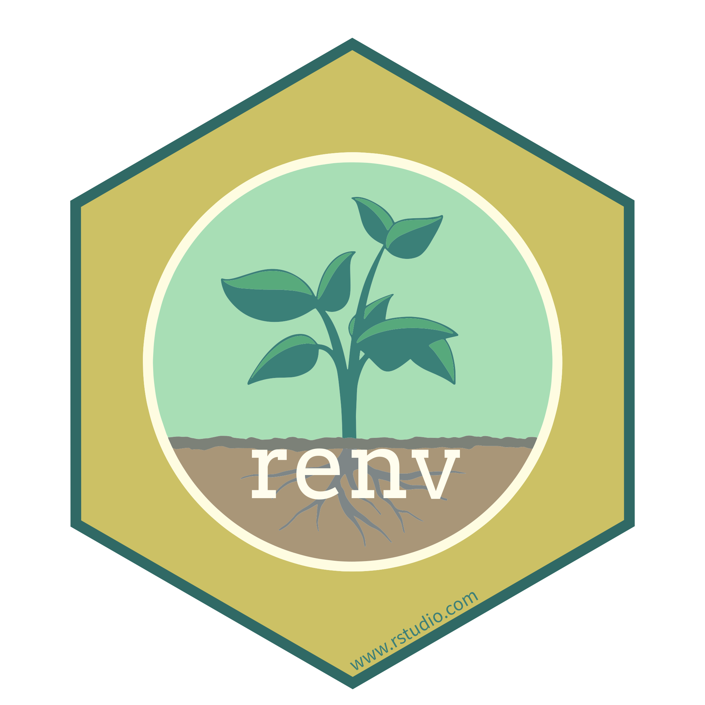

OSC Tutorial

#### Renv Tutorial

Manage the version of your R packages (1h)


OSC Tutorial

#### Code Publishing Tutorial

Publish your reproducible project on Zenodo (2h)

####  TOOLS & RESOURCES


#### Binder

Create online executable environments.


#### Docker

Containerization for full reproducibility.

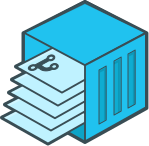

#### repo2docker

Build and run user environment containers.

### 3.1.4 Documentation

As with all documentation, your project repository’s documentation should be written early - initially for your near-future self to support efficient re-engagement after interruptions, then revised for internal team review, and ultimately expanded and refined for public sharing (see [4.2. Open Source Code](../../training/research-cycle-handbook/04-preserve-and-share.llms.md#sec-open-source-code)).

- **Create a README (e.g. a .md or .txt file) early and update it as you go.** Your README is the entry point to your project. A good README answers the essential questions: who created the script, what it contains, how they relate to other scripts and in which order scripts should be run, what the dependencies of the project are, how to obtain/access the input data, whether the code can be reused.
- **Annotate your code explaining *why* you made a decision.** All parameter values used as input for a function, or other decisions, should be justified minimally as comments in your code to later be included in your manuscript. **Do not include sensitive information such as credentials or name of excluded patient as comments in your code!**
- **Update your data dictionary and README files.** Your data documentation should be updated to include all data exclusion, change in range of possible values, etc. (see [2.2.4. Documentation](../../training/research-cycle-handbook/02-collect-and-manage.llms.md#sec-data-management)).

Example README to allow team members to review your code:

``` markdown
# Analysis of Treatment Effects

## Requirements
- R version 4.3+
- Packages listed in renv.lock

## Running the Analysis
1. Install dependencies: `renv::restore()`
2. Run scripts in order: 01_preprocessing.R, 02_analysis.R
```

####  LEARN MORE


OSC Lecture

#### Readable code lecture

Tips to write clear, understandable, and maintainable code.(1h)


OSC Tutorial

#### Data Documentation & Validation

Create validation rules and automated checks for your research data. (1h)


OSC Tutorial

#### Code Publishing Tutorial

Publish your reproducible project on Zenodo (2h)

## 3.2 Reporting Results

Your results should be **computationally reproducible** to ensure that the analysis can be independently verified. They should also be **reported comprehensively and in line with reporting guidelines** to facilitate statistical checks and future meta-analyses.

### 3.2.1 Results reproducibility

A practical way to make results and analysis decisions transparent and traceable is to use **literate programming**, which **combines narrative text** explaining the logic of the analysis with **executable code** that performs data processing and statistical procedures. **When the document is compiled, outputs such as tables, figures, and references are generated directly from the code and updated automatically whenever the code changes, ensuring that the reported methods and results remain consistent with the analysis.** This eliminates repeated copy-and-paste and reduces the risk of uncertainty about which version of, for example, a figure is actually included in the manuscript.

For users of R, Python, and Julia, **Quarto** has become the standard tool for creating reproducible reports, superseding R Markdown and enabling **rendering to formats such as HTML, PDF, and Microsoft Word** (see our [Quarto tutorial](https://lmu-osc.github.io/introduction-to-Quarto/)).

##### Reproducible Analysis Report: The Minimum Standard for Computational Reproducibility

- **Create an analysis report with Quarto.** To make your results reproducible, you should provide the analysis code that creates the results of the manuscript with explanations for each of the steps. Quarto is an ideal tool for this (see [Quarto tutorial](https://lmu-osc.github.io/introduction-to-Quarto/)). Your analysis report should contain your research question, data loading instructions, preprocessing steps, statistical procedures, tables and figures, session info and software versions (in the report itself or in your README).

This will facilitate your own revisions, code-review by your team, **reproducibility checks** that some journals conduct as part of peer-review, and verification of results reproducibility by other researchers. The code repository can be published with simulated, synthetic, or real data, depending on the project, together with the respective article (see [4.2. Open Source Code](../../training/research-cycle-handbook/04-preserve-and-share.llms.md#sec-open-source-code)).

Creating a reproducible analysis report in Quarto currently represents **state-of-the-art practice for demonstrating the computational reproducibility of a study**, and we recommend adopting this approach as a minimum standard.

Quarto can also be used to generate additional reporting outputs, such as manuscripts, presentations, and websites, in a fully reproducible manner. However, adopting a fully **reproducible workflow for all outputs will require additional coordination and time**, particularly when working with collaborators who use different tools or workflows.

##### Reproducible Manuscript: The Ultimate Reproducible Report

If you do not want to break the reproducibility chain by copy and pasting new results, tables, and figures into e.g. a Word document, you can write your entire manuscript in Quarto.

- **Include bibliographic references in your Quarto document**. You can directly source .bib files into your Quarto document or use the open source reference management software Zotero integrated in RStudio to cite articles and have them automatically formatted in any journal standards (see [Quarto tutorial](https://lmu-osc.github.io/introduction-to-Quarto/) and [Zotero tutorial](https://lmu-osc.github.io/introduction-to-zotero/)).

- **Use a template document for major formatting aspects**. You can use e.g. a Word template to create your output with e.g. specific header and legend formatting. Some journals offer Quarto templates for further formatting requirements (see [list of Quarto extensions](https://quarto.org/docs/extensions/listing-journals.html)). Some journals offer LaTeX or Word templates; you can adapt these by modifying Quarto’s YAML header and markdown content to create your own Quarto template.

- **Adapt your workflow to your collaborators.** Ideally, all your team mates have also adopted the use of Git and GitHub or LRZ GitLab and the use of issues and branches to work collaboratively (see [3.1.2. Version Control](#sec-data-processing-analysis)). A compromise with collaborators who do not use Git is to render your draft manuscript to e.g. Word and share it through cloud-based collaborative document editing e.g. [LRZ Sync & Share](https://syncandshare.lrz.de/login) or [Google Docs](https://docs.google.com/) with collaborators using the suggestion / track changes mode. Then, the lead author transcribes all edits manually, or with the help of e.g. R packages such as `trackdown` or `officer`, and addresses all comments in their quarto version before re-rendering for a second round of revisions, potentially with additional analyses.

##### Reproducible Presentations & Websites: Further Reproducible Outputs for Outreach

Using the same Quarto environment, you can also:

- **Convert your analyses report into a reproducible presentation.** To get feedback on your analyses, you can output a report into a slide presentation with presenter notes. Slides remain dynamically linked to the underlying analyses. Any modification to the data or code automatically propagates to tables, visualizations, and reported results, eliminating inconsistencies between presentation and computation.

- **Create reproducible website to support your research or teaching**. Quarto also enables the creation of reproducible and interactive websites by linking content directly to data, code, and analyses within a unified publishing workflow. Pages, figures, tables, and teaching materials update automatically when the underlying sources change, ensuring consistency across outputs. This approach simplifies maintenance, and allows websites to evolve as living, version-controlled resources rather than static collections of files. Examples of websites, interactive reports and other formats can be explored on the [Quarto Gallery](https://quarto.org/docs/gallery/). This website and our self-paced tutorials are all Quarto websites.

####  LEARN MORE


OSC Tutorial

#### Quarto Tutorial

Reproducible documents combining code and narrative (2h)


OSC Tutorial

#### Introduction to Zotero

Use a reference manager that integrates to RStudio. (1h)


OSC Tutorial

#### Git Tutorial

Use version control system Git from within RStudio. (2h)


OSC Tutorial

#### GitHub Tutorial

Collaborative coding with GitHub and RStudio (1h)


#### Advanced Git Tutorial

Use Git branches and further collaborative features (2h)

####  TOOLS & RESOURCES


Supported at LMU

#### LRZ Gitlab

Institutional Git hosting for LMU Munich.


Supported at LMU

#### LRZ Sync & Share

Cloud storage service for LMU Munich


Supported at LMU

#### LMU Chat (Matrix)

Institutional open source chat service for LMU Munich.

### 3.2.2 Reporting guidelines

Transparent and complete reporting is essential for the interpretation, verification, and reuse of scientific results. To support this, many disciplines have developed reporting guidelines that specify the **minimum information that should be included when describing study design, data collection, analysis, and results**. These guidelines help ensure that studies can be critically evaluated, replicated, and included in evidence syntheses such as systematic reviews and meta-analyses.

A central resource for such guidelines is the [EQUATOR Network](https://www.equator-network.org/reporting-guidelines/), an international initiative collecting and promoting reporting standards across many study types and disciplines.

#### 3.2.2.1  Typical items that should be reported include:

- **Study design and setting** – the type of study (e.g., randomized trial, cohort study), where and when it was conducted, and relevant contextual factors.
- **Participants or data sources** – eligibility criteria, recruitment or sampling procedures, sample size, and reasons for exclusions or dropouts.
- **Variables and measurements** – definitions of exposures, outcomes, predictors, and covariates, including how and when they were measured.
- **Sample size justification** – power calculations or other reasoning behind the chosen sample size.
- **Statistical methods** – the models used, assumptions checked, handling of missing data, variable transformations, and any sensitivity or robustness analyses.
- **Data preprocessing and analysis workflow** – steps such as cleaning, filtering, or derived variables that affect the final dataset used for analysis.
- **Results with appropriate uncertainty** – effect estimates, confidence intervals, *p*‑values, and clear descriptions of the comparisons performed.
- **Participant flow and descriptive statistics** – numbers of observations at each stage and summary statistics of the analyzed sample.
- **Limitations and potential sources of bias** – issues such as confounding, measurement error, or selection bias.
- **Data, code, and materials availability** – where readers can access datasets, analysis scripts, or supplementary materials to reproduce the analysis.

A lot of these elements are those of a preregistration (see [1.4.1. Pre-analysis planning](../../training/research-cycle-handbook/01-plan-and-design.llms.md#sec-study-design-analysis-plan)). Describe them in your methods section, adding they were **planned a priori in your preregistration** and citing its DOI, and **separate results into e.g. preregistered confirmatory analyses and non-preregistered exploratory analyses**.

Some of these elements will be refined depending on your study type. Widely used examples of guidelines include [CONSORT](https://www.equator-network.org/reporting-guidelines/consort/) for randomized controlled trials, [ARRIVE](https://www.equator-network.org/reporting-guidelines/improving-bioscience-research-reporting-the-arrive-guidelines-for-reporting-animal-research/) for animal studies, and [PRISMA](https://www.equator-network.org/reporting-guidelines/prisma/) for systematic reviews.

####  TOOLS & RESOURCES


#### EQUATOR Network

Comprehensive database of reporting guidelines.

##  Analyze & Collaborate Checklist

This assumes a reproducible workflow using R. Not all items are relevant for all fields of research or study types.

**1. During data analyses: create and maintain a repository**

**Repository Setup**

Use the lab’s standard folder structure

Use version-control with Git and LRZ GitLab or GitHub

Use Renv or equivalent for package management

**Repository Content**

Raw data or access procedure documented

Data dictionary (codebook) available

Scripts ordered for raw data extraction, processing, and analysis

Results generated from a Quarto reproducible analysis report

README describing usage, dependencies, and session info

**R Scripts**

Metadata/header identifying author, date, and purpose

Readable structure and consistent naming

Informative comments about analytic decisions

No sensitive information in the code (e.g., passwords, patient identifiers)

Functions used to avoid duplication

Seeds set to create reproducible random computations

Figures and other generated outputs are accessible (e.g. colorblind friendly)

Style guide followed (e.g., styler, lintr)

**2. Before presenting results to the research group: conduct internal code peer review**

Collaboration workflow established (e.g., branch or live review)

Code runs without errors on a different computer

Results, figures, tables are reproducible

Code is well-organized, readable, and commented

All functions are documented

Sensitive information removed

(for co-authors): Methods used are correct

(for co-authors): Methods match the pre-analysis plan or deviation are documented

**3. Before sharing outside the group**

README provides complete instructions to reproduce results

Results reproducible from the report

Sensitive information removed and restricted data protected

Code peer-reviewed by co-authors

Reporting of results follow relevant guidelines (e.g. effect size, confidence intervals, model specification)

Results are separated in preregistered confirmatory vs non preregistered exploratory analyses

[Download checklist ](assets/checklists/03-Analyze-Collaborate-Checklist.docx)

# 4 Preserve & Share

![](data:image/svg+xml;base64,PHN2ZyB3aWR0aD0iMTA1Ljk0OTg1bW0iIGhlaWdodD0iMTA2LjM1NjgybW0iIHZpZXdib3g9IjAgMCAxMDUuOTQ5ODUgMTA2LjM1NjgyIiB2ZXJzaW9uPSIxLjEiIGlkPSJzdmcxIiBzcGFjZT0icHJlc2VydmUiIHNvZGlwb2RpOmRvY25hbWU9Im9zLWN5Y2xlLnN2ZyIgaW5rc2NhcGU6dmVyc2lvbj0iMS40LjIgKDE6MS40LjIrMjAyNTA1MTIwNzM3K2ViZjBlOTQwZDApIiB4bWxuczppbmtzY2FwZT0iaHR0cDovL3d3dy5pbmtzY2FwZS5vcmcvbmFtZXNwYWNlcy9pbmtzY2FwZSIgeG1sbnM6c29kaXBvZGk9Imh0dHA6Ly9zb2RpcG9kaS5zb3VyY2Vmb3JnZS5uZXQvRFREL3NvZGlwb2RpLTAuZHRkIiB4bWxucz0iaHR0cDovL3d3dy53My5vcmcvMjAwMC9zdmciIHhtbG5zOnN2Zz0iaHR0cDovL3d3dy53My5vcmcvMjAwMC9zdmciPjxuYW1lZHZpZXcgaWQ9Im5hbWVkdmlldzEiIHBhZ2Vjb2xvcj0iI2ZmZmZmZiIgYm9yZGVyY29sb3I9IiM2NjY2NjYiIGJvcmRlcm9wYWNpdHk9IjEuMCIgaW5rc2NhcGU6c2hvd3BhZ2VzaGFkb3c9IjIiIGlua3NjYXBlOnBhZ2VvcGFjaXR5PSIwLjAiIGlua3NjYXBlOnBhZ2VjaGVja2VyYm9hcmQ9IjAiIGlua3NjYXBlOmRlc2tjb2xvcj0iI2QxZDFkMSIgaW5rc2NhcGU6ZG9jdW1lbnQtdW5pdHM9Im1tIiBpbmtzY2FwZTp6b29tPSIxLjkwMjM4MzEiIGlua3NjYXBlOmN4PSIzNzUuNTgxNTUiIGlua3NjYXBlOmN5PSIyMjIuMDg5ODYiIGlua3NjYXBlOndpbmRvdy13aWR0aD0iMzQ0MCIgaW5rc2NhcGU6d2luZG93LWhlaWdodD0iMTQwMyIgaW5rc2NhcGU6d2luZG93LXg9IjE5MjAiIGlua3NjYXBlOndpbmRvdy15PSIwIiBpbmtzY2FwZTp3aW5kb3ctbWF4aW1pemVkPSIxIiBpbmtzY2FwZTpjdXJyZW50LWxheWVyPSJnMTIiPjwvbmFtZWR2aWV3PjxkZWZzIGlkPSJkZWZzMSI+PHJlY3QgeD0iNDQxLjAyNTc5IiB5PSIxMjYuNjgzMjEiIHdpZHRoPSIxNTguMjIyNiIgaGVpZ2h0PSI5MS45ODk4ODMiIGlkPSJyZWN0MTMiIC8+PGNsaXBwYXRoIGlkPSJwMjUuMyI+PHBhdGggZD0iTSAwLDAgSCAyNTAwIFYgMjUwMCBIIDAgWiIgY2xpcC1ydWxlPSJldmVub2RkIiBpZD0icGF0aDk1IiAvPjwvY2xpcHBhdGg+PHJlY3QgeD0iNDQxLjAyNTc5IiB5PSIxMjYuNjgzMjEiIHdpZHRoPSIyMDguMTU5OTciIGhlaWdodD0iMTA1LjEzMTMiIGlkPSJyZWN0MTMtOSIgLz48cmVjdCB4PSI0NDEuMDI1NzkiIHk9IjEyNi42ODMyMSIgd2lkdGg9IjIwNi41ODI5OSIgaGVpZ2h0PSI5My41NjY4NDkiIGlkPSJyZWN0MTMtMCIgLz48cmVjdCB4PSI0NDEuMDI1NzkiIHk9IjEyNi42ODMyMSIgd2lkdGg9IjE3Mi45NDA5OCIgaGVpZ2h0PSIxMjMuNTI5MjgiIGlkPSJyZWN0MTMtMyIgLz48L2RlZnM+PGcgaW5rc2NhcGU6bGFiZWw9IkxheWVyIDEiIGlua3NjYXBlOmdyb3VwbW9kZT0ibGF5ZXIiIGlkPSJsYXllcjEiIHRyYW5zZm9ybT0idHJhbnNsYXRlKC0zMjkuNzYxMzMsLTY4LjkwODc3MykiPjxnIGlkPSJnMTMiIHRyYW5zZm9ybT0ibWF0cml4KDAuMjY0NTgzMzMsMCwwLDAuMjY0NTgzMzMsLTQ5LjU2NzMxLC01LjMwNjU4ODYpIiBzdHlsZT0iZmlsbDpub25lO3N0cm9rZTpub25lO3N0cm9rZS1saW5lY2FwOnNxdWFyZTtzdHJva2UtbWl0ZXJsaW1pdDoxMCIgaW5rc2NhcGU6bGFiZWw9Im9wZW4tcmVzZWFyY2gtY3ljbGUiPjxnIGlkPSJnMTIiIHRyYW5zZm9ybT0idHJhbnNsYXRlKC0xMS4xMjkxMTEsNC40NTk0MTI5KSIgaW5rc2NhcGU6bGFiZWw9InBoYXNlcyI+PGEgaHJlZj0iLi4vLi4vdHJhaW5pbmcvcmVzZWFyY2gtY3ljbGUtaGFuZGJvb2svMDQtcHJlc2VydmUtYW5kLXNoYXJlLmh0bWwiPjxnIGlkPSJwaGFzZS00IiBpbmtzY2FwZTpsYWJlbD0icGhhc2UtNCIgY2xhc3M9InBoYXNlLWdyb3VwIiByb2xlPSJidXR0b24iIHRhYmluZGV4PSIwIiB0cmFuc2Zvcm09InRyYW5zbGF0ZSgwLC0wLjM0NTkzNSkiIHN0eWxlPSJmaWxsOiMwMGMwNTc7ZmlsbC1vcGFjaXR5OjEiPjxwYXRoIGlkPSJwYXRoNSIgc3R5bGU9ImRpc3BsYXk6aW5saW5lO2ZpbGw6IzAwYzA1NztmaWxsLW9wYWNpdHk6MSIgaW5rc2NhcGU6bGFiZWw9InBoYXNlLTQtcXVhcnRlciIgZD0iTSAxNjM5LjE4NzIgMjc4LjA2NTIyIEMgMTUzMi41NzI4IDI3OC4wNjUyMiAxNDQ2LjE0NjIgMzY0LjQ5MTg2IDE0NDYuMTQ2MiA0NzEuMTA2MjQgTCAxNTkzLjE1MiA0NzEuMTA2MjQgTCAxNjM5LjE4NzIgNDI1LjM4NTUzIEwgMTYzOS4xODcyIDI3OC4wNjUyMiB6ICIgLz48dGV4dCBzcGFjZT0icHJlc2VydmUiIGlkPSJ0ZXh0MTMtMyIgc3R5bGU9ImZvbnQtc3R5bGU6bm9ybWFsO2ZvbnQtdmFyaWFudDpub3JtYWw7Zm9udC13ZWlnaHQ6Ym9sZDtmb250LXN0cmV0Y2g6bm9ybWFsO2ZvbnQtc2l6ZToyOS4zMzMzcHg7bGluZS1oZWlnaHQ6MC45NTtmb250LWZhbWlseTpzYW5zLXNlcmlmOy1pbmtzY2FwZS1mb250LXNwZWNpZmljYXRpb246JiMzOTtTYW5zLCBCb2xkJiMzOTs7Zm9udC12YXJpYW50LWxpZ2F0dXJlczpub3JtYWw7Zm9udC12YXJpYW50LWNhcHM6bm9ybWFsO2ZvbnQtdmFyaWFudC1udW1lcmljOm5vcm1hbDtmb250LXZhcmlhbnQtZWFzdC1hc2lhbjpub3JtYWw7dGV4dC1hbGlnbjpjZW50ZXI7bGV0dGVyLXNwYWNpbmc6MHB4O3dvcmQtc3BhY2luZzowcHg7d2hpdGUtc3BhY2U6cHJlO3NoYXBlLWluc2lkZTp1cmwoI3JlY3QxMy0zKTtkaXNwbGF5OmlubGluZTtmaWxsOiNmZmZmZmY7ZmlsbC1vcGFjaXR5OjE7c3Ryb2tlOm5vbmU7c3Ryb2tlLWxpbmVjYXA6c3F1YXJlO3N0cm9rZS1taXRlcmxpbWl0OjEwIiB0cmFuc2Zvcm09InRyYW5zbGF0ZSgxMDIyLjc2NjcsMjUyLjY2NTQxKSIgaW5rc2NhcGU6bGFiZWw9InBoYXNlLTQtdGV4dCI+PHRzcGFuIHg9IjQ0Ny4yNDAxOCIgeT0iMTQ4Ljk3MzI0IiBpZD0idHNwYW4xIj40LiBQcmVzZXJ2ZSA8L3RzcGFuPjx0c3BhbiB4PSI0NzEuMDczNDkiIHk9IjE3Ni44Mzk4OCIgaWQ9InRzcGFuMiI+JmFtcDsgU2hhcmU8L3RzcGFuPjwvdGV4dD48L2c+PC9hPjxhIGhyZWY9Ii4uLy4uL3RyYWluaW5nL3Jlc2VhcmNoLWN5Y2xlLWhhbmRib29rLzAzLWFuYWx5emUtYW5kLWNvbGxhYm9yYXRlLmh0bWwiPjxnIGlkPSJwaGFzZS0zIiBzdHlsZT0iZmlsbDojZmZjMDAwO2ZpbGwtb3BhY2l0eToxO3N0cm9rZTpub25lO3N0cm9rZS1saW5lY2FwOnNxdWFyZTtzdHJva2UtbWl0ZXJsaW1pdDoxMCIgaW5rc2NhcGU6bGFiZWw9InBoYXNlLTMiIHRyYW5zZm9ybT0idHJhbnNsYXRlKDMuMTMzMjIzMmUtNSwtMC4yNDgxMzUpIiBjbGFzcz0icGhhc2UtZ3JvdXAiIHJvbGU9ImJ1dHRvbiIgdGFiaW5kZXg9IjAiPjxwYXRoIGlkPSJwYXRoMTMiIHN0eWxlPSJkaXNwbGF5OmlubGluZTtmaWxsOiNmZmMwMDA7ZmlsbC1vcGFjaXR5OjEiIGlua3NjYXBlOmxhYmVsPSJwaGFzZS0zLXF1YXJ0ZXIiIGQ9Ik0gMTQ0Ni4xNDYxIDQ4My42NDMyIEMgMTQ0Ni4xNDYxIDU5MC4yNTc1OCAxNTMyLjU3MjcgNjc2LjY4NDIyIDE2MzkuMTg3MSA2NzYuNjg0MjIgTCAxNjM5LjE4NzEgNTI5LjY2MjczIEwgMTU5My40ODAxIDQ4My42NDMyIEwgMTQ0Ni4xNDYxIDQ4My42NDMyIHogIiAvPjx0ZXh0IHNwYWNlPSJwcmVzZXJ2ZSIgaWQ9InRleHQxMy0wIiBzdHlsZT0iZm9udC1zdHlsZTpub3JtYWw7Zm9udC12YXJpYW50Om5vcm1hbDtmb250LXdlaWdodDpib2xkO2ZvbnQtc3RyZXRjaDpub3JtYWw7Zm9udC1zaXplOjI5LjMzMzNweDtsaW5lLWhlaWdodDowLjk1O2ZvbnQtZmFtaWx5OnNhbnMtc2VyaWY7LWlua3NjYXBlLWZvbnQtc3BlY2lmaWNhdGlvbjomIzM5O1NhbnMsIEJvbGQmIzM5Oztmb250LXZhcmlhbnQtbGlnYXR1cmVzOm5vcm1hbDtmb250LXZhcmlhbnQtY2Fwczpub3JtYWw7Zm9udC12YXJpYW50LW51bWVyaWM6bm9ybWFsO2ZvbnQtdmFyaWFudC1lYXN0LWFzaWFuOm5vcm1hbDt0ZXh0LWFsaWduOmNlbnRlcjtsZXR0ZXItc3BhY2luZzowcHg7d29yZC1zcGFjaW5nOjBweDt3aGl0ZS1zcGFjZTpwcmU7c2hhcGUtaW5zaWRlOnVybCgjcmVjdDEzLTApO2Rpc3BsYXk6aW5saW5lO2ZpbGw6I2ZmZmZmZjtmaWxsLW9wYWNpdHk6MSIgdHJhbnNmb3JtPSJ0cmFuc2xhdGUoMTAwNS42Mzc0LDM5My4wMzQ4NykiIGlua3NjYXBlOmxhYmVsPSJwaGFzZS0zLXRleHQiPjx0c3BhbiB4PSI0NTUuNzMwOCIgeT0iMTQ4Ljk3MzI0IiBpZD0idHNwYW4zIj4zLiBBbmFseXplICZhbXA7IDwvdHNwYW4+PHRzcGFuIHg9IjQ1OS40NzA4NCIgeT0iMTc2LjgzOTg4IiBpZD0idHNwYW40Ij5Db2xsYWJvcmF0ZTwvdHNwYW4+PC90ZXh0PjwvZz48L2E+PGEgaHJlZj0iLi4vLi4vdHJhaW5pbmcvcmVzZWFyY2gtY3ljbGUtaGFuZGJvb2svMDItY29sbGVjdC1hbmQtbWFuYWdlLmh0bWwiPjxnIGlkPSJwaGFzZS0yIiBpbmtzY2FwZTpsYWJlbD0icGhhc2UtMiIgY2xhc3M9InBoYXNlLWdyb3VwIiByb2xlPSJidXR0b24iIHRhYmluZGV4PSIwIiB0cmFuc2Zvcm09InRyYW5zbGF0ZSgwLDAuMjQ4MTM1KSIgc3R5bGU9ImZpbGw6I2NjMDA2NjtmaWxsLW9wYWNpdHk6MSI+PHBhdGggaWQ9InBhdGgxMSIgc3R5bGU9ImRpc3BsYXk6aW5saW5lO2ZpbGw6I2NjMDA2NjtmaWxsLW9wYWNpdHk6MSIgaW5rc2NhcGU6bGFiZWw9InBoYXNlLTItcXVhcnRlciIgZD0iTSAxNjk2LjgxNjEgNDgzLjE0NjkzIEwgMTY0OS43MzYgNTI5LjkwNDc0IEwgMTY0OS43MzYgNjc2LjE4Nzk1IEMgMTc1Ni4zNTA0IDY3Ni4xODc5NSAxODQyLjc3OSA1ODkuNzYxMzEgMTg0Mi43NzkgNDgzLjE0NjkzIEwgMTY5Ni44MTYxIDQ4My4xNDY5MyB6ICIgLz48dGV4dCBzcGFjZT0icHJlc2VydmUiIHRyYW5zZm9ybT0idHJhbnNsYXRlKDExOTUuMzkxNSwzOTMuODY2NzgpIiBpZD0idGV4dDEzLTIiIHN0eWxlPSJmb250LXN0eWxlOm5vcm1hbDtmb250LXZhcmlhbnQ6bm9ybWFsO2ZvbnQtd2VpZ2h0OmJvbGQ7Zm9udC1zdHJldGNoOm5vcm1hbDtmb250LXNpemU6MjkuMzMzM3B4O2xpbmUtaGVpZ2h0OjAuOTU7Zm9udC1mYW1pbHk6c2Fucy1zZXJpZjstaW5rc2NhcGUtZm9udC1zcGVjaWZpY2F0aW9uOiYjMzk7U2FucywgQm9sZCYjMzk7O2ZvbnQtdmFyaWFudC1saWdhdHVyZXM6bm9ybWFsO2ZvbnQtdmFyaWFudC1jYXBzOm5vcm1hbDtmb250LXZhcmlhbnQtbnVtZXJpYzpub3JtYWw7Zm9udC12YXJpYW50LWVhc3QtYXNpYW46bm9ybWFsO3RleHQtYWxpZ246Y2VudGVyO2xldHRlci1zcGFjaW5nOjBweDt3b3JkLXNwYWNpbmc6MHB4O3doaXRlLXNwYWNlOnByZTtzaGFwZS1pbnNpZGU6dXJsKCNyZWN0MTMtOSk7ZGlzcGxheTppbmxpbmU7ZmlsbDojZmZmZmZmO2ZpbGwtb3BhY2l0eToxO3N0cm9rZTpub25lO3N0cm9rZS1saW5lY2FwOnNxdWFyZTtzdHJva2UtbWl0ZXJsaW1pdDoxMCIgaW5rc2NhcGU6bGFiZWw9InBoYXNlLTItdGV4dCI+PHRzcGFuIHg9IjQ2My45Njk1NyIgeT0iMTQ4Ljk3MzI0IiBpZD0idHNwYW41Ij4yLiBDb2xsZWN0ICZhbXA7IDwvdHNwYW4+PHRzcGFuIHg9IjQ4NS45Njk1NCIgeT0iMTc2LjgzOTg4IiBpZD0idHNwYW42Ij5NYW5hZ2U8L3RzcGFuPjwvdGV4dD48L2c+PC9hPjxhIGhyZWY9Ii4uLy4uL3RyYWluaW5nL3Jlc2VhcmNoLWN5Y2xlLWhhbmRib29rLzAxLXBsYW4tYW5kLWRlc2lnbi5odG1sIj48ZyBpZD0icGhhc2UtMSIgaW5rc2NhcGU6bGFiZWw9InBoYXNlLTEiIHN0eWxlPSJmaWxsOm5vbmU7c3Ryb2tlOm5vbmU7c3Ryb2tlLWxpbmVjYXA6c3F1YXJlO3N0cm9rZS1taXRlcmxpbWl0OjEwIiB0cmFuc2Zvcm09InRyYW5zbGF0ZSgzLjEzMzIyMzJlLTUsMC4zNDU5MzUpIiBjbGFzcz0icGhhc2UtZ3JvdXAiIHJvbGU9ImJ1dHRvbiIgdGFiaW5kZXg9IjAiPjxwYXRoIGlkPSJwYXRoOSIgc3R5bGU9ImRpc3BsYXk6aW5saW5lO2ZpbGw6IzAwNjZmZjtmaWxsLW9wYWNpdHk6MSIgaW5rc2NhcGU6bGFiZWw9InBoYXNlLTEtcXVhcnRlciIgZD0iTSAxNjUwLjg3NjYgMjc3LjM3MzM1IEwgMTY1MC44NzY2IDQyNC4yOTUyMiBMIDE2OTYuNjgxMyA0NzAuNDE0MzcgTCAxODQzLjkxOTYgNDcwLjQxNDM3IEMgMTg0My45MTk2IDM2My43OTk5OSAxNzU3LjQ5MSAyNzcuMzczMzUgMTY1MC44NzY2IDI3Ny4zNzMzNSB6ICIgLz48dGV4dCBzcGFjZT0icHJlc2VydmUiIHRyYW5zZm9ybT0idHJhbnNsYXRlKDEyMjAuMDUyMywyNDkuOTY2NzIpIiBpZD0idGV4dDEzIiBzdHlsZT0iZm9udC1zdHlsZTpub3JtYWw7Zm9udC12YXJpYW50Om5vcm1hbDtmb250LXdlaWdodDpib2xkO2ZvbnQtc3RyZXRjaDpub3JtYWw7Zm9udC1zaXplOjI5LjMzMzNweDtsaW5lLWhlaWdodDowLjk1O2ZvbnQtZmFtaWx5OnNhbnMtc2VyaWY7LWlua3NjYXBlLWZvbnQtc3BlY2lmaWNhdGlvbjomIzM5O1NhbnMsIEJvbGQmIzM5Oztmb250LXZhcmlhbnQtbGlnYXR1cmVzOm5vcm1hbDtmb250LXZhcmlhbnQtY2Fwczpub3JtYWw7Zm9udC12YXJpYW50LW51bWVyaWM6bm9ybWFsO2ZvbnQtdmFyaWFudC1lYXN0LWFzaWFuOm5vcm1hbDt0ZXh0LWFsaWduOmNlbnRlcjtsZXR0ZXItc3BhY2luZzowcHg7d29yZC1zcGFjaW5nOjBweDt3aGl0ZS1zcGFjZTpwcmU7c2hhcGUtaW5zaWRlOnVybCgjcmVjdDEzKTtkaXNwbGF5OmlubGluZTtmaWxsOm5vbmU7c3Ryb2tlOm5vbmU7c3Ryb2tlLWxpbmVjYXA6c3F1YXJlO3N0cm9rZS1taXRlcmxpbWl0OjEwIiBpbmtzY2FwZTpsYWJlbD0icGhhc2UtMS10ZXh0Ij48dHNwYW4geD0iNDU2Ljc2MjExIiB5PSIxNDguOTczMjQiIGlkPSJ0c3BhbjgiPjx0c3BhbiBzdHlsZT0iZmlsbDojZmZmZmZmIiBpZD0idHNwYW43Ij4xLiBQbGFuICZhbXA7IDwvdHNwYW4+PC90c3Bhbj48dHNwYW4geD0iNDY5LjkzMjgiIHk9IjE3Ni44Mzk4OCIgaWQ9InRzcGFuMTAiPjx0c3BhbiBzdHlsZT0iZmlsbDojZmZmZmZmIiBpZD0idHNwYW45Ij5EZXNpZ248L3RzcGFuPjwvdHNwYW4+PC90ZXh0PjwvZz48L2E+PC9nPjxwYXRoIGQ9Im0gMTYxMS42NjgxLDQ0NC4zNjQxMyAyOC43NzA3LDUuNjg3MTUgLTEyLjk5NTEsMjYuMjkxMSAtNS4xNDYsLTEwLjQzMTM4IGMgLTkuMzMyNiw1Ljg1NzYxIC0xMi45MjM5LDE3Ljk4OTE3IC03Ljk0MjIsMjguMDg3NDUgNS4zMTcsMTAuNzc3OSAxOC40MTA1LDE1LjIyMDUgMjkuMTg2Miw5LjkwNDYzIDEwLjc3NTcsLTUuMzE1ODcgMTUuMjE4MywtMTguNDA5NDQgOS45MDI0LC0yOS4xODUxMSAtMS41MjMxLC0zLjA4NzM5IC0wLjI1NTUsLTYuODIzMTYgMi44MzE4LC04LjM0NjI0IDMuMDg3NCwtMS41MjMwNyA2LjgyMzIsLTAuMjU1NTQgOC4zNDYzLDIuODMxODUgOC4zNTU0LDE2LjkzNzAzIDEuMzczMSwzNy41MjEwOCAtMTUuNTY2MSw0NS44Nzc1OCAtMTYuOTM5Myw4LjM1NjUxIC0zNy41MjIyLDEuMzcwOTQgLTQ1Ljg3NzYsLTE1LjU2NjA5IC04LjAyMTIsLTE2LjI1OTY0IC0xLjg3OTQsLTM1Ljg0ODE2IDEzLjYwMzcsLTQ0Ljc4NDM5IHoiIGlkPSJwYXRoMSIgc3R5bGU9ImZpbGw6IzAwMDAwMDtzdHJva2U6bm9uZTtzdHJva2Utd2lkdGg6Ny41NTkwNjtzdHJva2UtbGluZWNhcDpzcXVhcmU7c3Ryb2tlLW1pdGVybGltaXQ6MTA7c3Ryb2tlLWRhc2hhcnJheTpub25lIiBpbmtzY2FwZTpsYWJlbD0icm90YXRpbmctYXJyb3ciIC8+PC9nPjwvZz48L3N2Zz4=)

Make your research outputs accessible, reusable, and citable

Data Sharing Code Publishing Open Access Persistent Identifiers

Checkpoint: Manuscript submission with DOIs for preregistration, data, and code

## 4.1 FAIR Data Sharing

Sharing your data allows others to verify your findings, build on your work, and increase the impact of your research. But sharing does not always mean making everything publicly available. What you can share depends on the consent you obtained, the sensitivity of your data, and your ethics approval.

In [1. Plan & Design](../../training/research-cycle-handbook/01-plan-and-design.llms.md), you wrote a Data Management Plan, in [2. Collect & Manage](../../training/research-cycle-handbook/02-collect-and-manage.llms.md), you created documentation for yourself, and in [3. Analyze & Collaborate](../../training/research-cycle-handbook/03-analyze-and-collaborate.llms.md) you updated that documentation for your collaborators. Now you prepare that documentation for people who have no prior knowledge of your project and reassess you plan:

- **Make a final decision on how openly your data will be shared.**
- **Select an appropriate repository** for publishing your data type.
- **Apply a license** that tells others how they may reuse your work.

These steps are straightforward if you followed previous recommendations: by this stage, you should already have a README, a data dictionary (codebook), organized files, and clear metadata.

### 4.1.1 Open vs Restricted

Not all data can or should be shared openly. Your sharing options depend on what consent participants gave and what your ethics approval permits (see [1.2.3. Ethics](../../training/research-cycle-handbook/01-plan-and-design.llms.md#sec-legal-requirements)).

- **Open data** can be downloaded by anyone without restrictions. This maximizes reuse but is only appropriate when data contains no personal information or has been fully anonymized.

- **Restricted access** means the metadata is available on a professional repository and clear instructions of the conditions of access to the data are provided. Requesting the data often requires describing the purpose of reuse (sometimes in the form of a preregistration, see [1.4.1. Pre-analysis planning](../../training/research-cycle-handbook/01-plan-and-design.llms.md#sec-study-design-analysis-plan)), signing a Data Use Agreement, and agreeing to further conditions. This can be organized automatically through the repository or through contacting the authors. This balances reuse with protection.

- **Metadata only** describes what data exists without sharing the data itself. Others can discover your work and contact you to discuss access. This is appropriate when data cannot be shared due to legal or ethical constraints. Making your data Findable by sharing your metadata on a professional repository is the first step to making your data FAIR, as emphasized by the [LMU Guidelines for Safeguarding Good Scientific Practice](https://cms-cdn.lmu.de/media/contenthub/amtliche-veroeffentlichungen/gwp-ordnung.pdf) (see also [1.2. Legal Requirements](../../training/research-cycle-handbook/01-plan-and-design.llms.md#sec-legal-requirements))

When deciding whether data should be shared, consider the following:

- Ensure that data sharing is compatible with the **informed consent** provided by participants.
- Check what your **ethics approval** allows.
- Consider whether the data can be **anonymized** without losing scientific value (see [2.3.2. Anonymization](../../training/research-cycle-handbook/02-collect-and-manage.llms.md#sec-ethics-and-privacy)).
- If you work with **sensitive data**, you may consult the University’s [data protection officer](https://www.lmu.de/en/about-lmu/structure/organizational-structure/officers-representatives-and-contact-persons/data-protection-officer.html).
- If your research outputs could have **dual-use** implications (e.g. that could also be applied for military or malicious purposes), consult the relevant regulations (e.g. European Commission’s policy ([Dual-Use Regulation 2021/821](https://eur-lex.europa.eu/legal-content/EN/TXT/PDF/?uri=OJ:L:2021:206:FULL&from=EN))) and contact the University’s [Export Control service](mailto:Exportkontrolle@Verwaltung.Uni-Muenchen.DE).
- If your research may lead to **patents or commercialization**, contact the the University’s [IP Management team](https://www.lmu.de/en/research/research-transfer/inventions-patents-and-exploitation-rights/) before sharing data. Early consultation helps ensure that intellectual property rights are not compromised.

####  LEARN MORE


OSC Lecture

#### Why share data openly?

An introduction to the what, why, and how to make data open (30 min)


OSC Lecture

#### Maintaining Privacy with Open Data

How to make data open without revealing sensitive information (1h)


OSC Tutorial

#### Data Anonymization

Implement data anonymization techniques in R. (3h)

####  TOOLS & RESOURCES


#### LMU Guidelines for Safeguarding Good Scientific Practice

Implementation of the German Research Foundation's (DFG) Code of Conduct


#### EU Dual-Use Regulation 2021/821

List of regulated research outputs that could lead to military or malicious purposes.

### 4.1.2 Preparing Your Data

During the course of data collection and analyses, you created a README and data dictionary for yourself and collaborators. Before sharing publicly, review them from the perspective of someone who knows nothing about your project.

- **Expand your README** to include the research context (who created the data, what it contains, when and where it was collected, why it was generated, how it was produced), how to cite the dataset, and any access conditions.

- **Review your data dictionary** to ensure every variable is fully described. What was obvious to you during analysis may need explanation for others.

- **Confirm you follow community standards.** Many fields have established formats for sharing data (e.g., [BIDS](https://bids.neuroimaging.io/index.html) for neuroimaging, see [FAIRsharing](https://fairsharing.org/) and [RDMkit](https://rdmkit.elixir-europe.org/your_domain) to review discipline specific organizational and metadata standards). Using these makes your data immediately usable with existing tools (see also [2.2.5. Standards](../../training/research-cycle-handbook/02-collect-and-manage.llms.md#sec-data-management)).

- **Verify anonymization.** Check that no personal information remains in the data files, metadata, or filenames.

####  LEARN MORE


OSC Tutorial

#### FAIR Data Management

Manage data following FAIR principles. Covers READMEs, data dictionaries, file formats, and standards. (2h)


OSC Tutorial

#### Data Documentation & Validation

Create data dictionaries and READMEs for your data. (1h)


OSC Tutorial

#### Data Anonymization

Implement data anonymization techniques in R. (3h)

####  TOOLS & RESOURCES


#### FAIRsharing

Search by discipline to find metadata standards, reporting guidelines, and data policies for your field.


#### RDMkit

Domain-specific metadata standards

### 4.1.3 Where to Deposit

Choose a repository that suits your data type, your field’s expectations, and your access requirements.

- **Discipline-specific repositories** are often the best choice. They use metadata standards your community expects, making your data findable by researchers in your field. Search [re3data](https://www.re3data.org/) to find repositories for your domain.

- **General-purpose repositories** like [Zenodo](https://zenodo.org/) or [OSF](https://osf.io/) accept any data type. They provide DOIs and long-term preservation, but may lack the specialized metadata fields of discipline-specific options.

- **Institutional repositories** may be required by your funder. Choosing the LMU repository [Open Data LMU](https://data.ub.uni-muenchen.de/) also ensures you can get the support of the [Research Data Management team of the University Library](https://www.en.ub.uni-muenchen.de/writing/research_data/research-data-management/index.html).

Whichever you choose, ensure the repository provides a **DOI** (Digital Object Identifier) so your data can be cited and tracked.

####  TOOLS & RESOURCES


#### re3data

Registry of research data repositories.


#### Open Science Framework

General-purpose repository for data, materials, reports.


#### Zenodo

General-purpose repository for data, software, reports.


Supported at LMU

#### Open Data LMU

Institutional data repository.

### 4.1.4 Data Licenses

A license tells others what they can do with your data. Licensing your data consists in adding a file called LICENSE.txt next to your data, that contains the appropriate legal text. Without one, or equivalent statements, others cannot legally redistribute your research outputs, or reuse them in work they publish themselves, even if they are publicly available.

Common open licenses for data are:

- **CC0 (Public Domain)** places no restrictions. Anyone can use, modify, and redistribute without attribution. Recommended for factual data where maximum reuse is the goal.
- **CC BY (Attribution)** requires users to credit you. A good default when you want recognition while enabling broad reuse.
- **CC BY-NC (Non-Commercial)** adds a restriction against commercial use. Consider whether this limitation actually serves your goals.
- A **Scientific Use License (Public Use)** only allows re-use for scientific purposes (but with all freedoms within that scope). The Leibniz Institute for Psychology (ZPID) developed such a [standard license](https://www.psycharchives.org/en/item/7466aa16-69bd-49ea-baef-7f828f5b223f) together with legal experts.

Learn more about open licenses for data and code in our [code publishing tutorial](https://lmu-osc.github.io/code-publishing/choose-license.html).

For restricted-access data, a **Data Use Agreement** specifies conditions beyond a standard license: approved purposes, security requirements, publication terms, and data destruction timelines.

####  LEARN MORE


OSC Tutorial

#### Choose a License

License decision flowchart for data and code.

### 4.1.5 Data Use Agreements

*in construction*

- Description of what it is, when it is needed, what the process to create one is (Team SOP for handling access requests (who receives them, how decisions are made, what must be documented, and response timelines))
- LMU contact for legal department
- Examples DUA

## 4.2 Open Source Code

Making code publicly available demonstrates the reproducibility of your results and enables others to understand, verify, and build upon your analytical methods.

So far, your code was either backed up on the secured [LRZ Gitlab](https://gitlab.lrz.de/) (e.g. if your data and/or code are sensitive), or on [GitHub](https://github.com/) (see [3. Analyze & Collaborate](../../training/research-cycle-handbook/03-analyze-and-collaborate.llms.md)). Before the submission of a manuscript to a journal and/or upon the acceptance of a manuscript, there are small additional steps that need to be done to publish your code.

- **verify** the structure of your repository, the readability of your scripts, the completeness of the documentation (see [Analyze & Collaborate Checklist](../../training/research-cycle-handbook/03-analyze-and-collaborate.llms.md#sec-analyze-and-collaborate-checklist)).
- **make a clean version public**, e.g. on [GitHub](https://github.com/)
- **add a license**
- **get a DOI**, e.g. through [Zenodo](https://zenodo.org/)

If you work with **sensitive data that cannot be anonymized** and shared:

- **generate a simulated random dataset** to allow for the published code to run (which you may have already done if you simulated data in order to prepare a preregistration, see [1.4. Study Design & Analysis Plan](../../training/research-cycle-handbook/01-plan-and-design.llms.md#sec-study-design-analysis-plan)), *or*
- **create a synthetic dataset with the same properties as the original dataset** to allow others to re-derive an approximation of the original results and conduct further exploratory analyses.

### 4.2.1 Preparing Your Code Repository

During the course of data analyses, you created scripts and documentation such as README and data dictionary for yourself and collaborators. Before sharing publicly, review them from the perspective of someone who knows nothing about your project.

- **Expand your README** to include a description, involved data, computational requirements and dependencies (i.e. what software, packages, and their version, need to be installed to run the analyses), list of results.
- **Document your code** from an external perspective, using literate programming (e.g. Quarto) or comments.
- **Double check that no sensitive information remains in your repository** (e.g. code comments, history of sensitive data)

See our [code publishing tutorial](https://lmu-osc.github.io/code-publishing/) for more information on how to prepare your code repository for sharing.

> **IMPORTANT:**
>
> If you work with **sensitive data**, you must not include the raw or processed data in the version-controlled repository to be shared.
>
> Instead, explicitly **exclude the data directory using the .gitignore file from the start**. An easy solution (which, however, discards the version history for all files), is to **create a new local repository that contains all project files except the data** and only push that to the public repository.
>
> Importantly, if data are removed from an existing repository, they may still remain accessible in the repository’s history, since previous states of the project can be restored. If sensitive data are accidentally committed and pushed, it is possible to [rewrite the repository history](https://docs.github.com/en/authentication/keeping-your-account-and-data-secure/removing-sensitive-data-from-a-repository) to remove them retrospectively. However, this process is complex and error-prone, so it is best avoided by ensuring that sensitive data are excluded from version control from the outset.

####  LEARN MORE


OSC Tutorial

#### Code Publishing

Add all elements of a reproducible project to your repository.

### 4.2.2 Real, Simulated, or Synthetic Data

Sharing your code allows for other researchers to clearly see which analytic methods were applied to the data. Ideally, they should also be able to rerun the code and verify the reproducibility of the reported results.

You can provide the data required to run the code in several ways:

- **The real (anonymized) data.** This can be done either (1) by including the dataset in the repository so that the code can access it locally and run directly, or (2) by configuring the code to retrieve the data from an external source, such as a database, API, or external data repository. A practical workflow is to include “small”/one-shot datasets directly into a combined code/data-project (e.g. on GitHub), and to store “large”/reusable datasets (which deserve their own DOI) separately in a repository specialized for research data.
- **Simulated random data.** This option mainly demonstrates that the code runs without errors. However, the original results cannot be verified and further analyses are not meaningful. See our [data simulation tutorial](https://lmu-osc.github.io/Introduction-Simulations-in-R/).
- **Synthetic data that mimic key properties of the real data.** When privacy-sensitive data cannot be shared, synthetic datasets can provide a useful alternative. Compared with purely random simulated data, synthetic data can resemble the structure and characteristics of the original dataset, allowing other researchers to rerun the analyses and assess whether the main results can be reproduced. In addition, openly shared synthetic data enable exploratory analyses that may generate new hypotheses, and in some cases analyses conducted on synthetic data can approximate results obtained from the real data.

####  LEARN MORE


OSC Tutorial

#### FAIR Data Management

Manage data following FAIR principles. Covers READMEs, data dictionaries, file formats, and standards. (2h)


OSC Tutorial

#### Data simulation in R

Easy data simulations in R. (2h)


OSC Tutorial

#### Synthetic Data

Synthetic data creation in R to balance utility and privacy when sharing data. (3h)

### 4.2.3 Code Licenses

A license tells others what they can do with your code. Licensing your code consists in adding a file called LICENSE.txt next to your code, that contains the appropriate legal text. Without one, or equivalent statements, others cannot legally reuse your code, even if it is publicly available e.g. on [GitHub](https://github.com/). Common open licenses for code are:

- **CC0 (Public Domain)** places no restrictions. Anyone can use, modify, and redistribute without attribution. Recommended for generic code where maximum reuse is the goal.
- **MIT** is a simple license that requires users to credit you when they reuse, modify, and redistribute your code.
- **Apache 2.0** is a safer license (covering more legal cases) that requires users to credit you and state the changes you made to the code.

Learn more about open licenses for data and code in our [code publishing tutorial](https://lmu-osc.github.io/code-publishing/choose-license.html) or using the tool ‘[Choose an open source license](https://choosealicense.com/licenses/)’.

####  LEARN MORE


OSC Tutorial

#### Choose a License

License decision flowchart for data and code.


#### Choose an open source license

Tool comparing open software licenses.

### 4.2.4 Archiving & DOIs

To publish your code on Zenodo, we recommend to

- **Push your clean repository to GitHub** (see GitHub tutorial).
- **Create an account on [Zenodo](https://zenodo.org/).**
- **Link your GitHub account to Zenodo.** Navigate to your profile \> account settings \> link external accounts \> GitHub \> authorize Zenodo to access your GitHub account \> a list of your GitHub repositories should appear. Enable the repository by toggling the switch next to it; refresh the page to check to see if the visual indicator that the repository is connected appears
- **Go to GitHub and create a release.** Zenodo will automatically download a .zip-ball of each new release and register a DOI.
- **Add DOI badge to your README.** After your first release, a DOI badge that you can include in GitHub README will appear next to your repository in your list of GitHub repositories on Zenodo. This allows others to easily find and cite your archived code
- **Create new release when needed.** If you make a new release, it will create a new version on Zenodo, under the same overall DOI, with a ‘sub-DOI’ to identify a specific version.

> **TIP:**
>
> **Create a Zenodo “community” for the team.** After team members connect their repositories from their personal GitHub account to Zenodo, and archive releases with a DOI, these records can be added to a shared Zenodo *community*. A community provides a central space where all software and other research outputs produced by the group can be collected and displayed, making them easier to find, cite, and showcase at the team level.

####  LEARN MORE


OSC Tutorial

#### Code Publishing

Add all elements of a reproducible project to your repository.

####  TOOLS & RESOURCES


#### Zenodo

General-purpose repository for data, software, reports.

## 4.3 Open Materials

Any material needed to reproduce or replicate your study should also be shared openly unless there are dual-use, patent, or privacy concerns.

### 4.3.1 Digital materials

For instance, you can share your:

- **Share wet-lab protocols** on e.g. [protocols.io](https://www.protocols.io/), see [2.1.1. Lab Protocols](../../training/research-cycle-handbook/02-collect-and-manage.llms.md#sec-data-collection).
- **Share survey text, instructions, or scoring sheets** on e.g. [OSF](https://osf.io/)

We recommend to use a creative Common license such as

- **CC-BY** to allow reuse, modification and redistribution, while getting attribution; or one of its derivatives e.g.
- **CC-BY-SA (ShareAlike)** under which credit must be given to the creator *and* adaptations must be shared under the same terms.

See the [Creative Common license chooser](https://creativecommons.org/chooser/) to explore more.

####  TOOLS & RESOURCES


#### Protocols.io

Share, discover, cite, and improve research protocols.


#### OSF

Project management platform including storage and DOI.


#### Creative Commons licenses

Tool comparing licenses for diverse creative work.

### 4.3.2 Physical materials

Repositories for physical research materials (e.g., biological samples, chemicals, specimens, hardware, or other tangible resources) are usually called biobanks, material repositories, or research infrastructure collections and are domain specific or specialized to one kind of material (e.g. DNA).

For instance, [Addgene](https://www.addgene.org/) is a nonprofit plasmid repository deposited by thousands of research labs around the world, while [ARIADNE](https://www.ariadne-research-infrastructure.eu/)’s mission is to create a sustainable infrastructure for archaeological data sharing across institutions and nations.

Regardless of your discipline:

- **Use repositories that assign persistent identifiers** for proper citation.
- **Provide detailed metadata**, including provenance, storage conditions, and usage restrictions.
- **Check legal and ethical requirements** (biosafety, export control, patient consent).
- **Document links between materials and associated datasets or publications.**

## 4.4 Open Access Articles

Publishing open access articles (i.e. which are free to readers) **increases the visibility, citation, and impact** of research by removing paywall barriers, enabling scholars, practitioners, and policymakers worldwide to access and build upon the work without restriction. It also **accelerates knowledge dissemination and promotes equity** in scholarship by providing institutions and researchers - especially in low-resource settings - free and immediate access to scientific findings. Finally, tax-payer funded projects often have particular requirements for open access.

### 4.4.1 Pathways to Open Access

There are several pathways to make your articles free to read, e.g.:

- **Diamond Open Access**: journals that provide immediate open access without charging authors any Article Processing Charges (APCs), as publication costs are covered by institutions, consortia, or public funding. Visit the [Directory of Open Access Journals (DOAJ)](https://doaj.org/) to find them.
- **Gold Open Access**: the publication of the final version of record as immediately open access on the publisher’s platform, against payment of an Article Processing Charges (APCs) by the authors.
- **Green Open Access**: self-archiving of a ***preprint or postprint*** in an institutional or disciplinary repository, either immediately or after an embargo period imposed by the publisher, without cost to the author. Visit the [Open Policy Finder](https://openpolicyfinder.jisc.ac.uk/) to know whether and where your publishers allow you to publish preprint or postprints.

Depending on the contract negotiated by the University and each publisher (see [4.4.2. Contract with Publishers](#sec-open-access-articles)), the payment of APCs can also be requested by publishers regardless of the article’s accessibility status.

> **NOTE:**
>
> ***preprint***: article, book chapter, book, or other scholarly work that is deposited in a repository with unrestricted access (i.e. available to the public to view online, or download, without registration, payment, or approval) ahead of peer review. Equivalent terms used in some disciplines are ‘working paper’ and ‘unpublished manuscript’.
>
> ***postprint***: accepted version of an article, book chapter, book, or other scholarly work that is released by the author(s) on a repository with unrestricted access (i.e. available to the public to view online, or download, without registration, payment, or approval)

####  TOOLS & RESOURCES


#### Directory of Open Access Journals (DOAJ)

Index of trusted open access journals.


#### Jisc' Open Policy Finder

Clear summary of journals' open access policies.

### 4.4.2 Contracts with Publishers

Until 2024, authors publishing in legacy (subscription-based) journals were required to pay an **Article Processing Charge (APC)** to make their work immediately open access upon publication, the model commonly referred to as ‘*gold open access*’. To **avoid these fees** while still ensuring public accessibility, authors were encouraged to disseminate a **preprint and/or postprint**, or to deposit the publisher’s version in an institutional repository after the embargo period had expired. These procedures, which are **free to the authors**, are collectively known as ‘*green open access*’.

**Since 2025**, however, at LMU Munich and other universities that are part of the [DEAL Konsortium](https://deal-konsortium.de/en/) in Germany, the agreements with Elsevier, Wiley, and Springer Nature, stipulate that the **authors publishing in hybrid journals** (i.e., journals offering both subscription-based and open access options) **incur an Article Processing Charge (APC) regardless of whether the article is published closed or open access**. Consequently, authors who elect to publish in these venues and pay the APC are generally advised to opt for immediate open access through the publisher. Although preprinting remains possible and may expedite dissemination, it no longer constitutes a cost-free alternative for hybrid journals operating under these uniform APC conditions.

The current contract conditions for LMU Munich can be accessed on the [University Library Publication Fees Webpage (in german)](https://www.ub.lmu.de/en/open-access-publishing/financing-open-access/). To get support with Article Processing Charges and open access policies, contact the [University Library Open Access team](https://www.en.ub.uni-muenchen.de/writing/open-access-publishing/oa-auxiliary-page/index.html).

####  TOOLS & RESOURCES


Supported at LMU

#### LMU University Library

Publisher contracts and publication fees.

### 4.4.3 Publishing Preprints and Retaining Rights

To increase the accessibility and impact of your article we recommend you to:

- **Check what your target journal’s open access policies are.** [Jisc’ Open Policy Finder](https://openpolicyfinder.jisc.ac.uk/) provides clear information about whether you are allowed to archive various versions of manuscripts. For instance, your target journal may, or may not, allow you to deposit:

  - the version submitted to the journal (preprint)
  - the accepted manuscript version (postprint)
  - the published version
    - on a specific location (e.g. preprint repository, institutional repository, funders repository, author’s personal website)
    - after a specific amount of time (e.g. 6 or 12-month embargo)
    - under a specific license (e.g. CC-BY (recommended for maximum reuse), CC-BY-NC-ND)

- **Disclose the state of peer review on each preprint version.** Use watermarks such as ‘Draft’ and ‘Revised Draft’ for your preprint, with a statement on the title page highlighting that the work has not been peer reviewed. For postprints, indicate that the version was accepted through peer review, and link to the DOI of the official journal version.

- **Get a DOI for each public version of your manuscript.** When updating your preprint through the revision cycle, get a citable DOI (as provided by the repository).

- **Maintain as much rights to your own work as possible**.

  - Prior to submitting your manuscript, deposit your manuscript’s conceptual figures on a repository (e.g. [Zenodo](https://zenodo.org/), [OSF](https://osf.io/)), under an open license (e.g. [CC.BY 4.0](https://creativecommons.org/licenses/by/4.0/deed.en) allowing reuse and modification while requiring authors to get credited), and get a DOI for it to cite your own figure in your manuscript. This way, you (and possibly other researchers), can reuse them in future manuscripts without asking permission from the publisher, by indicating the DOI and license in the figure legend.
  - When given the choice, request your publisher to publish your manuscript under a CC.BY 4.0 license, so your right to distribution is included. It is possible that your publisher will request a CC.BY. NC (Non-Commercial) license which means you cannot deposit it on commercial platforms, but you would typically still be allowed to deposit it on preprint servers or institutional repositories (see [Jisc’ Open Policy Finder](https://openpolicyfinder.jisc.ac.uk/) for the policy of your specific journal)


Preprint flow

In practice, we recommend to follow the process of version releases illustrated in the figure, starting with a manuscript draft, should you wish to obtain feedback from your community, or preprinting the submitted version, should you want to e.g. accelerate dissemination of findings that are unlikely to change during revision, or postprinting the accepted version to have a free peer-reviewed version available to anyone. Note that submissions to some preprint servers are moderated (e.g. to prevent submission out of scope or generated by AI) which can take a few days.

To get support for [Open Access LMU](https://epub.ub.uni-muenchen.de/), the LMU Munich institutional repository for articles and books, contact the [University Library Open Access team](https://www.en.ub.uni-muenchen.de/writing/open-access-publishing/oa-auxiliary-page/index.html).

####  TOOLS & RESOURCES


#### Jisc' Open Policy Finder

Clear summary of journals' open access policies.


Supported at LMU

#### Open Access LMU

Institutional publication repository.


#### OSF Preprints

Multidisciplinary preprint service.

#### bioRxiv

Biological sciences preprints.

#### medRxiv

Medical and health sciences preprints.

#### arXiv

Physics, mathematics, computer science preprints.

## 4.5 Attributions & Persistent Identifiers

All research outputs and their specific versions should be linked to their authors, organizations, and funders through persistent identifiers.

### 4.5.1 Authorship, Contributorship, and ORCID

##### Authorship

According to §14 of the [LMU Guidelines for Safeguarding Good Scientific Practice](https://cms-cdn.lmu.de/media/contenthub/amtliche-veroeffentlichungen/gwp-ordnung.pdf), an author must:

- make a genuine, **verifiable contribution** to the content of a scientific publication, data, or software, and **not solely have a managerial or supervisory position** in the project;
- **agree to the final version** of the work to be published and **bear joint responsibility** for the publication unless explicitly stated otherwise.

Publishers can provide additional guidance on authorship decisions (often based on the recommendations of the [International Committee of Medical Journal Editors](https://www.icmje.org/recommendations/browse/roles-and-responsibilities/defining-the-role-of-authors-and-contributors.html).

We recommend to **start discussions on authorship, roles, and responsibilities as early as possible**. First discussions can for instance take place at the end of [1. Plan & Design](../../training/research-cycle-handbook/01-plan-and-design.llms.md), e.g. during the presentation of the study plan to the research group (see [Plan & Design Checklist](../../training/research-cycle-handbook/01-plan-and-design.llms.md#sec-plan-and-design-checklist)). As roles may shift in the course of a project, a review is warranted at the write-up stage.

##### Contributorship

- **Use the [Contributor Role Taxonomy (CRediT)](https://credit.niso.org/)** to increase transparency and accountability, and acknowledge what contribution to a research project each person has made: ‘Conceptualization’, ‘Data curation’, ‘Formal analysis’, ‘Funding acquisition’, ‘Investigation’, ‘Methodology’, ‘Project administration’, ‘Resources’, ‘Software’, ‘Supervision’, ‘Validation’, ‘Visualization’, ‘Writing—original draft’, and ‘Writing—review & editing’.
  - Use the [Tenzing App](https://rollercoaster.shinyapps.io/tenzing/) to keep track of contributorships in large collaborations and export the information into various reusable formats.
  - Include the CRediT statement in the acknowledgement section of your manuscript if your publisher is not a [formal CRediT adopter](https://credit.niso.org/adopters/) and does not otherwise prompt you upon submission of your article.
- **Use the [Method Reporting with Initials for Transparency (MeRIT)](https://doi.org/10.1038/s41467-023-37039-1)** when relevant. This consists in adding initials to the Methods section, identifying with greater transparency who did what when several team members contributed to e.g. data curation or software.

##### ORCID

- **Create an Open Researcher and Contributor ID** ([ORCID](https://orcid.org/)), a free, unique, persistent identifier for individuals, to distinguish yourself and claim credit for your work automatically, no matter how many people have your same (or similar) name.
- **Associate your ORCID to all your research outputs.** The vast majority of publishers, funders, and data and code repositories prompt for authors and contributors’ ORCID. You can also sign in to many academic and institutional services with your ORCID (e.g. [Zenodo](https://zenodo.org/), [OSF](https://osf.io/), [RDMO](https://rdmo.ub.lmu.de/)).

####  TOOLS & RESOURCES


#### LMU Guidelines for Safeguarding Good Scientific Practice

Implementation of the German Research Foundation's (DFG) Code of Conduct


#### CRediT

Contributor Role Taxonomy.


#### ORCID

Free, unique, persistent identifier for researchers.

### 4.5.2 Institution, Funders, and ROR

- **Disclose your institutional affiliations and funders** as part of the metadata of all your research outputs. To be machine-readable and automatically connected to people’s profile or their organization, this must include the official name of the organization and ideally (one of) its persistent identifier.
- **Use your institution and funders’ ROR**. The [Research Organization Registry (ROR)](https://ror.org/) is a global, community-led registry of open persistent identifiers for research and funding organizations.

> **NOTE:**
>
> The official names of LMU Munich are Ludwig-Maximilians-Universität München in German, and LMU Munich in English. This university’s ROR ID is <https://ror.org/05591te55>.
>
> LMU Munich is mostly funded by the German Research Foundation, whose ROR ID is <https://ror.org/018mejw64>
>
> The LMU Open Science Center is one of the many child organizations of LMU Munich; its ROR ID is <https://ror.org/029e6qe04>. The funder of this handbook’s project is the Volkswagen Foundation, <https://ror.org/03bsmfz84>.

####  TOOLS & RESOURCES


#### Research Organization Registry (ROR)

Persistent identifiers for research and funding organizations

### 4.5.3 Connecting Your Work

- **Request a Digital Object Identifiers (DOI) for each of your research outputs** (data, code, preprint, preregistration)
  - you automatically get a DOI from professional repository for outputs you make public
  - for a code repository you first want to keep private on e.g. [Zenodo](https://zenodo.org/), you can request a DOI (by ticking a box) to reserve a DOI link and already cite it in your manuscript.
  - for a preregistration you first embargoed (i.e. kept private for a set period of time) on e.g. the [OSF](https://osf.io/), you must first make it public to obtain a DOI to include in your manuscript.
- **Add persistent identifiers of connected outputs in their reciprocal metadata** to connect all parts of a project.
  - include the DOI of your data, code, and preregistration in your manuscript and in the metadata field provided by your publisher if prompted.
  - add the DOI of your code repository in the metadata of your published data and reciprocally, either in the description text or in the metadata fields provided by repositories like [Zenodo](https://zenodo.org/).
- **Add the persistent identifier of a published version of an output to all public versions of that output**
  - add the DOI of the published article (provided by your publisher) in the metadata of your preprint.
  - add the DOI provided by e.g. [Zenodo](https://zenodo.org/) when publishing your code from [GitHub](https://github.com/), back into your GitHub README file.

##  Preserve & Share Checklist

Not all items are relevant for all fields of research or study types.

**Before sharing resources**

Complete metadata, README (with instructions), and documentation (e.g. data dictionary)

No sensitive information in any files to be shared

Simulated or synthetic data created to run the code instead of real data (if needed)

Data quality validated, code peer-reviewed, materials checked and cleaned

Results reproducible, following reporting guidelines, separated in preregistered vs exploratory

All authors have an ORCID

**Upon publishing resources**

Add an open license (e.g. CC-BY 4.0 for data and materials, Apache 2.0 for code)

Fill out the metadata of the repository where the resources are deposited

Link authors’ ORCID, and the ROR of their organizations and funders to all resources

Release publicly and get a DOI

Modify the metadata of all resources to include the DOIs of other connected resources

**Upon submitting an article**

Include the DOI of all resources (data, code, materials, conceptual figures) in the manuscript

Use CRediT taxonomy to give attribution to all contributors

Deposit a preprint (if allowed) on preprint server or institutional repository

Request an open license (CC-BY 4.0) for the article if possible to allow redistribution

**After acceptance of an article**

Update the preprint with a postprint (if allowed)

Link the DOI of the published article to the preprint/postprint

Handle data access requests if only metadata were shared

Monitor citations and usage metrics of all research outputs

[Download checklist ](assets/checklists/04-Preserve-Share-Checklist.docx)
