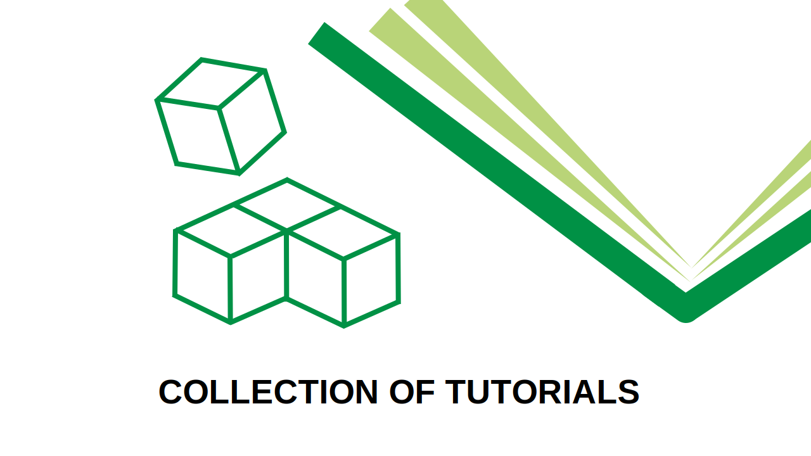
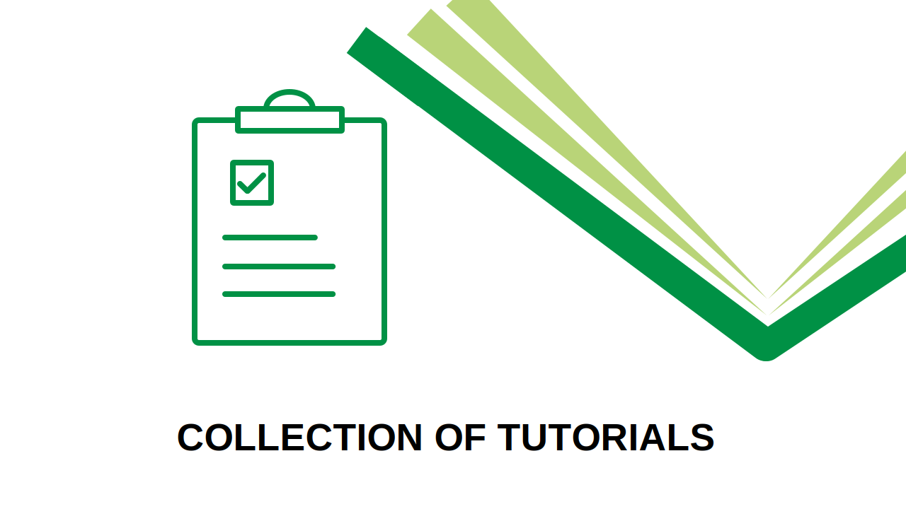
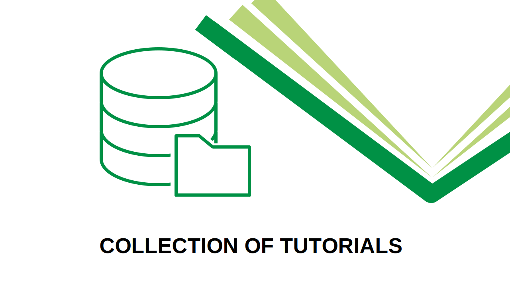
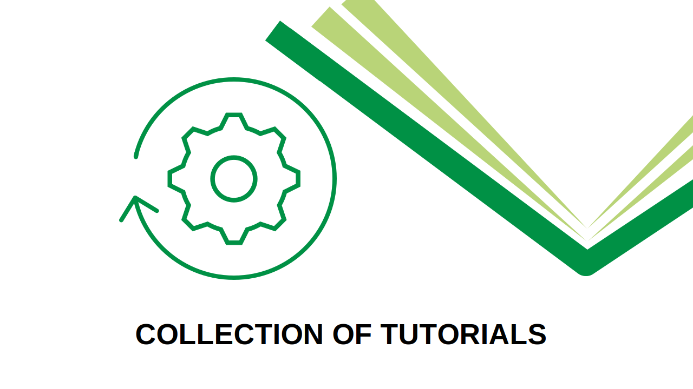
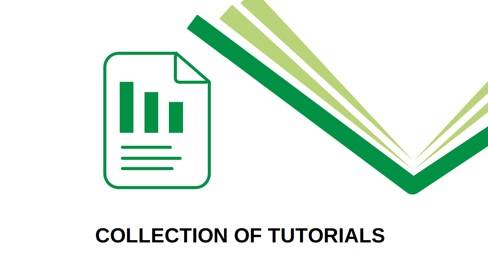

# Self-Learning Course Catalog

## Tutorial Categories

##### Principles

From the **replicability crisis** to the **credibility revolution**

##### Study Planning

From **study design** to **power analyses** and **preregistration**

##### Data Management

From preserving **anonymity** to **FAIR data sharing**

##### Reproducible Processes

From **programming** to **reproducible manuscripts**

##### Publishing Outputs

From sharing **data** and **code** to **publishing articles**

## All Tutorials

| Topic | Tutorial | Description | Tags |
|----|----|----|----|
| Data Management | [Maintaining Privacy with Open Data](../training/data-management/maintaining-privacy-with-open-data.llms.md) | A presentation on how to make data open to the public without revealing sensitive information | Open Data, Data Anonymity |
| Data Management | [Introduction to Open Data](../training/data-management/open-data.llms.md) | An introductory presentation on the what, why, and how of making research data open | Open Data |
| Data Management | [FAIR Data Management](https://lmu-osc.github.io/FAIR-Data-Management/) | Take steps towards making your data FAIR: **F**indable, **A**ccessible, **I**nteroperable, **R**eusable | FAIR data, Data Management, Documentation |
| Data Management | [Data Documentation & Validation in R](https://lmu-osc.github.io/data-documentation-validation-R/) | How to document, summarize, and validate your research data using R. | Documentation |
| Data Management | *In Development*: Data Anonymity | Implementing and evaluating data anonymization techniques in R for safely sharing sensitive research data | Data Anonymity |
| Data Management | [Generating Synthetic Data](https://lmu-osc.github.io/synthetic-data-tutorial/) | Generating Synthetic Data in R and balancing utility and privacy-preserving data sharing | Data Simulation, Data Anonymity |
| Principles | [Assessing Research Replicability](../training/principles/assessing-research-replicability.llms.md) | Lessons learned from replicating experiments in cancer biology | Replicability Crisis |
| Principles | [Credible Science](../training/principles/credible-science.llms.md) | Learn the ins and outs of reliable, reproducible, and open research | Open Research Practices |
| Principles | [Replicability Crisis](../training/principles/replicability-crisis.llms.md) | A presentation on the replication shortcomings of science and how researchers can improve | Replicability Crisis |
| Publishing Outputs | [Open Access, Preprints, Postprints](../training/publishing-outputs/open-access-preprints-postprints.llms.md) | Learn about the different ways to make your publications freely accessible. | Open Access, Preprints |
| Publishing Outputs | [Code Publishing](https://lmu-osc.github.io/code-publishing/) | Tie together your skills and publish your work | Licenses, Documentation |
| Reproducible Processes | [Advanced Git](../training/reproducible-processes/advanced-git.llms.md) | Learn git features like branching and gitflow, and how to take advantage of issues, pull requests, and more on GitHub | Git, GitHub |
| Reproducible Processes | [Readable Code](../training/reproducible-processes/readable-code.llms.md) | Tips to write clear, understandable, and maintainable code. | R |
| Reproducible Processes | [Reproducible Protocols](../training/reproducible-processes/reproducible-protocols.llms.md) | Learn how to write and publish a reusable, step-by-step protocol. | Documentation |
| Reproducible Processes | [Introduction to R](https://lmu-osc.github.io/introduction-to-R/) | Learn the basics of the R programming language | R |
| Reproducible Processes | [Introduction to Version Control within RStudio](https://lmu-osc.github.io/Introduction-RStudio-Git-GitHub/) | Explore the git version control software and its integrations with the popular RStudio interactive development environment | R, Git |
| Reproducible Processes | [Collaborative coding with GitHub and RStudio](https://lmu-osc.github.io/Collaborative-RStudio-GitHub/) | After learning the basics of git, apply your skills in an interactive tutorial | R, Git, GitHub |
| Reproducible Processes | [Introduction to Quarto](https://lmu-osc.github.io/introduction-to-Quarto/) | Discover the basics of setting up computationally reproducible analyses, manuscripts, and presentations | R, Quarto |
| Reproducible Processes | [Introduction to Zotero](https://lmu-osc.github.io/introduction-to-zotero/) | Easily save your sources to the Zotero software, and learn how to insert these citations into your documents | Zotero, Quarto |
| Reproducible Processes | [Introduction to {renv}](https://lmu-osc.github.io/introduction-to-renv/) | Make your projects reproducible by learning how to (easily) manage your R packages | R |
| Study Planning | *In Development*: Preregistration: Why and How? | Tutorial in progress… | Preregistration |
| Study Planning | [Introduction to Data Simulations in R](https://lmu-osc.github.io/Introduction-Simulations-in-R/) | How to simulate data in R to prepare your studies | Data Simulation, Power Analyses, Preregistration |
| Study Planning | [Simulations for Advanced Power Analyses](https://lmu-osc.github.io/Simulations-for-Advanced-Power-Analyses/) | This tutorial provides a deeper dive into simulations in R, with emphasis on GLMs, LMEs, and SEMs | Data Simulation, Power Analyses |
